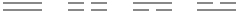
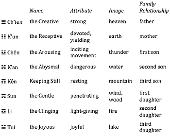
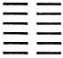
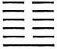
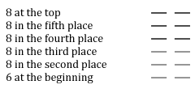
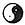

# Introduction by Richard Wilhelm

Introduction

by Richard Wilhelm

The Book of Changes—*I Ching* in Chinese—is unquestionably one of the most important books in the world’s literature. Its origin goes back to mythical antiquity, and it has occupied the attention of the most eminent scholars of China down to the present day. Nearly all that is greatest and most significant in the three thousand years of Chinese cultural history has either taken its inspiration from this book, or has exerted an influence on the interpretation of its text. Therefore it may safely be said that the seasoned wisdom of thousands of years has gone into the making of the *I Ching*. Small wonder then that both of the two branches of Chinese philosophy, Confucianism and Taoism, have their common roots here. The book sheds new light on many a secret hidden in the often puzzling modes of thought of that mysterious sage, Lao-tse, and of his pupils, as well as on many ideas that appear in the Confucian tradition as axioms, accepted without further examination.

Indeed, not only the philosophy of China but its science and statecraft as well have never ceased to draw from the spring of wisdom in the *I Ching*, and it is not surprising that this alone, among all the Confucian classics, escaped the great burning of the books under Ch’in Shih Huang Ti.<a id="ref-1" href="#/00-introduction?id=fn-1">1</a> Even the commonplaces of everyday life in China are saturated with its influence. In going through the streets of a Chinese city, one will find, here and there at a street corner, a fortune teller sitting behind a neatly covered table, brush and tablet at hand, ready to draw from the ancient book of wisdom pertinent counsel and information on life’s minor perplexities. Not only that, but the very signboards adorning the houses—perpendicular wooden panels done in gold on black lacquer—are covered with inscriptions whose flowery language again and again recalls thoughts and quotations from the *I Ching*. Even the policy makers of so modern a state as Japan, distinguished for their astuteness, do not scorn to refer to it for counsel in difficult situations.

In the course of time, owing to the great repute for wisdom attaching to the Book of Changes, a large body of occult doctrines extraneous to it—some of them possibly not even Chinese in origin—have come to be connected with its teachings. The Ch’in and Han dynasties<a id="ref-2" href="#/00-introduction?id=fn-2">2</a> saw the beginning of a formalistic natural philosophy that sought to embrace the entire world of thought in a system of number symbols. Combining a rigorously consistent, dualistic yin-yang doctrine with the doctrine of the “five stages of change” taken from the Book of History,<a id="ref-3" href="#/00-introduction?id=fn-3">3</a> it forced Chinese philosophical thinking more and more into a rigid formalization. Thus increasingly hairsplitting cabalistic speculations came to envelop the Book of Changes in a cloud of mystery, and by forcing everything of the past and of the future into this system of numbers, created for the *I Ching* the reputation of being a book of unfathomable profundity. These speculations are also to blame for the fact that the seeds of a free Chinese natural science, which undoubtedly existed at the time of Mo Ti<a id="ref-4" href="#/00-introduction?id=fn-4">4</a> and his pupils, were killed, and replaced by a sterile tradition of writing and reading books that was wholly removed from experience. This is the reason why China has for so long presented to Western eyes a picture of hopeless stagnation.

Yet we must not overlook the fact that apart from this mechanistic number mysticism, a living stream of deep human wisdom was constantly flowing through the channel of this book into everyday life, giving to China’s great civilization that ripeness of wisdom, distilled through the ages, which we wistfully admire in the remnants of this last truly autochthonous culture.

What is the Book of Changes actually? In order to arrive at an understanding of the book and its teachings, we must first of all boldly strip away the dense overgrowth of interpretations that have read into it all sorts of extraneous ideas. This is equally necessary whether we are dealing with the superstitions and mysteries of old Chinese sorcerers or the no less superstitious theories of modern European scholars who try to interpret all historical cultures in terms of their experience of primitive savages.<a id="ref-5" href="#/00-introduction?id=fn-5">5</a> We must hold here to the fundamental principle that the Book of Changes is to be explained in the light of its own content and of the era to which it belongs. With this the darkness lightens perceptibly and we realize that this book, though a very profound work, does not offer greater difficulties to our understanding than any other book that has come down through a long history from antiquity to our time.

1\. The Use of the Book of Changes

The Book of Oracles

At the outset, the Book of Changes was a collection of linear signs to be used as oracles.<a id="ref-6" href="#/00-introduction?id=fn-6">6</a> In antiquity, oracles were everywhere in use; the oldest among them confined themselves to the answers yes and no. This type of oracular pronouncement is likewise the basis of the Book of Changes. “Yes” was indicated by a simple unbroken line (———), and “No” by a broken line (— —). However, the need for greater differentiation seems to have been felt at an early date, and the single lines were combined in pairs:

To each of these combinations a third line was then added. In this way the eight trigrams<a id="ref-7" href="#/00-introduction?id=fn-7">7</a> came into being. These eight trigrams were conceived as images of all that happens in heaven and on earth. At the same time, they were held to be in a state of continual transition, one changing into another, just as transition from one phenomenon to another is continually taking place in the physical world. Here we have the fundamental concept of the Book of Changes. The eight trigrams are symbols standing for changing transitional states; they are images that are constantly undergoing change. Attention centers not on things in their state of being—as is chiefly the case in the Occident—but upon their movements in change. The eight trigrams therefore are not representations of things as such but of their tendencies in movement.

These eight images came to have manifold meanings. They represented certain processes in nature corresponding with their inherent character. Further, they represented a family consisting of father, mother, three sons, and three daughters, not in the mythological sense in which the Greek gods peopled Olympus, but in what might be called an abstract sense, that is, they represented not objective entities but functions.

A brief survey of these eight symbols that form the basis of the Book of Changes yields the following classification:

The sons represent the principle of movement in its various stages—beginning of movement, danger in movement, rest and completion of movement. The daughters represent devotion in its various stages—gentle penetration, clarity and adaptability, and joyous tranquility.

In order to achieve a still greater multiplicity, these eight images were combined with one another at a very early date, whereby a total of sixty-four signs was obtained. Each of these sixty-four signs consists of six lines, either positive or negative. Each line is thought of as capable of change, and whenever a line changes, there is a change also of the situation represented by the given hexagram. Let us take for example the hexagram K’un, THE RECEPTIVE, earth:

It represents the nature of the earth, strong in devotion; among the seasons it stands for late autumn, when all the forces of life are at rest. If the lowest line changes, we have the hexagram, Fu, RETURN:

The latter represents thunder, the movement that stirs anew within the earth at the time of the solstice; it symbolizes the return of light.

As this example shows, all of the lines of a hexagram do not necessarily change; it depends entirely on the character of a given line. A line whose nature is positive, with an increasing dynamism, turns into its opposite, a negative line, whereas a positive line of lesser strength remains unchanged. The same principle holds for the negative lines.

More definite information about those lines which are to be considered so strongly charged with positive or negative energy that they move, is given in book II in the Great Commentary (pt. I, chap. IX), and in the special section on the use of the oracle at the end of book III. Suffice it to say here that positive lines that move are designated by the number 9, and negative lines that move by the number 6, while non-moving lines, which serve only as structural matter in the hexagram, without intrinsic meaning of their own, are represented by the number 7 (positive) or the number 8 (negative). Thus, when the text reads, “Nine at the beginning means…” this is the equivalent of saying: “When the positive line in the first place is represented by the number 9, it has the following meaning….” If, on the other hand, the line is represented by the number 7, it is disregarded in interpreting the oracle. The same principle holds for lines represented by the numbers 6 and 8<a id="ref-8" href="#/00-introduction?id=fn-8">8</a> respectively.

We may obtain the hexagram named in the example above —K’un, THE RECEPTIVE—in the following form:

Hence the five upper lines are not taken into account; only the 6 at the beginning has an independent meaning, and by its transformation into its opposite, the situation K’un, THE RECEPTIVE,

becomes the situation Fu, RETURN:

In this way we have a series of situations symbolically expressed by lines, and through the movement of these lines the situations can change one into another. On the other hand, such change does not necessarily occur, for when a hexagram is made up of lines represented by the numbers 7 and 8 only, there is no movement within it, and only its aspect as a whole is taken into consideration.

In addition to the law of change and to the images of the states of change as given in the sixty-four hexagrams, another factor to be considered is the course of action. Each situation demands the action proper to it. In every situation, there is a right and a wrong course of action. Obviously, the right course brings good fortune and the wrong course brings misfortune. Which, then, is the right course in any given case? This question was the decisive factor. As a result, the *I Ching* was lifted above the level of an ordinary book of soothsaying. If a fortune teller on reading the cards tells her client that she will receive a letter with money from America in a week, there is nothing for the woman to do but wait until the letter comes—or does not come. In this case what is foretold is fate, quite independent of what the individual may do or not do. For this reason fortune telling lacks moral significance. When it happened for the first time in China that someone, on being told the auguries for the future, did not let the matter rest there but asked, “What am I to do?” the book of divination had to become a book of wisdom.

It was reserved for King Wên, who lived about 1150 B.C., and his son, the Duke of Chou, to bring about this change. They endowed the hitherto mute hexagrams and lines, from which the future had to be divined as an individual matter in each case, with definite counsels for correct conduct. Thus the individual came to share in shaping fate. For his actions intervened as determining factors in world events, the more decisively so, the earlier he was able with the aid of the Book of Changes to recognize situations in their germinal phases. The germinal phase is the crux. As long as things are in their beginnings they can be controlled, but once they have grown to their full consequences they acquire a power so overwhelming that man stands impotent before them. Thus the Book of Changes became a book of divination of a very special kind.

The hexagrams and lines in their movements and changes mysteriously reproduced the movements and changes of the macrocosm. By the use of yarrow stalks,<a id="ref-9" href="#/00-introduction?id=fn-9">9</a> one could attain a point of vantage from which it was possible to survey the condition of things. Given this perspective, the words of the oracle would indicate what should be done to meet the need of the time.

The only thing about all this that seems strange to our modern sense is the method of learning the nature of a situation through the manipulation of yarrow stalks. This procedure was regarded as mysterious, however, simply in the sense that the manipulation of the yarrow stalks makes it possible for the unconscious in man to become active. All individuals are not equally fitted to consult the oracle. It requires a clear and tranquil mind, receptive to the cosmic influences hidden in the humble divining stalks. As products of the vegetable kingdom, these were considered to be related to the sources of life. The stalks were derived from sacred plants.

The Book of Wisdom

Of far greater significance than the use of the Book of Changes as an oracle is its other use, namely, as a book of wisdom. Lao-tse<a id="ref-10" href="#/00-introduction?id=fn-10">10</a> knew this book, and some of his profoundest aphorisms were inspired by it. Indeed, his whole thought is permeated with its teachings. Confucius<a id="ref-11" href="#/00-introduction?id=fn-11">11</a> too knew the Book of Changes and devoted himself to reflection upon it. He probably wrote down some of his interpretative comments and imparted others to his pupils in oral teaching. The Book of Changes as edited and annotated by Confucius is the version that has come down to our time.

If we inquire as to the philosophy that pervades the book, we can confine ourselves to a few basically important concepts. The underlying idea of the whole is the idea of change. It is related in the Analects<a id="ref-12" href="#/00-introduction?id=fn-12">12</a> that Confucius, standing by a river, said: “Everything flows on and on like this river, without pause, day and night.” This expresses the idea of change. He who has perceived the meaning of change fixes his attention no longer on transitory individual things but on the immutable, eternal law at work in all change. This law is the tao<a id="ref-13" href="#/00-introduction?id=fn-13">13</a> of Lao-tse, the course of things, the principle of the one in the many. That it may become manifest, a decision, a postulate, is necessary. This fundamental postulate is the “great primal beginning” of all that exists, *t’ai chi*—in its original meaning, the “ridgepole.” Later Chinese philosophers devoted much thought to this idea of a primal beginning. A still earlier beginning, *wu chi*, was represented by the symbol of a circle. Under this conception, *t’ai chi* was represented by the circle divided into the light and the dark, yang and yin, .<a id="ref-14" href="#/00-introduction?id=fn-14">14</a>

This symbol has also played a significant part in India and Europe. However, speculations of a gnostic-dualistic character are foreign to the original thought of the *I Ching*; what it posits is simply the ridgepole, the line. With this line, which in itself represents oneness, duality comes into the world, for the line at the same time posits an above and a below, a right and left, front and back—in a word, the world of the opposites.

These opposites became known under the names yin and yang and created a great stir, especially in the transition period between the Ch’in and Han dynasties, in the centuries just before our era, when there was an entire school of yin-yang doctrine. At that time, the Book of Changes was much in use as a book of magic, and people read into the text all sorts of things not originally there. This doctrine of yin and yang, of the female and the male as primal principles, has naturally also attracted much attention among foreign students of Chinese thought. Following the usual bent, some of these have predicated in it a primitive phallic symbolism, with all the accompanying connotations.

To the disappointment of such discoverers it must be said that there is nothing to indicate this in the original meaning of the words yin and yang. In its primary meaning yin is “the cloudy,” “the overcast,” and yang means actually “banners waving in the sun,”<a id="ref-15" href="#/00-introduction?id=fn-15">15</a> that is, something “shone upon,” or bright. By transference the two concepts were applied to the light and dark sides of a mountain or of a river. In the case of a mountain the southern is the bright side and the northern the dark side, while in the case of a river seen from above, it is the northern side that is bright (yang), because it reflects the light, and the southern side that is in shadow (yin). Thence the two expressions were carried over into the Book of Changes and applied to the two alternating primal states of being. It should be pointed out, however, that the terms yin and yang do not occur in this derived sense either in the actual text of the book or in the oldest commentaries. Their first occurrence is in the Great Commentary, which already shows Taoistic influence in some parts. In the Commentary on the Decision the terms used for the opposites are “the firm” and “the yielding,” not yang and yin.

However, no matter what names are applied to these forces it is certain that the world of being arises out of their change and interplay. Thus change is conceived of partly as the continuous transformation of the one force into the other and partly as a cycle of complexes of phenomena, in themselves connected, such as day and night, summer and winter. Change is not meaningless—if it were, there could be no knowledge of it—but subject to the universal law, tao.

The second theme fundamental to the Book of Changes is its theory of ideas. The eight trigrams are images not so much of objects as of states of change. This view is associated with the concept expressed in the teachings of Lao-tse, as also in those of Confucius, that every event in the visible world is the effect of an “image,” that is, of an idea in the unseen world. Accordingly, everything that happens on earth is only a reproduction, as it were, of an event in a world beyond our sense perception; as regards its occurrence in time, it is later than the suprasensible event. The holy men and sages, who are in contact with those higher spheres, have access to these ideas through direct intuition and are therefore able to intervene decisively in events in the world. Thus man is linked with heaven, the suprasensible world of ideas, and with earth, the material world of visible things, to form with these a trinity of the primal powers.

This theory of ideas is applied in a twofold sense. The Book of Changes shows the images of events and also the unfolding of conditions *in statu nascendi*. Thus, in discerning with its help the seeds of things to come, we learn to foresee the future as well as to understand the past. In this way the images on which the hexagrams are based serve as patterns for timely action in the situations indicated. Not only is adaptation to the course of nature thus made possible, but in the Great Commentary (pt. II, chap. II), an interesting attempt is made to trace back the origin of all the practices and inventions of civilization to such ideas and archetypal images. Whether or not the hypothesis can be made to apply in all specific instances, the basic concept contains a truth.<a id="ref-16" href="#/00-introduction?id=fn-16">16</a>

The third element fundamental to the Book of Changes are the judgments. The judgments clothe the images in words, as it were; they indicate whether a given action will bring good fortune or misfortune, remorse or humiliation. The judgments make it possible for a man to make a decision to desist from a course of action indicated by the situation of the moment but harmful in the long run. In this way he makes himself independent of the tyranny of events. In its judgments, and in the interpretations attached to it from the time of Confucius on, the Book of Changes opens to the reader the richest treasure of Chinese wisdom; at the same time it affords him a comprehensive view of the varieties of human experience, enabling him thereby to shape his life of his own sovereign will into an organic whole and so to direct it that it comes into accord with the ultimate tao lying at the root of all that exists.

2\. The History of the Book of Changes

In Chinese literature four holy men are cited as the authors of the Book of Changes, namely, Fu Hsi, King Wên, the Duke of Chou, and Confucius. Fu Hsi is a legendary figure representing the era of hunting and fishing and of the invention of cooking. The fact that he is designated as the inventor of the linear signs of the Book of Changes means that they have been held to be of such antiquity that they antedate historical memory. Moreover, the eight trigrams have names that do not occur in any other connection in the Chinese language, and because of this they have even been thought to be of foreign origin. At all events, they are not archaic characters, as some have been led to believe by the half accidental, half intentional resemblances to them appearing here and there among ancient characters.<a id="ref-17" href="#/00-introduction?id=fn-17">17</a>

The eight trigrams are found occurring in various combinations at a very early date. Two collections belonging to antiquity are mentioned: first, the Book of Changes of the Hsia dynasty,<a id="ref-18" href="#/00-introduction?id=fn-18">18</a> called *Lien Shan*, which is said to have begun with the hexagram Kên, KEEPING STILL, mountain; second, the Book of Changes dating from the Shang dynasty,<a id="ref-19" href="#/00-introduction?id=fn-19">19</a> entitled *Kuei Ts’ang*, which began with the hexagram K’un, THE RECEPTIVE. The latter circumstance is mentioned in passing by Confucius himself as a historical fact. It is difficult to say whether the names of the sixty-four hexagrams were then in existence, and if so, whether they were the same as those in the present Book of Changes.

According to general tradition, which we have no reason to challenge, the present collection of sixty-four hexagrams originated with King Wên,<a id="ref-20" href="#/00-introduction?id=fn-20">20</a> progenitor of the Chou dynasty. He is said to have added brief judgments to the hexagrams during his imprisonment at the hands of the tyrant Chou Hsin. The text pertaining to the individual lines originated with his son, the Duke of Chou. This form of the book, entitled the Changes of Chou (*Chou I*), was in use as an oracle throughout the Chou period, as can be proven from a number of the ancient historical records.

This was the status of the book at the time Confucius came upon it. In his old age he gave it intensive study, and it is highly probable that the Commentary on the Decision (*T’uan Chuan*) is his work. The Commentary on the Images also goes back to him, though less directly. A third treatise, a very valuable and detailed commentary on the individual lines, compiled by his pupils or by their successors, in the form of questions and answers, survives only in fragments.<a id="ref-21" href="#/00-introduction?id=fn-21">21</a>

Among the followers of Confucius, it would appear, it was principally Pu Shang (Tz
u Hsia) who spread the knowledge of the Book of Changes. With the development of philosophical speculation, as reflected in the Great Learning (*Ta Hsüeh*) and the Doctrine of the Mean (*Chung Yung*),<a id="ref-22" href="#/00-introduction?id=fn-22">22</a> this type of philosophy exercised an ever increasing influence upon the interpretation of the Book of Changes. A literature grew up around the book, fragments of which—some dating from an early and some from a later time—are to be found in the so-called Ten Wings. They differ greatly with respect to content and intrinsic value.

The Book of Changes escaped the fate of the other classics at the time of the famous burning of the books under the tyrant Ch’in Shih Huang Ti. Hence, if there is anything in the legend that the burning alone is responsible for the mutilation of the texts of the old books, the *I Ching* at least should be intact; but this is not the case. In reality it is the vicissitudes of the centuries, the collapse of ancient cultures, and the change in the system of writing that are to be blamed for the damage suffered by all ancient works.

After the Book of Changes had become firmly established as a book of divination and magic in the time of Ch’in Shih Huang Ti, the entire school of magicians (*fang shih*) of the Ch’in and Han dynasties made it their prey. And the yin-yang doctrine, which was probably introduced through the work of Tsou Yen,<a id="ref-23" href="#/00-introduction?id=fn-23">23</a> and later promoted by Tung Chung Shu, Liu Hsin, and Liu Hsiang,<a id="ref-24" href="#/00-introduction?id=fn-24">24</a> ran riot in connection with the interpretation of the *I Ching*.

The task of clearing away all this rubbish was reserved for a great and wise scholar, Wang Pi,<a id="ref-25" href="#/00-introduction?id=fn-25">25</a> who wrote about the meaning of the Book of Changes as a book of wisdom, not as a book of divination. He soon found emulation, and the teachings of the yin-yang school of magic were displaced, in relation to the book, by a philosophy of statecraft that was gradually developing. In the Sung<a id="ref-26" href="#/00-introduction?id=fn-26">26</a> period, the *I Ching* was used as a basis for the *t’ai chi t’u* doctrine—which was probably not of Chinese origin—until the appearance of the elder Ch’êng Tz
u’s<a id="ref-27" href="#/00-introduction?id=fn-27">27</a> very good commentary. It had become customary to separate the old commentaries contained in the Ten Wings and to place them with the individual hexagrams to which they refer. Thus the book became by degrees entirely a textbook relating to statecraft and the philosophy of life. Then Chu Hsi<a id="ref-28" href="#/00-introduction?id=fn-28">28</a> attempted to rehabilitate it as a book of oracles; in addition to a short and precise commentary on the *I Ching*, he published an introduction to his investigations concerning the art of divination.

The critical-historical school of the last dynasty also took the Book of Changes in hand. However, because of their opposition to the Sung scholars and their preference for the Han commentators, who were nearer in point of time to the compilation of the Book of Changes, they were less successful here than in their treatment of the other classics. For the Han commentators were in the last analysis sorcerers, or were influenced by theories of magic. A very good edition was arranged in the K’ang Hsi<a id="ref-29" href="#/00-introduction?id=fn-29">29</a> period, under the title *Chou I Chê Chung*; it presents the text and the wings separately and includes the best commentaries of all periods. This is the edition on which the present translation is based.

3\. The Arrangement of the Translation

An exposition of the principles that have been followed in the translation of the Book of Changes should be of essential help to the reader.

The translation of the text has been given as brief and concise a form as possible, in order to preserve the archaic impression that prevails in the Chinese. This has made it all the more necessary to present not only the text but also digests of the most important Chinese commentaries. These digests have been made as succinct as possible and afford a survey of the outstanding contributions made by Chinese scholarship toward elucidation of the book. Comparisons with Occidental writings,<a id="ref-30" href="#/00-introduction?id=fn-30">30</a> which frequently suggested themselves, as well as views of my own, have been introduced as sparingly as possible and have invariably been expressly identified as such. The reader may therefore regard the text and the commentary as genuine renditions of Chinese thought. Special attention is called to this fact because many of the fundamental truths presented are so closely parallel to Christian tenets that the impression is often really striking.

In order to make it as easy as possible for the layman to understand the *I Ching*, the texts of the sixty-four hexagrams, together with pertinent interpretations, are presented in book I. The reader will do well to begin by reading this part with his attention fixed on its main ideas and without allowing himself to be distracted by the imagery. For example, he should follow through the idea of the Creative in its step-by-step development—as delineated in masterly fashion in the first hexagram—taking the dragons for granted for the moment. In this way he will gain an idea of what Chinese wisdom has to say about the conduct of life.

The second and third books explain why all these things are as they are. Here the material essential to an understanding of the structure of the hexagrams has been brought together, but only so much of it as is absolutely necessary, and as far as possible only the oldest material, as preserved in the Ten Wings, is presented. So far as has been feasible, these commentaries have been broken down and apportioned to the relevant parts of the text, in such a way as to afford a better understanding of them—their essential content having been made available earlier in the commentary summaries in book I. Therefore, for one who would plumb the depths of wisdom in the Book of Changes, the second and third books are indispensable. On the other hand, the Western reader’s power of comprehension ought not to be burdened at the outset with too much that is unfamiliar. Consequently it has not been possible to avoid a certain amount of repetition, but such reiteration will be of help in obtaining a thorough understanding of the book. It is my firm conviction that anyone who really assimilates the essence of the Book of Changes will be enriched thereby in experience and in true understanding of life.

R. W.

---

**Notes:**

<a id="fn-1" href="#/00-introduction?id=ref-1">**1.**</a> 213 B.C.

<a id="fn-2" href="#/00-introduction?id=ref-2">**2.**</a> Beginning in the last half of the third century B.C. and ending about A.D. 220.

<a id="fn-3" href="#/00-introduction?id=ref-3">**3.**</a> *Shu Ching*, the oldest of the Chinese classics. Modern scholarship has placed most of the records contained in the *Shu Ching* near the first millennium B.C., though formerly a much greater age was ascribed to the earliest of them.

<a id="fn-4" href="#/00-introduction?id=ref-4">**4.**</a> Fifth and fourth centuries B.C.

<a id="fn-5" href="#/00-introduction?id=ref-5">**5.**</a> We might mention here, because of its oddity, the grotesque and amateurish attempt on the part of Rev. Canon McClatchie, M.A., to apply the key of “comparative mythology” to the *I Ching*. His book was published in 1876 under the title, *A Translation of the Confucian YiKing or the Classic of Changes, with Notes and Appendix*.

<a id="fn-6" href="#/00-introduction?id=ref-6">**6.**</a> From the discussion here presented, it will become self-evident that the Book of Changes was not a lexicon, as has been assumed in many quarters.

<a id="fn-7" href="#/00-introduction?id=ref-7">**7.**</a> *Zeichen*, meaning sign, is used by Wilhelm to denote the linear figures in the *I Ching*, those of three lines as well as those of six lines. The Chinese word for both types of signs is *kua*. To avoid ambiguity, the precedent established by Legge (*The Sacred Books of the East*, XVI: *The Yi King*) has been adopted throughout: the term “trigram” is used for the sign consisting of three lines, and “hexagram” for the sign consisting of six lines.

<a id="fn-8" href="#/00-introduction?id=ref-8">**8.**</a> For this reason, the numbers 7 and 8 never appear in the portion of the text dealing with the meanings of the individual lines.

<a id="fn-9" href="#/00-introduction?id=ref-9">**9.**</a> The stalks come from the plant known to us as common yarrow, or milfoil (*Achillea millefolium*).

<a id="fn-10" href="#/00-introduction?id=ref-10">**10.**</a> Second half of fifth century B.C.

<a id="fn-11" href="#/00-introduction?id=ref-11">**11.**</a> 551-479 B.C.

<a id="fn-12" href="#/00-introduction?id=ref-12">**12.**</a> *Lun Yü*, IX, 16. This book comprises conversations of Confucius and his disciples.

<a id="fn-13" href="#/00-introduction?id=ref-13">**13.**</a> Here, as throughout the book, Wilhelm uses the German word *Sinn* (“meaning”) in capitals (*SINN*) for the Chinese word *tao* (see here and n. 1). The reasons that led Wilhelm to choose *SINN* to represent *tao* (see p. xiv of the introduction to his translation of Lao-tse: *Tao Te King: Das Buch des Alten von Sinn und Leben*, 3rd edn., Düsseldorf and Cologne, 1952) have no relation to the English word “meaning.” Therefore in the English rendering, “tao” has been used wherever *SINN* occurs.

<a id="fn-14" href="#/00-introduction?id=ref-14">**14.**</a> Known as *t’ai chi t’u*, “the supreme ultimate.” See R. Wilhelm, *A Short History of Chinese Civilization*, tr. by J. Joshua (London, 1929), p. 249.

<a id="fn-15" href="#/00-introduction?id=ref-15">**15.**</a> Cf. the noteworthy discussions of Liang Ch’i-ch’ao in the Chinese journal *The Endeavor*, July 15 and 22,1923, also the English essay by B. Schindler, “The Development of the Chinese Conceptions of Supreme Beings,” *Asia Major*, Hirth Anniversary Volume (London: Probsthain, n.d.), pp. 298-366.

<a id="fn-16" href="#/00-introduction?id=ref-16">**16.**</a> Cf. the extremely important discussions of Hu Shih in *The Development of the Logical Method in Ancient China* (2nd edn., New York: Paragon, 1963), and the even more detailed discussion in the first volume of his history of philosophy *Chung-kuo chê-hsüeh-shih-ta-kang*; not available in translation.

<a id="fn-17" href="#/00-introduction?id=ref-17">**17.**</a> Question has centered especially upon the trigram K’an , which resembles the character for water, *shui* ().

<a id="fn-18" href="#/00-introduction?id=ref-18">**18.**</a> According to tradition, 2205-1766 B.C.

<a id="fn-19" href="#/00-introduction?id=ref-19">**19.**</a> According to tradition, 1766-1150 B.C.

<a id="fn-20" href="#/00-introduction?id=ref-20">**20.**</a> King Wên was the head of a western state that suffered oppression from the house of Shang (Yin). He was given the title of king posthumously by his son Wu, who overthrew Chou Hsin, took possession of the Shang realm, and became the first ruler of the Chou dynasty, which in traditional chronology is dated 1150-249 B.C.

<a id="fn-21" href="#/00-introduction?id=ref-21">**21.**</a> Some are in the section known as the *Wên Yen* Commentary on the Words of the Text, some in the *Ta Chuan* Great Commentary. Cf. here.

<a id="fn-22" href="#/00-introduction?id=ref-22">**22.**</a> The Great Learning presents the Confucian principles concerning the education of the “superior man,” based on the view that innate within man are the qualities that when developed guide him to a personal and a social ethic. The Doctrine of the Mean shows that the “way of the superior man” leads to harmony between heaven, man, and earth. Both of these works belong to the school of thought led by Tzu-ssu, grandson of Confucius. They originally formed part of the *Li Chi*, the Book of Rites. Under the titles *Ta Hsio* and *Kung Yung* they can be found as bks. 39 and 28 in Legge’s translation of the Book of Rites (*The Sacred Books of the East*, XXVII: *The Li Ki*, Oxford, 1885).

<a id="fn-23" href="#/00-introduction?id=ref-23">**23.**</a> Fourth century B.C.

<a id="fn-24" href="#/00-introduction?id=ref-24">**24.**</a> All three are Han scholars.

<a id="fn-25" href="#/00-introduction?id=ref-25">**25.**</a> A.D. 226-249.

<a id="fn-26" href="#/00-introduction?id=ref-26">**26.**</a> A.D. 960-1279.

<a id="fn-27" href="#/00-introduction?id=ref-27">**27.**</a> Ch’êng Hao, A.D. 1032-1085.

<a id="fn-28" href="#/00-introduction?id=ref-28">**28.**</a> A.D. 1130-1200.

<a id="fn-29" href="#/00-introduction?id=ref-29">**29.**</a> A.D. 1662-1722.

<a id="fn-30" href="#/00-introduction?id=ref-30">**30.**</a> A number of footnote quotations from German poetry, chiefly passages from Goethe, have been omitted in the English rendering because their poetic suggestiveness disappears in translation.
