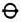
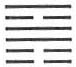
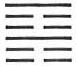

# On Consulting the Oracle

I. On Consulting the Oracle

1\. THE YARROW-STALK ORACLE

The oracle is consulted with the help of yarrow stalks. Fifty stalks are used for this purpose. One is put aside and plays no further part. The remaining 49 stalks are first divided into two heaps at random. Thereupon one stalk is taken from the right-hand heap and put between the ring finger and the little finger of the left hand. Then the left-hand heap is placed in the left hand, and the right hand takes from it bundles of 4, until there are 4 or fewer stalks remaining. This remainder is placed between the ring finger and the middle finger of the left hand. Next the right-hand heap is counted off by fours, and the remainder is placed between the middle finger and the forefinger of the left hand. The sum of the stalks now between the fingers of the left hand is either 9 or 5. (The various possibilities are 1 + 4 + 4, or 1 + 3 + 1, or 1 + 2 + 2, or 1 + 1 + 3; it follows that the number 5 is easier to obtain than the number 9.) At this first counting off of the stalks, the first stalk—held between the little finger and the ring finger—is disregarded as supernumerary, hence one reckons as follows: 9 = 8, or 5 = 4. The number 4 is regarded as a complete unit, to which the numerical value 3 is assigned. The number 8, on the other hand, is regarded as a double unit and is reckoned as having only the numerical value 2., Therefore, if at the first count 9 stalks are left over, they count as 2; if 5 are left, they count as 3. These stalks are now laid aside for the time being.

Then the remaining stalks are gathered together again and divided anew. Once more one takes a stalk from the pile on the right and places it between the ring finger and the little finger of the left hand; then one counts off the stalks as before. This time the sum of the remainders is either 8 or 4, the possible combinations being 1 + 4 + 3, or 1 + 3 + 4, or 1 + 1 + 2, or 1 + 2 + 1,so that this time the chances of obtaining 8 or 4 are equal. The 8 counts as 2, the 4 counts as 3.

The procedure is carried out a third time with the remaining stalks, and again the sum of the remainders is 8 or 4.

Now, from the numerical values assigned to each of the three composite remainders, a line is formed.

If the sum is 5 (= 4, value 3) + 4 (value 3) + 4 (value 3), the resulting numerical value is 9, the so-called old yang. This becomes a positive line that moves and must therefore be taken into account in the interpretation of the individual lines. It is designated by the symbol  or o.

If the sum of the composite remainders is 9 (= 8, value 2) + 8 (value 2) + 8 (value 2), the final value is 6, the so-called old yin. This becomes a negative line that moves and is therefore to be taken into account in the interpretation of the individual lines. It is designated by the symbol — X — or X.

If the sum is

9 (2) + 8 (2) + 4 (3)

or 5 (3) + 8 (2) + 8 (2) = 7

or 9 (2) + 4 (3) + 8 (2)

the value 7 results, the so-called young yang. This becomes a positive line that is at rest and therefore not taken into account in the interpretation of the individual lines. It is designated by the symbol —.

If the sum is

9 (2) + 4 (3) + 4 (3)

or 5 (3) + 4 (3) + 8 (2) = 8

or 5 (3) + 8 (2) + 4 (3)

the value 8 results, the so-called young yin. This becomes a negative line that is at rest and therefore not taken into account in the interpretation of the individual lines. It is designated by the symbol — —.

This procedure is repeated six times, and thus a hexagram of six stages is built up. When a hexagram consists entirely of nonmoving lines, the oracle takes into account only the idea represented by the hexagram as a whole, as set down in the Judgment by King Wên and in the Commentary on the Decision by Confucius, together with the Image.

If there are one or more moving lines in the hexagram thus obtained, the words appended by the Duke of Chou to the given line or lines are also to be considered. His words therefore carry the superscription, “Nine in the *x*th place,” or “Six in the *x*th place.”

Furthermore, the movement, i.e., change<a id="ref-1" href="#/appendix-01-consulting-the-oracle?id=fn-1">1</a> in the lines, gives rise to a new hexagram, the meaning of which must also be taken into account. For instance, when we get hexagram 56

showing a moving line in the fourth place

we must take into account not only the text<a id="ref-2" href="#/appendix-01-consulting-the-oracle?id=fn-2">2</a> and the Image belonging to this hexagram as a whole, but also the text that goes with the fourth line, and in addition both the text and the Image belonging to hexagram 52:

Thus hexagram 56 would be the starting point of a development leading, by reason of the situation of the nine in the fourth place and the appended counsel, to the final situation, i.e., hexagram 52.

In the second hexagram the text belonging to the moving line is disregarded.

2\. THE COIN ORACLE

In addition to the method of the yarrow-stalk oracle, there is in use a shorter method employing coins: for this as a rule old Chinese bronze coins, with a hole in the middle and aninscription on one side, are used. Three coins are taken up and thrown down together, and each throw gives a line. The inscribed side counts as yin, with the value 2, and the reverse side counts as yang, with the value 3. From this the character of the line is derived. If all three coins are yang, the line is a 9; if all three are yin, it is a 6.

Two yin and one yang yield a 7, and two yang and one yin yield an 8. In looking up the hexagrams in the Book of Changes, one proceeds as with the yarrow-stalk oracle.

There is yet another kind of coin oracle, employing, besides the hexagrams of the *I Ching*, the “five stages of change,” the cyclic signs, etc. This oracle is used by Chinese soothsayers, but without the text of the hexagrams of the *I Ching*. It is said to be a perpetuation of the ancient tortoise oracle, which was consulted in antiquity in addition to the yarrow-stalk oracle. In the course of time it was gradually supplanted by the *I Ching*, in the more rational form imparted to it by Confucius.

---

**Notes:**

<a id="fn-1" href="#/appendix-01-consulting-the-oracle?id=ref-1">**1.**</a> By movement or change a yielding line develops out of a strong line, and a strong line out of a yielding line.

<a id="fn-2" href="#/appendix-01-consulting-the-oracle?id=ref-2">**2.**</a> Judgment and Commentary on the Decision.
