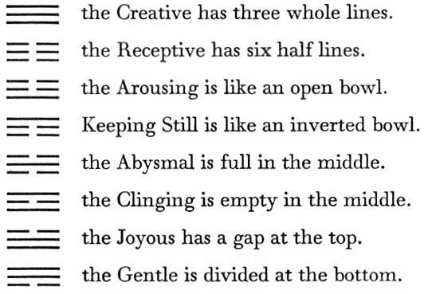

# The Hexagrams Arranged by Houses

II. The Hexagrams Arranged by Houses

THE EIGHT PRIMARY TRIGRAMS ACCORDING TO THEIR FORM (for memorizing)

THE EIGHT HOUSES

1\. The House of the Creative

1\. THE CREATIVE is Heaven (1)

2\. Heaven with Wind is COMING TO MEET (44)

3\. Heaven with Mountain is RETREAT (33)

4\. Heaven with Earth is STANDSTILL (12)

5\. Wind with Earth is CONTEMPLATION (20)

6\. Mountain with Earth is SPLITTING APART (23)

7\. Fire with Earth is PROGRESS (35)

8\. Fire with Heaven is POSSESSION IN GREAT MEASURE (14)

2\. The House of the Abysmal

1\. THE ABYSMAL is Water (29)

2\. Water with Lake is LIMITATION (60)

3\. Water with Thunder is DIFFICULTY AT THE BEGINNING (3)

4\. Water with Fire is AFTER COMPLETION (63)

5\. Lake with Fire is REVOLUTION (49)

6\. Thunder with Fire is ABUNDANCE (55)

7\. Earth with Fire is DARKENING OF THE LIGHT (36)

8\. Earth with Water is THE ARMY (7)

3\. The House of Keeping Still

1\. KEEPING STILL is Mountain (52)

2\. Mountain with Fire is GRACE (22)

3\. Mountain with Heaven is THE TAMING POWER OF THE GREAT (26)

4\. Mountain with Lake is DECREASE (41)

5\. Fire with Lake is OPPOSITION (38)

6\. Heaven with Lake is TREADING (10)

7\. Wind with Lake is INNER TRUTH (61)

8\. Wind with Mountain is DEVELOPMENT (53)

4\. The House of the Arousing

1\. THE AROUSING is Thunder (51)

2\. Thunder with Earth is ENTHUSIASM (16)

3\. Thunder with Water is DELIVERANCE (40)

4\. Thunder with Wind is DURATION (32)

5\. Earth with Wind is PUSHING UPWARD (46)

6\. Water with Wind is THE WELL (48)

7\. Lake with Wind is PREPONDERANCE OF THE GREAT (28)

8\. Lake with Thunder is FOLLOWING (17)

5\. The House of the Gentle

1\. THE GENTLE is Wind (57)

2\. Wind with Heaven is THE TAMING POWER OF THE SMALL (9)

3\. Wind with Fire is THE FAMILY (37)

4\. Wind with Thunder is INCREASE (42)

5\. Heaven with Thunder is INNOCENCE (25)

6\. Fire with Thunder is BITING THROUGH (21)

7\. Mountain with Thunder is THE CORNERS OF THE MOUTH (27)

8\. Mountain with Wind is WORK ON WHAT HAS BEEN SPOILED (18)

6\. The House of the Clinging

1\. THE CLINGING is Fire (30)

2\. Fire with Mountain is THE WANDERER (56)

3\. Fire with Wind is THE CALDRON (50)

4\. Fire with Water is BEFORE COMPLETION (64)

5\. Mountain with Water is YOUTHFUL FOLLY (4)

6\. Wind with Water is DISPERSION (59)

7\. Heaven with Water is CONFLICT (6)

8\. Heaven with Fire is FELLOWSHIP WITH MEN (13)

7\. The House of the Receptive

1\. THE RECEPTIVE is Earth (2)

2\. Earth with Thunder is RETURN (24)

3\. Earth with Lake is APPROACH (19)

4\. Earth with Heaven is PEACE (11)

5\. Thunder with Heaven is THE POWER OF THE. GREAT (34)

6\. Lake with Heaven is BREAK-THROUGH (43)

7\. Water with Heaven is WAITING (5)

8\. Water with Earth is HOLDING TOGETHER (8)

8\. The House of the Joyous

1\. THE JOYOUS is Lake (58)

2\. Lake with Water is OPPRESSION (47)

3\. Lake with Earth is GATHERING TOGETHER (45)

4\. Lake with Mountain is INFLUENCE (31)

5\. Water with Mountain is OBSTRUCTION (39)

6\. Earth with Mountain is MODESTY (15)

7\. Thunder with Mountain is PREPONDERANCE OF THE SMALL (62)

8\. Thunder with Lake is THE MARRYING MAIDEN (54)
