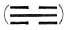
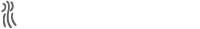

# Notes

1. *Le Livre des mutations*, texte primatif traduit du chinois par Charles de Harlez, présenté et annoté par Raymond de Becker (Paris, 1959).

2. Dover Publications, New York, 1963.

3. *I Ching: Book of Changes*, translated by James Legge, edited with introduction and Study Guide by Ch’u Chai and Winberg Chai (New Hyde Park, New York, 1964).

4. Le Maître Yüan-kuang, *Méthode pratique de Divination Chinoise par le “Yi-king”* (Paris, 1950); Meister Yüan-kuang, *I Ging: Praxis chinesischer Weissagung* translated by Fritz Werle (Munich, 1951).

5. John Blofeld, *The Book of Change*: a new translation of the ancient Chinese I Ching…with detailed instruction for its practical use in divination (London and New York, 1965).

6. I cannot make myself take seriously the claim that Confucius did not know the Book of Changes.

1. Legge makes the following comment on the explanatory text for the individual lines: “According to our notions, a framer of emblems should be a good deal of a poet, but those of the Yi only make us think of a dryasdust. Out of more than three hundred and fifty, the greater number are only grotesque” (*The Sacred Books of the East*, XVI: *The Yi King*,.2nd edn., Oxford: Clarendon Press, 1899, p. 22). Of the “lessons” of the hexagrams, the same author says: “But why, it may be asked, why should they be conveyed to us by such an array of lineal figures, and in such a farrago of emblematic representations” (ibid., p. 25). However, we are nowhere told that Legge ever bothered to put the method to a practical test.

2. Cf. “Synchronicity: An Acausal Connecting Principle,” *The Structure and Dynamics of the Psyche* (Coll. Works of C. G. Jung, vol. 8).

3. Cf. J. B. Rhine, *The Reach of the Mind* (New York and London, 1928).

4. They are *shên*, that is “spirit-like.” “Heaven produced the ‘spirit-like things’ ” (Legge, p. 41).

5. See the explanation of the method in Wilhelm’s text, p. 721.

6. For example, the *invidi* (“the envious:”) are a constantly recurring image in the old Latin books on alchemy, especially in the *Turba philosophorum* (eleventh or twelfth century).

7. From the Latin *concipere*, “to take together,” e.g., in a vessel: *concipere* derives from *capere*, “to take,” “to grasp.”

8. This is the classical etymology. The derivation of *religio* from *religare*, “bind to,” originated with the Church Fathers.

9. I made this experiment before I actually wrote the foreword.

10. The Chinese interpret only the changing lines in the hexagram obtained by use of the oracle. I have found all the lines of the hexagram to be relevant in most cases.

11. Cf. R. Wilhelm and C. G. Jung, *The Secret of the Golden Flower*, tr. Cary F. Baynes (London and New York. 1931; new edn., revised, 1962), in which this address appears as an appendix. The book did not appear in English until a year after Wilhelm’s death. The address is also in *The Spirit in Man, Art, and Literature* (Coll. Works of C. G. Jung, vol. 15).

12. The reader will find it helpful to look up all four of these hexagrams in the text and to read them together with the relevant commentaries.

1. 213 B.C.

2. Beginning in the last half of the third century B.C. and ending about A.D. 220.

3. *Shu Ching*, the oldest of the Chinese classics. Modern scholarship has placed most of the records contained in the *Shu Ching* near the first millennium B.C., though formerly a much greater age was ascribed to the earliest of them.

4. Fifth and fourth centuries B.C.

5. We might mention here, because of its oddity, the grotesque and amateurish attempt on the part of Rev. Canon McClatchie, M.A., to apply the key of “comparative mythology” to the *I Ching*. His book was published in 1876 under the title, *A Translation of the Confucian YiKing or the Classic of Changes, with Notes and Appendix*.

6. From the discussion here presented, it will become self-evident that the Book of Changes was not a lexicon, as has been assumed in many quarters.

7. *Zeichen*, meaning sign, is used by Wilhelm to denote the linear figures in the *I Ching*, those of three lines as well as those of six lines. The Chinese word for both types of signs is *kua*. To avoid ambiguity, the precedent established by Legge (*The Sacred Books of the East*, XVI: *The Yi King*) has been adopted throughout: the term “trigram” is used for the sign consisting of three lines, and “hexagram” for the sign consisting of six lines.

8. For this reason, the numbers 7 and 8 never appear in the portion of the text dealing with the meanings of the individual lines.

9. The stalks come from the plant known to us as common yarrow, or milfoil (*Achillea millefolium*).

10. Second half of fifth century B.C.

11. 551-479 B.C.

12. *Lun Yü*, IX, 16. This book comprises conversations of Confucius and his disciples.

13. Here, as throughout the book, Wilhelm uses the German word *Sinn* (“meaning”) in capitals (*SINN*) for the Chinese word *tao* (see [here and n. 1). The reasons that led Wilhelm to choose *SINN* to represent *tao* (see p. xiv of the introduction to his translation of Lao-tse: *Tao Te King: Das Buch des Alten von Sinn und Leben*, 3rd edn., Düsseldorf and Cologne, 1952) have no relation to the English word “meaning.” Therefore in the English rendering, “tao” has been used wherever *SINN* occurs.

14. Known as *t’ai chi t’u*, “the supreme ultimate.” See R. Wilhelm, *A Short History of Chinese Civilization*, tr. by J. Joshua (London, 1929), p. 249.

15. Cf. the noteworthy discussions of Liang Ch’i-ch’ao in the Chinese journal *The Endeavor*, July 15 and 22,1923, also the English essay by B. Schindler, “The Development of the Chinese Conceptions of Supreme Beings,” *Asia Major*, Hirth Anniversary Volume (London: Probsthain, n.d.), pp. 298-366.

16. Cf. the extremely important discussions of Hu Shih in *The Development of the Logical Method in Ancient China* (2nd edn., New York: Paragon, 1963), and the even more detailed discussion in the first volume of his history of philosophy *Chung-kuo chê-hsüeh-shih-ta-kang*; not available in translation.

17. Question has centered especially upon the trigram K’an , which resembles the character for water, *shui* ().

18. According to tradition, 2205-1766 B.C.

19. According to tradition, 1766-1150 B.C.

20. King Wên was the head of a western state that suffered oppression from the house of Shang (Yin). He was given the title of king posthumously by his son Wu, who overthrew Chou Hsin, took possession of the Shang realm, and became the first ruler of the Chou dynasty, which in traditional chronology is dated 1150-249 B.C.

21. Some are in the section known as the *Wên Yen* Commentary on the Words of the Text, some in the *Ta Chuan* Great Commentary. Cf. [here.

22. The Great Learning presents the Confucian principles concerning the education of the “superior man,” based on the view that innate within man are the qualities that when developed guide him to a personal and a social ethic. The Doctrine of the Mean shows that the “way of the superior man” leads to harmony between heaven, man, and earth. Both of these works belong to the school of thought led by Tz
u-ss
u, grandson of Confucius. They originally formed part of the *Li Chi*, the Book of Rites. Under the titles *Ta Hsio* and *Kung Yung* they can be found as bks. 39 and 28 in Legge’s translation of the Book of Rites (*The Sacred Books of the East*, XXVII: *The Li Ki*, Oxford, 1885).

23. Fourth century B.C.

24. All three are Han scholars.

25. A.D. 226-249.

26. A.D. 960-1279.

27. Ch’êng Hao, A.D. 1032-1085.

28. A.D. 1130-1200.

29. A.D. 1662-1722.

30. A number of footnote quotations from German poetry, chiefly passages from Goethe, have been omitted in the English rendering because their poetic suggestiveness disappears in translation.

1. The hexagram is assigned to the fourth month, May–June, when the light-giving power is at its zenith, i.e., before the summer solstice has marked the beginning of the year’s decline. The German text reads “April–May”; this is obviously a slip, for the first month of the Chinese lunar year extends approximately from the beginning of February to the beginning of March. New Year is a variable date, falling around February 5. Two or three other slips of this sort occurring later in the book have been similarly corrected, but without special mention.

2. The German word used here is *fördernd*, literally rendered by “furthering.” It occurs again and again as a key word in Wilhelm’s rendering of the Chinese text. To avoid extreme awkwardness, the phrase “is favorable” is occasionally used as an alternative.

3. This quotation and those following are from commentary material on this hexagram appearing in [bk. III. It will be noted here, as well as in a number of other instances, that the wording of the passages is not identical in the two books.

4. Cf. Gen. 2:1 ff., where the development of the different creatures is also attributed to the fall of rain.

5. “Mores” is the word chosen to render the German word *Sitte*, when the latter refers, as in the present instance, to what the Chinese know as *li*. However, neither “mores” nor any other available English word, such as “manners” or “customs,” conveys an adequate idea of what *li* stood for in ancient China, because none of them necessarily denotes anything more than behavior growing out of and regulated by tradition. The ideas for which *li* stands seem to have had their origin in a religious attitude to life and in ethical principles developing out of that attitude. On the religious side *li* meant the observance with true piety of the ritual through which the “will of heaven” was interpreted and made to prevail on earth. On the moral side it meant the sense of propriety—understood to be innate in man—that, through training, makes possible right relationships in personal life and in society. *Li* was the cornerstone upon which Confucius built in his effort to bring order out of chaos in his era (see *The Sacred Books of the East*, XXVII: *The Li Ki*). Obedience to the code of *li* was entirely self-imposed as regards the “superior man,” who in feudal times was always a man of rank. The conduct of the “inferior man”—the lower-class individual—was governed by law.

6. See [here. The text of the *Wên Yen* (Commentary on the Words of the Text) appears in bk. III.

7. The Creative causes the beginning and begetting of all beings, and can therefore be designated as heaven, radiant energy, father, ruler. It is a question whether the Chinese personified the Creative, as the Greeks conceived it in Zeus. The answer is that this problem is not the main one for the Chinese. The divine-creative principle is suprapersonal and makes itself perceptible only through its all-powerful activity. It has, to be sure, an external aspect, which is heaven, and heaven, like all that lives, has a spiritual consciousness, God, the Supreme Ruler. But all this is summed up as the Creative.

8. The lines are counted from the bottom up, i.e., the lowest is taken as the first. If the person consulting the oracle draws a seven, this is important in relation to the structure of the hexagram as a whole, because it is a strong line, but inasmuch as it does not move change it has no meaning as an individual line. On the other hand, if the questioner draws a nine, the line is a moving one, and a special meaning is attached to it; this must be considered separately. The same principle applies in respect to all the other strong lines and also as regards moving and nonmoving weak lines, i.e., sixes and eights. The two lowest lines in each hexagram stand for the earth, the two in the middle for the world of man, and the upper two for heaven. Further details as to the meaning of the nines and sixes are given [here.

9. The upper trigram is considered to be “outside,” the lower “inside” (see [here). This distinction underlies the constant juxtaposition, to be observed throughout bks. I and III, of inner, mental states and external actions or events, of subjective and objective experiences. From this also arise the frequent comparisons between ability and position, form and content, outer adornment and inner worth.

10. The circle indicates that this line is a governing ruler of the hexagram. Constituting rulers are marked by a square. For explanation of governing and constituting rulers, see [here.

1. Hexagrams that are opposites in structure are not necessarily opposites in meaning.

2. See [here, sec. 2.

3. While the top line of THE CREATIVE indicates titanic pride and forms a parallel to the Greek legend of Icarus, the top line of THE RECEPTIVE presents a parallel to the myth of Lucifer’s rebellion against God, or to the battle between the powers of darkness and the gods of Valhalla, which ended with the Twilight of the Gods.

1. A different translation is possible here, which would result in a different interpretation:\
Difficulties pile up.\
Horse and wagon turn about.\
If the robber were not there,\
The wooer would come.\
The maiden is faithful, she does not pledge herself.\
Ten years—then she pledges herself.\

1. “Fool” and “folly” as used in this hexagram should be understood to mean the immaturity of youth and its consequent lack of wisdom, rather than mere stupidity. Parsifal is known as the “pure fool” not because he was dull-witted but because he was inexperienced.

1. In the German translation, this secondary name does not appear in [bk. I. See here.

2. The upper trigram is considered to be in front of the lower. See [here.

1. See [here.

2. See [here for an explanation of what is meant by the “time.”

1. *Auftreten*, the German word used for the name of the hexagram, means both “treading” and “conduct.”

2. See explanation of this line in [bk. III, here.

1. This refers to Ch’êng T’ang, the first of the Shang rulers, whose reign is thought to have begun in 1766 B.C. However, modern Chinese scholarship no longer accepts the identification of the Emperor I (1191–1155 B.C., according to tradition) with T’ang, and holds that the daughter mentioned was given to King Wên’s father, or perhaps to King Wên himself.

1. The meaning of this hexagram parallels the saying of Jesus: “Blessed are the meek: for they shall inherit the earth.”

2. It might be supposed that HOLDING TOGETHER (8) would be a more favorable hexagram than POSSESSION IN GREAT MEASURE, because in the former one strong individual gathers five weak ones around him. But the judgment added in the present hexagram, “Supreme success,” is much the more favorable. The reason is that in the eighth hexagram the men held together by the powerful ruler are only simple subordinate persons, while here those who stand as helpers at the side of the mild ruler are strong and able individuals.

3. This offers the same dictum about possessions as that found in the words of the Bible: “Whosoever shall seek to save his life shall lose it; and whosoever shall lose his life shall preserve it” Luke 17:33.

4. Another generally accepted translation of the line is as follows:\
He does not rely on his abundance.\
No blame.\
This would mean that the individual avoids mistakes because he possesses as if he possessed nothing.

1. This hexagram offers a number of parallels to the teachings of the Old and the New Testament, e.g., “And whosoever shall exalt himself shall be abased; and he that shall humble himself shall be exalted” Matt. 23:12; “Every valley shall be exalted, and every mountain and hill shall be made low: and the crooked shall be made straight, and the rough places plain” Isa. 40:4; “God resisteth the proud, but giveth grace unto the humble” Jas. 4:6. The concept of the Last Judgment in the Parsee religion shows similar features. The Greek notion of the jealousy of the gods might be mentioned in connection with the third of the biblical passages here cited.

2. There are not many hexagrams in the Book of Changes in which all the lines have an exclusively favorable meaning, as in the hexagram of MODESTY. This shows how great a value Chinese wisdom places on this virtue.

1. Goethe’s attitude after the Napoleonic wars is an example of this in European history.

1. See the two trigrams.

1. Apart from the meaning of the hexagram as a whole, the single lines are explained as follows: the persons represented by the first and the top line suffer punishment, the others inflict it (see the corresponding lines in hexagram 4, Mêng, YOUTHFUL FOLLY).

2. It should be noted here that there is an alternative interpretation of this hexagram, based on the idea, “Above, light (the sun); below, movement.” In this interpretation the hexagram symbolizes a market below, full of movement, while the sun is shining in the sky above. The allusion to meat suggests that it is a food market. Gold and arrows are articles of trade. The disappearance of the nose means the vanishing of smell, that is, the person in question is not covetous. The idea of poison points to the dangers of wealth, and so on throughout.\
Confucius says in regard to the nine at the beginning in this hexagram: “The inferior man is not ashamed of unkindness and does not shrink from injustice. If no advantage beckons he makes no effort. If he is not intimidated he does not improve himself, but if he is made to behave correctly in small matters he is careful in large ones. This is fortunate for the inferior man.”\
On the subject of the nine at the top Confucius says: “If good does not accumulate, it is not enough to make a name for a man. If evil does not accumulate, it is not strong enough to destroy a man. Therefore the inferior man thinks to himself, ‘Goodness in small things has no value,’ and so neglects it. He thinks, ‘Small sins do no harm,’ and so does not give them up. Thus his sins accumulate until they can no longer be covered up, and his guilt becomes so great that it can no longer be wiped out.”

1. This hexagram shows tranquil beauty—clarity within, quiet without. This is the tranquillity of pure contemplation. When desire is silenced and the will comes to rest, the world-as-idea becomes manifest. In this aspect the world is beautiful and removed from the struggle for existence. This is the world of art. However, contemplation alone will not put the will to rest absolutely. It will awaken again, and then all the beauty of form will appear to have been only a brief moment of exaltation. Hence this is still not the true way of redemption. For this reason Confucius felt very uncomfortable when once, on consulting the oracle, he obtained the hexagram of GRACE.

1. Book of Mencius, bk. VI, sec. A, 14. Mencius lived from 389 to 305 B.C.

2. See [here, sec. 5.

1. The usual translation, “two bowls of rice,” has been corrected on the basis of Chinese commentaries.

1. It is a noteworthy and curious coincidence that fire and care of the cow are connected here just as in the Parsee religion. According to the Parsee belief the Divine Light, or Fire, was manifested in the mineral, vegetable, and animal worlds before it appeared in human form. Its animal incarnation was the cow, and Ahura-Mazda was nourished on her milk.

1. The idea expressed by this hexagram is similar to that in the saying of Jesus: “But I say unto you, That ye resist not evil” (Matt. 5:39).

2. A similar idea is suggested in the story of Jacob’s battle with the angel of Peniel: “I will not let thee go, except thou bless me” (Gen. 32:26).

1. This is the theme dealt with in detail in the Great Learning, *Ta Hsüeh* *The Chinese Classics, I: Confucian Analects*, etc., tr. James Legge, 2nd edn., Oxford, 1893, pp. 355–81.

1. Cutting off of the hair and nose was a severe and degrading punishment.

1. The present hexagram and the following one, INCREASE, are regarded as formed by changes in T’ai, PEACE ([11), and P’i, STANDSTILL (12), respectively. See here.

2. Cf. the story of the widow’s mite in the Gospel of Luke.

1. Literally, “exhausted.”

1. Cf. Goethe’s tale, “Das Märchen,” in which the phrase, “The hour has come!” is repeated three times before the great transformation begins.

1. There are beautiful examples of the *ting* in most of our museums, where they are classified as ritual vessels. The German word used by Wilhelm for *ting* is *Tiegel*, meaning literally “caldron” and, in another sense, “crucible.” Since this characteristic Chinese vessel is unique in form, so different from either a caldron or a crucible in the usual sense, the word *ting* has been retained wherever feasible here.

2. Cf. the other three hexagrams dealing with nourishment, viz., hexagrams 5, 27, 48.

1. In China, monogamy is formally the rule, and every man has but one official wife. This marriage, which is less the concern of the two participants than of their families, is contracted with strict observance of forms. But the husband retains the right also to indulge his more personal inclinations. Indeed, it is the most gracious duty of a good wife to be helpful to him in this respect. In this way the relationship that develops becomes a beautiful and open one, and the girl who enters the family at the husband’s wish subordinates herself modestly to the wife as a younger sister. Of course it is a most difficult and delicate matter, requiring tact on the part of all concerned. But under favorable circumstances this represents the solution of a problem for which European culture has failed to find an answer. Needless to say, the ideal set for woman in China is achieved no oftener than is the European ideal.

1. Literally, “perseverance.”

1. Literally, in the German, “He dissolves himself from his group.”

1. See [here.

1. Wu Ting reigned from 1324 to 1266 B.C.

1. See [here.

2. Note how this situation differs from that in the first line of the preceding hexagram.

1. See [bk. III, under the individual hexagrams.

2. James Legge stresses the opinion that a real understanding of the *I Ching* becomes possible only when the commentary material is separated from the text (*The Sacred Books of the East*, XVI: *The Yi King*, 2nd edn., Oxford, 1899). Accordingly he carefully separates the ancient commentaries from the text, and then supplies with it the commentaries of the Sung period A.D. 960-1279. Legge does not say why he holds the Sung period to be more closely related to the original text than Confucius 551-479 B.C.. What he does is to follow with meticulous literalness the edition called *Chou I Che Chung*, belonging to the K’ang Hsi period 1662-1722, which I also have used. The rendering is very inferior to Legge’s other translations. For example, he does not take the trouble to translate the names of the hexagrams—a task of course not easy but by so much the more necessary. In other respects also, definite misconceptions occur.

3. Bks. [I, III, under the individual hexagrams: passages entitled “The Image.”

4. See [here, n. 22.

5. This section of the commentary appears in [bk. III apportioned to the respective hexagrams under the heading *b* in the passages entitled “The Lines.”

6. See below, [here, and also bk. III, where passages are repeated as “Appended Judgments.”

7. Famous historian known in China as the “father of history.” Born about 145 B.C., died 86 B.C.

8. The full title is *Hsi Tz’u Chuan*, Commentary on the Appended Judgments.

9. Chu Hsi (A.D. 1130-1200) was the author of commentaries on most of the Chinese classics. His interpretations remained the generally accepted standard until the middle of the seventeenth century.

10. *T’uan Chuan*: First Wing, Second Wing.

11. This commentary moreover places the origin of the Book of Changes in “middle antiquity.” This term belongs to an arrangement of historical periods according to which the epoch of the Spring and Autumn Annals *Ch’un Ch’iu*, a chronological list of events that occurred in the state of Lu between 722 and 481 B.C., edited by Confucius, which closes with Confucius, is called “later antiquity.” It is obvious that this arrangement of periods could not have been utilized by Confucius himself.

12. bk. III, under hexagrams 1 and 2.

13. See below, [here.

14. bk. III, under the individual hexagrams.

15. bk. III, under the individual hexagrams.

1. Eighth Wing.

2. In the sense of humane feeling.

3. See [here, n. 22.

4. I.e., the *Ta Chuan* or *Hsi Tz’u Chuan*, given as the Great Treatise or [Great Commentary here.

1. Literally, “Before-the-World Sequence.”

1. These passages represent variants on the text of the *I Ching*, in which the Creative is symbolized by the dragon, the Receptive by the mare, and the Clinging by the cow.

2. In the text of the *I Ching*, the color of the Receptive is yellow, and its animal is the mare.

3. That is, pierced with holes.

1. Fifth Wing, Sixth Wing. Passages of this commentary are to be found repeated in [bk. III, as “Appended Judgments.”

2. *Umwandeln, verwandeln*: later on in his explanation Wilhelm defines *umwandeln* as meaning, in this connection, recurrent change, and *verwandeln* as meaning change in which there is no return to the starting point. The words “cyclic” and “sequent” are therefore introduced here in anticipation of these definitions, as the types of change alluded to would not otherwise be intelligible.

3. Here the principles of the Creative and the Receptive, and the Greek principles of *logos* and *eros*, are in close approximation.

1. It is to be noted that the designations yang and yin, later so much used, are not the terms chosen here. This is an indication of the antiquity of the text.

1. Cf. Wilhelm and Jung, *The Secret of the Golden Flower* (1962 edn.), p. 14.

1. Tao (*SINN*) is something that sets in motion and maintains the interplay of these forces. As this something means only a direction, invisible and in no way material, the Chinese chose for it the borrowed word tao, meaning “way,” “course,” which is also nothing in itself, yet serves to regulate all movements. For a discussion of the translation of the word tao, see the introduction to my translation of Lao-tse. See [here, n. 13.

2. This shows again to what extent the point of view of the Book of Changes is based on the principles of the organic world, in which there is no entropy.

3. This is probably the passage on which Mencius based his doctrine that man’s nature is good.

4. Cf. R. Wilhelm, *Chinesische Lebensweisheit* (Darmstadt, 1922), pp. 16 ff.

1. See [here, n. 16.

2. Seventh Wing: Commentary on the Words of the Text.

1. “The Great Plan.” See bk. IV of the *Shu Ching*, as translated by Legge (*The Sacred Books of the East*, III: *The Shu King*, Oxford, 1879).

2. The Chinese year is in essential agreement with the Metonic year. Meton, an Athenian astronomer of the fifth century B.C., used the phases of the moon as the basis of his calculations.

1. A.D. 1130–1200.

2. The way in which the Book of Changes works can best be compared to an electrical circuit reaching into all situations. The circuit only affords the potentiality of lighting; it does not give light. But when contact with a definite situation is established through the questioner, the “current” is activated, and the given situation is illumined. Although this analogy is not used in any of the commentaries, it serves to explain in a few words the entire meaning of the text.

1. Like Fu Hsi, one of the legendary rulers of China. He is credited with having founded the first dynasty of China, the Hsia dynasty, said to have lasted from 2205 to 1766 B.C.

2. This seems to refer to a train of thought the traces of which are scattered through chapter VIII and the present chapter. The problem is whether, in view of the inadequacy of our means of understanding, a contact transcending the limits of time is possible—whether a later epoch is ever able to understand an earlier one. On the basis of the Book of Changes, the answer is in the affirmative. True enough, speech and writing are imperfect transmitters of thought, but by means of the images—we would say “ideas”—and the stimuli contained in them, a spiritual force is set in motion whose action transcends the limits of time. And when it comes upon the right man, one who has inner relationship with this tao, it can forthwith be taken up by him and awakened anew to life. This is the concept of the supranatural connection between the elect of all the ages.

1. The reading “kindness” instead of “men” is contradicted by the context.

1. Many of the citations from the [Great Commentary appearing in bk. III under the heading “Appended Judgments” are from this chapter.

2. Same as Fu Hsi.

3. Written in the Han period by Pan Ku (A.D. 32–92).

4. *Shih Ching*, an anthology of poems said to have been arranged by Confucius. The latest of the poems belong to the year 585 B.C.; the oldest are earlier by many centuries.

5. Shên Nung, who is said to have taught the people agriculture.

6. For explanation of nuclear trigrams, see [here.

7. Yao, Shun, and Yü are the three rulers held up as models by Confucius.

8. Chêng Hsüan, A.D. 127–200.

1. First Wing, Second Wing.

1. See [here for numerical values.

1. These characterizations are given again with the respective hexagrams in [bk. III, under the heading “Appended Judgments.”

1. About the middle of the twelfth century B.C., according to traditional chronology.

1. See [here.

1. 206 B.C.–A.D. 220.

2. See [here.

3. Here and on the pages following, there are occasional discrepancies in regard to the examples cited.

4. See [bk. III.

1. For explanation, see [here.

2. \*Tsa Kua*: Tenth Wing. See [here.

3. *T’uan Chuan*: First Wing, Second Wing. “Decision” is the equivalent of “Judgment.”

4. See [here, where this passage is quoted. Here, as in a number of other instances, the phrasing differs somewhat from one book to another.

5. \*Hsiang Chuan*: Third Wing, Fourth Wing. In [bk. I, under the heading “The Image,” the reader has become familiar with the portion of this commentary known as the Great Images. It is repeated in bk. III under the same heading. The rest of the commentary, which explains the line judgments—though called Small Images (see here)—appears in the passages designated *b* under the heading “The Lines.” The passages designated *a* repeat the line judgments of bk. I. The German edition omits this repetition in the treatment of the first two hexagrams. However, the presence of the line itself makes the commentary so much more intelligible that it has seemed desirable here to supply the omission. Under “Six in the third place” in K’un, a parenthetic completion of the line text under *b*, and a sentence in the comment explaining this interpolation—both supplied by Wilhelm for elucidation in the absence of *a*—have been omitted as superfluous.

6. *Wên Yen*: Seventh Wing.

7. In the German rendering, these correlations are stated in four sentences so printed that they appear as a passage from the *Wên Yen*. Actually they do not occur in the *Wên Yen*. It is to be assumed therefore that they are part of Wilhelm’s comment on *a* 1.

8. See [here–here.

1. The Commentary on the Decision makes two sentences of the one. “The last words” refers to the last statement in the preceding paragraph of the Commentary on the Decision, and “what follows” refers to the first sentence of the next paragraph.

2. Another reading of this line is:\
When there is hoarfrost underfoot,\
The dark power begins to grow rigid.\
If this continues,\
Solid ice results.

3. In the text of the commentary, the six in the second place is explicitly named as ruler of the hexagram. The reference here is not to the Commentary on the Decision but to another commentary not presented in Wilhelm’s translation.

4. See [here, n. 5.

5. The nature of yin and yang.

6. The twelfth month in our calendar. See [here, n. 1.

1. *Hsü Kua:* Ninth Wing. There is no text of this wing for the first two hexagrams.

1. Symbolized by the outer trigram.

1. In the text, the character for “leads” is written *tu*; which means “to poison,” but should be read *tan*, “to lead.”

2. The word *lü*, “order,” in its original sense means a reedlike musical instrument. The literal meaning would be: “The army marches forth to the sound of horns. If the horns are not in tune, it is a bad sign.”

3. The sentence *li chih yen* is best translated by taking the word *yen* (meaning “to speak,” “to explain”) simply as the equivalent of an exclamation point, which it frequently is in the Book of Odes. This yields the translation, “It furthers one to hold fast, to catch” (the game).

1. See [here.

2. See [here.

1. From [chap. VII of the Great Commentary: Fifth Wing, Sixth Wing. See here–here for the sentences quoted.

1. See [here, sec. 5.

1. No doubt “lowly” was meant here, since the first place is always strong. See [here.

1. The ten cyclic signs are:

1. The line is strong, but its place is weak.

1. Today one would speak here of the coming together of positive and negative electricity, the resultant discharge producing lightning.

2. Author of a treatise on the *I Ching*; died A.D. 1208.

1. A.D. 226–249.

2. A.D. 1623–1716.

1. In this hexagram there appear ideas that correspond with the mystical interpretations of the legends of Paradise and the fall of man.

1. See [here.

1. Literally, “clinging.”

2. *Ti* means the earth

1. Tui.

2. Literally, “Thus the superior man receives people by virtue of emptiness.”

1. See [here.

1. Li, the sun.

1. Overthrown *ca*. 1150 B.C.

1. As these relationships indicate, the Chinese family is the patriarchal clan, which forms the nucleus of the patriarchal state. This trend of thought is developed still further in the Great Learning *Ta Hsüeh*.

1. Cf. the arrows of Helios.

1. According to another interpretation, the big toe from which one is to liberate oneself is the six at the beginning; with this line there is a relationship of correspondence from which one must free oneself.

1. A dictionary compiled *ca*. A.D. 100.

1. The Chinese text reads literally, “The place is not correct.” Wilhelm’s translation follows suggestions of the Chinese commentators.

1. See [here, where this line includes the augury, “No blame.”

1. Since the image is based on the idea of the drawing up of water, the meaning of the individual lines grows the more favorable, the higher the line stands.

1. T’ang the Completer (see [here); Wu Wang, son of King Wên.

2. Wu=Mou. See [here for a discussion of the cyclic signs.

3. Mou and Chi do not appear in the diagram showing the cyclic signs in relation to the trigrams in the Inner-World Arrangement (see [here), since this pair of cyclic signs stands for the center, not for one of the cardinal points. K’un is connected with Mou and Chi: since it too symbolizes the center, The cyclic signs and the primary trigrams represent two different systems of speculation, the one base on the “five stages of change,” the other on the dualism of yin an yang. Therefore the two systems cannot coincide point for point.

1. See [here, n. 1.

2. The *ting* of ancient China had either three legs or four. Since the divided line at the beginning touches the earth as it were at only two points, it suggests the idea of a *ting* upturned.

1. This phrase, “Keeping his stopping still” (*kên ch’i chih*), is a textual mistake persisting from Wang Pi’s time A.D. 226-249; it should read as the Judgment has it: “Keeping his back still” (*kên ch’i pei*). A comparison of the older explanations makes this evident.

1. \“Yielding” in the German, but this is assumed to be a slip of the pen. See [here, n. 1.

1. Literally, “the maiden who passes into ownership.”

2. See [here.

3. See [here.

4. A writer of the Ch’ing dynasty. The work named is an explanation of the *I Ching*.

1. Literally, “perseverance.”

2. In the outer trigram Li.

1. Cf. the modern theories on the nature of suggestion.

2. For a discussion of the cyclic signs or time divisions, see [here. There this sign is listed as the seventh, therefore “eighth” must be assumed to be a slip.

1. See [here.

2. Another possible rendering here is “encourage one another.”

1. See the explanation of this line [here.

1. The *Chou I Hêng Chieh* see [here, n. 4 gives another interpretation. There the two words are read together as meaning pig-fishes, i.e., dolphins: “Dolphins originate in the ocean (Tui) and warn boats (Sun) when a wind is coming up. They are reliable harbingers of storm, hence the symbol of inner truth. The approaching wind is heralded by definite signs, causing the dolphins to rise to the surface. Thus inner truth is the means of understanding the future.”\
The idea is very ingenious, except for the fact that the Book of Changes goes back to a time when the ocean was still unknown to the Chinese.

2. As the symbol of the west and of autumn, the place and time of death.

1. By movement or change a yielding line develops out of a strong line, and a strong line out of a yielding line.

2. Judgment and Commentary on the Decision.
