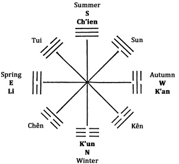
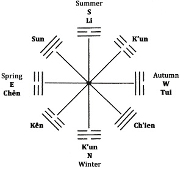
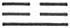
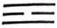
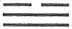
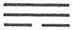
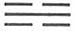
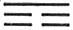

# Shuo Kua: Discussion of the Trigrams

Shuo Koa / Discussion of the Trigrams<a id="ref-1" href="#/book2-01-shuo-kua?id=fn-1">1</a></a>

CHAPTER I

1\. In ancient times the holy sages made the Book of Changes thus:

They invented the yarrow-stalk oracle in order to lend aid in a mysterious way to the light of the gods. To heaven they assigned the number three and to earth the number two; from these they computed the other numbers.

They contemplated the changes in the dark and the light and established the hexagrams in accordance with them. They brought about movements in the firm and the yielding, and thus produced the individual lines.

   They put themselves in accord with tao and its power, and in conformity with this laid down the order of what is right. By thinking through the order of the outer world to the end, and by exploring the law of their nature to the deepest core, they arrived at an understanding of fate.

This first section refers to the Book of Changes as a whole and to the fundamental principles underlying it. The original purpose of the hexagrams was to consult destiny. As divine beings do not give direct expression to their knowledge, a means had to be found by which they could make themselves intelligible. Suprahuman intelligence has from the beginningmade use of three mediums of expression—men, animals, and plants, in each of which life pulsates in a different rhythm. Chance came to be utilized as a fourth medium; the very absence of an immediate meaning in chance permitted a deeper meaning to come to expression in it. The oracle was the outcome of this use of chance. The Book of Changes is founded on the plant oracle as manipulated by men with mediumistic powers.

The established language for communication with suprahuman intelligences was based on numbers and their symbolism. The fundamental principles of the world are heaven and earth, spirit and matter. Earth is the derived principle; therefore the number two is assigned to it. Heaven is the ultimate unity; yet it includes the earth within itself, and is therefore assigned the number three. The number one could not be used, as it is too abstract and rigid and does not include the idea of the manifold. Following out this conception, the uneven numbers were assigned to the world of heaven, the even numbers to the world of earth.

The hexagrams, consisting of six lines each, are, so to speak, representations of actual conditions in the world, and of the combinations of the light-giving, heavenly power and the dark, earthly power that occur in these situations. Within the hexagrams, however, it is always possible for the individual lines to change and regroup themselves; just as world situations continually change and reconstitute themselves, so out of each hexagram there arises a new one. The process of change is to be observed in the lines that move, and the end result in the new hexagram thus formed.

In addition to its use as an oracle, the Book of Changes also serves to further intuitive understanding of conditions in the world, penetration to the uttermost depths of nature and spirit. The hexagrams give complete images of conditions and relationships existing in the world; the individual lines treat particular situations as they change within these general conditions. The Book of Changes is in harmony with tao and its power (natural law and moral law). Therefore it can lay down the rules of what is right for each person. The ultimate meaning of the world—fate, the world as it is, how it has come to be so through creative decision (*ming*)—can be apprehended bygoing down to the ultimate sources in the world of outer experience and of inner experience. Both paths lead to the same goal. (Cf. the first chapter of Lao-tse.)

2\. In ancient times the holy sages made the Book of Changes thus:

Their purpose was to follow the order of their nature and of fate. Therefore they determined the tao of heaven and called it the dark and the light. They determined the tao of the earth and called it the yielding and the firm. They determined the tao of man and called it love<a id="ref-2" href="#/book2-01-shuo-kua?id=fn-2">2</a> and rectitude. They combined these three fundamental powers and doubled them; therefore in the Book of Changes a sign is always formed by six lines.

   The places are divided into the dark and the light. The yielding and the firm occupy these by turns. Therefore the Book of Changes has six places, which constitute the linear figures.

This section deals with the elements of the individual hexagrams and their interrelation with the cosmic process. Just as in the heavens, evening and morning make a day through the alternation of dark and light (yin and yang), so the alternating even and uneven places in the hexagrams are respectively designated as dark and light. The first, third, and fifth places are light; the second, fourth, and sixth are dark. Furthermore, just as on earth all beings are formed from both firm and yielding elements, so the individual lines are firm, i.e., undivided, or yielding, i.e., divided. In correspondence with these two basic powers in heaven and on earth, there exist in man the polarities of love and rectitude—love being related to the light principle and rectitude to the dark. These human attributes, because they belong to the category of the subjective, not of the objective, are not represented specifically in the places and lines of the hexagrams. The trinity of worldprinciples, however, does come to expression in the hexagram as a whole and in its parts. These three principles are differentiated as subject (man), object having form (earth), and content (heaven). The lowest place in the trigram is that of earth; the middle place belongs to man and the top place to heaven. In correspondence with the principle of duality in the universe, the original three-line signs are doubled; thus in the hexagrams there are two places each for earth, for man, and for heaven. The two lowest places are those of the earth, the third and fourth are those of man, and the two at the top are those of heaven.

A fully rounded concept of the universe is expressed here, directly related to that expressed in the Doctrine of the Mean.<a id="ref-3" href="#/book2-01-shuo-kua?id=fn-3">3</a>

All the ideas set forth in this first chapter link it to the collection of essays on the meaning and structure of the hexagrams called the Appended Judgments,<a id="ref-4" href="#/book2-01-shuo-kua?id=fn-4">4</a> and are not connected with what follows here.

CHAPTER II

3\. Heaven and earth determine the direction. The forces of mountain and lake are united. Thunder and wind arouse each other. Water and fire do not combat each other. Thus are the eight trigrams intermingled.

Counting that which is going into the past depends on the forward movement. Knowing that which is to come depends on the backward movement. This is why the Book of Changes has backward-moving numbers.

Here, in what is probably a very ancient saying, the eight primary trigrams are named in a sequence of pairs that, according to tradition, goes back to Fu Hsi—that is to say, it wasalready in existence at the time of the compilation of the Book of Changes under the Chou dynasty. It is called the Sequence of Earlier Heaven, or the Primal Arrangement.<a id="ref-1" href="#/book2-01-shuo-kua?id=fn-1">1</a> The different trigrams are correlated with the cardinal points, as shown in the accompanying diagram fig. 1. (It is to be noted that the Chinese place south at the top.)

Fig. 1. Sequence of Earlier Heaven, or Primal Arrangement

Ch’ien, heaven, and K’un, earth, determine the north-south axis. Then follows the axis Kên-Tui, mountain and lake. Their forces are interrelated in that the wind blows from the mountain to the lake, and the clouds and mists rise from the lake to the mountain. Chên, thunder, and Sun, wind, strengthen each other when they appear. Li, fire, and K’an, water, are irreconcilable opposites in the phenomenal world. In the primal relationships, however, their effects do not conflict; on the contrary, they balance each other.

When the trigrams intermingle, that is, when they are in motion, a double movement is observable: first, the usual clockwise movement, cumulative and expanding as time goeson, and determining the events that are passing; second, an opposite, backward movement, folding up and contracting as time goes on, through which the seeds of the future take form. To know this movement is to know the future. In figurative terms, if we understand how a tree is contracted into a seed, we understand the future unfolding of the seed into a tree.

4\. Thunder brings about movement, wind brings about dispersion, rain brings about moisture, the sun brings about warmth, Keeping Still brings about standstill, the Joyous brings about pleasure, the Creative brings about rulership, the Receptive brings about shelter.

Here again the forces for which the eight primary trigrams stand are presented in terms of their effects in nature. The first four are referred to by their images, the last four by their names, because only the first four indicate in their images natural forces at work throughout time, while the last four point to conditions that come about in the course of the year.

Thus we have first a forward-moving (rising) line, in which the forces of the preceding year take effect. According to section 3, following this line leads to knowledge of the past, which is present as a latent cause in the effects it produces. In the second group, named not according to the images (phenomena) but according to the attributes of the trigrams, a backward movement sets in (a jump from Li in the east back to Kên in the northwest). Along this line the forces of the coming year develop, and following it leads to knowledge of the future, which is being prepared as an effect by its causes—like seeds that, in contracting, consolidate.

Within the Primal Arrangement the forces always take effect as pairs of opposites. Thunder, the electrically charged force, awakens the seeds of the old year. Its opposite, the wind, dissolves the rigidity of the winter ice. The rain moistens the seeds, enabling them to germinate, while its opposite, the sun, provides the necessary warmth. Hence the saying: “Water and fire do not combat each other.” Then come the backward-moving forces. Keeping Still stops further expansion; germinationbegins. Its opposite, the Joyous, brings about the joys of the harvest. Finally there come into play the directing forces—the Creative, representing the great law of existence, and the Receptive, representing shelter in the womb, into which everything returns after completing the cycle of life.

As in the course of the year, so in human life we find ascending and backward-moving lines of force from which the present and the future can be deduced.

5\. God comes forth in the sign of the Arousing; he brings all things to completion in the sign of the Gentle; he causes creatures to perceive one another in the sign of the Clinging (light); he causes them to serve one another in the sign of the Receptive. He gives them joy in the sign of the Joyous; he battles in the sign of the Creative; he toils in the sign of the Abysmal; he brings them to perfection in the sign of Keeping Still.

Here the sequence of the eight trigrams is given according to King Wên’s arrangement, which is called the Sequence of Later Heaven, or the Inner-World Arrangement. The trigrams are taken out of their grouping in pairs of opposites and shown in the temporal progression in which they manifest themselves in the phenomenal world in the cycle of the year. Hereby the arrangement of the trigrams is essentially changed. The cardinal points and the seasons are correlated. The arrangement is represented as in figure 2.

Fig. 2. Sequence of Later Heaven, or Inner-World Arrangement

The year begins to show the creative activity of God in the trigram Chên, the Arousing, which stands in the east and signifies the spring. The passage following explains more fully how this activity of God proceeds in nature.

It is highly probable that section 5 represents a cryptic saying of great antiquity that in the passage below has received an interpretation referable no doubt to the Confucian school of thought.

All living things come forth in the sign of the Arousing. The Arousing stands in the east.

They come to completion in the sign of the Gentle. The Gentle stands in the southeast. Completion means that all creatures become pure and perfect.

The Clinging is the brightness in which all creatures perceive one another. It is the trigram of the south. That the holy sages turned their faces to the south while they gave ear to the meaning of the universe means that in ruling they turned toward what is light. This they evidently took from this trigram.

The Receptive means the earth. It takes care that all creatures are nourished. Therefore it is said: “He causes them to serve one another in the sign of the Receptive.”

The Joyous is midautumn, which rejoices all creatures. Therefore it is said: “He gives them joy in the sign of the Joyous.”

“He battles in the sign of the Creative.” TheCreative is the trigram of the northwest. It means that here the dark and the light arouse each other.

The Abysmal means water. It is the trigram of due north, the trigram of toil, to which all creatures are subject. Therefore it is said: “He toils in the sign of the Abysmal.”

Keeping Still is the trigram of the northeast, where beginning and end of all creatures are completed. Therefore it is said: “He brings them to perfection in the sign of Keeping Still.”

Here the course of the year and the course of the day are harmonized. What is pictured in the foregoing passage as the unfolding of the divine is here shown as it appears in nature. The trigrams are allotted to the seasons and to the cardinal points without schematization, by cursory allusions that result in the diagram shown in figure 2.

Spring begins to stir and in nature there is germination and sprouting. This corresponds with the morning of a day. This awakening belongs to the trigram Chên, the Arousing, which streams out of the earth as thunder and electrical energy. Then gentle winds blow, renewing the plant world and clothing the earth in green; this corresponds with the trigram Sun, the Gentle, the Penetrating. Sun has for its image both wind, which melts the rigid ice of winter, and wood, which develops organically. The characteristic of this trigram is to make things flow into their forms, to make them develop and grow into the shape prefigured in the seed.

Then comes the high point of the year, midsummer, or, in terms of the day, noontide. Here is the place of the trigram Li, the Clinging, light. Creatures now perceive one another. What was vegetative organic life passes over into psychic consciousness. Thus we have likewise an image of human society, in which the ruler, turned to the light, governs the world. It is to be noted that the trigram Li occupies the place in the south that in the Primal Arrangement is held by the trigram Ch’ien, the Creative. Li consists essentially of the top and bottom lines of Ch’ien, which have taken to themselves the middle line ofK’un. To understand fully, one must always visualize the Inner-World Arrangement as transparent, with the Primal Arrangement shining through it. Thus when we come to the trigram Li, we come at the same time upon the ruler Ch’ien, who governs with his face turned to the south.

Thereupon follows the ripening of the fruits of the field, which K’un, the earth, the Receptive, bestows. It is the season of harvesting, of joint labor. Next, as evening follows day, midautumn follows under the trigram of the Joyous, Tui, which, as autumn, leads the year toward its fruition and joy.

Then follows the stern season, when proof of deeds accomplished must be forthcoming. Judgment is in the air. From earth our thoughts return to heaven, to Ch’ien, the Creative. A battle is being fought, for it is just when the Creative is coming to dominance that the dark yin force is most powerful in its external effects. Hence the dark and the light now arouse each other. There is no doubt as to the outcome of this battle, for it is only the final effect of pre-existing causes that comes to judgment through the Creative.

Now winter ensues, in the trigram K’an, the Abysmal. K’an, in the north—the place of the Receptive in the Primal Arrangement—is symbolized by the gorge. Now comes the toil of gathering the crops into the barns. Water shuns no effort, always seeking the lowest level, so that everything flows to it; in the same way, winter in the course of the year, and midnight in the course of the day, are the time of concentration.

The trigram Keeping Still, whose symbol is the mountain, is of mysterious significance. Here, in the seed, in the deep-hidden stillness, the end of every thing is joined to a new beginning. Death and life, dying and resurrection—these are the thoughts awakened by the transition from the old year to the new.

Thus the cycle is closed. Like the day or the year in nature, so every life, indeed every cycle of experience, is a continuity by which old and new are linked together. In view of this we can understand why, in several of the sixty-four hexagrams, the southwest represents the period of work and fellowship, while the northeast stands for the time of solitude, when the old is brought to an end and the new is begun.

6\. The spirit is mysterious in all living things and works through them. Of all the forces that move things, there is none swifter than thunder. Of all the forces that bend things, there is none swifter than wind. Of all the forces that warm things, there is none more drying than fire. Of all the forces that give joy to things, there is none more gladdening than the lake. Of all the forces that moisten things, there is none more moist than water. Of all the forces that end and begin things, there is none more glorious than keeping still.

Therefore: Water and fire complement each other, thunder and wind do not interfere with each other, and the forces of mountain and lake are united in their action. Thus only are change and transformation possible, and thus only can all things come to perfection.

Only the action of the six derived trigrams is described here. It is the action of the spiritual, which is not a thing among things, but the force that manifests its existence through the various effects of thunder, wind, and so on. The two primary trigrams, the Creative and the Receptive, are not mentioned because, as heaven and earth, they actually are those emanations of the spirit within which, through the action of the derived forces, the visible world comes into being and changes. Each of these forces acts in a definite direction, but movement and change come about only because the forces acting as pairs of opposites, without canceling each other, set going the cyclic movement on which the life of the world depends.

CHAPTER III

The third chapter deals with the eight trigrams separately and presents the symbols with which they are associated. It is important inasmuch as the words of the text on the individual lines in each hexagram are very often to be explained againstthe background of these symbols. A knowledge of these associations is important as a tool in understanding the structure of the Book of Changes.

7\. *The Attributes*

The Creative is strong.\
The Receptive is yielding.\
The Arousing means movement.\
The Gentle is penetrating.\
The Abysmal is dangerous.\
The Clinging means dependence.\
Keeping Still means standstill.\
The Joyous means pleasure.

8\. *The Symbolic Animals*

The Creative acts in the horse, the Receptive in the cow, the Arousing in the dragon, the Gentle in the cock, the Abysmal in the pig, the Clinging in the pheasant, Keeping Still in the dog, the Joyous in the sheep.

The Creative is symbolized by the horse,<a id="ref-1" href="#/book2-01-shuo-kua?id=fn-1">1</a> swift and tireless as it runs, and the Receptive by the gentle cow. The Arousing, whose image is thunder, is symbolized by the dragon, which, rising out of the depths, soars up to the stormy sky—in correspondence with the single strong line pushing upward below the two yielding lines. The Gentle, the Penetrating, is symbolized by the cock, time’s watchman, whose voice pierces the stillness—pervasive as the wind, the image of the Gentle. Water is the image associated with the Abysmal; of the domestic animals, the pig is the one that lives in mud and water. In Li as its trigram, the Clinging, brightness, has originally the image of a pheasant-like firebird. The dog, the faithful guardian, belongs to Kên, Keeping Still. The Joyous is linked with the sheep, which is regarded as the animal belonging to the west; the two parts of the divided line at the top are the horns of the sheep.

9\. *The Parts of the Body*

The Creative manifests itself in the head, the Receptive in the belly, the Arousing in the foot, the Gentle in the thighs, the Abysmal in the ear, the Clinging (brightness) in the eye, Keeping Still in the hand, the Joyous in the mouth.

The head governs the entire body. The belly serves for storing up. The foot steps on the ground and moves; the hand holds fast. The thighs under their covering branch downward; the mouth in plain sight opens upward. The ear is hollow outside; the eye is hollow inside. All these are pairs of opposites corresponding with the trigrams.

10\. *The Family of the Primary Trigrams*

The Creative is heaven, therefore it is called the father. The Receptive is the earth, therefore it is called the mother.

In the trigram of the Arousing she seeks for the first time the power of the male and receives a son. Therefore the Arousing is called the eldest son.

In the trigram of the Gentle the male seeks for the first time the power of the female and receives a daughter. Therefore the Gentle is called the eldest daughter.

In the Abysmal she seeks for a second time and receives a son. Therefore it is called the middle son.

In the Clinging he seeks for a second time and receives a daughter. Therefore it is called the middle daughter.

In Keeping Still she seeks for a third time and receives a son. Therefore it is called the youngest son.

In the Joyous he seeks for a third time and receives a daughter. Therefore it is called the third daughter.

In the sons, according to this derivation, the substance comes from the mother—hence the two female lines—while the dominant or determining line comes from the father. The opposite holds in the case of the daughters. The child is opposite in sex to the parent who “seeks” it.

Here we note a difference between the Inner-World Arrangement and the Primal Arrangement with respect to the sex of the derived trigrams. In the Primal Arrangement the lowest line is always the sex determinant and the sons are: (1) Chên, the Arousing ; (2) Li, the Clinging (the sun) ; (3) Tui, the Joyous . In the arrangement shown in the diagram fig. 1 they stand in the eastern half. The daughters are: (1) Sun, the Gentle ; (2) K’an, the Abysmal (the moon) ; (3) Kên, Keeping Still . They stand in the western half. In the Inner-World Arrangement, therefore, only Chên and Sun have not changed in sex. The diagram fig. 2 shows the three sons to the left of Ch’ien, the Creative, while K’un has the two elder daughters at the right and the youngest daughter at the left between itself and Ch’ien.

11\. *Additional Symbols*

The Creative is heaven. It is round, it is the prince, the father, jade, metal, cold, ice; it is deep red, a good horse, an old horse, a lean horse, a wild horse, tree fruit.

Most of these symbols explain themselves. Jade is the symbol of spotless purity and of firmness; so likewise is metal. Cold and ice are accounted for by the position of the trigram in the northwest. Deep red is the intensified color of the light principle (in the text itself, midnight blue is the color of the Creative, according with the color of the sky). The various horses denote power, endurance, firmness, strength (the “wild” horse is a mythical saw-toothed animal, able to tear even a tiger to pieces). Fruit is a symbol of duration in change.

Later commentaries add the following: it is straight, it is the dragon, the upper garment, the word.

The Receptive is the earth, the mother. It is cloth, a kettle, frugality, it is level, it is a cow with a calf,a large wagon, form, the multitude, a shaft. Among the various kinds of soil, it is the black.

The first of these symbols are intelligible at a glance. Cloth is something spread out; the earth is covered with life as with a garment. In the kettle, things are cooked until they are done; similarly, the earth is the great melting pot of life. Frugality is a fundamental characteristic of nature. “It is level” means that the earth knows no partiality. A cow with a calf is a symbol of fertility. The large wagon symbolizes the fact that the earth carries all living things. Form and ornament are the opposite of content, which finds expression in the Creative. The multitude, plurality, is the opposite of the oneness of the Creative. The shaft is the body of the tree, from which the branches spring, as all life sprouts forth from the earth. Black is intensified darkness.<a id="ref-2" href="#/book2-01-shuo-kua?id=fn-2">2</a>

The Arousing is thunder, the dragon. It is dark yellow, it is a spreading out, a great road, the eldest son. It is decisive and vehement; it is bamboo that is green and young, it is reed and rush.

Among horses it signifies those which can neigh well, those with white hind legs, those which gallop, those with a star on the forehead.

Among useful plants it is the pod-bearing ones. Finally, it is the strong, that which grows luxuriantly.

Dark yellow is a mixture of the dark heavens and the yellow earth. A “spreading out” (perhaps to be read “blossoms”) suggests the luxuriant growth of spring, which covers the earth with a garment of plants. A great road suggests the universal way to life in the spring. Bamboo, reed, and rush are especially fast-growing plants. The neighing of horses denotes their relationship to thunder. White hind legs gleam from afar as the horses run. The gallop is the liveliest gait. The seedlings of pod-bearing plants retain the pods.

The Gentle is wood, wind, the eldest daughter, the guideline, work; it is the white, the long, the high; it is advance and retreat, the undecided, odor.

Among men it means the gray-haired; it means those with broad foreheads; it means those with much white in their eyes; it means those close to gain, so that in the market they get threefold value. Finally, it is the sign of vehemence.

The first of these meanings need no further explanation. The guideline belongs to this trigram in that it refers to a windlike dissemination of commands. White is the color of the yin principle. Here yin is in the lowest place at the beginning. Wood grows long; the wind goes up to great heights. Advance and retreat refer to the changeableness of the wind; indecision and the odor wafted by the wind belong in this same context. Gray-haired, scanty-haired people have a great deal of white in their hair. People with much white in their eyes are arrogant and vehement; those who are eager for gain are likewise vehement, so that finally the trigram turns into its opposite and represents vehemence, Chên.

The Abysmal is water, ditches, ambush, bending and straightening out, bow and wheel.

Among men it means the melancholy, those with sick hearts, those with earache.

It is the blood sign; it is red.

Among horses it means those with beautiful backs, those with wild courage, those which let their heads hang, those with thin hoofs, those which stumble.

Among chariots it means those with many defects.

It is penetration, the moon.

It means thieves.

Among varieties of wood it means those which are firm and have much pith.

The first of these attributes are again self-explanatory. Bending and straightening out are implied by the winding course of water; this leads to the thought of something bent, of bow and wheel. Melancholy is expressed by the fact that one strong line is hemmed in between two weak lines; thus also sickness of the heart. The trigram signifies toil and also the ear. Pains in the ear come from laborious listening.

Blood is the fluid of the body, therefore the symbolic color of K’an is red, though a somewhat brighter red than that of Ch’ien, the Creative. Because of its penetrating quality K’an, when applied to a carriage, is made to symbolize a broken-down<a id="ref-3" href="#/book2-01-shuo-kua?id=fn-3">3</a> vehicle that serves as a wagon. Penetration is suggested by the penetrating line in the middle wedged in between the two weak lines. As a water element, K’an means the moon, which therefore appears as masculine. Persons who secretly penetrate a place and sneak away are thieves. The pithiness of wood is also connected with the attribute of penetration.

The Clinging is fire, the sun, lightning, the middle daughter.

It means coats of mail and helmets; it means lances and weapons. Among men it means the big-bellied.

It is the sign of dryness. It means the tortoise, the crab, the snail, the mussel, the hawkbill tortoise.

Among trees it means those which dry out in the upper part of the trunk.

Where the various symbols are not self-explanatory, they are suggested by the meaning of fire, of heat and dryness, and further by the character of the trigram, which is firm without and hollow, or yielding, within. This aspect accounts for the weapons, the fat belly, the shell-bearing creatures, and the hollow trees beginning to wither at the top.

Keeping Still is the mountain; it is a bypath; it means little stones, doors and openings, fruits and seeds, eunuchs and watchmen, the fingers; it is thedog, the rat, and the various kinds of black-billed birds.

Among trees it signifies the firm and gnarled.

A bypath is suggested by the mountain path, and so are stones. A gate is suggested by the form of the trigram. Fruits and seeds are the link between the end and the beginning of plants. Eunuchs are doorkeepers, and watchmen guard the streets; both protect and watch. The fingers serve to hold fast, the dog keeps guard, the rat gnaws, birds with black beaks grip things easily; likewise, gnarled tree trunks possess the greatest power of resistance.

The Joyous is the lake, the youngest daughter; it is a sorceress; it is mouth and tongue. It means smashing and breaking apart; it means dropping off and bursting open. Among the kinds of soil it is the hard and salty. It is the concubine. It is the sheep.

The sorceress is a woman who speaks. The trigram is open above, hence it denotes mouth and tongue. It stands in the west and is therefore connected with the idea of autumn, destruction, hence the smashing and breaking apart, the dropping off and bursting open of ripe fruits. Where lakes have dried up, the ground is hard and salty. The concubine derives from the idea of the youngest daughter. The sheep, outwardly weak and inwardly stubborn, is suggested by the form of the trigram, as already mentioned. (It should be noted that in China sheep and goats are regarded as practically the same animal and have the same name.)

---

**Notes:**

<a id="fn-1" href="#/book2-01-shuo-kua?id=ref-1">**1.**</a> Eighth Wing.

<a id="fn-2" href="#/book2-01-shuo-kua?id=ref-2">**2.**</a> In the sense of humane feeling.

<a id="fn-3" href="#/book2-01-shuo-kua?id=ref-3">**3.**</a> See here, n. 22.

<a id="fn-4" href="#/book2-01-shuo-kua?id=ref-4">**4.**</a> I.e., the *Ta Chuan* or *Hsi Tz’u Chuan*, given as the Great Treatise or Great Commentary here.

<a id="fn-1" href="#/book2-01-shuo-kua?id=ref-1">**1.**</a> Literally, “Before-the-World Sequence.”

<a id="fn-1" href="#/book2-01-shuo-kua?id=ref-1">**1.**</a> These passages represent variants on the text of the *I Ching*, in which the Creative is symbolized by the dragon, the Receptive by the mare, and the Clinging by the cow.

<a id="fn-2" href="#/book2-01-shuo-kua?id=ref-2">**2.**</a> In the text of the *I Ching*, the color of the Receptive is yellow, and its animal is the mare.

<a id="fn-3" href="#/book2-01-shuo-kua?id=ref-3">**3.**</a> That is, pierced with holes.
