# Ta Chuan: The Great Treatise

[Ta Chuan: The Great Treatise Great Commentary](#pup-iching003.html_pup-iching003htmlpt03toc)<a id="ref-1" href="#/book2-02-ta-chuan?id=fn-1">1</a>

(also called *Hsi Tz’u Chuan*, Commentary on the Appended Judgments)

PART I

A. UNDERLYING PRINCIPLES

CHAPTER I. The Changes in the Universe and in the Book of Changes

1\. Heaven is high, the earth is low; thus the Creative and the Receptive are determined. In correspondence with this difference between low and high, inferior and superior places are established.

Movement and rest have their definite laws; according to these, firm and yielding lines are differentiated.

Events follow definite trends, each according to its nature. Things are distinguished from one another in definite classes. In this way good fortune and misfortune come about. In the heavens phenomena take form; on earth shapes take form. In this way change and transformation become manifest.

In the Book of Changes a distinction is made between three kinds of change: nonchange, cyclic change, and sequent change.<a id="ref-2" href="#/book2-02-ta-chuan?id=fn-2">2</a> Nonchange is the background, as it were, againstwhich change is made possible. For in regard to any change there must be some fixed point to which the change can be referred; otherwise there can be no definite order and everything is dissolved in chaotic movement. This point of reference must be established, and this always requires a choice and a decision. It makes possible a system of co-ordinates into which everything else can be fitted. Consequently at the beginning of the world, as at the beginning of thought, there is the decision, the fixing of the point of reference. Theoretically any point of reference is possible, but experience teaches that at the dawn of consciousness one stands already inclosed within definite, prepotent systems of relationships. The problem then is to choose one’s point of reference so that it coincides with the point of reference for cosmic events. For only then can the world created by one’s decision escape being dashed to pieces against prepotent systems of relationships with which it would otherwise come into conflict. Obviously the premise for such a decision is the belief that in the last analysis the world is a system of homogeneous relationships —that it is a cosmos, not a chaos. This belief is the foundation of Chinese philosophy, as of all philosophy. The ultimate frame of reference for all that changes is the nonchanging.

The Book of Changes takes as the foundation for this system of relationships the distinction between heaven and earth. There is heaven, the upper world of light, which, though incorporeal, firmly regulates and determines everything that happens, and over against heaven there is the earth, the lower, dark world, corporeal, and dependent in its movements upon the phenomena of heaven. With this differentiation of above and below there is posited, in one way or another, a difference in value, so that the one principle, heaven, is the more exalted and honored, while the other, earth, is regarded as lesser and lower. These two cardinal principles of all existence are then symbolized in the two fundamental hexagrams of the Book of Changes, THE CREATIVE and THE RECEPTIVE. In the last analysis, this cannot be called a dualism. The two principles are united by a relation based on homogeneity; they do notcombat but complement each other. The difference in level creates a potential, as it were, by virtue of which movement and living expression of energy become possible.

This association of high and low with value differentiations leads to the differentiation of superior and inferior. This is expressed symbolically in the hexagrams of the Book of Changes, which are considered to have high and low, superior and inferior places. Each hexagram consists of six places, of which the odd-numbered ones are superior and the even-numbered ones inferior.

There is another difference bound up with this one. In the heavens constant movement and change prevail; on earth fixed and apparently lasting conditions are to be observed. On closer scrutiny, this is only delusion. In the philosophy of the Book of Changes nothing is regarded as being absolutely at rest; rest is merely an intermediate state of movement, or latent movement. However, there are points at which the movement becomes visible. This is symbolized by the fact that the hexagrams are built up of both firm and yielding lines. The firm, the strong, is designated as the principle of movement, the yielding as the principle of rest. The firm is represented by an undivided line, corresponding with the light principle, the yielding by a divided line that corresponds with the dark principle.

The fact that the character of the line (firm, yielding) combines with the character of the place (superior, inferior) results in a great multiplicity of possible situations. This serves to symbolize a third nexus of events in the world. There are conditions of equilibrium, in which a certain harmony prevails, and conditions of disturbed equilibrium, in which confusion prevails. The reason is that there is a system of order pervading the entire world. When, in accordance with this order, each thing is in its appropriate place, harmony is established. Such a tendency toward order can be observed in nature. The places attract related elements, as it were, so that harmony may come about. However, a parallel tendency is also at work. Not only are things determined by their tendency toward order: they move also by virtue of forces imparted to them, so to speak, mechanically from the outside. Hence it is not possible for equilibrium to be attained under all circumstances, fordeviations may occur, bringing with them confusion and disorder. In the sphere of human affairs, the condition of harmony assures good fortune, that of disharmony predicates misfortune. These complexes of occurrences can be represented by the combinations of lines and places, as pointed out above.

Another law is to be noted. Owing to changes of the sun, moon, and stars, phenomena take form in the heavens. These phenomena obey definite laws. Bound up with them, shapes come into being on earth, in accordance with identical laws. Therefore the processes on earth—blossom and fruit, growth and decay—can be calculated if we know the laws of time. If we know the laws of change, we can precalculate in regard to it, and freedom of action thereupon becomes possible. Changes are the imperceptible tendencies to divergence that, when they have reached a certain point, become visible and bring about transformations.

These are the immutable laws under which, according to Chinese thought, changes are consummated. It is the purpose of the Book of Changes to demonstrate these laws by means of the laws of change operating in the respective hexagrams. Once we succeed in completely reproducing these laws, we acquire a comprehensive view of events; we can understand past and future equally well and bring this knowledge to bear in our actions.

2\. Therefore the eight trigrams succeed one another by turns, as the firm and the yielding displace each other.

Here cyclic change is explained. It is a rotation of phenomena, each succeeding the other until the starting point is reached again. Examples are furnished by the course of the day and year, and by the phenomena that occur in the organic world during these cycles. Cyclic change, then, is recurrent change in the organic world, whereas sequent change means the progressive nonrecurrent change of phenomena produced by causality.

The firm and the yielding displace each other within the eight trigrams. Thus the firm is transformed, melts as it were, and becomes the yielding; the yielding changes, coalesces,as it were, and becomes the firm. In this way the eight trigrams change from one into another in turn, and the regular alternation of phenomena within the year takes its course. But this is the case in all cycles, the life cycle included. What we know as day and night, summer and winter—this, in the life cycle, is life and death.

To make more intelligible the nature of cyclic change and the alternations of the trigrams produced by it, their sequence in the Primal Arrangement is shown once again fig. 3. There are two directions of movement, the one rightward, ascending, the other backward, descending. The former starts from the low point, K’un, the Receptive, earth; the latter starts from the high point, Ch’ien, the Creative, heaven.

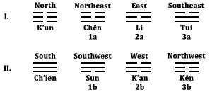

Figure 3

3\. Things are aroused by thunder and lightning; they are fertilized by wind and rain. Sun and moon follow their courses and it is now hot, now cold.

Here we have the sequence of the trigrams in the changing seasons of the year, and in such a way that each is the cause of the one next following. Deep in the womb of earth there stirs the creative force, Chên, the Arousing, symbolized by thunder. As this electrical force appears there are formed centers of activation that are then discharged in lightning. Lightning is Li, the Clinging, flame. Hence thunder is put before lightning. Thunder is, so to speak, the agent evoking the lightning; it is not merely the sounding thunder. Now the movement shifts; thunder’s opposite, Sun, the wind, sets in. The wind brings rain, K’an. Then there is a new shift. The trigrams Li andK’an, formerly acting in their secondary forms as lightning and rain, now appear in their primary forms as sun and moon. In their cyclic movement they cause cold and heat. When the sun reaches the zenith, heat sets in, symbolized by the trigram of the southeast, Tui, the Joyous, the lake. When the moon is at its zenith in the sky, cold sets in, symbolized by the trigram of the northwest, Kên, the mountain, Keeping Still. Hence the sequence is (cf. fig. 3):

1a — 2a 1b — 2b

2a — 3a 2b — 3b

Thus 2*a* (Li) and 2*b* (K’an) are named twice, once in their secondary forms (lightning and rain), once in their primary forms (sun and moon).

4\. The way of the Creative brings about the male.\
The way of the Receptive brings about the female.

Here the beginning of sequent change appears, manifested in the succession of the generations, an onward-moving process that never returns to its starting point. This shows the extent to which the Book of Changes confines itself to life. For according to Western ideas, sequent change would be the realm in which causality operates mechanically; but the Book of Changes takes sequent change to be the succession of the generations, that is, still something organic.

The Creative, in so far as it enters as a principle into the phenomenon of life, is embodied in the male sex; the Receptive is embodied in the female sex. Thus the Creative in the lowest line of each of the sons (Chên, Li, Tui, in the Primal Arrangement), and the Receptive in the lowest line of each of the daughters (Sun, K’an, Kên, in the Primal Arrangement), is the sex determinant of the given trigram.

5\. The Creative knows the great beginnings.\
The Receptive completes the finished things.

Here the principles of the Creative and the Receptive are traced further. The Creative produces the invisible seeds of all development. At first these seeds are purely abstract, therefore with respect to them there can be no action nor acting upon; here it is knowledge that acts creatively. Whilethe Creative acts in the world of the invisible, with spirit and time for its field, the Receptive acts upon matter in space and brings material things to completion. Here the processes of generation and birth are traced back to their ultimate meta-physical meanings.<a id="ref-3" href="#/book2-02-ta-chuan?id=fn-3">3</a>

6\. The Creative knows through the easy.\
The Receptive can do things through the simple.

The nature of the Creative is movement. Through movement it unites with ease what is divided. In this way the Creative remains effortless, because it guides infinitesimal movements when things are smallest. Since the direction of movement is determined in the germinal stage of being, everything else develops quite effortlessly of itself, according to the law of its nature.

The nature of the Receptive is repose. Through repose the absolutely simple becomes possible in the spatial world. This simplicity, which arises out of pure receptivity, becomes the germ of all spatial diversity.

7\. What is easy, is easy to know; what is simple, is easy to follow. He who is easy to know attains fealty. He who is easy to follow attains works. He who possesses attachment can endure for long; he who possesses works can become great. To endure is the disposition of the sage; greatness is the field of action of the sage.

This passage points out how the easy and the simple take effect in human life. What is easy is readily understood, and from this comes its power of suggestion. He whose ideas are clear and easily understood wins men’s adherence because he embodies love. In this way he becomes free of confusing conflicts and disharmonies. Since the inner movement is in harmony with the environment, it can take effect undisturbed and have long duration. This consistency and duration characterize the disposition of the sage.

It is exactly the same in the realm of action. Whatever is simple can easily be imitated. Consequently, others are ready to exert their energy in the same direction; everyone does gladly what is easy for him, because it is simple. The result is that energy is accumulated, and the simple develops quite naturally into the manifold. Thus it grows, and the sage’s mission to lead the multitude to the performance of great works is fulfilled.

8\. By means of the easy and the simple we grasp the laws of the whole world. When the laws of the whole world are grasped, therein lies perfection.

Here we are shown how the fundamental principles demonstrated above are applied in the Book of Changes. The easy and the simple are symbolized by very slight changes in the individual lines. The divided lines become undivided lines as the result of an easy movement that joins their separated ends; undivided lines become divided ones by means of a simple division in the middle. Thus the laws of all processes of growth under heaven are depicted in these easy and simple changes, and thereby perfection is attained.

Hereby the nature of change is defined as change of the smallest parts. This is the fourth meaning of the Chinese word *I*—a connotation that has, it is true, only a loose connection with the meaning “change.”

CHAPTER II. On the Composition and the Use of the Book of Changes

1\. The holy sages instituted the hexagrams, so that phenomena might be perceived therein. They appended the judgments, in order to indicate good fortune and misfortune.

The hexagrams of the Book of Changes are representations of earthly phenomena. In their interrelation they show the interrelation of events in the world. Thus the hexagrams wererepresentations of ideas. But these images or phenomena revealed only the actual; there still remained the problem of extracting counsel from them, in order to determine whether a line of action derived from the image was favorable or harmful, whether it should be adopted or avoided. To this extent the foundation of the Book of Changes was already in existence in the time of King Wên. The hexagrams were, so to speak, oracle pictures showing what event might be expected to occur under certain circumstances. King Wên and his son then added the interpretations; from these it could be ascertained whether the course of action indicated by the images augured good or ill. This marked the entrance of freedom of choice. From that time on one could see, in the representation of events, not only what might be expected to happen but also where it might lead. With the complex of events immediately before one in image form, one could follow the courses that promised good fortune and avoid those that promised misfortune, before the train of events had actually begun.

2\. As the firm and the yielding lines displace one another, change and transformation arise.

This brings out specifically the degree to which events in the world are represented in the Book of Changes. The hexagrams are made up of firm and yielding lines. Under certain conditions the firm and the yielding lines change: the firm lines are transformed and softened, the yielding lines change and become firm. Thus we have a reproduction of the alternation in world phenomena.

3\. Therefore good fortune and misfortune are the images of gain and loss; remorse and humiliation are the images of sorrow and forethought.

When the trend of an action is in harmony with the laws of the universe, it leads to attainment of the desired goal; this is expressed in the appended phrase “Good fortune.” If the trend is in opposition to the laws of the universe, it necessarily leads to loss; this is indicated by the judgment “Misfortune.” There are also trends that do not lead directly to a goal but are rather what might be called deviations in direction. However, if atrend has been wrong, and we feel sorrow in time, we can avoid misfortune; if we turn back, we can still achieve good fortune. This situation is indicated by the judgment “Remorse.” This judgment, then, contains an exhortation to feel sorrow and turn back. On the other hand, a given trend may have been right at the start, but one may become indifferent and arrogant, and heedlessly slip from good fortune into misfortune. This is indicated by the judgment “Humiliation.” This judgment, then, contains an admonition to exercise forethought, to check oneself when on the wrong path and turn back to good fortune.

4\. Change and transformation are images of progress and retrogression. The firm and the yielding are images of day and night. The movements of the six lines contain the ways of the three primal powers.

Change is the conversion of a yielding line into a firm one. This means progress. Transformation is the conversion of a firm line into a yielding one. This means retrogression. The firm lines are representations of light; the yielding lines, of darkness.<a id="ref-1" href="#/book2-02-ta-chuan?id=fn-1">1</a> The six lines of each hexagram are divided among the three primal powers, heaven, earth, and man. The two lower places are those of the earth, the two middle places belong to man, and the two upper ones to heaven. This section shows the extent to which the content of the Book of Changes reproduces the conditions of the world.

5\. Therefore it is the order of the Changes that the superior man devotes himself to and that he attains tranquility by. It is the judgments on the individual lines that the superior man takes pleasure in and that he ponders on.

From this point on we are shown the correct use of the Book of Changes. For the very reason that the Book of Changes is a reproduction of all existing conditions—with its appendedjudgments indicating the right course of action—it becomes our task to shape our lives according to these ideas, so that life in its turn becomes a reproduction of this law of change. This is not the kind of idealism that artificially imposes an inflexible abstract pattern on a life of quite different mold. On the contrary, the Book of Changes embraces the essential meaning of the various situations of life: thus we are in position to shape our lives meaningfully, by acting in accordance with order and sequence, and doing in each case what the situation requires. In this way we are equal to every situation, because we accept its meaning without resistance, and so we attain peace of soul. Thus our actions are set in order, and the mind also is satisfied, for when we meditate upon the judgments on the individual lines, we intuitively perceive the interrelationships in the world.

6\. Therefore the superior man contemplates these images in times of rest and meditates on the judgments. When he undertakes something, he contemplates the changes and ponders on the oracles. Therefore he is blessed by heaven. “Good fortune. Nothing that does not further.”

Here times of rest and of action are mentioned. During times of rest, experience and wisdom are obtained by meditation on the images and judgments of the book. During times of action we consult the oracle through the medium of the changes arising in the hexagrams as a result of manipulation of the yarrow stalks, and follow according to indication the counsels for action thus supplied.

B. Detailed Discussion

CHAPTER III. On the Words Attached to the Hexagrams and the Lines

1\. The decisions refer to the images. The judgments on the lines refer to the changes.

King Wên’s decisions (judgments) refer in each case to the situation imaged by the hexagram as a whole. The judgments appended by the Duke of Chou to the individual lines refer in each instance to the changes taking place within this situation. In consulting the oracle, the judgment on the line is to be considered only when the line in question “moves,” that is, when it is represented either by a nine or by a six (cf. explanation of the method of consulting the oracle in the appendix).

2\. “Good fortune” and “misfortune” refer to gain and loss, “remorse” and “humiliation” to minor imperfections. “No blame” means that one is in position to correct one’s mistakes in the right way.

This passage is an amplification of section 3 of the preceding chapter. Always making the right choice in words and acts means gain; failing in this results in loss. Slight deviations from what is right are called imperfections. When one does not know what is right and does wrong inadvertently, it is called a mistake. If we become conscious of these small lapses from the right and feel a wish to remedy them, we are moved by remorse. If we remain unaware of them, or if we have the opportunity to remedy them but are either unable or unwilling to do so, humiliation results. Mistakes are like rents in a garment; when a garment has been torn and one mends it, it is whole again. If we amend mistakes by a return to the right path, no blame remains.

3\. Therefore the classification of superior and inferior is based upon the individual places; the equalizing of great and small is based upon the hexagrams, and the discrimination between good fortune and misfortune is based upon the judgments.

The six places in the hexagram are distinguished as follows: The lowest and the topmost are, so to speak, outside the situation. Of these, the lowest is inferior, because it has not yet entered the situation. The uppermost is superior; it is the place of the sage who is no longer involved in worldly affairs, or, under certain circumstances, of an eminent man who is withoutpower. Of the inner places, the second and fourth are those of officials, or of sons or women. The fourth is the higher, the second inferior to it. The third and fifth are authoritative places, the former because it is at the top of the lower trigram, and the latter because it is the place of the ruler of the hexagram.

“Great” and “small” signify firm and yielding lines respectively. They are equalized in the hexagram considered as a whole. Both can be favorable and indicative of good fortune when in their proper places, but the appropriateness of the places cannot be determined in the abstract; it depends on the character of the hexagram as a whole. The situation may frequently be such that yielding is advantageous; in that case a yielding line in a yielding place will be especially favorable, while a firm line in a firm place may be unfavorable. In many cases strength is required, and then a firm place is more advantageous for a yielding line. In other cases the situation may demand that character and place coincide. In a word, the specific distribution is determined by the hexagram in question, that is to say, by the situation it reproduces. Therefore the judgments are appended, to indicate the good or ill fortune arising from the situation.

4\. Concern over remorse and humiliation depends on the borderline. The urge to blamelessness depends on remorse.

Remorse and humiliation are the results of a deviation from the right path and consequently always require a reversal of attitude. One can avoid both by being on guard in time. The point at which concern must set in, if one is to be spared remorse and humiliation, is that point at which good or evil has begun to stir in the mind but has not yet crossed the threshold into actuality. If at this moment one takes action and directs the movement in its germinal phase toward the good, one will be spared remorse and humiliation. If, however, a mistake has already been made, remorse is the psychological force leading to repentance and improvement.

5\. This is why there are small and great among the hexagrams, and therefore the appended judgments speakof danger or safety. The judgments in each case indicate the trend of development.

Among the situations reproduced by the hexagrams there are some of ascending and expanding potentiality and some of descending, contracting potentiality. Accordingly, at some times one must be prepared for danger, while at others one may hope for safety and tranquility. In order to adapt oneself completely to the given situation, it is of great value to know these conditions. This is the function of the judgments: they indicate in each case the direction in which the situation is developing.

CHAPTER IV. The Deeper Implications of the Book of Changes

1\. The Book of Changes contains the measure of heaven and earth; therefore it enables us to comprehend the tao of heaven and earth and its order.

This chapter sets forth the mysterious connections existing between the reproductions given in the Book of Changes and reality. Since the book presents a complete image of heaven and earth, a microcosm of all possible relationships, it enables us to calculate the movements in every situation to which these reproductions apply. If we ask how the Book of Changes can be a reproduction of the cosmos, the answer is that it is the work of men with cosmic intelligence, men who have incorporated their wisdom in the symbols of this book. Hence it contains the standard of heaven and earth.

The following section explains how the fact that the Book of Changes contains the measure, the standard of heaven and earth, makes it possible for us to investigate with its help the laws of the universe. Section 3 deduces from the resemblance of the Changes to heaven and earth a complete representation of inner predispositions. The fourth section, starting from the fact that the Changes comprise all forms and situations, shows how we can attain ultimate mastery of fate.

2\. Looking upward, we contemplate with its help the signs in the heavens; looking down, we examine the lines of the earth. Thus we come to know the circumstances of the dark and the light. Going back to the beginnings of things and pursuing them to the end, we come to know the lessons of birth and of death. The union of seed and power produces all things; the escape of the soul brings about change. Through this we come to know the conditions of outgoing and returning spirits.

The Book of Changes is based on the two fundamental principles of the light and the dark. The hexagrams are built up out of these elements. The individual lines are either at rest or in motion. When at rest—that is, when represented by the number seven (firm) or eight (yielding)—they build up the hexagram, When in motion—that is, when represented by the number nine (firm) or six (yielding)—they break down the hexagram again and transform it into a new hexagram. These are the processes that open our eyes to the secrets of life.

When we apply these principles to the signs in the heavens (the sun standing for light, the moon for darkness) and to the lines of direction on the earth (the cardinal points), we learn to know the circumstances concerning the dark and the light, i.e., the laws that bring about the course and alternation of the seasons and that condition the appearance and withdrawal of the vegetative life force. Thus we learn by observing the beginnings and endings of life that birth and death form one recurrent cycle. Birth is the coming forth into the world of the visible; death is the return into the regions of the invisible. Neither of these signifies an absolute beginning nor an absolute ending, any more than do the changes of the seasons within the year. Nor is it otherwise in the case of man. Just as the resting lines build up the hexagrams and produce change when they begin to move, so bodily existence is built up by the union of “outgoing” life streams of seed (male) with power (female). This corporeal existence remains relatively constant as long as the constructive forces are in the resting state, inequilibrium. When they begin to move, disintegration sets in. The psychic element escapes—the higher part mounting upward, the lower sinking to earth; the body disintegrates.

The spiritual forces that produce the building up and the breaking down of visible existence likewise belong either to the light principle or to the dark principle. The light spirits (*shên*) are outgoing; they are the active spirits, which can also enter upon new incarnations. The dark spirits (*kuei*), return home; they are the withdrawing forces and have the task of assimilating what life has yielded.<a id="ref-1" href="#/book2-02-ta-chuan?id=fn-1">1</a>

This idea of returning and outgoing spirits by no means entails the notion of good and evil beings; it only differentiates the expanding and the contracting phase of the underlying life energy. These are the ebb and flow in the great ocean of life.

3\. Since in this way man comes to resemble heaven and earth, he is not in conflict with them. His wisdom embraces all things, and his tao brings order into the whole world; therefore he does not err. He is active everywhere but does not let himself be carried away. He rejoices in heaven and has knowledge of fate, therefore he is free of care. He is content with his circumstances and genuine in his kindness, therefore he can practice love.

Here we are shown how with the help of the fundamental principles of the Book of Changes it is possible to arrive at a complete realization of man’s innate capacities. This unfolding rests on the fact that man has innate capacities that resemble heaven and earth, that he is a microcosm. Now, since the laws of heaven and earth are reproduced in the Book of Changes, man is provided with the means of shaping his own nature, so that his inborn potentialities for good can be completely realized. In this process two factors are to be taken into account: wisdom and action, or intellect and will. If intellect and will are correctly centered, the emotional life takes on harmony. We have here four propositions based on wisdom and love, justiceand mores, reminding us of the combination of these principles with the four words in the hexagram Ch’ien, THE CREATIVE: “Sublime success; perseverance furthers.”

The effect of wisdom, love, and justice is shown in the first proposition. On the basis of all-embracing wisdom, the regulations springing from a love of the world can be so shaped that all goes well for everyone and no mistakes are made. This is what furthers. The second proposition pictures wisdom and love, excluding no person or thing; these are regulated by the mores, which do not allow one to be carried away into anything improper or one-sided, and therefore have success. The third proposition shows the harmony of mind, perfect in wisdom, that rejoices in heaven and understands its dispensations. This provides the basis for perseverance. Finally; the last proposition shows the love that acquiesces trustingly in every situation and, out of its store of inner kindness, manifests itself in good will toward all men, thereby attaining sublimity, the root of all good.

4\. In it are included the forms and the scope of everything in the heavens and on earth, so that nothing escapes it. In it all things everywhere are completed, so that none is missing. Therefore by means of it we can penetrate the tao of day and night, and so understand it. Therefore the spirit is bound to no one place, nor the Book of Changes to any one form.

We are shown here how the individual can attain mastery over fate by means of the Book of Changes. Its principles contain the categories of all that is—literally, the molds and the scope of all transformations. These categories are in the mind of man; everything, all that happens and everything that undergoes transformation, must obey the laws prescribed by the mind of man. Not until these categories become operative do things become things. These categories are laid down in the Book of Changes; hence it enables us to penetrate and understand the movements of the light and the dark, of life and death, of gods and demons. This knowledge makes possiblemastery over fate, because fate can be shaped if its laws are known. The reason why we can oppose fate is that reality is always conditioned, and these conditions of time and space limit and determine it. The spirit, however, is not bound by these determinants and can bring them about as its own purposes require. The Book of Changes is so widely applicable because it contains only these purely spiritual relationships, which are so abstract that they can find expression within every framework of reality. They contain only the tao that underlies events. Therefore all chance contingencies can be shaped according to this tao. The conscious application of these possibilities assures mastery over fate.

CHAPTER V. Tao in Its Relation to the Light Power and to the Dark Power

1\. That which lets now the dark, now the light appear is tao.

The light and the dark are the two primal powers, designated hitherto in the text as firm and yielding, or as day and night. Firm and yielding are the terms applied to the lines of the Book of Changes, while light and dark designate the two primal powers of nature. It must be left to a later discussion to explain why up to this point the designations day and night have been used, and now suddenly the terms light and dark appear. Possibly we are dealing here with a later stratum of text. At any rate, we can observe that in the course of time the use of these expressions steadily increases.

The terms yin, the dark, and yang, the light, denote respectively the shadowed and the light side of a mountain or a river. Yang represents the south side of the mountain, because this side receives the sunlight, but it connotes the north side of the river, because the light of the river is reflected to that side. The reverse is true as regards yin. These terms are gradually extended to include the two polar forces of the universe, which we may call positive and negative.<a id="ref-1" href="#/book2-02-ta-chuan?id=fn-1">1</a> It may be that thesedesignations, which emphasize the cycle of change more than change itself, led also to the representation in circular form of the Primal Beginning,  *t’ai chi t’u*, the symbol that was later to play such an important part in Chinese thought.

2\. As continuer, it is good. As completer, it is the essence.

The primal powers never come to a standstill; the cycle of becoming continues uninterruptedly. The reason is that between the two primal powers there arises again and again a state of tension, a potential that keeps the powers in motion and causes them to unite, whereby they are constantly regenerated. Tao brings this about without ever becoming manifest. The power of tao to maintain the world by constant renewal of a state of tension between the polar forces, is designated as good<a id="ref-2" href="#/book2-02-ta-chuan?id=fn-2">2</a> (cf. Lao-tse, chap. 8).

As the power that completes things, the power that lends them their individuality and gives them a center around which they organize, tao is called the essence, that with which things are endowed at their origin.<a id="ref-3" href="#/book2-02-ta-chuan?id=fn-3">3</a>

3\. The kind man discovers it and calls it kind. The wise man discovers it and calls it wise. The people use it day by day and are not aware of it, for the way of the superior man is rare.

Tao reveals itself differently to each individual, according to his own nature. The man of deeds, for whom kindness and the love of his fellow man are supreme, discovers the tao of cosmic events and calls it supreme kindness—”God is love.” The contemplative man, for whom calm wisdom is supreme,discovers the tao of the universe and calls it supreme wisdom. The common people live from day to day, continually borne and nourished by tao, but they know nothing of it; they see only what meets the eye. For the way of the superior man, who sees not only things but the tao of things, is rare. The tao of the universe is indeed kindness and wisdom; but essentially tao is also beyond kindness and wisdom.

4\. It manifests itself as kindness but conceals its workings. It gives life to all things, but it does not share the anxieties of the holy sage. Its glorious power, its great field of action, are of all things the most sublime.

The movement from within outward shows tao in its manifestations as the force of supreme kindness. At the same time it remains mysterious even in the light of day. The movement from without inward conceals the results of its workings. It is just as when in spring and summer the seeds start growing, and the life-giving bounty of nature becomes manifest: but along with it there is at work that quiet power which conceals within the seed all the results of growth and in hidden ways prepares what the coming year is to bring. Tao works tirelessly and eternally in this way. Yet this life-giving activity, to which all beings owe their existence, is something purely spontaneous. It is not like the conscious anxiety of man, who strives for the good with inward toil.

5\. It possesses everything in complete abundance: this is its great field of action. It renews everything daily: this is its glorious power.

There is nothing that tao may not possess, for it is omnipresent; everything that exists, exists in and through it. But it is not lifeless possessing; by reason of its eternal power, it continually renews everything, so that each day the world becomes as glorious again as it was on the first day of creation.

6\. As begetter of all begetting, it is called change.

The dark begets the light and the light begets the dark in ceaseless alternation, but that which begets this alternation,that to which all life owes its existence, is tao with its law of change.

7\. As that which completes the primal images, it is called the Creative; as that which imitates them, it is called the Receptive.

This is based on the view expressed likewise in the *Tao Tê Ching*,<a id="ref-4" href="#/book2-02-ta-chuan?id=fn-4">4</a> namely, that underlying reality there is a world of archetypes, and reproductions of these make up the real things in the material world. The world of archetypes is heaven, the world of reproductions is the earth: there energy, here matter; there the Creative, here the Receptive. But it is the same tao that is active both in the Creative and in the Receptive.

8\. In that it serves for exploring the laws of number and thus for knowing the future, it is called revelation. In that it serves to infuse an organic coherence into the changes, it is called the work.

The future likewise develops in accordance with the fixed laws, according to calculable numbers. If these numbers are known, future events can be calculated with perfect certainty. This is the thought on which the Book of Changes is based. This world of the immutable is the daemonic world, in which there is no free choice, in which everything is fixed. It is the world of yin. But in addition to this rigid world of number, there are living trends. Things develop, consolidate in a given direction, grow rigid, then decline; a change sets in, coherence is established once more, and the world is one again. The secret of tao in this world of the mutable, the world of light—the realm of yang—is to keep the changes in motion in such a manner that no stasis occurs and an unbroken coherence is maintained. He who succeeds in endowing his work with this regenerative power creates something organic, and the thing so created is enduring.

9\. That aspect of it which cannot be fathomed in terms of the light and the dark is called spirit.

In their alternation and reciprocal effect, the two fundamental forces serve to explain all the phenomena in the world. Nonetheless, there remains something that cannot be explained in terms of the interaction of these forces, a final why. This ultimate meaning of tao is the spirit, the divine, the unfathomable in it, that which must be revered in silence.

CHAPTER VI. Tao as Applied to the Book of Changes

1\. The Book of Changes is vast and great. When one speaks of what is far, it knows no limits. When one speaks of what is near, it is still and right. When one speaks of the space between heaven and earth, it embraces everything.

Here the Book of Changes is brought into relation with the macrocosm and the microcosm. First the horizontal extent of its domain, its vastness, is given; its laws are valid to the utmost distance and likewise for what is nearest, as one’s own inner laws. Then the vertical extent is given, the space between heaven and earth, because the fates of men come down to them from heaven.

2\. In a state of rest the Creative is one, and in a state of motion it is straight; therefore it creates that which is great. The Receptive is closed in a state of rest, and in a state of motion it opens; therefore it creates that which is vast.

“The Creative” means here the trigram in the Book of Changes, and more especially the line, by which it is symbolized. When at rest, this is a simple unbroken line (———); when it is in motion, its direction is straight forward. The Receptive is symbolized by a divided line (— —); it is closed when at rest and opens when in motion. Thus that which iswrought by the Creative is designated, in accordance with its nature, as great. The Creative produces quality. That which is produced by the Receptive is designated, in accordance with its form, as broad and manifold. The Receptive produces quantity.

3\. Because of its vastness and greatness, it corresponds with heaven and earth. Because of its changes and its continuity, it corresponds with the four seasons. Because of the meaning of the light and the dark, it corresponds with sun and moon. Because of the good in the easy and the simple, it corresponds with the supreme power.

Here the parallels between the Book of Changes and the cosmos are shown. The Book of Changes contains material multiplicity, quantity, like the earth. It contains dynamic greatness, quality, like heaven. It shows changes and closed systems like the course of the year within the four seasons. In the light principle it reveals the same meaning as that underlying the sun. The light principle is called yang. The term for the sun is *t’ai yang*, the Great Light. In the dark principle, it reveals the same meaning as that underlying the moon. The dark principle is called yin. The term for the moon is *t’ai yin*, the Great Dark.

It has been explained above that the essence of the Creative lies in the easy, the essence of the Receptive in the simple, in those seeds from which everything else develops spontaneously. This mode corresponds with the good in tao, its art of continuing life in the simplest manner (cf. chap. V, sec. 2), and thus it corresponds with the supreme power of tao (cf. chap. V, sec. 4).

CHAPTER VII. The Effects of the Book of Changes on Man

1\. The Master said: Is not the Book of Changes supreme? By means of it the holy sages exalted their natures and extended their field of action.

Wisdom exalts. The mores make humble. The exalted imitate heaven. The humble follow the example of the earth.

These words are explicitly attributed to Confucius, consequently the essay of which they are a part cannot in its entirety have originated with Confucius, but is rather a product of his school. Actually the several chapters do contain commentaries of very different sorts, which probably also belong to different periods.

We are shown here how the Book of Changes, correctly used, leads to harmony with the ultimate principles of the universe. The sages exalt their natures by acquiring the wisdom preserved in this book, and thus they arrive at harmony with heaven, which is high. On the one hand, the mind gains loftiness of viewpoint; on the other hand, the field of action is widened. This comprehensiveness gives rise to the idea of mores: the individual subordinates himself to the whole. Through such humble subordination, the sages arrive at harmony with the earth, which is low. Thus the individual enlarges his field of action.

2\. Heaven and earth determine the scene, and the changes take effect within it. The perfected nature of man, sustaining itself and enduring, is the gateway of tao and justice.

Heaven is the scene of the spiritual, earth is the scene of the corporeal. In these worlds move the things that develop and are transformed according to the rules of the Book of Changes. So likewise the nature of man, which is perfected and endures, is the gateway through which the actions of man go in and out, and when man is in harmony with the teachings of the Book of Changes, these actions correspond with the tao of the universe and with justice. Tao, which manifests itself as kindness, corresponds with the light principle, and justice corresponds with the dark principle: the one relates to the exalting and the other to the broadening of man’s nature.

CHAPTER VIII. On the Use of the Appended Explanations

1\. The holy sages were able to survey all the confused diversities under heaven. They observed forms and phenomena, and made representations of things and their attributes. These were called the Images.

Here we are shown how the images of the Book of Changes developed out of the archetypal images that underlie the phenomenal world.

2\. The holy sages were able to survey all the movements under heaven. They contemplated the way in which these movements met and became interrelated, to take their course according to eternal laws. Then they appended judgments, to distinguish between the good fortune and misfortune indicated. These were called the Judgments.

The last word, “Judgments,” is actually “lines” in the text. The present translation incorporates the correction made by Hu Shih in his history of Chinese philosophy,<a id="ref-1" href="#/book2-02-ta-chuan?id=fn-1">1</a> because it brings out more clearly the contrast between Image and Judgment that is found also in other passages of the Book of Changes.

3\. They speak of the most confused diversities without arousing aversion. They speak of what is most mobile without causing confusion.

4\. This comes from the fact that they observed before they spoke and discussed before they moved. Through observation and discussion they perfected the changes and transformations.

These two sections present again the contrast between the observation in the Image, which gives us knowledge of the diversities of things, and the discussion in the Judgment,which gives us knowledge of the directions of movement. We have here comments on the theory of the simple as the root of diversity in form (in conformity with the Receptive) and of the easy as the root of all movement (in conformity with the Creative), as given in chapter 1 (secs. 6 et seq.). The following sections (fragments of a detailed commentary on the individual lines) give examples.

5\. “A crane calling in the shade. Its young answers it. I have a good goblet. I will share it with you.”

The Master said: The superior man abides in his room. If his words are well spoken, he meets with assent at a distance of more than a thousand miles. How much more then from near by! If the superior man abides in his room and his words are not well spoken, he meets with contradiction at a distance of more than a thousand miles. How much more then from near by! Words go forth from one’s own person and exert their influence on men. Deeds are born close at hand and become visible far away. Words and deeds are the hinge and bowspring of the superior man. As hinge and bowspring move, they bring honor or disgrace. Through words and deeds the superior man moves heaven and earth. Must one not, then, be cautious?

Compare book I, hexagram 61, Chung Fu, INNER TRUTH, nine in the second place, comment on the subject of speaking.

6\. “Men bound in fellowship first weep and lament, but afterward they laugh.”

The Master said:

Life leads the thoughtful man on a path of many windings.

Now the course is checked, now it runs straight again.

Here winged thoughts may pour freely forth in words,

There the heavy burden of knowledge must be shut away in silence.

But when two people are at one in their inmost hearts,

They shatter even the strength of iron or of bronze.

And when two people understand each other in their inmost hearts,

Their words are sweet and strong, like the fragrance of orchids.

Compare book I, hexagram 13, T’ung Jên, FELLOWSHIP WITH MEN, nine in the fifth place, comment on the subject of speaking.

7\. “To spread white rushes underneath. No blame.”

The Master said: It does well enough simply to place something on the floor. But if one puts white rushes underneath, how could that be a mistake? This is the extreme of caution. Rushes in themselves are worthless, but they can have a very important effect. If one is as cautious as this in all that one does, one remains free of mistakes.

Compare book III, hexagram 28, Ta Kuo, PREPONDERANCE OF THE GREAT, six at the beginning, comment on action.

8\. “A superior man of modesty and merit carries things to conclusion. Good fortune.”

The Master said: When a man does not boast of his efforts and does not count his merits a virtue, he is a man of great parts. It means that for all his merits he subordinates himself to others. Noble of nature, reverent in his conduct, the modest man is full ofmerit, and therefore he is able to maintain his position.

Compare book III, hexagram 15, Ch’ien, MODESTY, nine in the third place, comment on action.

9\. “Arrogant dragon will have cause to repent.”

The Master said: He who is noble and has no corresponding position, he who stands high and has no following, he who has able people under him who do not have his support, that man will have cause for regret at every turn.

Compare book III, hexagram 1, Ch’ien, THE CREATIVE, nine at the top, comment on action. The citation there from the *Wên Yen*<a id="ref-2" href="#/book2-02-ta-chuan?id=fn-2">2</a> contains this passage, obviously from the same commentary, word for word.

10\. “Not going out of the door and the courtyard is without blame.”

The Master said: Where disorder develops, words are the first steps. If the prince is not discreet, he loses his servant. If the servant is not discreet, he loses his life. If germinating things are not handled with discretion, the perfecting of them is impeded. Therefore the superior man is careful to maintain silence and does not go forth.

Compare book I, hexagram 60, Chieh, LIMITATION, nine at the beginning, comment on speaking.

11\. The Master said: The authors of the Book of Changes knew what robbers are like. In the Book of Changes it is said: “If a man carries a burden on his back and nonetheless rides in a carriage, he thereby encourages robbers to draw near.” Carrying a burden on the back is the business of a common man; a carriageis the appurtenance of a man of rank. Now, when a common man uses the appurtenance of a man of rank, robbers plot to take it away from him. If a man is insolent toward those above him and hard toward those below him, robbers plot to attack him. Carelessness in guarding things tempts thieves to steal. Sumptuous ornaments worn by a maiden are an enticement to rob her of her virtue. In the Book of Changes it is said: “If a man carries a burden on his back and nonetheless rides in a carriage, he thereby encourages robbers to draw near.” For that is an invitation to robbers.

Compare book I, hexagram 40, Hsieh, DELIVERANCE, six in the third place, comment on action.

CHAPTER IX. On the Oracle

1\. Heaven is one, earth is two; heaven is three, earth four; heaven is five, earth six; heaven is seven, earth eight; heaven is nine, earth ten.

In the traditional form of the text, this section comes just before chapter X. It was transposed to its present position by Ch’êng Tz
u in the Sung period and joined with the section that follows, which originally came after section 3. The two sections undoubtedly belong together, but they are only very loosely connected with what follows. They contain speculations about numbers similar to those in the section entitled *Hung Fan*<a id="ref-1" href="#/book2-02-ta-chuan?id=fn-1">1</a> in the Book of History *Shu Ching*. Probably they represent the beginning of the connection between the number speculations of the Book of History and the yin-yang doctrine of the Book of Changes, which played an important role in Chinese thought especially under the Han dynasty. To understandthis connection, which can be mentioned here only in passing, we must go back to the diagram known as *Ho T’u*, the Yellow River Map, said to have originated with Fu Hsi fig. 4. This map shows the development out of even and odd numbers of the “five stages of change” (*wu hsing*, usually incorrectly called “elements”).

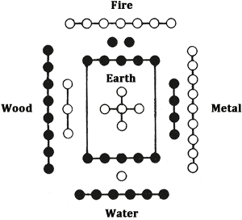

Figure 4

Water in the north has sprung from the one of heaven, which is complemented by the six of earth. Fire in the south has sprung from the two of earth, which is complemented by the seven of heaven. “Wood in the east has sprung from the three of heaven, which is complemented by the eight of earth. Metal in the west has sprung from the four of earth, which is complemented by the nine of heaven. Earth in the middle (*t’u*, the soil, the earth substance as distinguished from *ti*, the earth as a heavenly body) has sprung from the five of heaven, which is complemented by the ten of earth.

The second arrangement, according to which the numbers separate again and combine with the eight trigrams, is that of the *Lo Shu*, the Writing from the River Lo fig. 5.

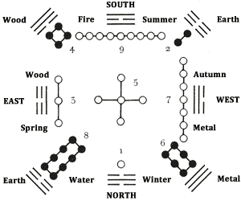

Figure 5

2\. There are five heavenly numbers. There are also five earthly numbers. When they are distributed among the five places, each finds its complement. The sum of the heavenly numbers is twenty-five, that of the earthly numbers is thirty. The sum total of heavenly numbers and earthly numbers is fifty-five. It is this which completes the changes and transformations and sets demons and gods in movement.

No further comment is needed in explanation of this. Like section 1, it undoubtedly belongs to a later period.

3\. The number of the total is fifty. Of these, forty-nine are used. They are divided into two portions, to represent the two primal forces. Hereupon one is set apart, to represent the three powers. They are counted through by fours, to represent the four seasons. The remainder is put aside, to represent the intercalary month. There are two intercalary months infive years, therefore the putting aside is repeated, and this gives us the whole.

Here the process of consulting the oracle is brought into relation with cosmic processes. The procedure in consulting the oracle is as follows:

One takes fifty yarrow stalks, of which only forty-nine are used. These forty-nine are first divided into two heaps at random, then a stalk from the right-hand heap is inserted between the ring finger and the little finger of the left hand. The left heap is counted through by fours, and the remainder (four or less) is inserted between the ring finger and the middle finger. The same thing is done with the right heap, and the remainder inserted between the forefinger and the middle finger. This constitutes one change. Now one is holding in one’s hand either five or nine stalks in all. The two remaining heaps are put together, and the same process is repeated twice. These second and third times, one obtains either four or eight stalks. The five stalks of the first counting and the four of each of the succeeding countings are regarded as a unit having the numerical value three; the nine stalks of the first counting and the eight of the succeeding countings have the numerical value two. When three successive changes produce the sum 3 + 3 + 3 = 9, this makes the old yang, i.e., a firm line that moves. The sum 2 + 2 + 2 = 6 makes the old yin, a yielding line that moves. Seven is the young yang, and eight the young yin; they are not taken into account as individual lines (cf. the section on consulting the oracle in Appendix I).

4\. The numbers that yield THE CREATIVE total 216; those which yield THE RECEPTIVE total 144, making in all 360. They correspond to the days of the

When THE CREATIVE is made up of six old ying yang lines, that is, of nines only, the following numbers result when the oracle is consulted

Total number of stalks 49

Subtracted the first time 5 + 4 + 4 = 13

36

When this is repeated six times (for the six lines), the total of the six remainders (36 x 6) is 216 stalks.

When THE RECEPTIVE consists of sixes only—that is, of old yin lines—the following numbers result.

Total number of stalks 49

Subtracted for a six (old yin) 9 + 8 + 8 = 25

24

When this has been done six times (for the six lines of a hexagram), the total of the remainders (24 x 6) is 144 stalks. If now one adds together the numbers obtained for THE CREATIVE and the numbers obtained for THE RECEPTIVE, the result is 216 + 144 = 360, which corresponds with the average number of days in the Chinese year.<a id="ref-2" href="#/book2-02-ta-chuan?id=fn-2">2</a>

5\. The numbers of the stalks in the two parts amount to 11,520, which corresponds with the number of the ten thousand things.

In the whole of the Book of Changes there are 192 lines of each kind—in all, 384 lines (64 x 6), of which half are yang and half yin. As has been shown in the section above, after a moving yang line is obtained there remain thirty-six stalks, so that we have altogether 192 x 36 = 6912. Each of the moving yin lines yields a remainder of twenty-four stalks: 192 x 24 = 4608. Together, 6912 + 4608 = 11,520.

6\. Therefore four operations are required to produce a change; eighteen mutations yield a hexagram.

The words “change” and “mutation” are used here in the same sense. Each line, as shown above, is composed of three mutations or changes. The four operations are: (1) dividing the stalks into two heaps; (2) taking up one stalk and inserting this between the ring finger and the little finger; (3) counting off the left-hand heap by fours and inserting the remainder between the ring finger and the middle finger; (4) countingoff the right-hand heap by fours and inserting the remainder between the forefinger and the middle finger. These four operations yield one change or mutation—that is to say, the numerical value two or three (see above). When this change is carried out three times, one obtains the value of the line, either a six or a seven, an eight or a nine. Six lines (3 changes x 6 = 18 changes) produce the structure of the hexagram.

7\. The eight signs constitute each a small completion.

The hexagram is made up of two trigrams. The “eight signs” are the eight primary trigrams. In a hexagram the lower trigram is also called the inner, and the upper trigram is also called the outer.

8\. When we continue and go further and add to the situations all their transitions, all possible situations on earth are encompassed.

Each of the sixty-four hexagrams can change into another through the appropriate movement of one or more lines. Thus we arrive at a total (64 x 64) of 4096 transitional stages, and these represent every possible situation.

9\. It reveals tao and renders nature and action divine. Therefore with its help we can meet everything in the right way, and with its help can even assist the gods themselves.

This section refers again to the Book of Changes in general. Its theme is that the book reveals the meaning of events in the universe and thereby imparts a divine mystery to the nature and action of the man who puts his trust in it, so that he is enabled to meet every event in the right way and even to aid the gods in governing the world.

10\. The Master said: Whoever knows the tao of the changes and transformations, knows the action of the gods.

CHAPTER X. The Fourfold Use of the Book of Changes

1\. The Book of Changes contains a fourfold tao of the holy sages. In speaking, we should be guided by its judgments; in action, we should be guided by its changes; in making objects, we should be guided by its images; in seeking an oracle, we should be guided by its pronouncements.

2\. Therefore the superior man, whenever he has to make or do something, consults the Changes, and he does so in words. It takes up his communications like an echo; neither far nor near, neither dark nor deep exist for it, and thus he learns of the things of the future. If this book were not the most spiritual thing on earth, how could it do this?

Here the psychological basis of the oracle is described. The person consulting the oracle formulates his problem precisely in words, and regardless of whether it concerns something distant or near, secret or profound, he receives—as though it were an echo—the appropriate oracle, which enables him to know the future. This rests on the assumption that the conscious and the supraconscious enter into relationship. The conscious process stops with the formulation of the question. The unconscious process begins with the division of the yarrow stalks, and when we compare the result of this division with the text of the book, we obtain the oracle.

3\. The three and five operations are undertaken in order to obtain a change. Divisions and combinations of the numbers are made. If one proceeds through the changes, they complete the forms of heaven and earth. If the number of changes is increased to the utmost, they determine all images on earth. If this were not the most changing thing on earth, how could it do this?

A great deal has been said about the “three and five” divisions, and even Chu Hsi<a id="ref-1" href="#/book2-02-ta-chuan?id=fn-1">1</a> is of the opinion that the passage is no longer comprehensible. But we need only take as a basis chapter IX, section 3, which the passage above serves to explain further, in order to establish coherence in the text. The “three” operations are the division into two heaps and the special disposition of a single stalk, “to represent the three powers.” After this each of the two heaps is counted through by fours, because “there are two intercalary months in five years,” and thus we arrive at three plus two, i.e., five operations, which yield one change. We proceed in this way with divisions and combinations until we “complete the forms of heaven and earth,” that is, until we obtain, as a first result, one of the eight primary trigrams or a “small completion” (cf. chapter IX, sec. 7). Continuing until the topmost or sixth line is reached, we obtain a complete image, which is always composed of two trigrams.

4\. The Changes have no consciousness, no action; they are quiescent and do not move. But if they are stimulated, they penetrate all situations under heaven. If they were not the most divine thing on earth, how could they do this?

Here we have a plain statement of what has been brought out in the remarks on section 2.<a id="ref-2" href="#/book2-02-ta-chuan?id=fn-2">2</a>

5\. The Changes are what has enabled the holy sages to reach all depths and to grasp the seeds of all things.

6\. Only through what is deep can one penetrate all wills on earth. Only through the seeds can one completeall affairs on earth. Only through the divine can one hurry without haste and reach the goal without walking.

Here it is shown that because the Book of Changes reaches down into the regions of the unconscious, both space and time are eliminated. Space, as the principle of diversity and confusion, is overcome by the deep, the simple. Time, as the principle of uncertainty, is overcome by the easy, the germinal.

7\. When the Master said, “The Book of Changes contains a fourfold tao of the holy sages,” this is what is meant.

It may be assumed that section 1 is based on a saying of Confucius that has been rhetorically elaborated and is once more summarized here.

CHAPTER XI. On the Yarrow Stalks and the Hexagrams and Lines

1\. The Master said: The Changes, what do they do? The Changes disclose things, complete affairs, and encompass all ways on earth—this and nothing else. For this reason the holy sages used them to penetrate all wills on earth and to determine all fields of action on earth, and to settle all doubts on earth.

Here again we have a saying of the Master placed at the head of a chapter which then develops and interprets it.

2\. Therefore the nature of the yarrow stalks is round and spiritual. The nature of the hexagrams is square and wise. The meaning of the six lines changes, in order to furnish information.

In this way the holy sages purified their hearts, withdrew, and hid themselves in the secret. They concerned themselves with good fortune and misfortunein common with other men. They were divine, hence they knew the future; they were wise, hence they stored up the past. Who is it that can do all this? Only the reason and clear-mindedness of the ancients, their knowledge and wisdom, their unremitting divine power.

Here the triplicity of the first section is consistently carried further. Penetration of all wills is paralleled with the spirituality of the yarrow stalks: they are round because they are symbols of heaven and of the spirit. Their basic number is seven, their total number is forty-nine (7 x 7). The hexagrams stand for the earth; their basic number is eight, their total number is sixty-four (8 x 8). They serve to determine the field of action. Finally, the individual lines are movable and changeable (their basic numbers are nine and six), in order to give information and to settle doubts pertaining to particular situations.

The holy sages were possessed of this knowledge. They withdrew into seclusion and cultivated the spirit, so that they were able to penetrate the minds of all men (penetration), so that they could determine good fortune and misfortune (the field of action), and so that they knew the past and the future (settlement of doubts). They could do this thanks to their reason and clear-mindedness (penetration of wills), their knowledge and wisdom (determination of the field of action), and their divine power (settlement of doubts). This divine power to battle (*shên wu*) acts without weakening itself (this is a better reading than “without killing”).

3\. Therefore they fathomed the tao of heaven and understood the situations of men. Thus they invented these divine things in order to meet the need of men. The holy sages fasted for this reason, in order to make their natures divinely clear.

Because these wise men knew equally well the laws of the universe and what was needful to man, they invented the use of the oracle stalks—“these divine things”—in order thus toanswer the needs of men. And so they concentrated their thoughts in holy meditation for the purpose of attaining the necessary power and fullness of being. Therefore the understanding of the Book of Changes calls for a similar concentration and meditation.

4\. Therefore they called the closing of the gates the Receptive, and the opening of the gate the Creative. The alternation between closing and opening they called change. The going forward and backward without ceasing they called penetration. What manifests itself visibly they called an image; what has bodily form they called a tool. What is established in usage they called a pattern. That which furthers on going out and coming in, that which all men live by, they called the divine.

In this passage are shown the tao of heaven and the conditions of men as recognized by the holy sages. The closing and the opening of the gates signify the alternation of rest and movement. These are likewise two conditions pertaining to yoga practice that are attainable only through individual training. Penetration is that state in which the individual has attained sovereign mastery in the psychic sphere as well and is able to move forward and backward in time. The next sentences show how the material world arises. First of all there is a pre-existent image, an idea; then a copy of this archetypal image takes shape as a corporeal form. That which regulates this process of imitation is a pattern; and the force that generates these processes is the divine principle. Many parallels to these expositions are to be found in Lao-tse.

5\. Therefore there is in the Changes the Great Primal Beginning. This generates the two primary forces. The two primary forces generate the four images. The four images generate the eight trigrams.

The Great Primal Beginning, *t’ai chi*, plays an important role in later Chinese natural philosophy. Originally *chi* is the ridgepole—a simple line symbolizing the positing of oneness(———). This positing of oneness implies also a positing of duality, an above and a below. The conditioning element is further designated as an undivided line, while the conditioned element is represented by means of a divided line (— —). These are the two polar primary forces later designated as yang, the bright principle, and yin, the dark. Then, through doubling, there arise the four images:

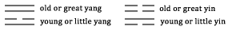

These correspond with the four seasons of the year. Through addition of another line, there arise the eight trigrams:

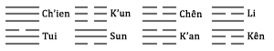

The same procedure is mentioned in chapter 42 of Lao-tse.

6\. The eight trigrams determine good fortune and misfortune. Good fortune and misfortune create the great field of action.

The “great field of action” are the regulations and rules instituted by the sages in order to obtain good fortune for men and to avoid misfortune.

7\. Therefore: There are no greater primal images than heaven and earth. There is nothing that has more movement or greater cohesion than the four seasons. Of the images suspended in the heavens, there is none more light-giving than the sun and the moon. Of the honored and highly placed, there is none greater than he who possesses wealth and rank. With respect to creating things for use and making tools helpful to the whole world, there is no one greater than the holy sages. For comprehending the chaotic diversity of things and exploring what is hidden, for penetrating the depths and extending influence afar, thereby determining good fortune andmisfortune on earth and consummating all efforts on earth, there is nothing greater than the oracle.

As in chapter 25 of Lao-tse, where the four great things in the universe are discussed, the great things in nature and in the world of men are here named together. Heaven and earth offer the archetypal image to be imitated. Among all things, the seasons have the most movement and the greatest degree of cohesion; the brightest are the sun and the moon.

On earth the most exalted person is the king of men, the sage on the throne, who, wealthy and noble himself, is at the same time the source of wealth and nobility. His helpers are, first, the active man of wisdom, directing and inventing, and, second, the oracle, which, corresponding with the light-giving images, the sun and moon, clarifies and illumines all conditions on earth.

8\. Therefore: Heaven creates divine things; the holy sage takes them as models. Heaven and earth change and transform; the holy sage imitates them. In the heavens hang images that reveal good fortune and misfortune; the holy sage reproduces these. The Yellow River brought forth a map and the Lo River brought forth a writing; the holy men took these as models.

In this section the parallel between the processes in the macrocosm and the works of the holy sages is elaborated. The divine things created by heaven and earth are presumably the natural phenomena that the holy men reproduced in the eight trigrams. According to another view, tortoises and yarrow stalks are meant. The changes and transformations manifesting themselves in day and night, and in the seasons of the year, are reproduced in the character of the changes in the lines. The signs in the heavens meaning good fortune and misfortune are the sun, moon, and stars, together with comets, eclipses, and the like. They are reproduced in the appended judgments on good fortune and misfortune.

The last sentence of the section, referring to two legendary events occurring in the time of Fu Hsi and Yü<a id="ref-1" href="#/book2-02-ta-chuan?id=fn-1">1</a> respectively,is a later addition and has had a disastrous effect on the exegesis of the Book of Changes. Reproductions of the two diagrams are given in the explanation of chapter IX, section 1. That this is a later addition is proven by the fact that sections 7, 8, 9 of the present chapter all deal with the threefold parallelism between nature and the world of man broached in section 1, and this addendum creates a break in the continuity of thought.

9\. In the Changes there are images, in order to reveal; there are judgments appended, in order to interpret; good fortune and misfortune are determined, in order to decide.

The text says “four” images; this is carried over by error from section 5. Here “images” means the eight trigrams, which show situations in their interrelation. This corresponds with the archetypal images of heaven. The judgments appended to the lines indicate the changes corresponding with the changes in the seasons. Finally, the decisions about good fortune and misfortune correspond with the signs in the heavens.

CHAPTER XII. Summary

1\. In the Book of Changes it is said: “He is blessed by heaven. Good fortune. Nothing that does not further.”

The Master said: To bless means to help. Heaven helps the man who is devoted; men help the man who is true. He who walks in truth and is devoted in his thinking, and furthermore reveres the worthy, is blessed by heaven. He has good fortune, and there is nothing that would not further.

This is a passage from the body of the commentary on the individual lines, fragments of which appear in chapter VIII,sections 5-11. It serves to amplify the close of section 6 of chapter II, but it does not fit the context here.

2\. The Master said: Writing cannot express words completely. Words cannot express thoughts completely.

Are we then unable to see the thoughts of the holy sages?

The Master said: The holy sages set up the images in order to express their thoughts completely; they devised the hexagrams in order to express the true and the false completely. Then they appended judgments and so could express their words completely.

(They created change and continuity, to show the advantage completely; they urged on, they set in motion, to set forth the spirit completely.)

This section gives in dialogue form, after the manner of the *Lun Yü* Analects, a judgment on the mode of expression of the Book of Changes. The Master has said that writing never expresses words completely and that words never express thoughts completely. A pupil asks whether one can never gain a clear view of what the sages thought and the Master uses the Book of Changes to show how it may be done. The sages set up the images and hexagrams in order to show the situations, and then appended the words: these, in conjunction with the images, may actually be taken as the complete expression of their thoughts.

The two final statements in parentheses have been transposed to this section from some other context, probably because of the similar rhetorical construction (cf. sec. 4, second half, and sec. 7).

3\. The Creative and the Receptive are the real secret of the Changes. Inasmuch as the Creative and the Receptive present themselves as complete, the changes between them are also posited. If the Creativeand the Receptive were destroyed, there would be nothing by which the changes could be perceived. If there were no more changes to be seen, the effects of the Creative and the Receptive would also gradually cease.

The changes are thought of here as natural processes, practically identical with life. Life depends on the polarity between activity and receptivity. This maintains tension, every adjustment of which manifests itself as a change, a process in life. If this state of tension, this potential, were to cease, there would no longer be a criterion for life—life could no longer express itself. On the other hand, these polar oppositions, these tensions, are constantly being generated anew by the changes inherent of life. If life should cease to express itself, these oppositions would be obliterated by progressive entropy, and the death of the world would ensue.

4\. Therefore: What is above form is called tao; what is within form is called tool.

We are shown here that the forces constituting the visible world are transcendent ones. Tao is taken here in the sense of an all-embracing entelechy. It transcends the spatial world, but it acts upon the visible world—by means of the images, i.e., ideas inherent in it, as is set forth more exactly in other passages—and what hereby comes into being are the objects. An object is spatial, that is, defined by its corporeal limits; but it cannot be understood without knowledge of the tao underlying it.

This section, like section 2, has an addition that reappears in large part, with a slight textual variation, in the closing section:

(That which transforms things and fits them together is called change; that which stimulates them and sets them in motion is called continuity. That which raises them up and sets them forth before all people on earth is called the field of action.)

5\. Therefore, with respect to the Images: The holy sages were able to survey all the confused diversities under heaven. They observed forms and phenomena, and made representations of things and their attributes. These were called the Images. The holy sages were able to survey all the movements under heaven. They contemplated the way in which these movements met and became interrelated, to take their course according to eternal laws. Then they appended judgments, to distinguish between the good fortune and misfortune indicated. These were called the Judgments.

This section is a literal repetition of sections 1 and 2 of chapter VIII.

6\. The exhaustive presentation of the confused diversities under heaven depends upon the hexagrams. The stimulation of all movements under heaven depends upon the Judgments.

There is some connection between this passage and section 3 of chapter VIII, while the following section contains a parallel to the second half of section 4 above.

7\. The transformation of things and the fitting together of them depend upon the changes. Stimulation of them and setting them in motion depend upon continuity. The spirituality and clarity depend upon the right man. Silent fulfillment, confidence that needs no words, depend upon virtuous conduct.

Here, in conclusion, the intermeshing of the Book of Changes and man is set forth. It is only through a living personality that the words of the book ever come fully to life and then exert their influence upon the world.<a id="ref-2" href="#/book2-02-ta-chuan?id=fn-2">2</a>

PART II

CHAPTER I. On the Signs and Lines, on Creating and Acting

1\. The eight trigrams are arranged according to completeness: thus the images are contained in them. Thereupon they are doubled: thus the lines are contained in them.

Compare part I, chapter II, section 1. The sequence in the order of completeness is: (1) Ch’ien, (2) Tui, (3) Li, (4) Chên, (5) Sun, (6) K’an, (7) Kên, (8) K’un. The trigrams contain only the images (ideas) of the things they represent. It is only in the hexagrams that the individual lines come into consideration, because it is only in the hexagrams that the relationships of above and below, within and without, appear.

2\. The firm and the yielding displace each other, and change is contained therein. The judgments, together with their counsels, are appended, and movement is contained therein.

Compare part I, chapter II, section 2. Change (as well as transformation) appears as a result of the alternation of firm and yielding lines. The judgments give their counsels through the appended oracles—”Good fortune,” “Misfortune,” and so on.

3\. Good fortune and misfortune, remorse and humiliation, come about through movement.

Compare part I, chapter II, section 3. Good fortune and misfortune, remorse and humiliation, appear only as a result of conduct of a corresponding kind.

4\. The firm and the yielding stand firm when they are in their original places. Their changes and continuities should correspond with the time.

When the firm lines are in firm places and the yielding lines in yielding places, a state of equilibrium exists. However, this abstract state of equilibrium must yield to change and reorganization when the time demands it. The time, that is, the total situation represented by a hexagram, plays an important role in regard to the positions of the individual lines.

5\. Good fortune and misfortune take effect through perseverance. The tao of heaven and earth becomes visible through perseverance. The tao of sun and moon becomes bright through perseverance. All movements under heaven become uniform through perseverance.

The secret of action lies in duration. Good fortune and misfortune are slow in the making. Only when a trend is followed continuously do the results of single actions gradually accumulate in such a way that they become manifest as good fortune or misfortune. Similarly, heaven and earth are the results of lasting conditions. In that all clear, luminous forces constantly rise upward, and all that is solid and turbid constantly sinks downward, the cosmos separates itself out of chaos—heaven above and earth below. So it is also as regards the course of the sun and the moon; their states of radiance are results of continuous movements and conditions of equilibrium. Thus all movements and actions continued over a long period of time channel out definite courses, which then become laws. According to this view, natural laws are not abstractions fixed once and for all, but sustained processes in which the character of law appears the more definitely the longer they are in operation.

6\. The Creative is decided and therefore shows to men the easy. The Receptive is yielding and therefore shows to men the simple.

The two fundamental principles move according to the requirements of the time, so that they are continuously undergoing change. But the nature of their movements is uniform and consistent. The Creative is always strong, decided, real, hence it meets with no difficulties. It always remains true to itself; hence its effortlessness. Difficulties always indicate vacillation and lack of clarity. In the same way it is the nature of the Receptive to be consistently yielding, to follow the line of least resistance, and therefore to be simple. Complications arise only from an inner conflict of motives.

7\. The lines imitate this. The images reproduce this.

Here a definition of the lines and images is given. In Chinese the word for “line” is *hsiao*; “to imitate” is also rendered by *hsiao* (written differently). “Image” and “to reproduce” (in the sense of “to represent”) are expressed by *hsiang* (also written differently in each case). The lines imitate in their changes the way in which good fortune and misfortune arise in a movement by reason of its duration. The images reproduce the way in which all the changes and interrelations of the firm and the yielding issue in the easy and the simple.

8\. The lines and images move within, and good fortune and misfortune reveal themselves without. The work and the field of action reveal themselves in the changes. The feelings of the holy sages reveal themselves in the judgments.

The movements of the lines and images, and of the infinitesimal germs of events symbolized by them, are invisible, but their results manifest themselves in the visible world as good fortune or misfortune. So also the changes pertaining to the work and the field of action are invisible, but are revealed by the words of the judgments.

9\. It is the great virtue of heaven and earth to bestow life. It is the great treasure of the holy sage to stand in the right place.

How does one safeguard this place? Through men.<a id="ref-1" href="#/book2-02-ta-chuan?id=fn-1">1</a> By what are men gathered together? Through goods. Justice means restraining men from wrongdoing by regulation of goods and by rectification of judgments.

Here the connection between the three powers is shown. Heaven and earth bestow life. The holy sage is guided by the same principle; but to carry it out he must have the position of a ruler. This position is safeguarded by the men whom he gathers under him. Men are gathered together by means of goods. The means by which goods are administered, and defended against wrong, is justice.

This presents a theory of society, based on cosmic principles, that corresponds with the views of the Confucian school.

Some commentators wish to take this section as an introduction to the next chapter. This has a certain justification, inasmuch as the next chapter gives a survey of the development of civilization, with the Book of Changes as a basis.

CHAPTER II. History of Civilization<a id="ref-1" href="#/book2-02-ta-chuan?id=fn-1">1</a>

1\. When in early antiquity Pao Hsi<a id="ref-2" href="#/book2-02-ta-chuan?id=fn-2">2</a> ruled the world, he looked upward and contemplated the images in the heavens; he looked downward and contemplated the patterns on earth. He contemplated the markings of birds and beasts and the adaptations to the regions. He proceeded directly from himself andindirectly from objects. Thus he invented the eight trigrams in order to enter into connection with the virtues of the light of the gods and to regulate the conditions of all beings.

The *Pai Hu T’ung*<a id="ref-3" href="#/book2-02-ta-chuan?id=fn-3">3</a> describes the primitive condition of human society as follows:

In the beginning there was as yet no moral nor social order. Men knew their mothers only, not their fathers. When hungry, they searched for food; when satisfied, they threw away the remnants. They devoured their food hide and hair, drank the blood, and clad themselves in skins and rushes. Then came Fu Hsi and looked upward and contemplated the images in the heavens, and looked downward and contemplated the occurrences on earth. He united man and wife; regulated the five stages of change, and laid down the laws of humanity. He devised the eight trigrams, in order to gain mastery over the world.

The name of the mythical founder of civilization is written in various ways; its meaning seems to point to a hunter or an inventor of cooking. There is a difference of opinion as to whether the sixty-four hexagrams or only the eight trigrams are to be ascribed to him. As he himself is a mythical personality, the dispute may rest where it stands. It would seem to be certain that the sixty-four hexagrams were already in use in the time of King Wên.

2\. He made knotted cords and used them for nets and baskets in hunting and fishing. He probably took this from the hexagram of THE CLINGING.

This chapter tells us how all the appurtenances of civilization came into existence as reproductions of ideal, archetypal images. In a certain sense this idea contains a truth. Every invention comes into being as an image in the mind of the inventor before it makes its appearance in the phenomenal World as a tool, a finished thing. Since, according to the school represented by the *Hsi Tz’u*, the sixty-four hexagrams present,in a mysterious way, images paralleling nature, an attempt can be made here to derive from them the inventions of man that have led to the development of civilization. However, this must be understood not in the sense that the inventors simply took the hexagrams of the book and made their inventions in accordance with them, but rather in the sense that out of the relationships represented by the hexagrams the inventions took shape in the minds of their originators.

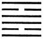

A net consists of meshes, empty within and surrounded by threads without. The hexagram Li, THE CLINGING (30), represents a combination of meshes of this sort. Furthermore, the written character means “to cling to” or “to be caught on something. “ For example, in the Book of Songs<a id="ref-4" href="#/book2-02-ta-chuan?id=fn-4">4</a> it is frequently said that the wild goose or the pheasant was caught in the net (*li*).

3\. When Pao Hsi’s clan was gone, there sprang up the clan of the Divine Husbandman.<a id="ref-5" href="#/book2-02-ta-chuan?id=fn-5">5</a> He split a piece of wood for a plowshare and bent a piece of wood for the plow handle, and taught the whole world the advantage of laying open the earth with a plow. He probably took this from the hexagram of INCREASE.

The primitive plow consisted of a bent pole with a pointed stick fastened on in front for scratching the earth. The advantage of this method over hoeing was that draft animals could be used and part of the work shifted to oxen.

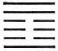

The hexagram I, INCREASE (42), consists of the two trigrams Sun and Chên, both associated with wood. Sun meanspenetration, Chên movement. The nuclear trigrams<a id="ref-6" href="#/book2-02-ta-chuan?id=fn-6">6</a> are Kên and K’un, both associated with the earth. This led to the idea of constructing a wooden instrument that would penetrate the earth and when moved forward would turn up the soil.

4\. When the sun stood at midday, he held a market. He caused the people of the earth to come together and collected the wares of the earth. They exchanged these with one another, then returned home, and each thing found its place. Probably he took this from the hexagram of BITING THROUGH.

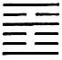

The hexagram Shih Ho, BITING THROUGH (21), consists of Li, the sun, above and Chên, movement, below. Chên also means a great road, while the upper nuclear trigram K’an means flowing water, and the lower, Kên, small paths. Thus the connotation is of movement under the sun, a streaming together. This is hardly enough to convey the idea of a market, but the words *shih ho* when written differently can also mean food and merchandise, and the market might be suggested in this way. Evidently the hexagram formerly had the secondary meaning of market (cf. the explanation of this hexagram in bk. I).

5\. When the clan of the Divine Husbandman was gone, there sprang up the clans of the Yellow Emperor, of Yao, and of Shun.<a id="ref-7" href="#/book2-02-ta-chuan?id=fn-7">7</a> They brought continuity into their alterations, so that the people did not grow weary. They were divine in the transformations they wrought, so that the people were content. When one change had run its course, they altered. (Through alteration they achieved continuity.)Through continuity they achieved duration. Therefore: “They were blessed by heaven. Good fortune. Nothing that does not further.”

The Yellow Emperor, Yao, and Shun allowed the upper and lower garments to hang down, and the world was in order. They probably took this from the hexagrams of THE CREATIVE and THE RECEPTIVE.

In this section two different strata are to be distinguished. The closing paragraph seems to be the older stratum. The introduction of clothes is depicted. Accordingly, Chêng K’ang Ch’êng<a id="ref-8" href="#/book2-02-ta-chuan?id=fn-8">8</a> says: “Heaven is blue-black, the earth is yellow; therefore they made the upper garments dark blue and the lower garments yellow.”

Allowing the garments to hang down was later taken to mean that the Yellow Emperor, Yao, and Shun sat quietly without stirring, and as a result of their inaction things automatically righted themselves. Then, from previously known material, there was appended a description of their cultural activity and the blessing that grew out of it. The parenthetic sentence seems in turn to be a later addition to this description. The meaning of the activity of the three rulers is that they constantly carried out timely reforms.

6\. They scooped out tree trunks for boats and they hardened wood in the fire to make oars. The advantage of boats and oars lay in providing means of communication. (They reached distant parts, in order to benefit the whole world.) They probably took this from the hexagram of DISPERSION.

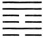

The sentence in parentheses has been questioned by Chu Hsi. The hexagram Huan, DISPERSION (59), consists of the trigram Sun, wood, over K’an, water. That is why it is said in theJudgment, “It furthers one to cross the great water,” and in the Commentary on the Decision, “To rely on wood is productive of merit.” A boat as a means of communication across rivers and for travel to distant places is represented here. Wood over water—this is the meaning of the primary trigrams. The nuclear trigrams Kên and Chên mean large and small roads.

7\. They tamed the ox and yoked the horse. Thus heavy loads could be transported and distant regions reached, for the benefit of the world. They probably took this from the hexagram of FOLLOWING.

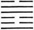

The hexagram Sui, FOLLOWING (17), consists of Tui, liveliness, in front and Chên, movement, behind—an image of the way in which the ox and horse go ahead and the wagon moves along behind. Oxen were for heavy carts, horses for fast carriages and war chariots. The use of horses for riding was unknown to China in the earliest period.

8\. They introduced double gates and night watchmen with clappers, in order to deal with robbers. They probably took this from the hexagram of ENTHUSIASM.

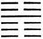

The hexagram Yu, ENTHUSIASM (16), consists of the trigram Chên, movement, above and K’un, the earth, below. The nuclear trigrams are K’an, danger, and Kên, mountain. K’un symbolizes a closed door, while Kên likewise means a door; hence the double gates. K’an means thief. Beyond the gates, movement, with wood (Chên) in the hand (Kên), serves as a preparation (*yü* also means preparation) against the thief.

9\. They split wood and made a pestle of it. They made a hollow in the ground for a mortar. The use of the mortar and pestle was of benefit to all mankind.They probably took this from the hexagram of PREPONDERANCE OF THE SMALL.

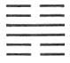

The hexagram Hsiao Kuo, PREPONDERANCE OF THE SMALL (62), is composed of Chên, movement, wood, above and Kên, Keeping Still, stone, below. Kuo also means transition. The mortar was the primitive form of the mill, and signifies the transition from eating whole grain to baking.

10\. They strung a piece of wood for a bow and hardened pieces of wood in the fire for arrows. The use of bow and arrow is to keep the world in fear. They probably took this from the hexagram of OPPOSITION.

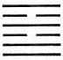

The hexagram K’uei, OPPOSITION (38), consists of Li, the Clinging, above and Tui, the Joyous, below. The nuclear trigrams are K’an, danger, and, again, Li. The whole hexagram indicates strife. Li is the sun, which sends arrows from afar. Li means weapons, K’an danger. The danger is hedged around by weapons, therefore one is not afraid.

11\. In primitive times people dwelt in caves and lived in forests. The holy men of a later time made the change to buildings. At the top was a ridgepole, and sloping down from it there was a roof, to keep off wind and rain. They probably took this from the hexagram of THE POWER OF THE GREAT.

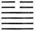

The hexagram Ta Chuang, THE POWER OF THE GREAT (34), has Chên, thunder, above; the upper nuclear trigram Tui, lake, is at the top of Ch’ien, heaven, which is the lower nuclear trigram. The lower primary trigram is also Ch’ien, heaven,the atmosphere. Thus the hexagram as a whole means a heaven, a strong, protected space with thunder and rain above it. The trigram Chên also means wood, and as the eldest son it means the ridgepole at the top. The two yielding lines at the top are then thought of as the sloping roof.

12\. In primitive times the dead were buried by covering them thickly with brushwood and placing them in the open country, without burial mound or grove of trees. The period of mourning had no definite duration. The holy men of a later time introduced inner and outer coffins instead. They probably took this from the hexagram of PREPONDERANCE OF THE GREAT.

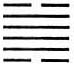

The hexagram Ta Kuo, PREPONDERANCE OF THE GREAT (28), consists of the trigram Tui, the lake, above and Sun, wood, penetration, below. Forming the nuclear trigrams in the middle is Ch’ien, heaven, doubled. The hexagram must be taken as a whole; the two yin lines above and below mean the earth, within which the double coffin, represented by the double heaven, is inclosed. Entering (Sun) their last resting place in this way, the dead are made glad (Tui). Here we have a link with ancestor worship.

13\. In primitive times people knotted cords in order to govern. The holy men of a later age introduced written documents instead, as a means of governing the various officials and supervising the people. They probably took this from the hexagram of BREAK-THROUGH.

The hexagram Kuai, BREAK-THROUGH (43), has Tui, words, above and Ch’ien, strength, below. It means giving permanenceto words. The notch at the top also indicates the form of the oldest documents: cut in wood, they consisted of two halves that fitted into each other when held together. As a rule the ancient writings were scratched on tablets of smoothed bamboo. Here the significance of writing in the organization of a large community is emphasized.

NOTE. In its main features the sketch of the development of civilization given in this chapter corresponds to an extraordinary degree with our own ideas. The fundamental thought, that all institutions are based on the development of definite ideas, is likewise undoubtedly correct. It is not always easy to recognize such ideas in the complexes of ideas presented by the hexagrams, nor is it improbable that there were once certain connections that are now obliterated. There are indications that in the period preceding that of the Chou dynasty the hexagrams had meanings different from those which are traditional today. Possibly this chapter affords insight into these earliest meanings. That still another change in meaning took place later becomes evident when we compare the Judgments with the Images.

CHAPTER III. On the Structure of the Hexagrams

1\. Thus the Book of Changes consists of images. The images are reproductions.

The hexagrams are reproductions of conditions in the heavens and on earth. Therefore they are to be applied productively; they have creative power, so to speak, in the realm of ideas, as explained above.

2\. The decisions provide the material.

The Commentary on the Decision i.e., on the Judgment,<a id="ref-1" href="#/book2-02-ta-chuan?id=fn-1">1</a> which is probably what is meant here, presents the material out of which each hexagram, taken as a whole, is constructed. Thus it describes the situation as such before it undergoes change. Naturally this also applies to the Judgment itself.

3\. The lines are imitations of movements on earth.

Here the lines are equivalent to the judgments appended to them; the judgments apply in the case of lines that move, that is, when they are nines or sixes. They reflect the changes within the individual situations.

4\. Thus do good fortune and misfortune arise, and remorse and humiliation appear.

This movement reveals the direction that events are taking, and warnings or confirmations are added.

CHAPTER IV. On the Nature of the Trigrams

1\. The light trigrams have more dark lines, the dark trigrams have more light lines.

The “light” trigrams are the three sons, Chên, 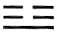, K’an, 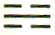, and Kên, 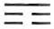, each of which consists of two dark lines and one light line. The “dark” trigrams are the three daughters, Sun, 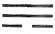, Li, 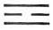, and Tui, 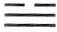, each of which consists of two light lines and one dark line.

2\. What is the reason for this? The light trigrams are uneven, the dark trigrams are even.

The light trigrams are made up of the lines 7 + 8 + 8, or 7 + 6 + 8, or 7 + 6 + 6, or 9 + 8 + 8, or 9 + 6 + 6, or 9 + 6 + 8.<a id="ref-1" href="#/book2-02-ta-chuan?id=fn-1">1</a> Using the relevant numbers, the numerical values of the lines in the dark trigrams can be found in the same way. Hence the sum of the values of the lines in light trigrams is always an uneven number, and the line representing the uneven number an undivided line is therefore the determinant of the light trigram. In the case of dark trigrams, the reverse is true.

3\. What is their nature and how do they act? The light trigrams have one ruler and two subjects. They show the way of the superior man. The dark trigrams have two rulers and one subject. This is the way of the inferior man.

Where one alone rules, unity is present, whereas when one person must serve two masters, nothing good can come of it. This truth is here more or less accidentally linked with the structure of the trigrams.

CHAPTER V. Explanation of Certain Lines

1\. In the Changes it is said: “If a man is agitated in mind, and his thoughts go hither and thither, only those friends on whom he fixes his conscious thoughts will follow.”

The Master said: What need has nature of thought and care? In nature all things return to their common source and are distributed along different paths; through one action, the fruits of a hundred thoughts are realized. What need has nature of thought, of care?

2\. When the sun goes, the moon comes; when the moon goes, the sun comes. Sun and moon alternate; thus light comes into existence. When cold goes, heat comes; when heat goes, cold comes. Cold and heat alternate, and thus the year completes itself. The past contracts. The future expands. Contraction and expansion act upon each other; hereby arises that which furthers.

3\. The measuring worm draws itself together when it wants to stretch out. Dragons and snakes hibernate in order to preserve life. Thus the penetration of a germinal thought into the mind promotes the working of the mind. When this working furthers and brings peace to life, it elevates a man’s nature.

4\. Whatever goes beyond this indeed transcends all knowledge. When a man comprehends the divine and understands the transformations, he lifts his nature to the level of the miraculous.

In this explanation of the nine in the fourth place in hexagram 31, Hsien, INFLUENCE (bk. III), a theory of the power of the unconscious is given. Conscious influences are always merely limited ones, because they are brought about by intention. Nature knows no intentions; this is why everything in nature is so great. It is owing to the underlying unity of nature that all its thousand ways lead to a goal so perfect that it seems to have been planned beforehand down to the last detail.

Then, in connection with the course of the day and the year, we are shown how past and future flow into each other, how contraction and expansion are the two movements through which the past prepares the future and the future unfolds the past.

In the two succeeding sections the same thought is applied to the man who, through supreme concentration, so intensifies and strengthens his inner being that mysterious autonomous currents of power emanate from him: thus the effects he creates proceed from his unconscious and mysteriously affect the unconscious in others, attaining such breadth and depth of influence that they transcend the individual sphere and enter the realm of cosmic phenomena.

5\. In the Changes it is said: “A man permits himself to be oppressed by stone, and leans on thorns and thistles. He enters his house and does not see his wife. Misfortune. “

The Master said: If a man permits himself to be oppressed by something that ought not to oppress him, his name will certainly be disgraced. If he leans on things upon which one cannot lean, his life will certainly be endangered. For him who is in disgrace and danger, the hour of death draws near; how can he then still see his wife?

This is an example of an unfavorable pronouncement. Compare the explanation of the six in the third place in hexagram 47, K’un, OPPRESSION (bk. I).

6\. In the Changes it is said: “The prince shoots at ahawk on a high wall. He kills it. Everything serves to further.”

The Master said: The hawk is the object of the hunt; bow and arrow are the tools and means. The marksman is man (who must make proper use of the means to his end). The superior man contains the means in his own person. He bides his time and then acts. Why then should not everything go well? He acts and is free. Therefore all he has to do is to go forth, and he takes his quarry. This is how a man fares who acts after he has made ready the means.

This is an example of a favorable line. Compare the explanation of the six at the top in hexagram 40, Hsieh, DELIVERANCE (bk. I).

7\. The Master said: The inferior man is not ashamed of unkindness and does not shrink from injustice. If no advantage beckons he makes no effort. If he is not intimidated he does not improve himself, but if he is made to behave correctly in small matters he is careful in large ones. This is fortunate for the inferior man. This is what is meant when it is said in the Book of Changes: “His feet are fastened in the stocks, so that his toes disappear. No blame.”

Here we have an example of a line that leads to the good through remorse. Compare the explanation of the nine at the beginning in hexagram 21, Shih Ho, BITING THROUGH (bk. I).

8\. If good does not accumulate, it is not enough to make a name for a man. If evil does not accumulate, it is not strong enough to destroy a man. Therefore the inferior man thinks to himself, “Goodness in small things has no value,” and so neglects it. He thinks, “Small sins do no harm,” and so does not give them up. Thus his sins accumulate until theycan no longer be covered up, and his guilt becomes so great that it can no longer be wiped out. In the Book of Changes it is said: “His neck is fastened in the wooden cangue, so that his ears disappear. Misfortune.”

This is an example of a line showing that misfortune follows hard upon humiliation. Compare the explanation of the nine at the top in hexagram 21, Shih Ho, BITING THROUGH (bk. I).

9\. The Master said: Danger arises when a man feels secure in his position. Destruction threatens when a man seeks to preserve his worldly estate. Confusion develops when a man has put everything in order. Therefore the superior man does not forget danger in his security, nor ruin when he is well established, nor confusion when his affairs are in order. In this way he gains personal safety and is able to protect the empire. In the Book of Changes it is said: “ ‘What if it should fail, what if it should fail?’ In this way he ties it to a cluster of mulberry shoots.”

This is an example of a line showing how one remains free of blame and thus attains success. See the explanation of the nine in the fifth place in hexagram 12, P’i, STANDSTILL (bk. I).

10\. The Master said: Weak character coupled with honored place, meager knowledge with large plans, limited powers with heavy responsibility, will seldom escape disaster. In the Changes it is said: “The legs of the *ting* are broken. The prince’s meal is spilled, and his person is soiled. Misfortune.” This is said of someone not equal to his task.

This is an example of a line showing that one meets with misfortune through being inadequate to the situation. Compare the explanation of the nine in the fourth place in hexagram 50, Ting, THE CALDRON (bk. I).

11\. The Master said: To know the seeds, that is divine indeed. In his association with those above him, the superior man does not flatter. In his association with those beneath him, he is not arrogant. For he knows the seeds. The seeds are the first imperceptible beginning of movement, the first trace of good fortune (or misfortune) that shows itself. The superior man perceives the seeds and immediately takes action. He does not wait even a whole day. In the Changes it is said: “Firm as a rock. Not a whole day. Perseverance brings good fortune.”

Firm as a rock, what need of a whole day?

The judgment can be known.

The superior man knows what is hidden and what is evident.

He knows weakness, he knows strength as well.

Hence the myriads look up to him.

This is an example of a line showing that foreknowledge enables one to escape misfortune in good time. Compare the explanation of the six in the second place in hexagram 16, Yü, ENTHUSIASM (bk. I).

12\. The Master said: Yen Hui is one who will surely attain it. If he has a fault, he never fails to recognize it; having recognized it, he never commits the error a second time. In the Changes it is said: “Return from a short distance. No need for remorse. Great good fortune.”

This is an example of a line showing that one can learn from experience. Yen Hui was the favorite disciple of Confucius. It is said in the Analects too that he never committed the same error twice. See the explanation of the nine at the beginning in hexagram 24, Fu, RETURN (bk. III).

13\. The Master said: Heaven and earth come together, and all things take shape and find form.Male and female mix their seed, and all creatures take shape and are born. In the Changes it is said: “When three people journey together, their number decreases by one. When one man journeys alone, he finds a companion.”

This is an example of a line that is favorable by reason of unity. Compare the explanation of the six in the third place in hexagram 41, Sun, DECREASE (bk. III).

14\. The Master said: The superior man sets his person at rest before he moves; he composes his mind before he speaks; he makes his relations firm before he asks for something. By attending to these three matters, the superior man gains complete security. But if a man is brusque in his movements, others will not co-operate. If he is agitated in his words, they awaken no echo in others. If he asks for something without having first established relations, it will not be given to him. If no one is with him, those who would harm him draw near. In the Changes it is said: “He brings increase to no one. Indeed, someone even strikes him. He does not keep his heart constantly steady. Misfortune.”

This is an example of a line showing that everything depends on proper preparation. Compare the explanation of the nine at the top in hexagram 42, I, INCREASE (bk. I).

CHAPTER VI. On the Nature of the Book of Changes in General

1\. The Master said: The Creative and the Receptive are indeed the gateway to the Changes. The Creative is the representative of light things and the Receptive of dark things. In that the natures of the darkand the light are joined, the firm and the yielding receive form. Thus do the relationships of heaven and earth take shape, and we enter into relation with the nature of the light of the gods.

Following out what has been said in part I, chapter XII, section 3, the method of the Book of Changes is presented here. The first two trigrams, the Creative and the Receptive, are shown as representatives of the two polar primal forces. The aim is to explain that matter is the product of energy. The light and the dark are energies. The interaction of these forces gives rise to matter—that is, the firm and the yielding. Matter makes up the form, the body, of all beings in heaven and on earth, but it is always energy that keeps it in motion. The important thing is to maintain connection with these divine forces of light.

2\. The names employed are manifold but not superfluous. When we examine their kinds, thoughts about the decline of an era come to mind.

The names of the sixty-four hexagrams are diverse, but they all keep within the sphere of the necessary. Actual situations, just as life brings them, are described. The situations throughout are of such a nature as to make it plain that the reference is to an era of decline, the aim being to provide the means of reconstruction. It is pointed out that the body of ideas in the hexagrams stems from a time already confronted with phenomena of decline.

3\. The Changes illumine the past and interpret the future. They disclose that which is hidden and open that which is dark. They distinguish things by means of suitable names. Then, when the right words and decisive judgments are added, everything is complete.

The wording of this section, and indeed of the whole of this chapter, seems to be rather uncertain, but the general meaning is easy to understand. Here again the various connotations of the Book of Changes are pointed out: hidden things arerevealed in time and space, first symbolically by means of names and relationships, then explicitly by means of the judgments.

4\. The names employed sound unimportant, but the possibilities of application are great. The meanings are far-reaching, the judgments are well ordered. The words are roundabout but they hit the mark. Things are openly set forth, but they contain also a deeper secret. This is why in doubtful cases they may serve to guide the conduct of men and thus to show the requital for reaching or for missing the goal.

The abstract, allegorical content of the hexagrams is here pointed out. The hexagrams permit of a general extension to all sorts of situations, because they present nothing but the laws that pertain to various complexes of conditions.

CHAPTER VII. The Relation of Certain Hexagrams to Character Formation

1\. The Changes came into use in the period of middle antiquity. Those who composed the Changes had great care and sorrow.

This passage refers to King Wên and his son, the Duke of Chou, who both lived through very difficult times. The writer of the lines quoted above feels himself in sympathy with them in this respect, for he too can do nothing more than preserve for posterity the framework of a perishing civilization.

2\. Thus the hexagram of TREADING shows the basis of character. MODESTY shows the handle of character; RETURN, the stem of character. DURATION brings about firmness of character; DECREASE, cultivation of character; INCREASE, fullness of character; OPPRESSION, the test of character; THE WELL, the field of character; THE GENTLE, the exercise of character.

3\. The hexagram of TREADING is harmonious and attains its goal. MODESTY gives honor and shines forth. RETURN is small, yet different from external things. DURATION shows manifold experiences without satiety. DECREASE shows first what is difficult and then what is easy. INCREASE shows the growth of fullness without artifices. OPPRESSION leads to perplexity and thereby to success. THE WELL abides in its place, yet has influence on other things. Through THE GENTLE one is able to weigh things and remain hidden.

4\. TREADING brings about harmonious conduct. MODESTY serves to regulate the mores. RETURN leads to self-knowledge. DURATION brings about unity of character. DECREASE keeps harm away. INCREASE furthers what is useful. Through OPPRESSION one learns to lessen one’s rancor. THE WELL brings about discrimination as to what is right. Through THE GENTLE one is able to take special circumstances into account.<a id="ref-1" href="#/book2-02-ta-chuan?id=fn-1">1</a>

Here nine hexagrams are used to show the development of character. First the relations of the hexagrams to character are given, then the material of the hexagrams, and finally their effect. The movement is from within outward. What is wrought in the depths of the heart becomes outwardly visible in its effects. The nine hexagrams are as follows:

1\. Lü, TREADING (10). This hexagram deals with the rules of good conduct, compliance with which is a prerequisite of character formation. This good conduct is harmonious—in conformity with the trigram Tui, the Joyous, which is inside—and hence attains its goal even under difficult circumstances (“treading upon the tail of the tiger”). Thus it brings aboutthose harmonious forms which are a prerequisite of outward behavior.

2\. Ch’ien, MODESTY (15). This hexagram shows the attitude that is necessary before character formation can be undertaken. Modesty (mountain under the earth) honors others and thereby attains honor for itself; it regulates human intercourse in such a way that friendliness evokes friendliness. To the outward forms it adds the right attitude of mind as content.

3\. Fu, RETURN (24). This hexagram is characterized by the fact that a light line returns from below and moves upward. It means the root and stem of character. The good that shows itself below is at first quite insignificant, but it is strong enough to be able constantly to prevail in its own unique character against any temptation of the surroundings. In the sense of return, it also suggests lasting reform following upon errors committed, and the self-examination and self-knowledge necessary for this.

4\. Hêng, DURATION (32). This hexagram brings about firmness of character in the frame of time. It shows wind and thunder constantly together; hence there are manifold movements and experiences, from which fixed rules are derived, so that a unified character results.

5\. Sun, DECREASE (41). This hexagram shows a decrease in influence of the lower faculties, the untamed instincts, in favor of the higher life of the mind. Here we have the essence of character training. The hexagram shows first the difficult thing—the taming of the instincts—then the easy phase, when character is under control; thus harm is kept away.

6\. I, INCREASE (42). This hexagram gives needed fullness to character. Mere asceticism is not enough to make a good character: greatness is also needed. Thus INCREASE shows an organic growth of personality that is not artificial and hence furthers what is useful.

7\. K’un, OPPRESSION (47). This hexagram leads the individual of developed character finally into the field where he must prove himself. Difficulties and obstacles arise; these must be overcome, yet they often prove insuperable. He sees himself confronted by bounds that he cannot set aside and that can be surmounted only by recognizing them for what they are. In thus recognizing as fate the things that must be so taken, oneceases to hate adversity—of what use would it be to storm against fate—and through this lessening of resentment, character is purified and advances to a higher level.

8\. Ching, THE WELL (48). This hexagram represents a wellspring, which, though fixed in one spot, dispenses blessing far and wide and so makes its influence far-reaching. This shows the field in which character can take effect. We perceive the profound influence emanating from a richly endowed and generous personality, an influence that is not any the less because the person exerting it keeps in the background. The hexagram shows what is right, and thus makes it possible for the right to take effect.

9\. Sun, THE GENTLE, THE PENETRATING (57). This hexagram gives the proper flexibility of character. What is needed is not rigidity that holds fast to established principles and is in reality mere pedantry, but mobility: thus one weighs things and penetrates to the needs of the time without exposing oneself to attack, so learning to take circumstances into account and to preserve a strong unity of character along with intelligent versatility.

CHAPTER VIII. On the Use of the Book of Changes: The Lines

1\. The Changes is a book

From which one may not hold aloof.

Its tao is forever changing—

Alteration, movement without rest,

Flowing through the six empty places;

Rising and sinking without fixed law,

Firm and yielding transform each other.

They cannot be confined within a rule;

It is only change that is at work here.

2\. They move inward and outward according to fixed rhythms.

Without or within, they teach caution.

3\. They also show care and sorrow and their causes.

Though you have no teacher,

Approach them as you would your parents.

4\. First take up the words,

Ponder their meaning,

Then the fixed rules reveal themselves.

But if you are not the right man,

The meaning will not manifest itself to you.

In half rhythmic and half rhymed prose, we are here admonished to study the Book of Changes diligently. It is pointed out with praise that continuous change is the rule of the book. In conclusion, attention is called to the fact that an innate capacity is essential to an understanding of the book, otherwise it will remain locked as if with seven seals. If the person consulting the oracle is not in contact with tao, he does not receive an intelligible answer, since it would be of no avail.

CHAPTER IX. The Lines (continued)

1\. The Changes is a book whose hexagrams begin with the first line and are summed up in the last. The lines are the essential material. The six lines are interspersed according to the meaning belonging to them at the time.

This section discusses the relation of the lines to the hexagram as a whole. With the individual lines as the material, the hexagram is built from the bottom upward. The individual lines have within this sequence the meaning imparted to them by force of the particular situation.

2\. The beginning line is difficult to understand. The top line is easy to understand. For they stand in the relationship of cause and effect. The judgment onthe first line is tentative, but at the last line everything has attained completion.

Here in the first instance the reciprocal relationship between the first and the top line is stated. Both stand, as it were, outside the essential hexagram and the nuclear trigrams. At the first line the action is only just beginning to develop, and at the last it is concluded.

3\. But if one wishes to explore things in their manifold gradation, and their qualities as well, and to discriminate between right and wrong, it cannot be done completely without the middle lines.

The “things in their manifold gradation” result from the manifold gradation of the places. Their qualities inhere in their firm or their yielding character. Right and wrong are distinguishable according to whether or not the lines occupy the places appropriate to them in view of the meaning of the time.

4\. Yes, even that which is most important in regard to surviving or perishing, in regard to good fortune or misfortune, can be known in the course of time. The man of knowledge contemplates the judgment on the decision, and thus he can think out for himself the greater part.

In the Commentary on the Decision the rulers of the hexagrams are always indicated. By pondering the relationships of the other lines to these rulers, one can gain an approximate idea of their position and meaning in the hexagram as a whole.

5\. The second and the fourth place correspond in their work but are differentiated by their positions. They do not correspond as regards the degree to which they are good. The second is usually praised, the fourth is usually warned, because it stands near the ruler. The meaning of the yielding is that it is not favorable for it to be far away. The importantthing, however, is to remain without blame; its expression consists in being yielding and central.

The fifth place is that of the ruler. The second and the fourth place are those of officials. The second, which stands in the relationship of correspondence to the fifth (each being centrally placed, the former in the inner, the latter in the outer trigram), is the official who, far from the court, is attending to his work in the country. The fourth place is that of the minister. Therefore the two places, both dark—that is, dependent—are not equally good, despite their correspondence with respect to their work. The second usually carries a favorable judgment, the fourth a warning one: because it is too close to the prince, it must be doubly cautious. Now it is not in the nature of the yielding to prosper when it is far from the firm, hence one would expect the second place to be less favorable than the fourth. However, an important factor is that it is centrally placed and so remains without blame.

6\. The third and the fifth place correspond in their work but are differentiated by their positions. The third usually has misfortune, the fifth usually has merit, because they are graded according to rank. The weaker is endangered, the stronger has victory.

The fifth place is that of the ruler. The third, as the top place of the inner lower trigram, has at least a limited power. But it is not central; it is in an insecure position on the boundary between two trigrams. Therein, as well as in its lower rank, lie elements of weakness that in most situations show the place to be endangered. The fifth place is central and strong, the ruler of the hexagram; these are all elements of strength, promising victory.

CHAPTER X. The Lines (continued)

1\. The Changes is a book vast and great, in which everything is completely contained. The tao of heaven is in it, the tao of the earth is in it, and thetao of man is in it. It combines these three primal powers and doubles them; that is why there are six lines. The six lines are nothing other than the ways (tao) of the three primal powers.

2\. The Way has changes and movements. Therefore the lines are called changing lines. The lines have gradations, therefore they represent things. Things are diverse; this gives rise to line characteristics. The line characteristics do not always correspond. From this arise good fortune and misfortune.

Here the places are divided according to the three primal powers. The first and the second line are the places of the earth, the third and the fourth those of man, and the fifth and the top line those of heaven; this division comes into consideration with the very first hexagram, THE CREATIVE. According to whether the lines of the different gradations are appropriate to the places, conclusions are drawn as to whether they mean good fortune or misfortune. The Chinese character for “line,” *hsiao*, when written differently may also mean “to imitate.” This is why the lines are here called “changing lines”—that is, lines oriented to the pattern of tao. The written character for *hsiao* consists of two sets of crossed lines, suggesting the crossing of yang and yin (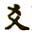).

CHAPTER XI. The Value of Caution as a Teaching of the Book of Changes

The time at which the Changes came to the fore was that in which the house of Yin came to an end and the way of the house of Chou was rising, that is, the time when King Wên and the tyrant Chou Hsin were pitted against each other.<a id="ref-1" href="#/book2-02-ta-chuan?id=fn-1">1</a>

This is why the judgments of the book sofrequently warn against danger. He who is conscious of danger creates peace for himself; he who takes things lightly creates his own downfall. The tao of this book is great. It omits none of the hundred things. It is concerned about beginning and end, and it is encompassed in the words “without blame.” This is the tao of the Changes.

King Wên, the founder of the Chou dynasty, was held captive by the last ruler of the Yin dynasty, the tyrant Chou Hsin. He is said to have composed the judgments on the different hexagrams during his captivity. Because of the danger of his situation, all these judgments emanate from a caution that is intent on remaining without blame and thus attains success.

CHAPTER XII. Summary

1\. The Creative is the strongest of all things in the world. The expression of its nature is invariably the easy, in order thus to master the dangerous. The Receptive is the most devoted of all things in the world. The expression of its nature is invariably simple, in order thus to master the obstructive.

The two cardinal principles of the Book of Changes, the Creative and the Receptive, are here once more presented in their essential features. The Creative is represented as strength, to which everything is easy, but which remains conscious of the danger involved in working from above downward, and thus masters the danger. The Receptive is represented as devotion, which therefore acts simply, but which is conscious of the obstructions inherent in working from below upward, and hence masters these obstructions.

2\. To be able to preserve joyousness of heart and yet to be concerned in thought: in this way we can determine good fortune and misfortune on earth, and bring to perfection everything on earth.

In the text there appear next to the expression, “to be concerned in thought,” two other characters that Chu Hsi has quite correctly eliminated as later additions. Joyousness of heart is the way of the Creative. To be concerned in thought is the way of the Receptive. Through joyousness one gains an overall view of good fortune and misfortune, through concern one attains the possibility of perfection.

3\. Therefore: The changes and transformations refer to action. Beneficent deeds have good auguries. Hence the images help us to know the things, and the oracle helps us to know the future.

The changes refer to action. Hence the images of the Book of Changes are of such sort that one can act in accordance with the changes and know reality (cf. also chapter II above, where inventions are traced to the images). Events tend toward good fortune or misfortune, which are expressed in omens. In that the Book of Changes interprets these omens, the future becomes clear.

4\. Heaven and earth determine the places. The holy sages fulfill the possibilities of the places. Through the thoughts of men and the thoughts of spirits, the people are enabled to participate in these possibilities.

Heaven and earth determine the places and thereby the possibilities. The sages make these possibilities into reality, and through the collaboration of the thoughts of spirits and of men in the Book of Changes, it becomes possible to extend the blessings of culture to the people as well.

5\. The eight trigrams point the way by means of their images; the words accompanying the lines, and the decisions, speak according to the circumstances. In that the firm and the yielding are interspersed, good fortune and misfortune can be discerned.

6\. Changes and movements are judged according to the furtherance (that they bring). Good fortune andmisfortune change according to the conditions. Therefore: Love and hate combat each other, and good fortune and misfortune result therefrom. The far and the near injure each other, and remorse and humiliation result therefrom. The true and the false influence each other, and advantage and injury result therefrom. In all the situations of the Book of Changes it is thus: When closely related things do not harmonize, misfortune is the result: this gives rise to injury, remorse, and humiliation.

The close relationships between the lines are those of correspondence and of holding together.<a id="ref-1" href="#/book2-02-ta-chuan?id=fn-1">1</a> According to whether the lines attract or repel one another, good fortune or misfortune ensues, in all the gradations possible in each case.

7\. The words of a man who plans revolt are confused. The words of a man who entertains doubt in his inmost heart are ramified. The words of men of good fortune are few. Excited men use many words. Slanderers of good men are roundabout in their words. The words of a man who has lost his standpoint are twisted.

This passage summarizes the effects of states of mind on verbal expression. It becomes plain therefrom that the authors of the Book of Changes, who are so sparing of words, belong in the category of men of good fortune.

---

**Notes:**

<a id="fn-1" href="#/book2-02-ta-chuan?id=ref-1">**1.**</a> Fifth Wing, Sixth Wing. Passages of this commentary are to be found repeated in bk. III, as “Appended Judgments.”

<a id="fn-2" href="#/book2-02-ta-chuan?id=ref-2">**2.**</a> *Umwandeln, verwandeln*: later on in his explanation Wilhelm defines *umwandeln* as meaning, in this connection, recurrent change, and *verwandeln* as meaning change in which there is no return to the starting point. The words “cyclic” and “sequent” are therefore introduced here in anticipation of these definitions, as the types of change alluded to would not otherwise be intelligible.

<a id="fn-3" href="#/book2-02-ta-chuan?id=ref-3">**3.**</a> Here the principles of the Creative and the Receptive, and the Greek principles of *logos* and *eros*, are in close approximation.

<a id="fn-1" href="#/book2-02-ta-chuan?id=ref-1">**1.**</a> It is to be noted that the designations yang and yin, later so much used, are not the terms chosen here. This is an indication of the antiquity of the text.

<a id="fn-1" href="#/book2-02-ta-chuan?id=ref-1">**1.**</a> Cf. Wilhelm and Jung, *The Secret of the Golden Flower* (1962 edn.), p. 14.

<a id="fn-1" href="#/book2-02-ta-chuan?id=ref-1">**1.**</a> Tao (*SINN*) is something that sets in motion and maintains the interplay of these forces. As this something means only a direction, invisible and in no way material, the Chinese chose for it the borrowed word tao, meaning “way,” “course,” which is also nothing in itself, yet serves to regulate all movements. For a discussion of the translation of the word tao, see the introduction to my translation of Lao-tse. See here, n. 13.

<a id="fn-2" href="#/book2-02-ta-chuan?id=ref-2">**2.**</a> This shows again to what extent the point of view of the Book of Changes is based on the principles of the organic world, in which there is no entropy.

<a id="fn-3" href="#/book2-02-ta-chuan?id=ref-3">**3.**</a> This is probably the passage on which Mencius based his doctrine that man’s nature is good.

<a id="fn-4" href="#/book2-02-ta-chuan?id=ref-4">**4.**</a> Cf. R. Wilhelm, *Chinesische Lebensweisheit* (Darmstadt, 1922), pp. 16 ff.

<a id="fn-1" href="#/book2-02-ta-chuan?id=ref-1">**1.**</a> See here, n. 16.

<a id="fn-2" href="#/book2-02-ta-chuan?id=ref-2">**2.**</a> Seventh Wing: Commentary on the Words of the Text.

<a id="fn-1" href="#/book2-02-ta-chuan?id=ref-1">**1.**</a> “The Great Plan.” See bk. IV of the *Shu Ching*, as translated by Legge (*The Sacred Books of the East*, III: *The Shu King*, Oxford, 1879).

<a id="fn-2" href="#/book2-02-ta-chuan?id=ref-2">**2.**</a> The Chinese year is in essential agreement with the Metonic year. Meton, an Athenian astronomer of the fifth century B.C., used the phases of the moon as the basis of his calculations.

<a id="fn-1" href="#/book2-02-ta-chuan?id=ref-1">**1.**</a> A.D. 1130–1200.

<a id="fn-2" href="#/book2-02-ta-chuan?id=ref-2">**2.**</a> The way in which the Book of Changes works can best be compared to an electrical circuit reaching into all situations. The circuit only affords the potentiality of lighting; it does not give light. But when contact with a definite situation is established through the questioner, the “current” is activated, and the given situation is illumined. Although this analogy is not used in any of the commentaries, it serves to explain in a few words the entire meaning of the text.

<a id="fn-1" href="#/book2-02-ta-chuan?id=ref-1">**1.**</a> Like Fu Hsi, one of the legendary rulers of China. He is credited with having founded the first dynasty of China, the Hsia dynasty, said to have lasted from 2205 to 1766 B.C.

<a id="fn-2" href="#/book2-02-ta-chuan?id=ref-2">**2.**</a> This seems to refer to a train of thought the traces of which are scattered through chapter VIII and the present chapter. The problem is whether, in view of the inadequacy of our means of understanding, a contact transcending the limits of time is possible—whether a later epoch is ever able to understand an earlier one. On the basis of the Book of Changes, the answer is in the affirmative. True enough, speech and writing are imperfect transmitters of thought, but by means of the images—we would say “ideas”—and the stimuli contained in them, a spiritual force is set in motion whose action transcends the limits of time. And when it comes upon the right man, one who has inner relationship with this tao, it can forthwith be taken up by him and awakened anew to life. This is the concept of the supranatural connection between the elect of all the ages.

<a id="fn-1" href="#/book2-02-ta-chuan?id=ref-1">**1.**</a> The reading “kindness” instead of “men” is contradicted by the context.

<a id="fn-1" href="#/book2-02-ta-chuan?id=ref-1">**1.**</a> Many of the citations from the Great Commentary appearing in bk. III under the heading “Appended Judgments” are from this chapter.

<a id="fn-2" href="#/book2-02-ta-chuan?id=ref-2">**2.**</a> Same as Fu Hsi.

<a id="fn-3" href="#/book2-02-ta-chuan?id=ref-3">**3.**</a> Written in the Han period by Pan Ku (A.D. 32–92).

<a id="fn-4" href="#/book2-02-ta-chuan?id=ref-4">**4.**</a> *Shih Ching*, an anthology of poems said to have been arranged by Confucius. The latest of the poems belong to the year 585 B.C.; the oldest are earlier by many centuries.

<a id="fn-5" href="#/book2-02-ta-chuan?id=ref-5">**5.**</a> Shên Nung, who is said to have taught the people agriculture.

<a id="fn-6" href="#/book2-02-ta-chuan?id=ref-6">**6.**</a> For explanation of nuclear trigrams, see here.

<a id="fn-7" href="#/book2-02-ta-chuan?id=ref-7">**7.**</a> Yao, Shun, and Yü are the three rulers held up as models by Confucius.

<a id="fn-8" href="#/book2-02-ta-chuan?id=ref-8">**8.**</a> Chêng Hsüan, A.D. 127–200.

<a id="fn-1" href="#/book2-02-ta-chuan?id=ref-1">**1.**</a> First Wing, Second Wing.

<a id="fn-1" href="#/book2-02-ta-chuan?id=ref-1">**1.**</a> See here for numerical values.

<a id="fn-1" href="#/book2-02-ta-chuan?id=ref-1">**1.**</a> These characterizations are given again with the respective hexagrams in bk. III, under the heading “Appended Judgments.”

<a id="fn-1" href="#/book2-02-ta-chuan?id=ref-1">**1.**</a> About the middle of the twelfth century B.C., according to traditional chronology.

<a id="fn-1" href="#/book2-02-ta-chuan?id=ref-1">**1.**</a> See here.
