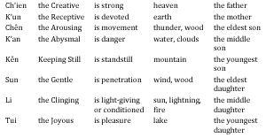
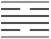
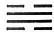
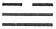
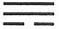
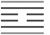
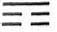
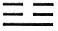
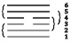

# The Structure of the Hexagrams

The Structure of the Hexagrams

1\. General Considerations

The foregoing supplies most of what is necessary for an understanding of the hexagrams. Here, however, there follows a summary regarding their structure. This will enable the reader to perceive why the hexagrams have precisely the meanings given them, why the lines have the often seemingly fantastic text that is appended to them—indicating, by means of allegory, what position the line holds in the total situation of the hexagram, and to what degree it therefore signifies good fortune or misfortune.

This substructure of explanation has been carried to great lengths by the Chinese commentators. Since the Han period<a id="ref-1" href="#/book2-03-structure-of-hexagrams?id=fn-1">1</a> especially, when the magic of the “five stages of change” became associated with the Book of Changes, more and more mystery and finally more and more hocus-pocus have become attached to the book. This is what has given the book its reputation for profundity and unintelligibility. I believe that the reader may be spared all this overgrowth, and have presented only such matter from the text and the oldest commentaries as proves itself relevant.

Obviously in a work like the Book of Changes there is always a nonrational residuum. Why, in a particular instance, one given aspect is stressed, rather than some other that might just as well have been, can no more be accounted for than the fact that oxen have horns and not upper front teeth as horses have. It is possible only to give proof of the interrelations within the framework of what is posited; to sustain the analogy, it is like explaining to what extent there is an organic connection between the development of horns and the absence of upper front teeth.

2\. The Eight Trigrams and Their Application

As has previously been pointed out, the hexagrams should be thought of not merely as made up of six individual lines but always as composed of two primary trigrams. In the interpretation of the hexagrams, these primary trigrams play a part according to the various aspects of their character—first according to their attributes, then according to their images, and finally according to their positions within the family sequence (here uniformly only the Sequence of Later Heaven<a id="ref-2" href="#/book2-03-structure-of-hexagrams?id=fn-2">2</a> is taken into account):

These general meanings, particularly when it is a question of interpretation of the individual lines, must be supplemented by the lists of symbols and attributes—at first glance seemingly superfluous—given in chapter III of the *Shuo Kua*, Discussion of the Trigrams.

In addition, the positions of the trigrams in relation to each other must be taken into account. The lower trigram is below, within, and behind; the upper trigram is above, without, and in front. The lines stressed in the upper trigram are always characterized as “going”; those stressed in the lower trigram, as “coming.”

From these characterizations of the trigrams—already in use in the Commentary on the Decision—there was later constructed a system of transforming the hexagrams one intoanother, which has led to much confusion. This system is here left wholly out of account, since it is not in any way essential to the explanation. Nor has any use been made of the “hidden” hexagrams—i.e., the idea that basically each hexagram has its opposite hidden within it (for example, within Ch’ien is K’un, within Chên is Sun, etc.).

But it is decidedly necessary to make use of the so-called nuclear trigrams, *hu kua*. These form the four middle lines of each hexagram, and overlap each other so that the middle line of the one falls within the other. An example or two will make this clear:

The hexagram Li, THE CLINGING, FIRE (30), shows a nuclear trigram complex consisting of the four lines:

The two nuclear trigrams are Tui, the Joyous, as the upper (), and Sun, the Gentle, as the lower ().

The hexagram Chung Fu, INNER TRUTH (61), has for its nuclear trigram complex the four lines:

Here the two nuclear trigrams are Kên, Keeping Still, as the upper (), and Chên, the Arousing, as the lower ().

The structure of the hexagrams therefore shows a stage-by-stage overlapping of different trigrams and their influences:

Thus, in each case, the beginning and the top line are each part of one trigram only—the lower and the upper primary trigram respectively. The second and the fifth line belong each to two trigrams, the former to the lower primary and the lower nuclear trigram, the latter to the upper primary and the upper nuclear trigram. The third and the fourth line belong each to three trigrams—to the upper and the lower primary trigram respectively, and to both of the two nucleartrigrams. The result is that the beginning and the top line tend in a sense to drop out of connection, while a state of equilibrium, usually favorable, obtains in the case of the second and the fifth line, and the two middle lines are conditioned by the fact that each belongs to both nuclear trigrams, which disturbs the balance in all except particularly favorable cases. These relationships correspond exactly with the evaluations of the lines in the appended judgments.

3\. The Time

The situation represented by the hexagram as a whole is called the time. This term comprises several entirely different meanings, according to the character of the various hexagrams.

In hexagrams in which the situation as a whole has to do with movement, “the time” means the decrease or growth, the emptiness or fullness, brought about by this movement. Hexagrams of this sort are: T’ai, PEACE (11); P’i, STANDSTILL (12); Po, SPLITTING APART (23); Fu, RETURN (24).

Similarly, the action or process characteristic for a given hexagram is called the time, as in Sung, CONFLICT (6), Shih, THE ARMY (7), Shih Ho, BITING THROUGH (21), and I, PROVIDING NOURISHMENT (27).

In addition, the time means the law expressed through a hexagram, as in Lü, TREADING (10), Ch’ien, MODESTY (15), Hsien, INFLUENCE (31), and Hêng, DURATION (32).

Finally, the time may also mean the symbolic situation represented by the hexagram, as in Ching, THE WELL (48), and Ting, THE CALDRON (50).

In all cases the time of a hexagram is determinative for the meaning of the situation as a whole, on the basis of which the individual lines receive their meaning. A given line—let us say, a six in the third place—can be now favorable, now unfavorable, according to the time determinant.

4\. The Places

The places occupied by the lines are differentiated as superior and inferior, according to their relative elevation. As a rule the lowest and the top line are not taken into account, whereasthe four middle lines are active within the time. Of these, the fifth place is that of the ruler, and the fourth that of the minister who is close to the ruler. The third, as the highest place of the lower trigram, holds a sort of transitional position; the second is that of the official in the country, who nevertheless stands in direct connection with the prince in the fifth place. But in some situations the fourth place may represent the wife and the second the son of the man represented by the fifth place. Under certain circumstances the second place may be that of the woman, active within the house, while the fifth place is that of the husband, active in the world without. In short, while any of various designations may be given to a line in a specific place, the varying functions ascribed to the place are always analogous.

As regards the time of the hexagram, the lowest and the top place as a rule represent the beginning and the end. But under certain circumstances the lowest line may also stand for an individual beginning to take part in the time situation without having as yet entered the field of action, while the top line may signify someone who has already withdrawn from the affairs of the time. However, it depends on the time represented by the hexagram whether, under some conditions, these very places have a typical activity, as for example the first place in Chun, DIFFICULTY AT THE BEGINNING (3) and in Ta Yu, POSSESSION IN GREAT MEASURE (14), or the top place in Kuan, CONTEMPLATION (20), in Ta Ch’u, THE TAMING POWER OF THE GREAT (26), and in I, INCREASE (42). In all of these cases the lines in question are rulers of the hexagrams.<a id="ref-3" href="#/book2-03-structure-of-hexagrams?id=fn-3">3</a> On the other hand, it may also happen that the fifth place is not that of the ruler, as when, in conformity with the situation indicated by the hexagram as a whole, no prince appears.

5\. The Character of the Lines

The character of the lines is designated as firm or yielding, as central, as correct, or as not central or not correct. The undivided lines are firm (or rigid), the divided lines are yielding(or weak). The middle lines of the two primary trigrams, the second and the fifth, are central irrespective of their other qualities. A line is correct when it stands in a place appropriate to it—e.g., a firm line occupying the first, third, or fifth place, or a yielding line occupying the second, fourth, or sixth place.

Both firm and yielding lines may be favorable or unfavorable, according to the time requirement of the hexagram. When the time calls for firmness, firm lines are favorable; when the time requires giving way, yielding lines are favorable. This holds true to such an extent that correctness may not always be of advantage. When the time requires giving way, a firm line in the third place, although correct in itself, is harmful because it shows too much firmness, while conversely a yielding line in the third place can be favorable because its yielding character compensates for the rigidity of the place. Only the central position is favorable in the great majority of cases, whether associated with correctness or not. A yielding ruler in particular may have a very favorable position, especially when supported by a strong, firm official in the second place.

6\. The Relationships of the Lines to One Another

Correspondence

Lines occupying analogous places in the lower and the upper trigram sometimes have an especially close relationship, the relationship of correspondence. As a rule, firm lines Correspond with yielding lines only, and vice versa. The following lines, provided that they differ in kind, correspond: the first and the fourth, the second and the fifth, the third and the top line. Of these, the most important are the two central lines in the second and the fifth place, which stand in the correct relationship of official to ruler, son to father, wife to husband. A strong official may be in the relation of correspondence to a yielding ruler, or a yielding official may be so related to a strong ruler. The former is the case in sixteen hexagrams, in all of which the result is favorable. It is wholly favorable in hexagrams 4, 7, 11, 14, 18, 19, 32, 34, 38, 40, 41, 46, 50, andsomewhat less favorable, owing to the time conditions, in hexagrams 26, 54, 64. The relationship of correspondence between a yielding official and a strong ruler is not nearly so favorable. Its effect is quite unfavorable in hexagrams 12, 13, 17, 20, 31. Difficulties appear in hexagrams 3, 33, 39, 63, but as these are explainable on the basis of the time, the relationship in itself can still be said to be correct. The relationship acts favorably in hexagrams 8, 25, 37, 42, 45, 49, 53.

Occasionally there is correspondence also between the first and the fourth line. It is favorable when a yielding line in the fourth place is in the relationship of correspondence to a strong first line, because this means that an obedient official seeks strong, efficient assistants in the name of his ruler (cf. hexagrams 3, 22, 26, 27, 41). On the other hand, correspondence of a strong fourth line with a yielding first line would indicate a temptation to intimacy with inferior persons, which should be avoided (cf. hexagrams 28, 40, 50). A relationship between the third and the top line hardly ever occurs—or at most only as a temptation—because an exalted sage who has renounced the world would forfeit his purity if he became entangled in worldly affairs, and an official in the third place would forfeit his loyalty if he passed by his ruler in the fifth place.

Of course when a line is a ruler of a hexagram, there occur relationships of correspondence that are independent of these considerations, and the good fortune or misfortune implied by them is determined by the time significance of the hexagram as a whole.

Holding Together

Between two adjacent lines of different character there may occur a relationship of holding together, which is also described with respect to the lower line as “receiving” and with respect to the upper as “resting upon.” As regards the relationship of holding together, the fourth and the fifth line (minister and ruler) are of first importance. Here, in contradistinction to the situation respecting the second and the fifth line, it is more favorable for a yielding minister to hold together with a strong ruler, because in this closer proximity reverence is of value. Thus in sixteen hexagrams in which this type of holdingtogether occurs, it is always more or less auspicious: it is very favorable in hexagrams 8, 9, 20, 29, 37, 42, 48, 53, 57, 59, 60, 61 and somewhat less favorable but not altogether unfavorable in hexagrams 3, 5, 39, 63. But the holding together of a strong, i.e., an incorrect line in the fourth place with a yielding ruler is generally unfavorable, as in hexagrams 30, 32, 35, 50, 51; it is somewhat less unfavorable in hexagrams 14, 38, 40, 54, 56, 62. Conversely, it is favorable in certain hexagrams in which the strong fourth line is the ruler: these are hexagrams 16, 21, 34, 55 (here the line is the ruler of the upper trigram), 64.

In addition, the relationship of holding together occurs also between the fifth and the top line. Here it pictures a ruler placing himself under a sage; in such a case it is usually a humble ruler (a weak line in the fifth place) who reveres a strong sage (a strong line above), as in hexagrams 14, 26, 27, 50. This is naturally very favorable. But when, conversely, a strong line stands in the fifth place with a weak one above it, this points rather to association with inferior elements and is undesirable, as in hexagrams 28, 31, 43, 58. The only exception to this appears in hexagram 17, Sui, FOLLOWING, because the total meaning of the hexagram presupposes that the strong element descends to a place under the weak element.

The remaining lines, the first and second, the second and third, the third and fourth, do not stand in the correct relationship of holding together. Where this occurs it always implies a danger of factionalism and is to be avoided. For a weak line, resting upon a firm line is even at times a source of trouble.

In dealing with lines that are rulers of their hexagrams, correspondence and holding together are taken into account regardless of the places of the lines. Besides the above-mentioned instances, other examples may be cited. In Yü, ENTHUSIASM (16), the fourth line is the ruler of the hexagram, the first line corresponds with it, and the third holds together with it. In Po, SPLITTING APART (23), the top line is the ruler; the third corresponds with it, the fifth holds together with it, and both these factors are favorable. In Fu, RETURN (24), the first line is the ruler; the second holds together with it, the fourth corresponds with it, and both these relationships arefavorable. In Kuai, BREAK-THROUGH (RESOLUTENESS) (43), the top line is the ruler, the third corresponds with it, and the fifth holds together with it. And in Kou, COMING TO MEET (44), the first line is the ruler, the second holds together with it, the fourth corresponds with it. Here good fortune and misfortune are determined according to the trend indicated by the meaning of the hexagram.

7\. The Rulers of the Hexagrams

Distinction is made between two kinds of rulers, constituting and governing. The constituting ruler of the hexagram is that line which gives the hexagram its characteristic meaning, regardless of whether or not the line indicates nobility and goodness of character. The weak top line in hexagram 43, Kuai, BREAK-THROUGH (RESOLUTENESS) is an example, for the idea that this line is resolutely to be cast out is the constituting factor in the hexagram.

Governing rulers are always of good character and become rulers by virtue of their position and the meaning of the time. Usually they are in the fifth place, but occasionally lines in other places may be governing rulers.

When the constituting ruler is at the same time the governing ruler, the line is certain to be good and to be in the place appropriate to the time. When it is not the governing ruler as well, it is a sure sign that its character and place do not accord with the demands of the time.

The ruler of the hexagram can always be determined from the Commentary on the Decision.<a id="ref-4" href="#/book2-03-structure-of-hexagrams?id=fn-4">4</a> When the constituting ruler and the governing ruler are identical, the hexagram has one ruler; otherwise it has two. Often there are two lines constituting the meaning of the hexagram, as for instance the two advancing weak lines in hexagram 33, Tun, RETREAT; these are both rulers because they are pushing back the four strong lines. If the hexagram is produced by the interaction of the images of the primary trigrams, the two lines respectively characterizing the trigrams are the rulers.

The constituting ruler in the hexagram is designated by asquare (), the governing ruler by a circle (). When the two are identical, only the circle is used. In book III, moreover, a detailed interpretation of the ruler appears in connection with each hexagram.

---

**Notes:**

<a id="fn-1" href="#/book2-03-structure-of-hexagrams?id=ref-1">**1.**</a> 206 B.C.–A.D. 220.

<a id="fn-2" href="#/book2-03-structure-of-hexagrams?id=ref-2">**2.**</a> See here.

<a id="fn-3" href="#/book2-03-structure-of-hexagrams?id=ref-3">**3.**</a> Here and on the pages following, there are occasional discrepancies in regard to the examples cited.

<a id="fn-4" href="#/book2-03-structure-of-hexagrams?id=ref-4">**4.**</a> See bk. III.
