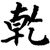
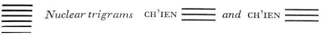

# Commentary: 1. Ch'ien / The Creative

<a id="ref-1" href="#/com-01-ch-ien-the-creative?id=fn-1">1</a>

The ruler of the hexagram is the nine in the fifth place. THE CREATIVE indicates the way of heaven, and the fifth place is the symbol of heaven. THE CREATIVE also indicates the way of the superior man, and the fifth place, as that of the ruler, is his appropriate place. Moreover, the nine in the fifth place possesses the four attributes of firmness, strength, moderation (central position in the upper trigram), and justice (correctness, the yang element being in the yang place). Hence this line possesses the character of heaven in all its perfection.

This hexagram is correlated with the fourth month (May–June), because the light-giving power is then at its zenith.

Miscellaneous Notes on the Hexagrams<a id="ref-2" href="#/com-01-ch-ien-the-creative?id=fn-2">2</a>

THE CREATIVE is strong.
Strength and firmness constitute the character of this hexagram. Its image is the trigram of heaven doubled, that is, two successive rotations or days. It is made up of positive lines only.

### THE JUDGMENT

> THE CREATIVE works sublime success,
>
> Furthering through perseverance.

Commentary on the Decision<a id="ref-3" href="#/com-01-ch-ien-the-creative?id=fn-3">3</a>

NOTE. This commentary, no doubt correctly ascribed to Confucius, explains the names of the hexagrams as well as the words appended by King Wên to the hexagram as a whole the Judgment. In general, the commentary first explains the name of the hexagram, taking into consideration as occasion demands its character, its image, and its structure. Next it elucidates the words of King Wên, either using the sources just named or else starting from the situation of the ruler of the hexagram or from the change of form that has given rise to the hexagram.

No explanation of the names of the eight primary trigrams is given; because it is assumed that this is known.

In the Chinese, the sentences in this commentary are for the most part rhymed, probably in order to make it easier to remember them. The rhymes have not been reproduced in this translation, because they are of no material significance. However, it is well to remember the circumstance, because it explains much of the abruptness in the style, which is often somewhat forced.

Great indeed is the sublimity of the Creative, to which all beings owe their beginning and which permeates all heaven.<a id="ref-4" href="#/com-01-ch-ien-the-creative?id=fn-4">4</a>

The commentary separates the two pairs of attributes given in the Judgment into the four individual attributes of the creative power, whose visible form is heaven. The first attribute is sublimity, which, as the primal cause of all that exists, forms the most important and most inclusive attribute of the Creative. The root meaning of the Chinese word for it—*yüan*—is literally “head.”

The clouds pass and the rain does its work, and all individual beings flow into their forms.

This explains the expression “success.” The success of the creative activity is revealed in the gift of water, which causes the germination and sprouting of all living things. The first passage tells of the beginning of all beings in general; here the separate species in their particular forms are instanced. These two passages show the attributes of greatness and success as they manifest themselves in the creative force in nature. The attributes of sublimity and success take shape correspondingly in the creative man, the sage, who is in harmony with the creative power of the godhead.

Because the holy man is clear as to the end and the beginning, as to the way in which each of the six stages completes itself in its own time, he mounts on them toward heaven as though on six dragons.

The holy man, who understands the mysteries of creation inherent in end and beginning, in death and life, in dissolution and growth, and who understands how these polar opposites condition one another, becomes superior to the limitations of the transitory. For him, the meaning of time is that in it the stages of growth can unfold in a clear sequence. He is mindful at every moment and uses the six stages of growth as if they were six dragons (the image attributed to the individual lines) on which he mounts toward heaven. This is the sublimity and success of the Creative as it shows itself in man.

The way of the Creative works through change and transformation, so that each thing receives its true nature and destiny and comes into permanent accord with Great Harmony: this is what furthers and what perseveres.

Here the two other attributes, power to further and power to persevere, are explained in their relation to the creative force in nature. The mode of the creative is not rest but continuous movement and development. Through this force, all things are gradually changed until they are completely transformed in their manifestation. Thus the seasons and all living beings change and alternate in their course. In this way each thingreceives the nature appropriate to it, which, from the divine viewpoint, is called its appointed destiny. This explains the concept of furthering. With each thing thus finding its mode, a great and lasting harmony arises in the world: this is expressed in the concept of perseverance (lastingness and integrity).

He towers high above the multitude of beings, and all lands are united in peace.

This describes the creative power of the holy man, who makes it possible for everything to attain its appropriate place, thus bringing about peace on earth, when he occupies an eminent ruling place.

In all these explanations there is an evident parallelism between the Creative in nature and the Creative in the world of man. What is said about the Creative in nature is based on the image of heaven symbolized by the hexagram. Heaven shows the strong, ceaseless movement that by its nature causes everything to happen in due time. The words about the Creative in man are based on the position of the ruler of the hexagram, the nine in the fifth place. The “flying dragon in the heavens” is the image of the sublimity and success of the holy ruler. The eminent place held by the holy man, through which peace comes to the world, has its basis in the line, “It furthers one to see the great man.”

Commentary on the Images<a id="ref-5" href="#/com-01-ch-ien-the-creative?id=fn-5">5</a>

NOTE. This commentary, starting with the combination of the two trigrams, deduces from it the situation represented by the hexagram as a whole. With the attributes of the two trigrams as a basis, it then gives advice for correct behavior in this situation.

### THE IMAGE

> The movement of heaven is full of power.
>
> Thus the superior man makes himself strong and untiring.

The doubling of the trigram Ch’ien, the Creative, gives the image of powerful and constantly repeated movement. The doubling suggests that one draws strength from within oneself, and that after each action a new one follows, without cease.

### THE LINES

Nine at the beginning:

*a*) Hidden dragon. Do not act.

*b*) “Hidden dragon. Do not act.” For the light-giving force is still below.
The lowest place is as it were still wholly beneath the earth, hence the idea of something hidden. But since the line is undivided, the image chosen is the dragon, the symbol of the light-giving force.

Nine in the second place:

*a*) Dragon appearing in the field.

It furthers one to see the great man

*b*) “Dragon appearing in the field.” Already the influence of character reaches far.
The second place stands for the surface of the earth, hence the idea of a field. Appearing in the field and seeing the great man are indicated by the influential character of the line, since it holds the center of the lower trigram and is moreover relatedto the ruler of the hexagram through place and affinity of nature.

Nine in the third place:

*a*) All day long the superior man is creatively active. At nightfall his mind is still beset with cares. Danger. No blame.

*b*) “All day long the superior man is creatively active.”

One goes to and fro on the right path.
The third place, as the place of transition from the lower to the upper trigram, is naturally unsettled and therefore frequently not exactly favorable. Here, however, owing to the uniform character of all the lines, the transition is merely a sign of tireless activity leading to and fro on the path to truth. “To and fro” means that one is only beginning to acquire moral stability.

Nine in the fourth place:

*a*) Wavering flight over the depths. No blame.

*b*) “Wavering flight over the depths.” Advance is not a mistake.
Here we reach the upper limit of what pertains to man in the hexagram. Advance on level ground is no longer possible. In order to advance, a man must dare to relinquish his foothold on earth and soar into realms of uncharted space and utter solitude. Here the individual is free—precisely because of the possibilities inherent in the position. Each man must determine his own fate.

Nine in the fifth place:

*a*) Flying dragon in the heavens. It furthers one to see the great man.

*b*) “Flying dragon in the heavens.” This shows the great man at work.
Here the ruler of the hexagram is in the place which is preeminently that of the ruler. Hence he is symbolized by a dragon flying in the sky.

Nine at the top:

*a*) Arrogant dragon will have cause to repent.

*b*) “Arrogant dragon will have cause to repent.” For what is at the full cannot last.
By the law of change, whatever has reached its extreme must turn back.

When all the lines are nines:

*a*) There appears a flight of dragons without heads.

Good fortune.

*b*) “All the lines are nines.” It is the nature of heaven not to appear as head.
The Creative does indeed guide all happenings, but it never becomes manifest; it never behaves outwardly as the leader. Thus true strength is that strength which, mobile as it is hidden, concentrates on the work without being outwardly visible. Since all the lines are nines, the hexagram Ch’ien changes into the hexagram, K’un, THE RECEPTIVE, which is wholly receptive; hence no head is showing.

Commentary on the Words of the Text<a id="ref-6" href="#/com-01-ch-ien-the-creative?id=fn-6">6</a>

NOTE. This wing consists of four commentaries on the first two hexagrams in the Book of Changes. Of these, two commentaries deal with the text referring to the hexagram as a whole the Judgment and also with the *T’uan Chuan* Commentary on the Decision, while all four also elucidate the individual lines. The commentaries, here designated as *a*, *b*, *c*, and *d*, contain a different number of sections each. In the original text the sequence is arranged as follows: *a*, 1–9; *b*, 1–7; *c*, 1–7; *d*, 1–12. In the presentation below, for the sake of clarity and to avoid unnecessary repetition, the differentcommentaries pertaining to the respective hexagrams have been arranged together, and are distinguishable by the classifying letters and numerals.

On the Hexagram as a Whole

a\) 1. Of all that is good, sublimity is supreme. Succeeding is the coming together of all that is beautiful. Furtherance is the agreement of all that is just. Perseverance is the foundation of all actions.

Here the four fundamental attributes of the hexagram are related to the four cardinal virtues of Chinese ethics. Sublimity is correlated with humaneness, success with the mores, furtherance with justice, and perseverance with wisdom.<a id="ref-7" href="#/com-01-ch-ien-the-creative?id=fn-7">7</a>

a\) 2. Because the superior man embodies humaneness, he is able to govern men. Because he brings about the harmonious working together of all that is beautiful, he is able to unite them through the mores. Because he furthers all beings, he is able to bring them into harmony through justice. Because he is persevering and firm, he is able to carry out all actions.

The four fundamental attributes of the Creative are likewise the attributes necessary to a leader and ruler of men. In order to rule and lead men, the first essential is to have humane feeling toward them. Without humaneness, nothing lasting can be accomplished in the sphere of authority. Power that influences through fear works only for the moment and necessarily arouses resistance as a countereffect.

On the basis of this conception, it follows that the mores are the instrument by which men can be brought into union. For nothing binds people more firmly together than deeply rooted social usages that are observed because they appear to eachmember of society as something beautiful and worth striving for.

Wherever it is possible to construct a framework of mores in which each person feels content, it is easy to unify and organize the masses. Furthermore, as the foundation of social life there must be the greatest possible freedom and the greatest possible advantage for all. These are guaranteed by justice, which curtails individual freedom no more than is absolutely necessary for the general welfare. Finally, to reach the desired goals, there is the fourth requisite of wisdom, manifesting itself by pointing out the established and enduring paths that, according to immutable cosmic laws, must lead to success.

*a*) 3. The superior man acts in accordance with these four virtues. Therefore it is said: The Creative is sublime, successful, furthering, persevering.

*d*) 1. The sublimity of the Creative depends on the fact that it begins everything and has success.

*d*) 2. Furtherance and perseverance: thus it brings about the nature and way of all beings.

Here the attributes are again summed up in pairs. The sublimity of the Creative depends on its absoluteness, on the fact that it is the beginning of all things—for it is not itself conditioned by anything else—and that it is the active principle, i.e., it is itself the cause of all else. Furtherance and perseverance—meaning the urge to life, and the fixed laws of nature—reveal the causality of the Creative in its efficacy. The urge to life—that which furthers and is right for each being—lays the foundation of its nature, and this nature acts according to fixed laws: this is the way of all beings. In the Commentary on the Decision nature is traced back to its origin in the divine decree; here nature is shown in its mode of action.

*d*) 3. The Creative, by positing the beginning, is able to further the world with beauty. Its true greatness lies in the fact that nothing is said about the means by which it furthers.

Of the Creative it is said only that it furthers by virtue of what eternally belongs to it, by virtue of its very nature. This nature is not defined more exactly. In this lies the suggestion of the infinite possibilities and aspects of its benefits. The Receptive forms a contrast to this, because it is said: “It furthers through the perseverance of a mare.” In the phenomenal world, each thing has its specific nature: this is the principle of individuation. At the same time this specific nature fixes a boundary that separates each individual being from every other.

*d*) 4. How great indeed is the Creative! It is firm and strong, moderate and correct, pure, unalloyed and spiritual.

Here the attributes of the whole hexagram are deduced from the nature of its ruler, the nine in the fifth place, as is frequently the case in the *T’uan Chuan*, Commentary on the Decision, to which the entire passage refers. The fifth line is firm because it is in an uneven place, strong because it is undivided (strong means movement, firm means rest); it is moderate because it is in the middle of the upper trigram, correct because it stands in its appropriate place—a strong line in a strong place. In these four attributes the four cardinal attributes of the hexagram are revealed once more. These attributes are present in pure, unalloyed, and spiritual form because the hexagram consists of strong lines only.

*d*) 5. The six individual lines open up and unfold the thought, so that the character of the whole is explained through its different sides.

Because of the unity of the hexagram, the individual lines stand in a continuous relationship that, as it progresses, clarifies the idea of the whole still further. In this respect the hexagram Ch’ien, THE CREATIVE, forms a contrast to K’un, THE RECEPTIVE, in which the single lines stand side by side without inner relationship. This inheres in the temporal character of THE CREATIVE as contrasted with the spatial character of THE RECEPTIVE.

*d*) 6. “In his own time he mounts toward heaven on six dragons. The clouds pass and the rain falls.” All this means peace coming to the world.

Because of this closing remark, the corresponding passage in the Commentary on the Decision is interpreted as a reference to historical events, namely, the ordering of the empire.

On the Lines

On nine at the beginning:

*a*) 4. Nine at the beginning means: “Hidden dragon. Do not act.” What does this signify? The Master said:

This means a person who has the character of a dragon but remains concealed. He does not change to suit the outside world; he makes no name for himself. He withdraws from the world, yet is not sad about it. He receives no recognition, yet is not sad about it. If lucky, he carries out his principles; if unlucky, he withdraws with them. Verily, he cannot be uprooted; he is a hidden dragon.

*b*) 1. “Hidden dragon. Do not act.” The reason is that he is below.

*c*) 1. “Hidden dragon. Do not act.” The power of the light principle is still covered up and concealed.

*d*) 7. The superior man acts in accordance with the character that has become perfected within him. This is a way of life that can submit to scrutiny on any day.

Being hidden means that he is still in concealment and not given recognition, that if he should act he would not as yet accomplish anything. In this case the superior man does not act.

On nine in the second place:

*a*) 5. Nine in the second place means: “Dragon appearing in the field. It furthers one to see the great man.” What does this signify?

The Master said: This means a man who has the character of a dragon and is moderate and correct. Even in ordinary speech he is reliable. Even in ordinary actions he is careful. He does away with what is false and preserves his integrity. He improves his era and does not boast about it. His character is influential and transforms men.

In the Book of Changes it is said: “Dragon appearing in the field. It furthers one to see the great man.” This refers to a man who has the qualities of a ruler.

*b*) 2. “Dragon appearing in the field.” The reason is that he is not needed as yet.

*c*) 2. “Dragon appearing in the field.” Through him the whole world attains beauty and clarity.

*d*) 8. The superior man learns in order to gather material; he questions in order to sift it. Thus he becomes generous in nature and kindly in his actions.

In the Book of Changes it is said: “Dragon appearing in the field. It furthers one to see the great man.” For he has the qualities of a ruler.

On nine in the third place:

*a*) 6. Nine in the third place means: “All day long the superior man is creatively active. At nightfall his mind is still beset with cares. Danger. No blame.” What does this signify?

The Master said: The superior man improves his character and labors at his task. It is through loyalty and faith that he fosters his character. By workingon his words, so that they rest firmly on truth, he makes his work enduring. He knows how this is to be achieved and achieves it; in this way he is able to plant the right seed. He knows how it is to be brought to completion and so completes it; thereby he is able to make it truly enduring. For this reason he is not proud in his superior position nor disappointed in an inferior one. Thus he is creatively active and, as circumstances demand, careful, so that even in a dangerous situation he does not make a mistake.

*b*) 3. “All day long he is creatively active.” This is the way in which he carries out his undertakings.

*c*) 3. “All day long he is creatively active.” He moves with the time.

*d*) 9. The nine in the third place shows redoubled firmness and is moreover not in a central place. On the one hand, it is not yet in the heavens above; on the other hand, it is no longer in the field below. Therefore one must be creatively active and, as circumstances demand, careful. Then, despite the danger, no mistake is made.

On nine in the fourth place:

*a*) 7. Nine in the fourth place means: “Wavering flight over the depths. No blame.” What does this signify?

The Master said: In ascent or descent there is no fixed rule, except that one must do nothing evil. In advance or retreat no sustained perseverance avails, except that one must not depart from one’s nature. The superior man fosters his character and labors at his task, in order to do everything at the right time. Therefore he makes no mistake.

*b*) 4. “Wavering flight over the depths.” He tests his powers.

*c*) 4. “Wavering flight over the depths.” Here the way of the Creative is about to transform itself.

*d)* 10. The nine in the fourth place is too rigid and not moderate. It is not yet in the heavens above, neither is it any longer in the field below nor in the middle regions of the human. Therefore it is said: “Wavering flight …” To waver means that one has freedom of choice, therefore one makes no mistake.

On nine in the fifth place:

*a*) 8. Nine in the fifth place means: “Flying dragon in the heavens. It furthers one to see the great man.” What does this signify?

The Master said: Things that accord in tone vibrate together. Things that have affinity in their inmost nature seek one another. Water flows to what is wet, fire turns to what is dry. Clouds follow the dragon, wind follows the tiger. Thus the sage rises, and all creatures follow him with their eyes. What is born of heaven feels related to what is above. What is born of earth feels related to what is below. Each follows its kind.

*b*) 5. “Flying dragon in the heavens.” This is the supreme way of ruling.

*c*) 5. “Flying dragon in the heavens.” This is the place appropriate to heavenly character.

*d*) 11. The great man accords in his character with heaven and earth; in his light, with the sun and moon; in his consistency, with the four seasons; in the good and evil fortune that he creates, with gods and spirits. When he acts in advance of heaven, heavendoes not contradict him. When he follows heaven, he adapts himself to the time of heaven. If heaven itself does not resist him, how much less do men, gods, and spirits!

On nine at the top:

*a*) 9. Nine at the top means: “Arrogant dragon will have cause to repent.” What does this signify?

The Master said: He who is noble and has no corresponding position, he who stands high and has no following, he who has able people under him who do not have his support, that man will have cause for regret at every turn.

*b*) 6. “Arrogant dragon will have cause to repent.” Everything that goes to extremes meets with misfortune.

*c*) 6. “Arrogant dragon will have cause to repent.” In time he exhausts himself.

*d*) 12. Arrogance means that one knows how to press forward but not how to draw back, that one knows existence but not annihilation, knows something about winning but nothing about losing.

It is only the holy man who understands how to press forward and how to draw back, who knows existence and annihilation as well, without losing his true nature. The holy man alone can do this.

On all the nines changing:

*b*) 7. When THE CREATIVE, the great, undergoes change in all the nines, the world is set in order.

*c*) 7. When THE CREATIVE, the great, undergoes change in all the nines, one perceives the law of heaven.

NOTE. The hexagram Ch’ien, THE CREATIVE, occupies a unique position, in that it is uniformly composed of firm lines all having a certain relation to one another. They form a sequence of stages, so that a genetic development in time can be observed. For this reason the judgments attached to the individual lines in this hexagram differ from those pertaining to any of the other hexagrams. In the case of THE CREATIVE, there can be no question of relationships of correspondence and holding together<a id="ref-8" href="#/com-01-ch-ien-the-creative?id=fn-8">8</a> between firm and yielding lines, such as determine the character of the other hexagrams; instead, the judgment takes into account solely the relation of the place to the nature of the line.

A characteristic difference between the upper and the lower trigram is to be noted. The lower pictures the development of the character of the creative power; the upper, the development of the external position. The first line and the fourth each mark a beginning. The first line, at the very bottom, still within the realm of earth (first and second places), is designated as hidden, latent. The fourth line, in the lowest place of the upper trigram, likewise indicates a beginning, that is, a changing of position. In themselves, the omens for this line are not favorable. Being firm in a yielding place, the line does not fit its place, and this might well imply a defect somewhere. But because the essence of the Creative is strength, it is explicitly emphasized that there is no mistake. The divergence between the character and the place of the line manifests itself instead in the potentiality of the decision, which is still in doubt.

The middle lines in the two trigrams, the second and the fifth, are extraordinarily favorable. The second line is central and as such is immediately to be conceived as correct. Since it is still in the lower trigram, it shows the inner nature of the great man, who is already becoming known (“in the field”) but does not yet hold an appropriate position. He must see the “great man” in the fifth place, with whom he is connected by kinship of character, and who, as ruler of the whole, can assign him the position suitable to him. These favorable omens hold in regard to the fifth line in a yet more marked degree. The second line shows the strong man in a weak, lowlyplace; in the fifth line, however, character and position accord. It is a strong line in a strong place, in the sphere of heaven (fifth and sixth places); moreover, it is the ruler of the whole. Therefore it represents the great man whom it is worthwhile to see. Hence the two central lines carry no warning at all; they are altogether favorable.

It is different in the case of the two end lines, the third and the top line. Of the two, the third has the more favorable position. It is indeed too strong for the place of transition (strength of character intensified by strength of place), so that it would seem that mistakes are to be feared. However, since the whole hexagram deals with creative powers, excess of strength does no harm, for at the place of transition it can be applied to inner preparation for the new conditions. For the top line, however, matters are quite different. Here the end of the whole situation is reached. Although the place is weak, the line character is still strong. This divergence between what one wants to do and what one is able to do leads to remorse, since there is no possible way out.

---

**Notes:**

<a id="fn-1" href="#/com-01-ch-ien-the-creative?id=ref-1">**1.**</a> For explanation, see here.

<a id="fn-2" href="#/com-01-ch-ien-the-creative?id=ref-2">**2.**</a> *Tsa Kua*: Tenth Wing. See here.

<a id="fn-3" href="#/com-01-ch-ien-the-creative?id=ref-3">**3.**</a> *T’uan Chuan*: First Wing, Second Wing. “Decision” is the equivalent of “Judgment.”

<a id="fn-4" href="#/com-01-ch-ien-the-creative?id=ref-4">**4.**</a> See here, where this passage is quoted. Here, as in a number of other instances, the phrasing differs somewhat from one book to another.

<a id="fn-5" href="#/com-01-ch-ien-the-creative?id=ref-5">**5.**</a> *Hsiang Chuan*: Third Wing, Fourth Wing. In bk. I, under the heading “The Image,” the reader has become familiar with the portion of this commentary known as the Great Images. It is repeated in bk. III under the same heading. The rest of the commentary, which explains the line judgments—though called Small Images (see here)—appears in the passages designated *b* under the heading “The Lines.” The passages designated *a* repeat the line judgments of bk. I. The German edition omits this repetition in the treatment of the first two hexagrams. However, the presence of the line itself makes the commentary so much more intelligible that it has seemed desirable here to supply the omission. Under “Six in the third place” in K’un, a parenthetic completion of the line text under *b*, and a sentence in the comment explaining this interpolation—both supplied by Wilhelm for elucidation in the absence of *a*—have been omitted as superfluous.

<a id="fn-6" href="#/com-01-ch-ien-the-creative?id=ref-6">**6.**</a> *Wên Yen*: Seventh Wing.

<a id="fn-7" href="#/com-01-ch-ien-the-creative?id=ref-7">**7.**</a> In the German rendering, these correlations are stated in four sentences so printed that they appear as a passage from the *Wên Yen*. Actually they do not occur in the *Wên Yen*. It is to be assumed therefore that they are part of Wilhelm’s comment on *a* 1.

<a id="fn-8" href="#/com-01-ch-ien-the-creative?id=ref-8">**8.**</a> See here–here.
