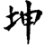
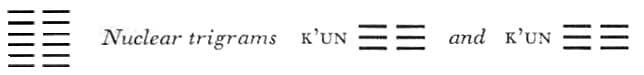

# Commentary: 2. K'un / The Receptive

The ruler of the hexagram is the six in the second place. K’un, THE RECEPTIVE, represents the nature of the earth; the number two symbolizes the earth. Furthermore, THE RECEPTIVE demonstrates the nature of the man who serves, and the second place is his station. In addition, this line expresses perfectly the fourfold character of the Receptive: it is yielding, devoted, moderate (i.e., central), and correct (i.e., yielding in a yielding place). For this reason, it is the ruler of the hexagram.The statements made in the Judgment all refer to the nature of an official: “If he tries to lead, he goes astray; but if he follows, he finds guidance. It is favorable to find friends in the west and south, to forego friends in the east and north.”

This hexagram is linked with the tenth month (November–December), when the dark power in nature brings an end to the year.

Miscellaneous Notes

THE RECEPTIVE is yielding.

### THE JUDGMENT

> THE RECEPTIVE brings about sublime success,
>
> Furthering through the perseverance of a mare.
>
> If the superior man undertakes something and tries to lead,
>
> He goes astray;
>
> But if he follows, he finds guidance.
>
> It is favorable to find friends in the west and south,
>
> To forego friends in the east and north.
>
> Quiet perseverance brings good fortune.

Commentary on the Decision

Perfect indeed is the sublimity of the Receptive. All beings owe their birth to it, because it receives the heavenly with devotion.

This is the explanation of the word “sublime” in the Judgment. The greatness of the Receptive is characterized as perfect. That which attains the ideal is perfect. This means that the Receptive is dependent on the Creative. While the Creative is the generating principle, to which all beings owe their beginning, because the soul comes from it, the Receptive is that which brings to birth, that which takes the seed of the heavenly into itself and gives to beings their bodily form.

The Receptive in its riches carries all things. Its nature is in harmony with the boundless. Itembraces everything in its breadth and illumines everything in its greatness. Through it, all individual beings attain success.

This is the explanation of the word “success” in the Judgment. Here also there is the contrasting complement to the Creative. While the Creative shields things—that is, covers them from above—the Receptive carries them, like a foundation that endures forever. Infinite accord with the Creative is its essence. This produces its success. The movement of the Creative is a direct forward movement, and its resting state is standstill; the movement of the Receptive is an opening out, and in its resting state it is closed. In the resting, closed state, it embraces all things as though in a vast womb. In the state of movement, of opening, it allows the divine light to enter, and by means of this light illuminates everything. This is the source of its success, which shows itself in the success of living beings. While the success of the Creative lies in the fact that individual beings receive their specific forms, the success of the Receptive causes them to thrive and unfold.

A mare belongs to the creatures of the earth; she roams the earth without bound. Yielding, devoted, furthering through perseverance: thus the superior man has a direction for his way of life.

While the Creative is symbolized by the dragon flying in the heavens, the Receptive is symbolized by the mare (combining strength and devotion) coursing over the earth. Being yielding and devoted must not exclude strength, for strength is necessary to the Receptive if it is to be the helper of the Creative. This strength is expressed in the words, “furthering through perseverance,” appearing in the commentary as the model for the way of life of the superior man. (The punctuation of the commentary deviates from that of the Judgment. Because of the rhyme, the commentary requires the literal translation, “Furthering through perseverance. Thus the superior man has somewhere to go.” In the Judgment, on the other hand, most interpreters make the last words a dependent clauselinked with what follows, and the sentence reads: “If the superior man undertakes something … he goes astray.”<a id="ref-1" href="#/com-02-k-un-the-receptive?id=fn-1">1</a>)

Taking the lead brings confusion because one loses his way. Following with devotion—thus does one attain his permanent place.

In the west and south one finds friends, so that he proceeds with people of his own kind. In the east and north one must do without friends, so that he finally attains good fortune.

If the Receptive were to push ahead on its own initiative, it would deviate from its natural character and miss the way. By submitting to and following the Creative, it attains its appropriate permanent place.

The west and south, according to King Wên’s arrangement, are the region in which the feminine trigrams are placed. Here K’un is in the midst of the daughters. But the masculine trigrams (Ch’ien and the sons) are in the east and north, so that the Receptive in this region is alone. But the very fact that it is alone with the Creative is to its advantage. Thus the earth must be alone with heaven, the official must serve only the ruler, the wife must cleave only to the husband.

The good fortune of rest and perseverance depends on our being in accord with the boundless nature of the earth.

The earth is still. It does not act of itself but is constantly receptive to the influences of heaven. Thus its life becomes inexhaustible and eternal. Man likewise attains eternity if he does not strive vaingloriously to achieve everything of his own strength but quietly keeps himself receptive to the impulses flowing to him from the creative forces.

### THE IMAGE

> The earth’s condition is receptive devotion.
>
> Thus the superior man who has breadth of character
>
> Carries the outer world.

Heaven moves with power; therefore it is said of it that “it moves.” The earth completes within the form; hence, in reference to it, one says “condition.” Earth is doubled, indicating massiveness, which is necessary in order that it may dedicate itself without forfeiting its nature. Thus man too must possess inner strength, weight of character, and breadth of view, that he may endure the world without being swayed by it.

### THE LINES

Six at the beginning:

*a*) When there is hoarfrost underfoot, solid ice is not far off.

*b*) “When there is hoarfrost underfoot, solid ice is not far off.” When the dark power begins to grow rigid and continues in this way, things reach the point of solid ice.<a id="ref-2" href="#/com-02-k-un-the-receptive?id=fn-2">2</a>
The first line contains a warning not to minimize the beginnings of evil, because, left to itself, evil increases as inevitably as the ice of winter follows on the hoarfrost of autumn.

Six in the second place:

*a*) Straight, square, great. Without purpose, yet nothing remains unfurthered

*b*) The movement of the six in the second place<a id="ref-3" href="#/com-02-k-un-the-receptive?id=fn-3">3</a> is straight and, because of this, square.

“Without purpose, yet nothing remains unfurthered”: for in the nature of the earth lies the light.
Because the Receptive in its movements adapts itself to the Creative, these movements come to be exactly as they should be. Thus the earth brings forth all beings, each in its own kind, according to the will of the Creator. Square, firm, refers to unchangingness. Each kind of living being has a fixed law of existence, according to which it develops in a way that is unchanging. In this lies the greatness of the earth.

For this very reason the earth has no need of a purpose. Everything becomes spontaneously what it should rightly be, for in the law of heaven life has an inner light that it must involuntarily obey.

Six in the third place:

*a*) Hidden lines. One is able to remain persevering.

If by chance you are in the service of a king,

Seek not works, but bring to completion.

*b*) “Hidden lines. One is able to remain persevering.” One must let them shine forth at the right time.

“If by chance you are in the service of a king….“<a id="ref-4" href="#/com-02-k-un-the-receptive?id=fn-4">4</a> This shows that the light of wisdom is great.
To hide beauty does not mean to be inactive; it means only that beauty must not be displayed at the wrong time. When the right time arrives, one must reveal oneself. If one does not boast of one’s merits, but sees to it that everything is carried out, it is a sign of great wisdom.

Six in the fourth place:

*a*) A tied-up sack. No blame, no praise.

*b*) “A tied-up sack. No blame.” Through caution one remains free of harm.
Here there is a yin line in a yin place; that is, the yin power is on the increase, therefore the contraction is as powerful as in the case of a tied-up sack. This naturally brings about a certain isolation, but it frees one of obligations.

Six in the fifth place:

*a*) A yellow lower garment brings supreme good fortune.

*b*) “A yellow lower garment brings supreme good fortune.” Beauty is within.
This line resembles in position the six in the third place. Here also the strength inherent in the place is neutralized by the character of the line—hence, in both cases, hidden beauty.

Six at the top:

*a*) Dragons fight in the meadow.

Their blood is black and yellow.

*b*) “Dragons fight in the meadow.” The way comes to an end.
The six at the top tries to hold firm, although the situation of darkness is already at an end. At this moment the dark principle advances out of the realm of the morally indifferent and becomes positively evil. There ensues a battle with the light-giving primal power coming from without to oppose the darkness, in which both elements suffer harm.

When all the lines are sixes:

*a*) Lasting perseverance furthers.

*b*) “Lasting perseverance”: it ends in great things.
The sixes change into their opposites; they become light or great lines.

Commentary on the Words of the Text

In contrast to the considerable number of commentaries on THE CREATIVE comprised in the *Wên Yen*, there is only one on THE RECEPTIVE.

On the Hexagram as a Whole

The Receptive is altogether yielding, yet firm in its movement. It is altogether still, yet in its nature square.

The mare is yielding, yet strong. So likewise is the Receptive, for only in this way can it be the peer of the Creative. It is altogether still within, because wholly dependent, yet it is bound immutably to definite laws in its manifestations—the bringing to birth of the different species. “Firm in movement” is the explanation of the text words “sublime success.” “Still, yet square” is the explanation of the text words “perseverance furthers.”

“If he follows, he finds guidance,” and thus obtains something enduring.

“It embraces everything,” and its power to transform is light-giving.

These sentences are amplifications of the Commentary on the Decision. The reference here is to the movement of the Receptive, which corresponds with the seasons of summer and autumn (south and west). At these times the Receptive is with “friends,” that is, obedient to the laws of heaven: it is giving life to all varieties of beings, each according to its kind—so sharing the eternity of heaven, embracing all things and bringing them to maturity, and thus in bright light showing its power to transform them.

The way of the Receptive—how devoted it is! It receives heaven into itself and acts in its own time.

These two activities correspond with winter and spring (north and east). The reference is to the solitary union with the Creative, the receiving of the seed, and its quiet ripening to birth.

The comments on THE RECEPTIVE are based on the character of the six in the second place, the ruler of the hexagram, just as the comments on THE CREATIVE are based on the nine in the fifth place in that hexagram.

On the Lines

On six at the beginning:

A house that heaps good upon good is sure to have an abundance of blessings. A house that heaps evil upon evil is sure to have an abundance of ills. Where a servant murders his master, where a son murders his father, the causes do not lie between the morning and evening of one day. It took a long time for things to go so far. It came about because things that should have been stopped were not stopped soon enough.

In the Book of Changes it is said: “When there is hoarfrost underfoot, solid ice is not far off.” This shows how far things go when they are allowed to run on.

According to Chu Hsi the last sentence should read: “This refers to the necessary vigilance,” i.e., the vigilance needed to stop in time those things which must naturally have evil consequences.

On six in the second place:

Straightness means righting things; squareness means fulfillment of duty. The superior man is serious, in order to make his inner life straight; he does his duty, in order to make his outer life square. Where seriousness and fulfillment of duty stand firm, character will not become one-sided.

“Straight, square, great. Without purpose, yet nothing remains unfurthered”: because one is never in doubt as to what one has to do.

The inner life becomes right through consistent seriousness; the outer life becomes correct (square) through fulfillment of duty. Duty has a shaping influence on outer life, yet it is by no means something external. Through seriousness and fulfillment of duty, character develops richly of itself; greatness comes unsought, of its own accord. Therefore in all matters the individual hits upon the right course instinctively and without reflection, because he is free of all those scruples and doubts which induce a timid vacillation and lame the power of decision.

On six in the third place:

The dark force possesses beauty but veils it. So must a man be when entering the service of a king. He must avoid laying claim to the completed work. This is the way of the earth, the way of the wife, the way of one who serves. It is the way of the earth to make no display of completed work but rather to bring everything to completion vicariously.

It is the duty of one who subordinates himself to conceal his own worth, without craving an independent position, and to let all the merits for the completed work go to the master for whom he is working.

On six in the fourth place:

When heaven and earth are creating in change and transformation, all plants and trees flourish; but when heaven and earth close, the able man withdraws into the dark.

In the Book of Changes it is said: “A tied-up sack. No blame, no praise.” This counsels caution.

The six in the fourth place is near the ruler but does not receive recognition from him. In such a case, the only right thing to do is to shut oneself off from the world. This is the resting state of the dark principle, the state in which it closes (cf. above).

On six in the fifth place:

The superior man is yellow and moderate; thus he makes his influence felt in the outer world through reason.

He seeks the right place for himself and dwells in the essential.

His beauty is within, but it gives freedom to his limbs and expresses itself in his works. This is the perfection of beauty.

Yellow is the color of the middle and of moderation. Inner moderation has an outer effect, because it imbues all forms of expression with reason. The right place sought by the superior man is found in the good form that makes him yield precedence to others and stay modestly in the background. Reserved grace, unseen yet present in all movements and deeds, is the perfection of beauty.

There is a characterizing difference in what is said about the lines of THE CREATIVE and THE RECEPTIVE. In the former the emphasis is always on the real, the unfailing, while in the latter the attributes stressed are seriousness, conscientiousness, and modesty. We are dealing with the same thing seen from two sides. Only truth leads to seriousness, and only seriousness makes truth possible.

On six at the top:

When the dark seeks to equal the light principle, there is certain to be a struggle. Lest one think that nothing of the light remains, the dragon is mentioned. But to make clear that there is no deviation from their kind,<a id="ref-5" href="#/com-02-k-un-the-receptive?id=fn-5">5</a> blood is also mentioned. Black and yellow are heaven and earth in confusion. Heaven is black and earth yellow.

This explanation is somewhat obscurely expressed. The meaning is as follows: In the tenth month, the power of the darkprinciple has completely triumphed; the last remaining light has been driven away.<a id="ref-6" href="#/com-02-k-un-the-receptive?id=fn-6">6</a> The sun has reached its lowest position; the dark force rules unrestrained. But this is the very reason for the coming change to the opposite; the solstice takes place, and light struggles anew with darkness.

It is the same in all relationships. The dark principle cannot be the ruling one; it is in its proper place only when conditioned by the light principle, and submissive to it. If this is disregarded, and the dark principle tries to issue from its realm within and come forth upon the field of action without, the power of the light principle shows itself. The dragon, the symbol of the light-giving power, appears and drives the dark power back within its confines, as a sign that the light principle still exists. Blood is the symbol of the dark principle, just as breath is the symbol of the light principle. Since blood flows, the dark principle is injured. However, blood comes not only from the dark principle, for the light principle also suffers injury in this struggle; therefore the color is designated as black and yellow. Black, or rather dark blue, is the color of heaven, and yellow that of the earth. (It should be noted that the color symbolism here differs from that in the comments on the eight trigrams, where the Creative is said to be red and the Receptive black, i.e., dark.)

NOTE. Here, in contrast to the relationships in the hexagram of THE CREATIVE, the single lines do not have a developmental relation to one another, but stand side by side without interrelation. Each line represents a separate situation. This is in accord with the nature of the two hexagrams. THE CREATIVE represents time, producing sequence; THE RECEPTIVE represents space, which indicates juxtaposition.

With respect to the individual lines, the following is to be noted. The first and the top line, i.e., the two outside places, are unfavorable. The inner, not the outer place, is proper to the Receptive. The first line shows the dark principle taking the initiative (cf. hexagram 44, Kou, COMING TO MEET); this means danger. Therefore the dark principle is represented as something objective that must be opposed at the right time.

In the top place, the dark principle arrogates leadership to itself and enters into rivalry with the light principle. Here also it is represented objectively as the thing fought against (cf. hexagram 43, Kuai, BREAK-THROUGH); for these two situations are not in harmony with the nature of a superior man, and the Book of Changes is written only for superior men. Hence whatever is inferior is in every case something external or objective.

The middle lines of the primary trigrams, being central, are favorable. But in contrast to the situation in Ch’ien, the ruler here is in the second place instead of the fifth, for it is the nature of the Receptive to be below. Therefore we are here shown the way of the earth, of material, spatial nature, in which everything acts spontaneously. The fifth place shows modesty in human nature. The fact that garments are spoken of points rather to the image of a princess than to that of a prince (cf. hexagram 54, Kuei Mei, THE MARRYING MAIDEN, six in the fifth place).

The two transitional lines are neutral in meaning. The third has the possibility of entering the service of a king, for the weakness of its nature is compensated by the strength of its place. But while the third line of Ch’ien is self-contained, the third line of K’un is self-effacingly concerned only with serving others. The fourth line is too weak (a yielding line in a weak place), and moreover has no relationship with the fifth line. Hence withdrawal into itself is all that is left for it. The heightened passivity of this line corresponds with the heightened activity of the nine in the third place in Ch’ien, just as the third line in K’un corresponds in its undetermined possibilities with the nine in the fourth place of Ch’ien.

---

**Notes:**

<a id="fn-2" href="#/com-02-k-un-the-receptive?id=ref-2">**2.**</a> 

<a id="fn-1" href="#/com-02-k-un-the-receptive?id=ref-1">**1.**</a> The Commentary on the Decision makes two sentences of the one. “The last words” refers to the last statement in the preceding paragraph of the Commentary on the Decision, and “what follows” refers to the first sentence of the next paragraph.

<a id="fn-2" href="#/com-02-k-un-the-receptive?id=ref-2">**2.**</a> Another reading of this line is:\ When there is hoarfrost underfoot,\ The dark power begins to grow rigid.\ If this continues,\ Solid ice results.

<a id="fn-3" href="#/com-02-k-un-the-receptive?id=ref-3">**3.**</a> In the text of the commentary, the six in the second place is explicitly named as ruler of the hexagram. The reference here is not to the Commentary on the Decision but to another commentary not presented in Wilhelm’s translation.

<a id="fn-4" href="#/com-02-k-un-the-receptive?id=ref-4">**4.**</a> See here, n. 5.

<a id="fn-5" href="#/com-02-k-un-the-receptive?id=ref-5">**5.**</a> The nature of yin and yang.

<a id="fn-6" href="#/com-02-k-un-the-receptive?id=ref-6">**6.**</a> The twelfth month in our calendar. See here, n. 1.
