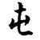
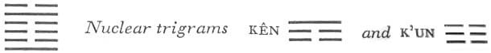

# Commentary: 3. Chun / Difficulty at the Beginning

In Chun the nine at the beginning and the nine in the fifth place are the rulers. These two are the only yang lines in the hexagram. The nine at the beginning is below and means the helper who can quiet the people. The nine in the fifth place is above; it can appoint the helper for the task of quieting the people.

The Sequence of the Hexagrams<a id="ref-1" href="#/com-03-chun-difficulty-at-the-beginning?id=fn-1">1</a>

After heaven and earth have come into existence, individual beings develop. It is these individual beings that fill the space between heaven and earth. Hence there follows the hexagram of DIFFICULTY AT THE BEGINNING. Difficulty at the beginning is the same as filling up.

Chun does not really mean filling up. What is meant is the difficulty that arises when heaven and earth, the light and the shadowy principle, have united for the first time, and all beings are begotten and brought to birth. This produces a chaos that fills up everything, hence the idea of filling up is associated with the hexagram Chun.

Miscellaneous Notes

Chun is visible but has not yet lost its dwelling.
The grass has already pushed its tips out of the earth, that is, it is visible but still within the earth, its original dwelling place. The upper nuclear trigram, mountain, indicates visibility; the lower, earth, means dwelling.

### THE JUDGMENT

> Difficulty at the Beginning works supreme success,
>
> Furthering through perseverance.
>
> Nothing should be undertaken.
>
> It furthers one to appoint helpers.

Commentary on the Decision

DIFFICULTY AT THE BEGINNING: the firm and the yielding unite for the first time, and the birth is difficult.

The lower primary trigram is Chên, the eldest son, who comes into being when the light power and the dark power first draw together. This indicates the first union. K’an, the upper primary trigram, means difficulty, danger. This indicates the difficulty of the birth.

Movement in the midst of danger brings great success and perseverance.

The lower trigram, Chên, is movement; the upper, K’an, is danger. Hence we have movement in the midst of danger. By movement one gets out of the danger. This explains the words of the text: “Supreme success, furthering through perseverance.”

The movement of thunder and rain fills the atmosphere. If chaos and darkness prevail while heaven is creating, it is fitting to appoint helpers, without being oneself thereby lulled to rest.

This too describes the filling up of the atmosphere with the difficulties that prevail up to the point when a thunderstormbreaks. The final effect, however, is presaged in the fact that the two images are not instanced in the sequence predicated by the structure of the hexagram of K’an (clouds) above and Chên (thunder) below; instead, thunder is mentioned first and then the clouds, dissolved, are spoken of as rain.

Just as in a storm, thunder and darkening clouds precede release, so in the affairs of men a chaotic time precedes a period of order. At such a time a ruler entrusted with bringing order out of chaos needs efficient people. At first, however, the situation remains serious and difficult, and he must not try to rely wholly on others. This saying is suggested by the two rulers of the hexagram. The nine at the beginning indicates the efficient helper who should be appointed in such dangerous times; the nine in the fifth place means that there are still difficulties that preclude yielding to inaction. Because of the precarious conditions, the nine in the fifth place must still await the proper solution and may not yet rest.

### THE IMAGE

> Clouds and thunder:
>
> The image of Difficulty at the Beginning.
>
> Thus the superior man
>
> Brings order out of confusion.

While in the Commentary on the Decision the sequence is that of thunder and rain, to indicate the end condition brought about by the movement, here clouds and thunder are named in the sequence they follow in the structure of the hexagram. This specifies the condition before the rain, which symbolizes danger (K’an). To overcome it, we must separate and combine, as happens when a thunderstorm breaks—first clouds above and thunder below, then thunder above and rain below.

### THE LINES

Nine at the beginning:

*a*) Hesitation and hindrance.

It furthers one to remain persevering.

It furthers one to appoint helpers.

*b*) Although hesitation and hindrance still prevail, the aim of the work is nonetheless to carry out what is right. When an eminent man subordinates himself to his inferiors, he wins the hearts of all people.
This line is a ruler of the hexagram. It stands at the beginning, which indicates that the difficulties at the beginning remain unsolved. Here nothing can be accomplished suddenly; the confusion must be resolved gradually. The character and position of the line show the right way to this goal. It is by nature a light, firm line, hence eminent, and as such places itself below the weak yin lines, which cannot help themselves. To rule by serving is the secret of success. Thus this line is the efficient helper needed to overcome obstacles in times of difficulty at the beginning.

Six in the second place:

*a*) Difficulties pile up.

Horse and wagon part.

He is not a robber;

He wants to woo when the time comes.

The maiden is chaste,

She does not pledge herself.

Ten years—then she pledges herself.

*b*) The difficulty of the six in the second place is that it rests upon a rigid line. Pledging herself after ten years means return to the general rule.
This line stands in the midst of the difficulties at the beginning. Its normal connection is with the nine in the fifth place, with which it has a relationship of correspondence. But this relationship is disturbed by the influence of the nine at the beginning, which stands below and through its importunities (it is moreover one of the rulers of the hexagram) causes doubt and uncertainty. But since the six in the second place is central and correct, these temptations are overcome, and when the time of difficulty is at an end (“ten years” indicates a completecycle) the general rule obtains again, and the connection with the nine in the fifth place is established.

Six in the third place:

*a*) Whoever hunts deer without the forester

Only loses his way in the forest.

The superior man understands the signs of the time

And prefers to desist.

To go on brings humiliation.

*b*) “He hunts deer without the forester,” that is, he desires the game.

“The superior man understands the signs of the time and prefers to desist. To go on brings humiliation.”

It leads to failure.
The line is weak in character but occupies a strong place, being moreover at the top of the trigram of movement. Out of this arises the danger that its movement will be uncontrolled and disturbed by desire. Such movement must lead to failure.

In terms of the nuclear trigrams, the line belongs in one aspect to the lower nuclear trigram K’un, and in this position it has abandoned the ruler and leader and retains only movement. Here the saying in the hexagram K’un applies: “If one tries to lead, one goes astray.” The forest is suggested by the upper nuclear trigram Kên, mountain, whose realm is entered here. Since the six in the third place does not have a corresponding line above, in the sixth place, it fails and does not find the game it is seeking.

Six in the fourth place:

*a*) Horse and wagon part.

Strive for union.

To go brings good fortune.

Everything acts to further.

*b*) To go only when bidden—this is clarity.

This line is in the relationship of correspondence to the nine at the beginning, and from this arises the idea of waitinguntil courted. The courting is expressed in the fact that the nine at the beginning subordinates itself to the six in the fourth place. This nine at the beginning is the active ruler of the hexagram; in contradistinction to this, the six in the fourth place stands for an able man wise enough not to offer his services and to wait until bidden.

Nine in the fifth place:

*a*) Difficulties in blessing.

A little perseverance brings good fortune.

Great perseverance brings misfortune.

*b*) “Difficulties in blessing,” because the benefaction is not yet recognized.
This line is one of the rulers of the hexagram, and being central and correct, it is capable of having a beneficial influence. However, this influence is impaired in several ways. First, the line stands in the middle of the trigram K’an, gorge, and as the image implies, is shut off at both sides by steep walls. Hence, as in the case of a river between steep banks, its influence cannot benefit the surroundings. Furthermore, the six in the second place, although in the relationship of correspondence to it is too weak, while the nine at the beginning, the other ruler of the hexagram, is not in direct relationship to it. Therefore, from the individual standpoint of the nine in the fifth place, the ruler below is to be regarded rather as a rival. Finally, the line is at the top of the upper nuclear trigram Kên, whose attribute is keeping still, and which thus also obstructs its influence.

Six at the top:

*a*) Horse and wagon part.

Bloody tears flow.

*b*) “Bloody tears flow.” How could one tarry long in this!
Like the second and fourth lines, this line is symbolized by a wagon that stops and is unhitched. But while the second line is related to both the first and the fifth line, and hence needs only to avoid a false tie, and the six in the fourth placecorresponds with the nine at the beginning and finds in it a suitable tie, the six at the top is entirely isolated, because there is no corresponding line in the third place. At the top of the trigram K’an, whose symbol is a defective wagon, it the line as the traveler is forced to unhitch. But no one comes to the rescue, and therefore the other symbols of the trigram K’an—water (tears) and blood—manifest themselves. However, the state of despair is not a lasting one. Indeed, since this top line is a six, it changes into its opposite, and out of the trigram for danger and gorge there develops the trigram Sun, which means wind, and which therefore overcomes the standstill. In this situation, therefore, one must quickly introduce a change.

---

**Notes:**

<a id="fn-1" href="#/com-03-chun-difficulty-at-the-beginning?id=ref-1">**1.**</a> *Hsü Kua:* Ninth Wing. There is no text of this wing for the first two hexagrams.
