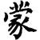
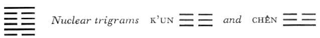

# Commentary: 4. Mêng / Youthful Folly

The nine in the second place and the six in the fifth are the rulers. The nine in the second place has a firm and central character, and the six in the fifth corresponds with it. The nine in the second place is in a low position; it is the teacher, capable of teaching others. The six in the fifth place is in a high position; it is able to honor the teacher and thus to teach men through him.

The Sequence

When, after difficulties at the beginning, things have just been born, they are always wrapped at birth in obtuseness. Hence there follows the hexagram of YOUTHFUL FOLLY. For youthful folly means youthful obtuseness. This is the state of things in their youth.

Miscellaneous Notes

YOUTHFUL FOLLY means confusion and subsequent enlightenment.
In early life the various qualities and aptitudes are as yet undifferentiated and undeveloped. Through education everything is differentiated, and clarity takes the place of obtuseness. Obtuseness is symbolized by the inner trigram, abyss, and clarity by the outer trigram, mountain.

### THE JUDGMENT

> YOUTHFUL FOLLY has success.
>
> It is not I who seek the young fool;
>
> The young fool seeks me.
>
> At the first oracle I inform him.
>
> If he asks two or three times, it is importunity.
>
> If he importunes, I give him no information.
>
> Perseverance furthers.

Commentary on the Decision

YOUTHFUL FOLLY shows danger at the foot of a mountain. Danger and standstill: this is folly.

The image of the hexagram, a mountain with a watery abyss in front of it, as well as the attributes of the two primary trigrams, indicating a danger before which one pauses, suggests the idea of folly.

“FOLLY has success.” One who succeeds hits upon the right time for his undertaking.

“It is not I who seek the young fool; the young fool seeks me.” The two positions correspond.

“At the first oracle I answer,” because the position is firm and central.

“If someone asks two or three times, it is importunity. If he importunes, I give no answer.” To importune is folly.

To strengthen what is right in a fool is a holy task.

The ruler of the hexagram is the strong second line. It is in the middle of the lower trigram, therefore in a central position. Since the line is strong and central, it meets with success by acting at the right time. It represents a sage in a lowly position, qualified to counsel wisely a youthful and inexperienced ruler. The youthful ruler is represented by the weak fifth line, which stands in the relationship of correspondence to the strong second line. The fifth line, which is weak in a superior place, and the second line, which is strong in an inferior place, together express the fact that the strong teacher does not seek out the young fool; rather, the latter approaches the teacher as one asking a favor. This is the correct relationship in education.

Because the second line is strong and central, it can answer the questions of the fifth, keeping within definite bounds of moderation. But if these bounds are overstepped with importunate questions, the teacher in turn becomes disagreeable toward the pupil by refusing to answer.

The saying in the text, “Perseverance furthers,” is amplified by the final comment, “To strengthen what is right in a fool is a holy task.”

In addition to the second line, the strong line at the top is also occupied with driving out youthful folly, while the remaining four lines represent youthful fools of various kinds. The second line, which is in a central position, represents gentleness, while the strong top line stands for severity.

### THE IMAGE

> A spring wells up at the foot of the mountain:
>
> The image Of YOUTH.
>
> Thus the superior man fosters his character
>
> By thoroughness in all that he does.

The spring at the foot of the mountain is still small and in its youth. The superior man derives his course of action from the images of the two trigrams. In his nature he is thoroughgoing, and clear as a mountain spring. Hence he achieves a calmness in the face of danger that emulates the great calmness of a mountain on the edge of an abyss.

### THE LINES

Six at the beginning:

*a*) To make a fool develop

It furthers one to apply discipline.

The fetters should be removed.

To go on in this way brings humiliation.

*b*) “It furthers one to apply discipline”—that is, in order to give emphasis to the law.
The yielding line in the lower position is a youthful fool who as yet is following no settled course. He must be subjected to discipline by the strong line standing above him in the second place, in order that firm principles and good habits may be formed in him.

Nine in the second place:

*a*) To bear with fools in kindliness brings good fortune.

To know how to take women

Brings good fortune.

The son is capable of taking charge of the household.

*b*) “The son is capable of taking charge of the household,” for firm and yielding are in union.
The yielding fifth line stands in a complementary relationship to the firm second line. Therefore the compliant master of the household permits the firm son to take over. The same holds true in public life as regards the relationship between prince and official. This line is the ruler of the hexagram.

Six in the third place:

*a*) Take not a maiden who, when she sees a man of bronze,

Loses possession of herself.

Nothing furthers.

*b*) One should not take the maiden because her conduct is not in accord with order.
The line is yielding in a strong place; besides, it is in the place of transition from the lower to the upper trigram. Hence it is not able to withstand the temptation to throw itself away, and thus it leaves the right path. An intimate union is therefore not favorable. The emendation of the text proposed by Chu Hsi, who wished to read “in accord with order” as “cautious,” is superfluous.

Six in the fourth place:

*a*) Entangled youthful folly brings humiliation.

*b*) The humiliation of entangled youthful folly comes from the fact that it of all things is furthest from what is real.
A yielding line in a weak place, unrelated to a firm line and surrounded by other weak lines, is through these circumstances completely excluded from any relationship with a real, i.e., firm line, and therefore remains incurably entangled in its youthful folly.

Six in the fifth place:

*a*) Childlike folly brings good fortune.

*b*) The good fortune of the childlike fool comes from his being devoted and gentle.
The fifth place is that of the ruler, but since the line is yielding and in relationship with the firm line in the second place, we have the idea of devotion, that is, courtesy of speech, and of gentleness, readiness to listen. The line stands at the top of the upper nuclear trigram K’un, which is by nature devoted.

Nine at the top:

*a*) In punishing folly

It does not further one

To commit transgressions.

The only thing that furthers

Is to prevent transgressions.

*b*) “It furthers to prevent transgressions,” for then those above and those below conform to order.
This strong line is in relationship with the weak third line, which has deviated from order and pushed ahead regardless of circumstances. It is vigorously sent back where it belongs by the top line, so that it conforms to order. But since the top line acts only defensively and does not exceed its limits, it does not itself deviate from order.
