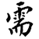
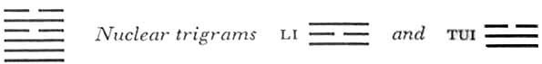

# Commentary: 5. Hsü / Waiting (Nourishment)

The ruler of the hexagram is the nine in the fifth place. All transactions require patient waiting, and it is particularly essential for a ruler that his plans should be brought to fruition through continuous influence. The remark in the Commentary on the Decision—”Occupies the place of heaven and is central and correct in its behavior”—refers to the nine in the fifth place.

The Sequence

When things are still small, one must not leave them without nourishment. Hence there follows the hexagramHsü. Hsü means the way to eating and drinking.

The connection between the two meanings of the hexagram—nourishment and waiting—lies in the fact that we must wait to be nourished. Nourishment depends on heaven and the rain. It does not lie within the power of man.

Miscellaneous Notes

WAITING means not advancing.

### THE JUDGMENT

> WAITING. If you are sincere,
>
> You have light and success.
>
> Perseverance brings good fortune.
>
> It furthers one to cross the great water.

Commentary on the Decision

WAITING means holding back. Danger lies ahead. Being firm and strong, one does not fall into it. The meaning is that one does not become perplexed or bewildered.

The lower trigram is Ch’ien, whose attribute is strength. The upper trigram is K’an, the abyss, danger; but since we feel secure in our own strength and do not act overhastily, we avoid perplexity.

“If you are sincere, you have light and success. Perseverance brings good fortune.” For the ruling line occupies the place of heaven and is central and correct in its behavior.

“It furthers one to cross the great water.” Through progress the work is accomplished.

The fifth line, the ruler of the hexagram, has the sincerity of water, of which it is the symbol (K’an is a watercourse between high banks). This line corresponds in its special quality with the meaning of the trigram Ch’ien, the Creative, heaven. Inthat it is a firm line in an uneven (i.e., yang) place, its place and character correspond, hence it is correct. Moreover, it is in the middle of the upper primary trigram and therefore central. All of these are relationships of the ruler of the hexagram that point to success. Waiting does not mean giving up an undertaking, however. To defer is not to abandon. Therefore the work is accomplished.

### THE IMAGE

> Clouds rise up to heaven:
>
> The image of WAITING.
>
> Thus the superior man eats and drinks,
>
> Is joyous and of good cheer.

In the heavens, water takes the form of clouds. Once the clouds rise, it will not be long before rain falls. While frequently the second portion of the Image separates the attributes of the two trigrams, in order to show how a given situation can be overcome, we have in this instance an explanation of how to accept and adapt to the situation. Even as rain rises to the heavens, it is preparing to fall—whereby all life is nourished and refreshed. The superior man acts in accordance with this, and so masters the second meaning of the hexagram, for Hsü signifies nourishment as well as waiting. Further, the two nuclear trigrams—Li, clarity, and Tui, pleasure, joyousness—also play a part.

### THE LINES

Nine at the beginning:

*a*) Waiting in the meadow.

It furthers one to abide in what endures.

No blame.

*b*) “Waiting in the meadow.” One does not seek out difficulties overhastily.

“It furthers one to abide in what endures. No blame.” One has not abandoned the general ground.
Because the lowest line is firm, it does not unduly press any matter in the face of a danger that is still remote (hence theimage of the meadow), but is able to remain calm and collected as if nothing extraordinary lay ahead.

Nine in the second place:

*a*) Waiting on the sand.

There is some gossip.

The end brings good fortune.

*b*) “Waiting on the sand.” One is calm, for the line is central. Although this leads to some gossip, the end brings good fortune.
This line is even nearer to the danger symbolized in the upper trigram than the first line, therefore the waiting on the sand. But it is well balanced; the capability of its nature is mitigated by the yielding character of the place, which moreover is central. Therefore it remains calm despite minor discords (it is not in the relation of correspondence to the ruler of the hexagram, but rather, since the two lines are of the same category, in the relation of mutual repulsion), hence all goes well. Gossip is indicated by the nuclear trigram Tui.

Nine in the third place:

*a*) Waiting in the mud

Brings about the arrival of the enemy.

*b*) “Waiting in the mud.” The misfortune is outside.<a id="ref-1" href="#/com-05-hs-waiting-nourishment?id=fn-1">1</a>

“Brings about the arrival of the enemy.” Seriousness and caution prevent defeat.
The strong line in the strong place is too energetic. It faces danger and plunges into it, thus inviting enemies. Only through caution is this harm to be avoided.

Six in the fourth place:

*a*) Waiting in blood.

Get out of the pit.

*b*) “Waiting in blood.” He is yielding and obeys.
This is a weak line in a weak place; consequently, although in the midst of danger and hemmed in between two strong lines (K’an means pit and blood), it does not make things worse by pressing forward. Instead, it submits, and the storm passes over.

Nine in the fifth place:

*a*) Waiting at meat and drink.

Perseverance brings good fortune.

*b*) “Meat and drink. Perseverance brings good fortune,” because of the central and correct character.
This line is the ruler of the hexagram. As such, it occupies the center of the upper primary trigram. It has a strong place corresponding with its strong character, hence it is correct. Moreover, it is at the top of the upper nuclear trigram Li, light, which gives it enlightenment. Altogether, this gives prospect of favorable conditions.

Six at the top:

*a*) One falls into the pit.

Three uninvited guests arrive.

Honor them, and in the end there will be good fortune.

*b*) “Uninvited guests arrive. If they are honored, in the end there will be good fortune.” Although the line is not in its proper place, at least no great mistake is made.
A yielding line at the high point of danger, at the very top of the hexagram, is not really in its proper place (K’an connotes a pit). Although to all appearances a weak line in a weak place is where it should be, a certain impropriety arises from the fact that it stands at the top, while the line corresponding with it, the strong third line, is below. The arrival of three uninvited guests is suggested by this third line and the two lower ones of the trigram Ch’ien, which hold together with it. Since by virtue of their strong natures they are not jealous, everythinggoes well, if the yin line follows its yielding nature and meets them deferentially.

NOTE. The situation revealed in WAITING is one in which a strong, firm nature is faced with danger. What is required of the individual here is restraint. He must await the proper time; he must be yielding and remain calm. If he does not weigh the time conditions sufficiently and presses forward, ruthless, angry, and restless, he will certainly meet defeat. The nine at the beginning is still far from danger; hence if one holds to lasting things, one can avoid mistakes. The nine in the second place is approaching closer to danger, but it too can ultimately attain good fortune by yielding and by keeping to the middle way. The nine in the third place is actually under threat of danger, therefore it is said; “Seriousness and caution prevent defeat.” The six in the fourth place has been overtaken by danger, but because it is yielding and peaceful, it gets out of the pit again. The six at the top is at the peak point of danger, but through deference it too finally attains good fortune. Thus during a time of waiting, self-control and deference are the means of avoiding harm. The significance of the time of danger is great.

---

**Notes:**

<a id="fn-1" href="#/com-05-hs-waiting-nourishment?id=ref-1">**1.**</a> Symbolized by the outer trigram.
