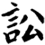
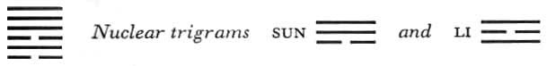

# Commentary: 6. Sung / Conflict

The ruler of the hexagram is the nine in the fifth place. All the other lines represent persons quarreling, and the nine in the fifth place stands for the person who overhears the quarrel. This is what is referred to by the following sentence from theCommentary on the Decision: “’It furthers one to see the great man’: thus his central and correct position is honored.”

The Sequence

Over meat and drink, there is certain to be conflict.

Hence there follows the hexagram of CONFLICT.

Miscellaneous Notes

CONFLICT means not to love.

### THE JUDGMENT

> CONFLICT. You are sincere
>
> And are being obstructed.
>
> A cautious halt halfway brings good fortune.
>
> Going through to the end brings misfortune.
>
> It furthers one to see the great man.
>
> It does not further one to cross the great water.

Commentary on the Decision

CONFLICT: strength is above, danger below. Danger and strength produce conflict.

“The contender is sincere and is being obstructed.”

The firm comes and attains the middle.

“Going through to the end brings misfortune. A conflict must not be allowed to become permanent.”

“It furthers one to see the great man”: thus his central and correct position is honored.

“It does not further one to cross the great water,” for this would lead one into the abyss.

The name of the hexagram of CONFLICT is derived from the attributes of the two trigrams Ch’ien, strength, and K’an, danger. When strength is above and cunning below, conflict is sure to arise. Similarly, a person who is inwardly cunning and outwardly strong inclines to conflict with others.

The contender, the second line, is sincere and feels himselfobstructed. He is in the inner trigram, and therefore it is said, “He comes.” Because the line is strong and occupies the center, it suggests sincerity, for it makes the middle “sound.” It is obstructed because it is inclosed between the two yin lines. The great man is the central and correct line in the fifth place. The judge who must render the decision abides outside the dangerous situation. He can render a just decision only by remaining impartial. The abyss into which one would fall by crossing the great water is indicated by the trigram K’an, danger. Crossing of the great water is suggested by the fact that the nuclear trigram Sun, wood, is over the lower primary trigram K’an, water.

Structurally, this hexagram is the inverse of the preceding one: hence we have conflict here, forbearance there. Although the time meaning of the hexagram is that of conflict, it nevertheless teaches at every turn that conflict should be avoided.

### THE IMAGE

> Heaven and water go their opposite ways:
>
> The image of CONFLICT.
>
> Thus in all his transactions the superior man
>
> Carefully considers the beginning.

The movement of the upper trigram, heaven, goes upward, that of the lower, water, goes downward; thus the two draw farther and farther apart, and create conflict. To avoid conflict, all transactions (nuclear trigram Sun, work, undertaking) must be well considered at the beginning (K’an means being concerned, and the nuclear trigram Li means clarity; Ch’ien is the beginning of all things).

### THE LINES

Six at the beginning:

*a*) If one does not perpetuate the affair,

There is a little gossip.

In the end, good fortune comes.

*b*) Not perpetuating the affair: one must not prolong the conflict.

Although “there is a little gossip,” the matter is finally decided clearly.
The six is weak and at the very bottom. Therefore, although there is a brief altercation with the neighboring nine, which comes from without, the conflict cannot continue—the place and the character of the line are too weak. Since the nuclear trigram Li, standing above it, has clarity as its attribute, everything is finally decided justly—a fortunate thing in a conflict. As the six changes, there arises the trigram Tui, speech.

Nine in the second place:

*a*) One cannot engage in conflict;

One returns home, gives way.

The people of his town,

Three hundred households,

Remain free of guilt.

*b*) “One cannot engage in conflict: one returns home, gives way.” Thus one escapes. To contend from a lowly place with someone above brings self-incurred suffering.
One cannot engage in conflict, although in this hard line in the middle of the trigram K’an, the Abysmal, intention to contend with the nine in the fifth place is inherently present. This second line, being a nine, moves; that is, it changes into a yin line. Thereby it conceals itself, and with the two other yin lines it forms the town of three hundred families, who remain free of all entanglement.

Six in the third place:

*a*) To nourish oneself on ancient virtue induces perseverance.

Danger. In the end, good fortune comes.

If by chance you are in the service of a king,

Seek not works.

*b*) “To nourish oneself on ancient virtue.” To obey the one above brings good fortune.
Because the line is weak in a strong place, it is not correct. Above and below are strong lines hemming it in. Moreover, being in a place of transition, it is inwardly restless. All these circumstances constitute elements of danger. Still, everything goes well, provided the line rests content with what it has honorably acquired from its ancestors. It corresponds with the third line of the “mother” hexagram, K’un; hence the oracle for this line in K’un is repeated here in part.

Nine in the fourth place:

*a*) One cannot engage in conflict.

One turns back and submits to fate,

Changes one’s attitude,

And finds peace in perseverance.

Good fortune.

*b*) “One turns back and submits to fate, changes one’s attitude, and finds peace in perseverance.” Thus nothing is lost.
This line is neither central nor correct, and therefore originally intended to quarrel. But it cannot do so. Over it is the strong judge in the fifth place, with whom one may not quarrel. Below it is the weak line in the third place, and standing in the relationship of correspondence to it is the weak line at the beginning, neither of which gives cause for quarrel. Its position in a yielding place gives this line the possibility of being converted and of turning away from conflict.

Nine in the fifth place:

*a*) To contend before him

Brings supreme good fortune.

*b*) “To contend before him brings supreme good fortune,” because he is central and correct.
This line is the ruler of the hexagram; it occupies the place of honor, is central, correct, and strong. All this fits it for the task of settling the quarrel, so that great good fortune comes about through it.

Nine at the top:

*a*) Even if by chance a leather belt is bestowed on one,

By the end of a morning

It will have been snatched away three times.

*b*) To attain distinction through conflict is, after all, nothing to command respect.
A strong line at the high point of CONFLICT seeks to win distinction through conflict. But this does not last.

NOTE. The nine in the fifth place is the judge, the other lines the contenders, but only the strong lines really contend. The weak lines in the first and the third place hold back. The strong lines in the second and the fourth place are inclined by nature to contend, but cannot quarrel with the judge in the fifth place, and the weak lines below them offer no resistance. Therefore they too withdraw from the conflict in good time. Only the strong top line carries the conflict through to the end and, being in the relationship of correspondence to the weak line in the third place, it triumphs and receives a distinction. Yet the line is analogous to the top line—the “arrogant dragon”—of the hexagram Ch’ien. It will have cause to rue the matter. What is won by force is wrested away by force.
