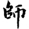
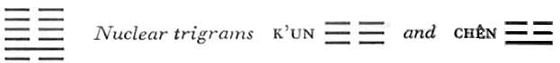

# Commentary: 7. Shih / The Army

The rulers of the hexagram are the nine in the second place and the six in the fifth. The former, positioned below, is the strong man, while the latter, being above, has capacity to employ the strong man.

The Sequence

When there is conflict, the masses are sure to rise up. Hence there follows the hexagram of THE ARMY. Army means mass.

Miscellaneous Notes

THE ARMY means mourning.

### THE JUDGMENT

> THE ARMY. The army needs perseverance
>
> And a strong man.
>
> Good fortune without blame.

Commentary on the Decision

THE ARMY means the masses. Perseverance means discipline.

The man who can effect discipline through the masses may attain mastery of the world.

The strong one is central and finds response.

One does a dangerous thing but finds devotion.

The man who thus leads<a id="ref-1" href="#/com-07-shih-the-army?id=fn-1">1</a> the world is followed by the people.

Good fortune. How could this be a mistake?

This hexagram consists of a mass of yielding lines in the midst of which, in a central although subordinate place, is a single strong line. As a general, not as a ruler, it holds the others under control. From this arises the idea of the mass (the many yielding lines) and of the army—a disciplined multitude. The firm line in the second place finds support, because of correspondence, in the yielding line in the fifth place, the place of the ruler. The danger of the action is indicated by the lower trigram, K’an, and devotion by the upper, K’un.

### THE IMAGE

> In the middle of the earth is water:
>
> The image of THE ARMY.
>
> Thus the superior man increases his masses
>
> By generosity toward the people.

Owing to the compulsory military service customary in antiquity, the supply of soldiers available from the populace was as plentiful as water underground. Hence fostering the people ensured an efficient army.

Great expanse is the attribute of the earth, which also represents the masses. Water stands for serviceability; everything flows toward water.

### THE LINES

Six at the beginning:

*a*) An army must set forth in proper order.

If the order is not good, misfortune threatens.

*b*) “An army must set forth in proper order.”<a id="ref-2" href="#/com-07-shih-the-army?id=fn-2">2</a> Losing order is unfortunate.
This line is at the very bottom and therefore indicates the beginning, the marching forth of the army. The water trigram indicates order and the correct use of the army. If the line changes, the lower trigram becomes Tui, joyousness, whereby of course order is upset, for joyousness is not the proper frame of mind for the onset of war.

Nine in the second place:

*a*) In the midst of the army.

Good fortune. No blame.

The king bestows a triple decoration.

*b*) “In the midst of the army. Good fortune.” He receives grace from heaven.

“The king bestows a triple decoration.” He has the welfare of all countries at heart.
The second place is that of the official, in this case a general, as this is the hexagram of THE ARMY. The grace of heaven derives from the six in the fifth place, which, occupying a place in the sphere of heaven, stands in the relationship of correspondence to this line. The triple decoration derives from the three lines all of like kind composing the upper trigram K’un.

Six in the third place:

*a*) Perchance the army carries corpses in the wagon.

Misfortune.

*b*) “Perchance the army carries corpses in the wagon.”

This is quite without merit.
The upper trigram is K’un, whose image is the wagon. This line is weak; it stands at the peak of danger, and in the middle of the nuclear trigram Chên, agitation. All of these are circumstances suggesting a severe defeat.

Six in the fourth place:

*a*) The army retreats. No blame.

*b*) “The army retreats. No blame,” for it does not deviate from the usual way.
Literally the text reads: “The army turns to the left.” In war, “to the right” is the equivalent of “in the van,” and “to the left” is the equivalent of “in the rear.” The line is extremely weak, because it is weak by nature and also in a weak place. Yet it is in the place appropriate to it; hence retreat, for which it is not to be censured.

Six in the fifth place:

*a*) There is game in the field.

It furthers one to catch it.

Without blame.

Let the eldest lead the army.

The younger transports corpses;

Then perseverance brings misfortune.

*b*) “Let the eldest lead the army,” because he is central and correct.

“The younger transports corpses.” Thus the right man is not put in charge.
The trigram K’an means pig; the “field” is the earth (K’un). To the inside of the trigram K’un (field) is K’an (pig, i.e., game). Therefore it furthers one to catch it. The literal rendering would be: “To explain his mistakes.” This interpretation, however, is not as satisfactory.<a id="ref-3" href="#/com-07-shih-the-army?id=fn-3">3</a> The “eldest” is the strong nine in the second place, and it is this line that ought to lead the army. If some other without experience leads it (the reference is to the six in the third place), the result will be that corpses must be transported—that is to say, there will be a defeat.

Six at the top:

*a*) The great prince issues commands,

Founds states, vests families with fiefs.

Inferior people should not be employed.

*b*) “The great prince issues commands,” in order to reward merit properly.

“Inferior people should not be employed,” because they are certain to cause confusion in the country.
The top place shows the victorious end of war. The great prince is the six in the fifth place. Here, as occasionally elsewhere in the case of a six at the top, an additional statement concerningthe line in the fifth place is given—from the outward, objective standpoint. The merit rewarded is that of the nine in the second place; the inferior people are represented by the six in the third place.

---

**Notes:**

<a id="fn-1" href="#/com-07-shih-the-army?id=ref-1">**1.**</a> In the text, the character for “leads” is written *tu*; which means “to poison,” but should be read *tan*, “to lead.”

<a id="fn-2" href="#/com-07-shih-the-army?id=ref-2">**2.**</a> The word *lü*, “order,” in its original sense means a reedlike musical instrument. The literal meaning would be: “The army marches forth to the sound of horns. If the horns are not in tune, it is a bad sign.”

<a id="fn-3" href="#/com-07-shih-the-army?id=ref-3">**3.**</a> The sentence *li chih yen* is best translated by taking the word *yen* (meaning “to speak,” “to explain”) simply as the equivalent of an exclamation point, which it frequently is in the Book of Odes. This yields the translation, “It furthers one to hold fast, to catch” (the game).
