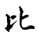
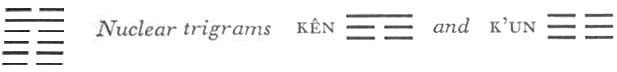

# Commentary: 8. Pi / Holding Together [Union]

[8. Pi / Holding Together Union](#pup-iching003.html_pup-iching003htmlpt05toc)

The ruler is the nine in the fifth place, for the hexagram is so organized that it contains only one yang line, which occupies the place of honor and holds together with all the yin lines above and below it.

The Sequence

Among the masses there is surely a reason for uniting. Hence there follows the hexagram of HOLDING TOGETHER. Holding together means uniting.

Miscellaneous Notes

HOLDING TOGETHER is something joyous.

### THE JUDGMENT

> HOLDING TOGETHER brings good fortune.
>
> Inquire of the oracle once again
>
> Whether you possess sublimity, constancy, and perseverance;
>
> Then there is no blame.
>
> Those who are uncertain gradually join.
>
> Whoever comes too late
>
> Meets with misfortune.

Commentary on the Decision

“HOLDING TOGETHER brings good fortune.” Holding together means mutual help. Those below are devoted and obedient.

This hexagram is the inverse of the preceding one. In the latter the general, the nine in the second place, is the center, while here the center is the nine in the fifth place, the strong, central, and correct prince. All the other lines are yielding, hence the relationship of mutual supplementation and assistance. The yielding lines are the subordinates who obey. Thus the name of the hexagram is explained through its structure.

“Inquire of the oracle once again whether you possess sublimity, constancy, and perseverance. Then there is no blame,” because of the firmness and central position.

“Those who are uncertain gradually join.” Above and below are in correspondence.

“Whoever comes too late meets with misfortune.”

His way is at an end.

The line to which everything relates is the prince in the fifth place. All the yielding lines below correspond with it. These five lines mutually hold together; thereby they attain power, and it is a joyous matter. The only one that stays apart and does not enter into the general union is the six at the top; it insists on going its own way, which leads to nothing.

The hexagram Pi, HOLDING TOGETHER, like the hexagram Ts’ui, GATHERING TOGETHER (45), has the trigram K’un below, but instead of Tui, the lake, here there is K’an, water, above. There is very little difference in meaning between the two hexagrams. “Sublimity, constancy, and perseverance” apply here to the whole hexagram, while in Ts’ui they apply only to the nine in the fifth place.

In the hexagram Mêng, YOUTHFUL FOLLY, there is a reference to “the first oracle,” and the commentary relates it to the firm central line. There K’an, meaning wisdom, darkness,oracle, is below, and the firm line appears in the first trigram. Here it is said: “Inquire of the oracle once again.” The explanation in the commentary points likewise to the firm central line. But here K’an is above, hence the firm line appears in the second, that is, the upper trigram.

### THE IMAGE

> On the earth is water:
>
> The image of HOLDING TOGETHER.
>
> Thus the kings of antiquity
>
> Bestowed the different states as fiefs
>
> And cultivated friendly relations
>
> With the feudal lords.

The water on the earth holds together with it. From this fact a double lesson is deduced. As water penetrates and gives moisture to the earth, so should fiefs be distributed from above; and as waters flow together on the earth, so should the organization of society show union.

### THE LINES

Six at the beginning:

*a*) Hold to him in truth and loyalty;

This is without blame.

Truth, like a full earthen bowl:

Thus in the end

Good fortune comes from without.

*b*) The six at the beginning of HOLDING TOGETHER encounters good fortune from another quarter.
This line stands at the bottom; it is weak and in no direct relation to the ruler of the hexagram. But since the attitude in the holding together is sincere—the line is at the bottom of the trigram K’un, whose attribute is devotion—it will attain what it strives for, and this unexpectedly from the outside. The earth has for its symbol the kettle, the utensil for receiving the blessing that comes from above.

Six in the second place:

*a*) Hold to him inwardly.

Perseverance brings good fortune.

*b*) “Hold to him inwardly.” Do not lose yourself.
This yielding line of the inner trigram, which stands in the relationship of correspondence to the ruler of the hexagram, suggests the idea of holding together inwardly. But just because this holding together bespeaks an inner affinity and hence is inevitable, it does not depend on unworthy external maneuvers.

Six in the third place:

*a*) You hold together with the wrong people.

*b*) “You hold together with the wrong people.” Is this not injurious?
The line is weak and in the place of transition, that is, restless, not central, and not correct. The lines below and above it, as well as the six at the top, with which there is a relation, are all dark lines. Here they denote evil people.

Six in the fourth place:

*a*) Hold to him outwardly also.

Perseverance brings good fortune.

*b*) Hold outwardly also to people of worth, in order thus to follow the one above.
The firm line in the fifth place is a worthy ruler, while the yielding line in the fourth place represents the minister. A minister may show outwardly his loyalty to his worthy ruler. This situation differs from that of the six in the second place, the official as yet without a post. Such a man must be reserved in order not to lose dignity, but the minister firmly established in an official relationship may safely show his attachment. Since the line is not attracted by the six at the beginning, it is free to follow the one above with undivided allegiance.

Nine in the fifth place:

*a*) Manifestation of holding together.

In the hunt the king uses beaters on three sides only

And foregoes game that runs off in front.

The citizens need no warning.

Good fortune.

*b*) The good fortune resulting from “manifestation of holding together” inheres in the fact that the position is correct and central.

Discarding those who resist, accepting the devoted: this is the meaning of “foregoes game that runs off in front.”

“The citizens need no warning,” for the one above makes them central.
This is the image of a ruler whose followers gather around him from natural instinct. He merely makes manifest what is inherent in each individual. The spontaneity of this holding together is presented in an image of the royal hunt and its customs. The quarry accepted are the lower lines, which voluntarily offer themselves. The quarry that resists and hence is not taken into consideration is the six at the top. Here again, as in the preceding hexagram, an image of the hunt is used, but in the latter the game is pursued, while here it is allowed to go free. There the lower nuclear trigram is Chên, whose movement goes upward; here the upper nuclear trigram is Kên, Keeping Still; therefore the movement, starting with the nine in the fifth place, is downward only, not upward.

Six at the top:

*a*) He finds no head for holding together.

Misfortune.

*b*) “He finds no head for holding together.” Therefore he also fails to find the right end.
This line takes its position above the ruling yang line. While the lower yielding lines find their head in this yang line, theyin line at the top has no head to follow and must therefore go astray, particularly because it stands at the top of the trigram K’an, danger.

The expression “no head” occurs also in the hexagram of THE CREATIVE. There it has a favorable meaning, because the hexagram has nothing but strong lines, and thus the expression signifies humility. Here it is unfavorable, because the line is yielding. A yielding element with “no head” bodes ill, because there is nothing to steady it.
