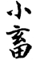
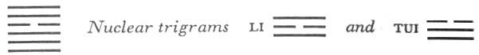

# Commentary: 9. Hsiao Ch'u / The Taming Power of the Small

The six in the fourth place is the constituting ruler of the hexagram, and the nine in the fifth place its governing ruler.<a id="ref-1" href="#/com-09-hsiao-ch-u-the-taming-power-of-the-small?id=fn-1">1</a> The six in the fourth place, as the only yin line, restrains the yang lines. The Commentary on the Decision refers to this as follows: “The yielding obtains the decisive place, and those above and those below correspond with it.” The nine in the fifth place accords in attitude with the six in the fourth place, thus to perfect the restraint; hence it is said in the Commentary on the Decision: “The strong is central and its will is done.”

The Sequence

Through holding together, restraint is certain to come about. Hence there follows THE TAMING POWER OF THE SMALL.

Miscellaneous Notes

THE TAMING POWER OF THE SMALL is slight.
This refers to the fact that “the small” here occupies the place of the official. Compare the hexagram Ta Yu, POSSESSION IN GREAT MEASURE (14), in which the small and yielding element is in the ruler’s place.

### THE JUDGMENT

> THE TAMING POWER OF THE SMALL
>
> Has success.
>
> Dense clouds, no rain from our western region.

Commentary on the Decision

THE TAMING POWER OF THE SMALL. The yielding obtains the decisive place, and those above and those below correspond with it: this is called THE TAMING POWER OF THE SMALL.

Strong and gentle: the strong is central and its will is done, therefore “success.”

“Dense clouds, no rain”: the movement goes still further.

“From our western region”: the influence has not yet set in.

The small, yielding line in the place of the minister holds the decisive place. The firm lines above and below all correspond with it. This structure explains the name of the hexagram. Success is due to the character of the two trigrams, inner strength coupled with outer gentleness. This is the way to achievement. Moreover, the ruler is central and his will is done. The upper trigram Sun, wind, has enough strength to condense the mists rising up from the lower trigram Ch’ien, and so to form clouds, but its strength does not suffice to cause rain. “Western region” is suggested by the original position of Sun, in the west (in the arrangement of the trigrams called the Sequence of Earlier Heaven<a id="ref-2" href="#/com-09-hsiao-ch-u-the-taming-power-of-the-small?id=fn-2">2</a>; in the Sequence of LaterHeaven, Tui, the lake, has the position in the west). When Tui stands over Ch’ien, we have the hexagram of BREAKTHROUGH (43); in the latter case the water vapor is already condensed and will descend easily. In the present hexagram Tui appears over Ch’ien only as a nuclear trigram, not yet separated from it. In China, the rain clouds always come from the east, from the direction of the sea, not from the west.

### THE IMAGE

> The wind drives across heaven:
>
> The image of THE TAMING POWER OF THE SMALL.
>
> Thus the superior man
>
> Refines the outward aspect of his nature.

The wind penetrates everywhere; this means refinement. The lower trigram is heaven; this means the essence of character. The upper nuclear trigram is Li, form. This refinement of outer form, as contrasted with the carrying out of fundamental principles, is “the small.”

### THE LINES

Nine at the beginning:

*a*) Return to the way.

How could there be blame in this?

Good fortune.

*b*) “Return to the way.” This is something that bodes well.
This strong yang line, belonging to the rising trigram Ch’ien, naturally tends upward, but it is held back by the yielding line in the fourth place. As it stands in the relationship of correspondence to the latter, it retreats again without offering opposition, so that all struggle is avoided. The good augury is based on this.

Nine in the second place:

*a*) He allows himself to be drawn into returning.

Good fortune.

*b*) Being drawn into returning derives from the central position. Also, he does not lose himself.
This line is higher than the first and likewise tends upward by nature. But because of its central and moderate position in the lower trigram Ch’ien, it attaches itself to the first line and retreats without a struggle. Thus it assumes an attitude that saves it from losing itself or throwing itself away, as would be the case if it offered itself despite its being checked by the fourth line.

Nine in the third place:

*a*) The spokes burst out of the wagon wheels.

Man and wife roll their eyes.

*b*) When “man and wife roll their eyes,” it is a sign that they cannot keep their house in order.
The idea of the spokes bursting out of the wagon wheels is suggested by the fact that Ch’ien, being round, symbolizes a wheel, and that Tui, the lower nuclear trigram, means breaking apart. Li, the upper nuclear trigram, means eyes, and Sun, the upper primary trigram, means much white in the eyes; hence the rolling of the eyes.

This line has the same upward tendency as the two preceding ones, but while the latter renounce conflict and retreat voluntarily, this line (too strong because it is strong in a strong place, unstable because it is in a place of transition) tries to push on by force. The yielding fourth line represents the wife, who allows the spokes of the wheels, belonging to the third line, her husband, to get broken. The man looks at her fiercely in his rage, and she returns the look. Inasmuch as the third line thus abandons its family (the two lower lines), it shows that it cannot maintain order.

Six in the fourth place:

*a*) If you are sincere, blood vanishes and fear gives way.

No blame.

*b*) “If you are sincere … fear gives way,” because the one at the top agrees in attitude.
This line, in the midst of the strong lines, is empty within, that is, sincere (cf. hexagram 61, INNER TRUTH). It is the middle line of the nuclear trigram Li, which is the opposite of K’an, blood and fear; hence the absence of blood and fear. The fourth place is that of the minister. It has the difficult task of controlling with weak powers the upward-striving lower lines. This is necessarily associated with danger and fear, but because the line is sincere (yielding in a yielding place, and empty within) the prince, the nine in the fifth place, stands by it and gives it the needed support.

Nine in the fifth place:

*a*) If you are sincere and loyally attached,

You are rich in your neighbor.

*b*) “If you are sincere and loyally attached,” you will not be alone in your riches.
The fifth line is in the place of honor, in the middle of the trigram Sun, riches. Sun also means a bond, and therefore the line is attached to the six in the fourth place, its neighbor. In that the two complement each other and share their wealth, they are rich indeed.

Nine at the top:

*a*) The rain comes, there is rest.

This is due to the lasting effect of character.

Perseverance brings the woman into danger.

The moon is nearly full.

If the superior man persists,

Misfortune comes.

*b*) “The rain comes, there is rest.” This is the continuously cumulative effect of character.

“If the superior man persists, misfortune comes,” for there might be doubts.
Because the line moves, being a nine, the trigram Sun, wind, becomes the trigram K’an, rain and moon. The line stands at the top of Sun—gentle and devoted—which has graduallyaccumulated within itself the powers of the Creative, so that the desired effect has been achieved. When this effect of the Gentle is attained, it must suffice. Should it insistently presume upon its success, danger might ensue. Persistence would lead to a doubtful situation, because restraint would then turn into suppression, and this the strong Ch’ien would certainly not tolerate.

---

**Notes:**

<a id="fn-1" href="#/com-09-hsiao-ch-u-the-taming-power-of-the-small?id=ref-1">**1.**</a> See here.

<a id="fn-2" href="#/com-09-hsiao-ch-u-the-taming-power-of-the-small?id=ref-2">**2.**</a> See here.
