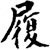
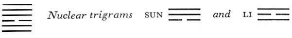

# Commentary: 10. Lü / Treading [Conduct]

[10. Lü / Treading Conduct](#pup-iching003.html_pup-iching003htmlpt05toc)

The constituting ruler of the hexagram is the six in the third place; the nine in the fifth place is the governing ruler. The six in the third place, as the only yielding line among the numerous firm ones, enters their midst with fear and trembling. Therefore the hexagram bears the name TREADING. Whoever holds an honored place must especially be constantly mindful of danger and fear. Because of this the judgment on the nine in the fifth place couples the idea of danger with perseverance. The Commentary on the Decision says of this line: “Strong, central, and correct, he treads into the place of the ruler and remains without blame.”

The Sequence

When beings are subjected to restraint the mores arise; hence there follows the hexagram of CONDUCT.

Miscellaneous Notes

That which treads does not stay.

Appended Judgments<a id="ref-1" href="#/com-10-l-treading-conduct?id=fn-1">1</a>

TREADING shows the basis of character. It is harmonious and attains its goal. It brings about harmonious conduct.

This hexagram is the inverse of the preceding one. The movement of the two primary trigrams is upward, hence the idea that the one strides behind the other. The youngest daughter walks behind the father.

### THE JUDGMENT

> TREADING. Treading upon the tail of the tiger.
>
> It does not bite the man. Success.

Commentary on the Decision

TREADING: the yielding treads upon the firm. Joyous, and in the relationship of correspondence to the Creative; hence, “Treading upon the tail of the tiger. It does not bite the man. Success.”

Strong, central, and correct, he treads into the place of the ruler and remains without blame: his light shines bright.

The yielding that treads upon the firm is the lower trigram Tui, which follows the trigram Ch’ien. Thus the forms of the two trigrams explain the name of the hexagram.

Joyousness is the attribute of Tui, the lower trigram, which moves in the same direction as the Creative, the strong; hence the image of treading upon the tail of the tiger (Tui stands in the west, which is symbolized by the tiger). The tiger’s tail is mentioned because the weak line in Tui comes behind the three lines of Ch’ien. In addition, it is to be noted that the yielding line in the lower trigram stands over the two firm lines.

The comment “strong, central, and correct” refers to the ruler of the hexagram, the central line of the upper trigram,Ch’ien; this line occupies a place in the sphere of heaven, hence the place of the ruler. Light is the primary characteristic of the trigram Ch’ien; furthermore, the nuclear trigram Li, whose attribute is light, is contained in the hexagram.

### THE IMAGE

> Heaven above, the lake below:
>
> The image of TREADING.
>
> Thus the superior man discriminates between high and low,
>
> And thereby fortifies the thinking of the people.

Heaven represents what is highest, the lake represents what is lowest; these differences in elevation provide a rule for conduct and mores. Thus the superior man creates in society the differences in rank that correspond with differences in natural endowment, and in this way fortifies the thinking of the people, who are reassured when these differences accord with nature.

### THE LINES

Nine at the beginning:

*a*) Simple conduct. Progress without blame.

*b*) The progress of simple conduct follows in solitude its own bent.
TREADING means behavior. Good behavior is determined by character. This line is at the beginning of the hexagram, hence simplicity is the right thing for it. It progresses independently. Not being related to the other lines, it goes its way alone, but since it is strong, this agrees exactly with its inclination.

Nine in the second place:

*a*) Treading a smooth, level course.

The perseverance of a dark man

Brings good fortune.

*b*) “The perseverance of a dark man brings good fortune.” He is central and does not get confused.
This line is light, but occupies a dark place, hence the image of a dark man. However, since he walks in the middle of the road—the line is central—he does not meet with danger, but progresses along an even path and is not led astray by wrong relationships.

Six in the third place:

*a*) A one-eyed man is able to see,

A lame man is able to tread.

He treads on the tail of the tiger.

The tiger bites the man.

Misfortune.

Thus does a warrior act on behalf of his great prince.

*b*) “A one-eyed man is able to see,” but not enough for clarity.

“A lame man is able to tread,” but not enough to tread with others.

The misfortune in the biting of the man is due to the fact that the place is not appropriate.

“Thus does a warrior act on behalf of his great prince,” because his will is firm.
This line stands in both the nuclear trigrams, Li, eye, and Sun, leg. But since it is not correct—being weak in a strong place—its seeing and treading are defective. Furthermore, the place is in the very mouth of Tui, the lower trigram, hence the idea that the tiger bites. As a weak line it occupies a strong place and rests upon a firm line. Since it is at the high point of joyousness (Tui), it is light-minded and fails to retreat despite the danger of the situation. This suggests that it treads on the tail of the tiger and is injured. When the line changes, the lower trigram becomes Ch’ien. This suggests the warrior who pushes on ruthlessly in order to serve his prince.

Nine in the fourth place:

*a*) He treads on the tail of the tiger.

Caution and circumspection

Lead ultimately to good fortune.

*b*) “Caution and circumspection lead ultimately to good fortune,” because what is willed is done.
This line is related to the nine at the beginning, therefore it is careful when treading on the tail of the tiger. Its quality is the exact opposite of that of the foregoing line: in the latter, we have inner weakness coupled with outward aggressiveness, which leads into danger, here we have inner strength with outward caution, which leads to good fortune.

Nine in the fifth place:

*a*) Resolute conduct.

Perseverance with awareness of danger.

*b*) “Resolute conduct. Perseverance with awareness of danger.” The place is correct and appropriate.
The ruler of the hexagram, correct, central, strong, positioned in the ruler’s place, is pledged to resolute action. At the same time he is aware of danger. Hence the good result announced in the judgment on the hexagram as a whole.

Nine at the top:

*a*) Look to your conduct and weigh the favorable signs.

When everything is fulfilled, supreme good fortune comes.

*b*) “Supreme good fortune” in the topmost place carries great blessing.
The line stands at the end of TREADING and therefore treads upon nothing further. Hence it looks back over its conduct. Since it has a strong character because of its nature (a strong line) and knows caution because of its place, good fortune is assured.

NOTE. This hexagram means conduct, with the secondary meaning of good manners. In practice, good manners depend on modesty and possession of a gracious ease. The hexagram consists of the Joyous below, related to the Creative, the strong, above. Thus the subordinate is cautious in the service of his superior.

Strange to note, although the hexagram as a whole, owing to the character of its two trigrams, contains the idea that the tiger on whose tail the man treads does not harm him, the line that evokes this idea, the six in the third place, is the very line whose individual fate it is to be bitten by the tiger. The reason is that on the one hand, when the hexagram is considered as a whole, the lower trigram as a unit is taken as joyous and obedient; on the other, however, in the judgment on the individual line, the latter is evaluated according to its unfavorable position, which bodes ill for it. Very often in the Book of Changes one can note such a difference between the judgment pertaining to the hexagram as a whole and that pertaining to an individual line.

---

**Notes:**

<a id="fn-1" href="#/com-10-l-treading-conduct?id=ref-1">**1.**</a> From chap. VII of the Great Commentary: Fifth Wing, Sixth Wing. See here–here for the sentences quoted.
