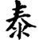
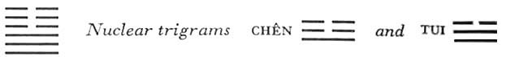

# Commentary: 11. T'ai / Peace

The rulers of the hexagram are the nine in the second place and the six in the fifth. The meaning of the hexagram is that what is above and what is below are united and of one will. The nine in the second place fulfills completely the duties of the official in relation to the ruler, and the six in the fifth place fulfills completely the duties of the ruler in relation to his subordinates. The two lines are the constituting as well as the governing rulers.

The Sequence

Good conduct, then contentment; thus calm prevails. Hence there follows the hexagram of PEACE. Peace means union, interrelation.

The Chinese word *t’ai* is not easy to translate. It means contentment, rest, peace, in the positive sense of unobstructed, complete union, bringing about a time of flowering and greatness. The movement of the lower trigram Ch’ien tends upward, that of the upper trigram K’un tends downward, and thus they approach each other. This hexagram is correlated with the first month (February–March).

Miscellaneous Notes

The hexagrams of STANDSTILL and PEACE stand in natural opposition to each other.

### THE JUDGMENT

> PEACE. The small departs,
>
> The great approaches.
>
> Good fortune. Success.

Commentary on the Decision

PEACE. “The small departs, the great approaches. Good fortune. Success.”

In this way heaven and earth unite, and all beings come into union.

Upper and lower unite, and they are of one will.

The light principle is within, the shadowy without; strength is within and devotion without; the superior man is within, the inferior without.

The way of the superior man is waxing; the way of the inferior man is waning.

Taken as a whole and as one of the “calendar” hexagrams, this hexagram is interpreted with the idea that the strong lines entering from below are mounting, while the weak lines above are withdrawing from the hexagram. Therefore, “The small departs, the great approaches.”

The movement of the two trigrams toward each other gives rise to another interpretation. The lower, ascending trigram is Ch’ien, heaven. The upper, sinking trigram is K’un, the earth. Thus the two primary powers unite, and all thingsenter upon union and development. This corresponds with the state of things at the beginning of the year.

In terms of the human world, with special reference to two lines—the six in the fifth place representing the prince, and the nine in the second place representing the officials—the result is unity between high and low, their wills being directed to a common goal. The positions of the two trigrams—within (below) and without (above)—lead to still another reflection. The yang power is within, the yin power without. This points to a difference in rank between the ruling yang power at the center and the dependent yin power at the periphery; this is further emphasized by the respective attributes of the trigrams, strength and devotion. These relative positions are likewise favorable for both elements.

In relation to the political field, another consideration arises from the difference in value between the superior persons symbolized by the light lines and the inferior persons symbolized by the dark lines. Good men are at the center of power and influence; inferior people are on the outside, subject to the influence of the good. This likewise works for the good of the whole.

The movement of the hexagram as a whole produces finally a victorious ascendancy of the principles of the good man and a withdrawal and defeat of the principles of inferior men.

None of this occurs arbitrarily; it is born of the time. It is the season of spring, both in the year and in history, that is represented by this hexagram.

### THE IMAGE

> Heaven and earth unite: the image of PEACE.
>
> Thus the ruler
>
> Divides and completes the course of heaven and earth;
>
> He furthers and regulates the gifts of heaven and earth,
>
> And so aids the people.

Human activity must help nature in times of flowering. Nature must be kept within limits, as the earth limits theactivities of heaven, in order to regulate excess. On the other hand, nature must be furthered, as heaven furthers the gifts of the earth, in order to make up for deficiencies. In this way the blessings of nature benefit the people. The Chinese word for “aid” means literally “being at the left and the right,” which in turn derives from the fact that the movement of yang is thought of as being toward the right and that of yin toward the left.

### THE LINES

Nine at the beginning:

*a*) When ribbon grass is pulled up, the sod comes with it.

Each according to his kind.

Perseverance brings good fortune and success.

*b*) “When ribbon grass is pulled up…. Undertakings bring good fortune.” The will is directed outward.
The three lines of the lower trigram Ch’ien belong with one another and advance together. The lowest place suggests the idea of sod. The six in the fourth place unites with the nine at the beginning, therefore going forth—“undertakings” brings good fortune.

Nine in the second place:

*a*) Bearing with the uncultured in gentleness,

Fording the river with resolution,

Not neglecting what is distant,

Not regarding one’s companions:

Thus one may manage to walk in the middle.

*b*) “Bearing with the uncultured in gentleness … thus one may manage to walk in the middle,” because the light is great.
The trigram Ch’ien incloses K’un, bears the uncultured in gentleness. The line must proceed resolutely through the river because it is the lowest line in the nuclear trigram Tui, water. It must step over those that lie between, in order tounite with the six in the fifth place. Those far away are symbolized by the six at the top; the friends are the two other strong lines of Ch’ien. They are not regarded because the nine in the second place unites with the six in the fifth. “Thus one may manage to walk in the middle,” or according to another explanation, “Thus one obtains aid for walking in the middle,” that is, from the six in the fifth place.

Nine in the third place:

*a*) No plain not followed by a slope.

No going not followed by a return.

He who remains persevering in danger

Is without blame.

Do not complain about this truth;

Enjoy the good fortune you still possess.

*b*) “No going not followed by a return”: this is the boundary of heaven and earth.
This line is in the middle of the hexagram, on the boundary between heaven and earth, between yang and yin. This suggests the idea of a setback. But the line is extremely strong. Hence it should not be sad, but only strong, enjoying the good fortune that still remains (the nuclear trigram, Tui, in which this is the middle line, means mouth, hence enjoying, eating).

Six in the fourth place:

*a*) He flutters down, not boasting of his wealth,

Together with his neighbor,

Guileless and sincere.

*b*) “He flutters down, not boasting of his wealth”: all of them have lost what is real.

“Guileless and sincere”: he desires it in the depths of his heart.
As the three lower lines ascend together, so the three upper ones sink down together, fluttering. None wants to possess wealth for himself alone. This line has “lost what is real,” thatis, it has renounced material advantage such as would beckon if it should egotistically unite with the nine at the beginning.

Six in the fifth place:

*a*) The sovereign I

Gives his daughter in marriage.

This brings blessing

And supreme good fortune.

*b*) “This brings blessing and supreme good fortune,” because he is central in carrying out what he desires.
The nuclear trigram Chên means the entrance of the ruler (“God comes forth in the sign of the Arousing”<a id="ref-1" href="#/com-11-t-ai-peace?id=fn-1">1</a>). This line stands over the nuclear trigram Tui, the youngest daughter, hence the image of the daughter given in marriage to the nine in the second place, which is lower in rank. Owing to its central character, the six in the fifth place achieves the fulfillment of all its wishes.

Six at the top:

*a*) The wall falls back into the moat.

Use no army now.

Make your commands known within your own town.

Perseverance brings humiliation.

*b*) “The wall falls back into the moat.” His plans fall into confusion.
The earth, in the highest place, indicates the wall. The line, like the other yin lines, tends downward; therefore it symbolizes falling into the moat. K’un means mass, the army. The nuclear trigram Tui (mouth) suggests commands.

This line is in union with the restless nine in the third place. Thus it is drawn into the confusion prophesied in relation to the latter. But if one keeps oneself inwardly free and takes care of those nearest to him, he can guard against the impending ruin—though only in silence. In general, the time fulfills itself of necessity.

---

**Notes:**

<a id="fn-1" href="#/com-11-t-ai-peace?id=ref-1">**1.**</a> See here, sec. 5.
