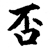
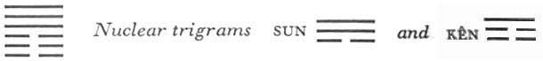

# Commentary: 12. P'i / Standstill [Stagnation]

[12. P’i / Standstill Stagnation](#pup-iching003.html_pup-iching003htmlpt05toc)

The rulers of the hexagram are the six in the second place and the nine in the fifth. During standstill, those above are out of union with those below. The saying associated with the six in the second place is: “Standstill brings success.” The line refers to a person who takes refuge in his virtue in order to avoid difficulties. The saying associated with the nine in the fifth place is: “Standstill is giving way.” This line refers to someone who transforms standstill into peace. However, the six in the second place is the ruler having the constituting function in the hexagram, while the nine in the fifth place is the ruler that governs it.

The Sequence

Things cannot remain forever united; hence there follows the hexagram of STANDSTILL.

This hexagram is the inverse of the preceding one. Therefore the movements of the trigrams diverge. The trigram Ch’ien above withdraws always farther upward, and K’un below sinks farther and farther down. The two nuclear trigrams, Sun, gentleness, and Kên, Keeping Still, also characterize the hexagram. These trigrams form the hexagram Ku, WORK ON WHAT HAS BEEN SPOILED (18), and in the latter too have the meaning of standstill. The hexagram P’i is linked with the seventh month (August–September).

Miscellaneous Notes

The hexagrams of STANDSTILL and PEACE are opposed in their natures.

### THE JUDGMENT

> STANDSTILL. Evil people do not further
>
> The perseverance of the superior man.
>
> The great departs; the small approaches.

Commentary on the Decision

“Evil people of the time of STANDSTILL do not further the perseverance of the superior man. The great departs; the small approaches.”

Thus heaven and earth do not unite, and all beings fail to achieve union.

Upper and lower do not unite, and in the world, states go down to ruin.

The shadowy is within, the light without; weakness is within, firmness without; the inferior is within, the superior without. The way of the inferior is waxing, the way of the superior is waning.

Point for point, these conditions are the opposite of those in the preceding hexagram. Although we are dealing with cosmic conditions, the cause is nevertheless to be sought in the wrong course taken by man. It is man who spoils conditions—aside, naturally, from the regular phenomena of decline occurring in the normal course of life as well as of the year. When heaven and earth are disunited, life in nature stagnates. When those above and those below are disunited, political and social life stagnate. Within, at the center, there should be light; instead, the dark is there, and light is pushed to the outside. Man is inwardly weak and outwardly hard; inferior men are at the center of government, and the superior men are forced to the periphery. All this indicates that the way of the inferior man is on the increase, while that of the superior man is in decrease—just as the dark lines enter the hexagramfrom below and press upward, and the strong lines withdraw upward.

### THE IMAGE

> Heaven and earth do not unite:
>
> The image of STANDSTILL.
>
> Thus the superior man falls back upon his inner worth
>
> In order to escape the difficulties.
>
> He does not permit himself to be honored with revenue.

The way to overcome the difficulties of the time of STANDSTILL is indicated in the attributes of the two primary trigrams. K’un means frugality, retrenchment. The three strong lines of the outer trigram Ch’ien, which withdraw, symbolize escape from all the difficulties that arise from the pressing forward of the inferior men. This withdrawal also implies rejection of material rewards. While in the preceding hexagram the gifts of heaven and earth are administered by the superior man, here he stands completely aloof.

### THE LINES

Six at the beginning:

*a*) When ribbon grass is pulled up, the sod comes with it.

Each according to his kind.

Perseverance brings good fortune and success.

*b*) “When ribbon grass is pulled up…. Perseverance brings good fortune.” The will is directed to the ruler.
Here, taken singly, the yin lines are regarded not as inferior but as superior, at a time when the inferior element is triumphing. In conformity with the movement of the two trigrams, there is no relationship of correspondence between the upper and the lower lines. Hence the three lower lines hang together like ribbon grass and together withdraw downward, in orderto remain loyal to the prince and to avoid association with the inferior men who are advancing.

Six in the second place:

*a*) They bear and endure;

This means good fortune for inferior people.

The standstill serves to help the great man to attain success.

*b*) “The standstill serves to help the great man to attain success.” He does not confuse the masses.
The inferior people ingratiate themselves with the ruler, the nine in “the fifth place, which is fortunate for them, for it might enable them to improve themselves. But in order not to confuse the multitude who think as he does, the superior man does not enter into any such incorrect, sycophantic relationship.

Here as in the preceding hexagram, forbearance is meant. But in the latter a superior man bears with an inferior, while here we have servile support of influential persons who are rich and powerful.

Six in the third place:

*a*) They bear shame.

*b*) “They bear shame” because the place is not the right one.
The third line is weak in the strong place of transition. This is an incorrect place for it, hence the idea of humiliation. Because the line is at the top of the lower trigram K’un, it is the one that supports and bears with the lower ones. Here the beginning of a change for the better is indicated, just as in the preceding hexagram the beginning of failure is indicated in the nine in the third place.

Nine in the fourth place:

*a*) He who acts at the command of the highest

Remains without blame.

Those of like mind partake of the blessing.

*b*) “He who acts at the command of the highest remains without blame.” What is willed is done.
The mid-point of the stagnation has been passed. Order is gradually being re-established. This line is strong in a yielding place, therefore not too yielding. It stands in the minister’s place, hence acts under orders from above, and as a result remains free of blame. Here again, as in the preceding hexagram, minister and ruler are united.

Nine in the fifth place:

*a*) Standstill is giving way.

Good fortune for the great man.

“What if it should fail, what if it should fail?”

In this way he ties it to a cluster of mulberry shoots.

*b*) The good fortune of the great man consists in the fact that the place is correct and appropriate.
The fifth place is that of the ruler, and since the line has all the necessary good qualities, it brings the period of stagnation to an end. But its work is not yet finished; hence the anxious concern lest things should still go wrong. This anxiety is a good thing.

Nine at the top:

*a*) The standstill comes to an end.

First standstill, then good fortune.

*b*) When the standstill comes to an end, it reverses.

One should not wish to make it permanent.
Here the end is reached. With this, change sets in actually. A strong line stands at the top of the hexagram of STANDSTILL, which indicates that the change to the opposite is at hand. Here too a parallelism—i.e., with the top line of the preceding hexagram—is to be noted.
