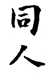
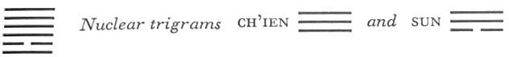
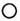

# Commentary: 13. T'ung Jên / Fellowship with Men

The rulers of the hexagram are the six in the second and the nine in the fifth place. The six in the second place, as the only yin line, is able to maintain fellowship with all the yang lines, and the nine in the fifth place corresponds with it. Therefore the Commentary on the Decision says: “The yielding finds its place, finds the middle, and the Creative corresponds with it.”

The Sequence

Things cannot be at a standstill forever. Hence there follows the hexagram of FELLOWSIDP WITH MEN.

Miscellaneous Notes

Fellowship with men finds love.
The movement of both primary trigrams is upward, hence parallel. In the same way the two nuclear trigrams, Ch’ien and Sun, which together form the hexagram of COMING TO MEET (44) indicate fellowship. The lower primary trigram is Li, the sun, fire. Ch’ien, heaven, becomes especially brilliant because fire is given to it.

### THE JUDGMENT

> FELLOWSHIP WITH MEN in the open.
>
> Success.
>
> It furthers one to cross the great water.
>
> The perseverance of the superior man furthers.

Commentary on the Decision

FELLOWSHIP WITH MEN. The yielding finds its place, finds the middle, and the Creative corresponds with it: this means fellowship with men.

FELLOWSHIP WITH MEN means: “Fellowship with men in the open. Success. It furthers one to cross the great water.”

The Creative acts. Order and clarity, in combination with strength; central, correct, and in the relationship of correspondence: this is the correctness of the superior man. Only the superior man is able to unite the wills of all under heaven.

The second line is the yielding element that finds its place in the middle and with which the Creative corresponds. It is to be taken as the representative of the trigram K’un, which has established itself in the second place of Ch’ien. Therefore this line accords with the nature of the earth and of the official.

The phrase “fellowship with men in the open” is also represented by this line, which stands in the place of the field (cf. the nine in the second place in hexagram 1, THE CREATIVE). The fellowship here is brought about by the official (not by the ruler), by virtue of his character, not by virtue of the authority of his position. The kind of character capable of bringing this about is delineated in the attributes of the two primary trigrams. Order and clarity are attributes of Li, and strength characterizes Ch’ien. First knowledge, then strength—this is the road to culture.

The superior man, even when placed where he serves, fills this position correctly and unselfishly and finds the support he needs in his ruler, the representative of the heavenly principle. The will of men under heaven is represented by Li (which means enlightened will) beneath Ch’ien, heaven.

Crossing of the great water is indicated by the nucleartrigram Sun, which means wood and gives rise to the idea of a ship.

### THE IMAGE

> Heaven together with fire:
>
> The image of FELLOWSHIP WITH MEN.
>
> Thus the superior man organizes the clans
>
> And makes distinctions between things.

Fire has the same nature as heaven, to which it flames up. It is strengthened in this trend by the nuclear trigram Sun, wind. The wind, which blows everywhere, also suggests union and fellowship. The same thought is expressed by the sun in the sky, which shines upon all things equally.

Yet there is one thing in this fellowship that the superior man must not overlook. He must not degrade himself. Hence the necessity of organization and differentiation, which is suggested by the attribute of order in the lower trigram Li.

### THE LINES

Nine at the beginning:

*a*) Fellowship with men at the gate.

No blame.

*b*) Going out of the gate for fellowship with men—who would find anything to blame in this?
This line at the beginning is light, strong without egotism. The six in the second place is a divided line, open in the center, the image of a door. The nine at the beginning, strong in a strong place, seeks fellowship, and without self-interest or egotism unites with the six in the second place, which in turn is central and correct, so that no blame attaches to such a union. Even the two envious lines in the third and the fourth place cannot find anything wrong in it.

Six in the second place:

*a*) Fellowship with men in the clan.

Humiliation.

*b*) “Fellowship with men in the clan” is the way to humiliation.
Clan means faction, fellowship on the basis of similarity of kind. In the sequence of the trigrams in the Inner-World Arrangement, Li is in the south, the place of Ch’ien in the Primal Arrangement. Through movement, the present line becomes a nine, and Li becomes Ch’ien. These are relationships of an intimate character. But since the meaning of the hexagram favors open relations, the fellowship represented by this line is too limited and therefore humiliating.

Nine in the third place:

*a*) He hides weapons in the thicket;

He climbs the high hill in front of it.

For three years he does not rise up.

*b*) “He hides weapons in the thicket” because he had a hard man as opponent.

“For three years he does not rise up.” How could it be done?
The trigram Li means weapons, the nuclear trigram Sun means to hide, also wood, thicket. Sun, in changing, becomes Kên, mountain, hence the image of a high hill in front. This line is hard and not central. It means a rough man who seeks fellowship with the six in the second place on the basis of the relation of holding together. But the six in the second place is correct and cultivates appropriate fellowship with the nine in the fifth place. The present line tries to prevent this, but its strength is not a match for that of its opponent, and so it resorts to cunning. It peeps out at its opponent but does not dare to come forth. “Three years” is probably suggested by the three lines of Ch’ien. The place is the lowest in the nuclear trigram Ch’ien.

Nine in the fourth place:

*a*) He climbs up on his wall; he cannot attack.

Good fortune.

*b*) “He climbs up on his wall.” The situation means that he can do nothing. His good fortune consists in the fact that he gets into trouble and therefore returns to lawful ways.
This line also seeks the fellowship of the six in the second place. But it is without, and the second line is within. The second line stands in the relationship of correspondence to the nine in the fifth place, and holds together with the nine in the third place. Hence the nine in the third place forms the high wall confronting this fourth line, protecting the six in the second place from it. If the fourth line tries to contend with the nine in the fifth place, it finds that it is in no position to do so, because of its weak and incorrect place. But since this yielding place softens the hardness of the line, it is moved by the exigencies of the situation to renunciation and a return to the right way.

Nine in the fifth place:

*a*) Men bound in fellowship first weep and lament,

But afterward they laugh.

After great struggles they succeed in meeting.

*b*) The beginning of the men bound in fellowship is central and straight.

“After great struggles they succeed in meeting,” that is, they are victorious.
The fifth and the second line are in a correct, direct relationship of correspondence. At first the third and the fourth line prevent their union and they are sad, but being central and correct, they will eventually unite. The lower trigram Li means weapons; the upper, Ch’ien, advances vigorously to meet it. This points to a victory of great armies.

Nine at the top:

*a*) Fellowship with men in the meadow.

No remorse.

*b*) “Fellowship with men in the meadow.” The will is not yet satisfied.
Ch’ien means the meadow before the town. The upper line is outside the hexagram, and this also indicates the meadow. Beyond the meadow is the open country. Fellowship in the meadow, then, still falls short of the ultimate ideal. The will to fellowship in the open, which brings success, is not yet satisfied.

NOTE. This hexagram embodies the ideal of the universal brotherhood of man, which, however, is not yet attained. Its demand thus points beyond all of the situations of fellowship shown in the hexagram—none of these is wholly satisfactory. None of the individual lines attains the ideal. All seek fellowship on the basis of narrower relationships. For this reason, none of them attains the great success that the hexagram as a whole envisions.
