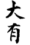
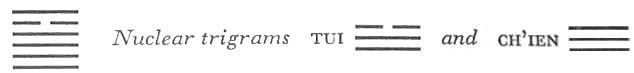

# Commentary: 14. Ta Yu / Possession in Great Measure

The ruler of the hexagram is the six in the fifth place. This line is empty and central, occupies an honored place, and is capable of possessing all the yang lines. Therefore it is said in the Commentary on the Decision: “The yielding receives the honored place in the great middle, and upper and lower correspond with it.”

The Sequence

Through FELLOWSHIP WITH MEN things are sure to fall to one’s lot. Hence there follows the hexagram of POSSESSION IN GREAT MEASURE.

Miscellaneous Notes

POSSESSION IN GREAT MEASURE indicates the mass.
The two primary trigrams, Ch’ien and Li, are both ascending, and so are the nuclear trigrams, Ch’ien and Tui. All these circumstances are extremely favorable. This hexagram is the inverse of the preceding one. It is more favorable than FELLOWSHIP WITH MEN, because here the ruler is at the same time in the place of authority, the fifth place.

### THE JUDGMENT

> POSSESSION IN GREAT MEASURE.
>
> Supreme success.

Commentary on the Decision

POSSESSION IN GREAT MEASURE: the yielding receives the honored place in the great middle, and upper and lower correspond with it. This is called POSSESSION IN GREAT MEASURE.

His character is firm and strong, ordered and clear; it finds correspondence in heaven and moves with the time; hence the words, “Supreme success.”

The yielding element that receives the honored position is the six in the fifth place. As contrasted with the six in the second place in the preceding hexagram, this line occupies the “great” middle; from this vantage, possession of the five strong lines can be organized much better. The official can indeed unite people, but only the prince can possess them. In the preceding hexagram the strong lines stand only in indirect relationship to the prince; here they are directly related. Thus the structure of the hexagram gives rise to the name.

The words of the Judgment are interpreted on the basis of the attributes and structure of the hexagram. Within dwell the firmness and power of Ch’ien; to the outside, the clear and ordered form of Li appears. The six in the fifth place, the ruler to whom everything conforms, modestly conforms on his part with the nine in the second place and finds correspondence there in the center of heaven. Ch’ien, being doubled (lower primary trigram and lower nuclear trigram), indicates theflow of time. The successful execution of measures demands that firm decision dwell within the mind, while the method of execution must be ordered and clear.

### THE IMAGE

> Fire in heaven above:
>
> The image of POSSESSION IN GREAT MEASURE.
>
> Thus the superior man curbs evil and furthers good,
>
> And thereby obeys the benevolent will of heaven.

The sun in heaven, which shines upon everything, is the image of possession in great measure. Suppression of evil is indicated by the trigram Ch’ien, the trigram that metes out judgment, and that fights the evil in living beings. Furthering of the good is indicated by the trigram Li, which clarifies and orders everything. Both are the decree of benevolent heaven (Ch’ien), to which the superior man devotes himself obediently (Li means devotion).

### THE LINES

Nine at the beginning:

*a*) No relationship with what is harmful;

There is no blame in this.

If one remains conscious of difficulty,

One remains without blame.

*b*) If the nine at the beginning in POSSESSION IN GREAT MEASURE has no relationships, this is harmful.
The upper trigram Li means weapons and therefore something harmful. This line is still far away from Li, hence there is no relationship with the latter. Difficulties exist, because great possession in a lowly place attracts danger. Therefore caution is fitting. However, since the line is strong, it may be assumed that it remains free of blame.

Nine in the second place:

*a*) A big wagon for loading.

One may undertake something.

No blame.

*b*) “A big wagon for loading.” Accumulating in the middle; thus no harm results.
Ch’ien symbolizes a wheel and a big wagon. The load to be placed in the wagon consists of the three lines of the trigram. Since Ch’ien implies vigorous movement, undertakings are indicated. The present line is firm and central and in the relationship of correspondence to the ruler of the hexagram, therefore everything is favorable. Ordinarily, accumulation of treasure brings disaster, but here accumulating in the middle is correct and central and brings no harm. It is not earthly but heavenly treasure that is being accumulated.

Nine in the third place:

*a*) A prince offers it to the Son of Heaven.

A petty man cannot do this.

*b*) “A prince offers it to the Son of Heaven.” A petty man harms himself.
This line is strong and correct and has relationships above. Being at the top of the lower trigram, it represents the prince. Since it belongs to the trigram Ch’ien and to the nuclear trigram Tui, it is ready to sacrifice. A small-minded man would give merely from a desire for gain, and this would result only in harm.

Nine in the fourth place:

*a*) He makes a difference

Between himself and his neighbor.

No blame.

*b*) “He makes a difference between himself and his neighbor. No blame.” He is clear, discriminating, and intelligent.
The six in the fifth place has possession of the five yang lines. This fourth line is in the place of the minister; hence it might ignore the difference between itself and the ruler, and arrogate possession to itself. But since it is strong in a weak place, it is too modest to do this, and since it is at the beginning of Li, ithas Li’s attribute of clear discrimination, which prevents any such confusion of “mine” and “thine.”

Six in the fifth place:

*a*) He whose truth is accessible, yet dignified,

Has good fortune.

*b*) “He whose truth is accessible”: by his trustworthiness he kindles the will of others. The good fortune of his dignity comes from the fact that he acts easily, without prearrangements.
The six in the fifth place is in the place of honor. It is modest and true, therefore it moves the other lines to confidence. Owing to its position, however, it can also impress by its dignity. This it does easily, however, and without external prearrangements, because it holds the great middle. Therefore it arouses no unpleasant feelings.

Nine at the top:

*a*) He is blessed by heaven.

Good fortune.

Nothing that does not further.

*b*) The place at the top of POSSESSION IN GREAT MEASURE has good fortune. This is because it is blessed by heaven.
The five yang lines are all in the possession of the six in the fifth place. Even the top line submits to it. Ch’ien and Li are both heavenly in nature, therefore it is said that heaven blesses this line. In the commentary on this line, as well as in that on the first line of the hexagram, special mention is made of the position, in order to emphasize the end and the beginning. For this hexagram is organized so favorably that the movement setting in at the beginning does not at the close come to standstill nor change to its opposite, but ends harmoniously.
