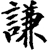
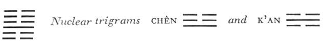

# Commentary: 15. Ch'ien / Modesty

The ruler of the hexagram is the nine in the third place. It is the only light line in the hexagram; it is in its proper place and stands in the lower trigram. This is the symbol of modesty, therefore the judgment on this line is the same as that on the hexagram as a whole. The commentary often attributes misfortune to third lines, but this one is very favorable.

The Sequence

He who possesses something great must not make it too full; hence there follows the hexagram of MODESTY.

Miscellaneous Notes

Things are easy for the modest person.
The movement of both primary trigrams is downward, but the sinking tendency of the upper trigram is stronger than that of the lower, and in this way the connection between the two remains assured. The lower nuclear trigram sinks, while the upper rises.

Appended Judgments

MODESTY shows the handle of character. MODESTY gives honor and shines forth. MODESTY serves to regulate the mores.

Good character has modesty for a handle; by means of it good character can be grasped and made one’s own. Modesty is ready to honor others, and in so doing shows itself at its best. Modesty is the attitude of mind that underlies sincere observance of the mores.

### THE JUDGMENT

> MODESTY creates success.
>
> The superior man carries things through.

Commentary on the Decision

MODESTY creates success, for it is the way of heaven to shed its influence downward and to create light and radiance. It is the way of the earth to be lowly and to go upward.

It is the way of heaven to make empty what is full and to give increase to what is modest. It is the way of the earth to change the full and to augment the modest. Spirits and gods bring harm to what is, full and prosper what is modest. It is the way of men to hate fullness and to love the modest.

Modesty that is honored spreads radiance. Modesty that is lowly cannot be ignored. This is the end attained by the superior man.

Here the structure of the hexagram is used to explain the saying that modesty creates success. The nine in the third place is the representative of the yang force, which has sunk down. It brings light and radiance, attributes of the trigram Kên, the mountain. The upper trigram K’un shows the earth as having moved upward (the nuclear trigram Chên has a rising movement). The law governing the abasing of the proud and the elevation of the modest is set forth in four ways: (1) in heaven: when the sun reaches the zenith, it begins to decline; when the moon is full, it wanes; when dark, it begins to wax; (2) on earth: high mountains become valleys, valleys become hills; water turns toward the heights and wears them down; water turns toward depth and fills it up (the lowernuclear trigram is K’an, water); (3) in the effect of the forces of fate: powerful families draw down destruction upon themselves, modest ones become great; (4) among men: arrogance brings dislike in its train, modesty wins love.

The ultimate cause is never the outside world, which moreover reacts according to fixed laws, but rather man himself. For according to his conduct he draws upon himself good or evil influences. The way to expansion leads through contraction.

### THE IMAGE

> Within the earth, a mountain:
>
> The image of MODESTY.
>
> Thus the superior man reduces that which is too much,
>
> And augments that which is too little.
>
> He weighs things and makes them equal.

To bring about the conditions set forth by the hexagram, the superior man moves in harmony with the increasing and decreasing movements of the nuclear trigrams. Where the lowly stands (K’un, earth) he ascends (Chên) and augments what is too little. Conversely, where the lofty stands (Kên, mountain) he descends (K’an). Thus he equalizes things.

### THE LINES

Six at the beginning:

*a*) A superior man modest about his modesty

May cross the great water.

Good fortune.

*b*) “A superior man modest about his modesty” is lowly in order to guard himself well.
Twofold modesty is indicated by the doubly yielding character of the line (a yielding line in a yielding<a id="ref-1" href="#/com-15-ch-ien-modesty?id=fn-1">1</a> place). Crossing of the great water is indicated by the lower nuclear trigram, K’an,situated in front of above the first line. Here is that modesty in a lowly place which cannot be ignored.

Six in the second place:

*a*) Modesty that comes to expression.

Perseverance brings good fortune.

*b*) “Modesty that comes to expression. Perseverance brings good fortune.” He has it in the depths of his heart.
The ruler of the hexagram, who sets the tone, is the nine in the third place. The second line has a relationship of holding together with the ruler, therefore it responds to this tone, that is, expresses itself. The line is central, hence it has modesty at the center, in the heart.

Nine in the third place:

*a*) A superior man of modesty and merit

Carries things to conclusion.

Good fortune.

*b*) “A superior man of modesty and merit”: all the people obey him.
Kên, mountain, is the trigram in which end and beginning meet. This line is at the top of Kên, and from this comes the idea of effort leading to achievement. The three upper lines belong to the trigram K’un, which means the masses and devotion. The yang line in the third place is the third line of the trigram Ch’ien, the Creative, distinguished likewise by indefatigable effort. The Master said:

When a man does not boast of his efforts and does not count his merits a virtue, he is a man of great parts. It means that for all his merits he subordinates himself to others. Noble of nature, reverent in his conduct, the modest man is full of merit, and therefore he is able to maintain his position.

Six in the fourth place:

*a*) Nothing that would not further modesty

In movement.

*b*) “Nothing that would not further modesty in movement.” He does not overstep the rule.
This line is in a yielding place, at the very bottom of the trigram K’un, whose attribute is devotion; it mediates between the nine in the third place and the six in the fifth. It stands in the center of the nuclear trigram Chên, movement, hence the idea of movement (literally, “beckoning”).

Six in the fifth place:

*a*) No boasting of wealth before one’s neighbor.

It is favorable to attack with force.

Nothing that would not further.

*b*) “It is favorable to attack with force” in order to chastise the disobedient.
This line is central, in the place of honor, yet yielding. It combines all the virtues of the ruler. It is empty, hence not boastful of its wealth. It is in the center of the trigram K’un, signifying the masses, above the nuclear trigram K’an, danger—hence the idea of chastisement.

Six at the top:

*a*) Modesty that comes to expression.

It is favorable to set armies marching

To chastise one’s own city and one’s country.

*b*) “Modesty that comes to expression.” The purpose is not yet attained. One may set armies marching, in order to chastise one’s own city and one’s country.
This line stands in the relationship of correspondence to the ruler of the hexagram, the nine in the third place; hence, for reasons analogous to those obtaining in the case of the six in the second place, “modesty that comes to expression.” K’un, the upper primary trigram, and K’an, the lower nuclear trigram, together make up the hexagram Shih, THE ARMY. The trigram K’un also indicates the city, and the country. The purpose is not yet achieved because the line is very far awayfrom the nine in the third place toward which it strives; hence chastisement by means of armies, in order that the two may be united.

---

**Notes:**

<a id="fn-1" href="#/com-15-ch-ien-modesty?id=ref-1">**1.**</a> No doubt “lowly” was meant here, since the first place is always strong. See here.
