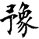
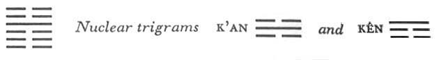

# Commentary: 16. Yü / Enthusiasm

The ruler of the hexagram is the nine in the fourth place. It is the only light line, and stands in the place of the minister. This gives the hexagram the meaning of enthusiasm. Therefore it is said in the Commentary on the Decision: “The firm finds correspondence, and its will is done.”

The Sequence

When one possesses something great and is modest, there is sure to be enthusiasm. Hence there follows the hexagram of ENTHUSIASM.

Miscellaneous Notes

ENTHUSIASM leads to inertia.

Appended Judgments

The heroes of old introduced double gates and night watchmen with clappers, in order to deal with robbers. They probably took this from the hexagram of ENTHUSIASM.

Yü means preparation as well as enthusiasm. The upper trigram is movement (Chên), and also the sound of thunder: this suggests the image of the night watchman making hisrounds with a clapper and encountering danger (nuclear trigram K’an). The lower nuclear trigram Kên means a closed door.

The two trigrams move in opposite directions. Thunder moves upward, the earth sinks down. Nevertheless, since the upper nuclear trigram K’an indicates downward movement, while the lower, Kên, is motionless, there is a certain coherence of structure. However, the hexagram is not as favorable in outlook as the preceding one, of which it is the inverse.

### THE JUDGMENT

> ENTHUSIASM. It furthers one to install helpers
>
> And to set armies marching.

Commentary on the Decision

ENTHUSIASM. The firm finds correspondence, and its will is done. Devotion to movement: this is ENTHUSIASM.

Because ENTHUSIASM shows devotion to movement, heaven and earth are at its side. How much the more then is it possible to install helpers and set armies marching!

Heaven and earth move with devotion; therefore sun and moon do not swerve from their courses, and the four seasons do not err.

The holy man moves with devotion; therefore fines and punishments become just, and the people obey. Great indeed is the meaning of the time of ENTHUSIASM.

The trigram K’un means mass, hence army. Chên, the upper trigram, is the eldest son, the leader of the masses, hence the idea of the installment of helpers (feudal lords) and of the marching of armies. The commander of the army, whose will awakens enthusiasm and spurs to movement those devoted to him, is the nine in the fourth place, the ruler of the hexagram. The secret of all natural and human law is movement that meets with devotion.

### THE IMAGE

> Thunder comes resounding out of the earth:
>
> The image of ENTHUSIASM.
>
> Thus the ancient kings made music
>
> In order to honor merit,
>
> And offered it with splendor
>
> To the Supreme Deity,
>
> Inviting their ancestors to be present.

Chên is the sound of the thunder that accompanies the movements of reawakening life. This sound is the prototype of music. Furthermore, Chên is the trigram in which God comes forth, hence the idea of the Supreme Deity. The nuclear trigram Kên is a door, and the nuclear trigram K’an means something deeply mysterious; this leads to the idea of the temple of the ancestors.

### THE LINES

Six at the beginning:

*a*) Enthusiasm that expresses itself

Brings misfortune.

*b*) The six at the beginning expresses its enthusiasm; this leads to the misfortune of having the will obstructed.
This line is analogous to the six at the top in the preceding hexagram. Consequently the idea of self-expression appears here for the same reason as it does there, namely, because of the relationship of correspondence to the strong ruler of the hexagram. The line at the beginning is weak, incorrect, isolated, and instead of being cautious, expresses its enthusiasm. This is certain to lead to misfortune.

Six in the second place:

*a*) Firm as a rock. Not a whole day.

Perseverance brings good fortune.

*b*) “Not a whole day. Perseverance brings good fortune,” because it is central and correct.
This line is in the lowest place of the nuclear trigram Kên, mountain, hence the comparison with a rock. The movement of the line is directed downward rather than upward, hence its readiness to withdraw at any time. This comes from its prudence—indicated by its central and correct position—in the time of ENTHUSIASM.

Six in the third place:

*a*) Enthusiasm that looks upward creates remorse.

Hesitation brings remorse.

*b*) “Enthusiasm that looks upward creates remorse,” because the place is not the appropriate one.
This is a weak line in a strong place, and moreover in the place of transition. It is attracted by the strong line in the fourth place, toward which it looks up with enthusiasm, because the relationship is that of holding together with it. Thereby, however, it loses its independence, which is not a good thing.

Nine in the fourth place:

*a*) The source of enthusiasm.

He achieves great things.

Doubt not.

You gather friends around you

As a hair clasp gathers the hair.

*b*) “The source of enthusiasm. He achieves great things.” His will is done in great things.
This line is at the beginning of the trigram Chên, movement, which strives upward; it is at the same time the only yang line in the hexagram, and all the others conform to it. Hence it is the source of enthusiasm. The five yin lines represent the great thing that is attained. The excess of dark lines might give rise to a doubt, and doubt might also be occasioned by the nuclear trigram K’an, in which this line has the middle place.But the five yin lines are good friends of the yang line; it unites them just as a hair clasp holds the hair together.

Six in the fifth place:

*a*) Persistently ill, and still does not die.

*b*) The persistent illness of the six in the fifth place is due to the fact that it rests upon a hard line. That it nevertheless does not die is due to the fact that the middle has not yet been passed.
This place is actually that of the ruler. But since the firm line, the nine in the fourth place, as the source of enthusiasm, unites all those around it, the fifth place is deprived of enthusiasm. The fact that the line is at the top of the nuclear trigram K’an, which suggests heart disease, accounts for the idea that the person represented is chronically ill. But since his central position keeps him from becoming desperate because of this, he lives on and on.

Six at the top:

*a*) Deluded enthusiasm.

But if after completion one changes,

There is no blame.

*b*) Deluded enthusiasm in a high place: how could this last?
A weak line at the high point of enthusiasm—this leads to delusion. But since the line also stand’s at the top of the upper trigram Chên, whose character is movement, a factor to be reckoned with is that this situation has no permanence.
