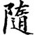
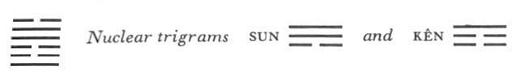

# Commentary: 17. Sui / Following

The rulers of the hexagram are the nine at the beginning and the nine in the fifth place. The reason why the hexagram means following is that the strong man brings himself to accept subordination to that which is weak. The first and the fifth line are both strong and stand under weak lines, hence they are the rulers of the hexagram.

The Sequence

Where there is enthusiasm, there is certain to be following. Hence there follows the hexagram of FOLLOWING.

Miscellaneous Notes

FOLLOWING tolerates no old prejudices.

Appended Judgments

The heroes of old tamed the ox and yoked the horse. Thus heavy loads could be transported and distant regions reached, for the benefit of the world. They probably took this from the hexagram of FOLLOWING.

This hexagram consists of movement below and joyousness above: it shows the Arousing (Chên) under the Joyous (Tui), suggesting rest, the more so since the nuclear trigrams Sun, the Gentle, and Kên, Keeping Still, likewise point to this idea.Thus the domestication of the ox and the horse is to be explained as a means to labor saving. Success derives from the inner structure of the hexagram. Transportation of heavy loads is suggested by the lower nuclear trigram Kên, mountain; the ox that carries these loads is analogous to the earth (the mountain belongs to the earth). Reaching distant regions is suggested by the upper nuclear trigram Sun, wind, which reaches everywhere. The traveling cart is drawn by the horse, which, like heaven, is characterized by movement (the wind belongs to heaven).

Tui is the youngest daughter, Chên the eldest son. In the hexagram as a whole, as well as in the case of the two rulers, the strong element places itself under the weak in order to obtain a following. In their movement the two trigrams have the same upward trend.

### THE JUDGMENT

> FOLLOWING has supreme success.
>
> Perseverance furthers. No blame.

Commentary on the Decision

FOLLOWING. The firm comes and places itself under the yielding.

Movement and joyousness: FOLLOWING.

Great success and perseverance without blame: thus one is followed by the whole world.

Great indeed is the meaning of the time of FOLLOWING.

First, the name of the hexagram is explained on the basis of its structure and attributes. The firm element that comes—that is, moves from above downward and places itself under the yielding—consists on the one hand of Chên, which places itself under Tui, and on the other of the two rulers of the hexagram, in the first and the fifth place, both of which place themselves under yielding lines.

Chên has movement as its attribute, Tui has joyousness. Followers readily join a movement that is associated withjoyousness. The explanation of the words of the text also gives expression to the fundamental principle that one must first of all follow in the right way, if one would be followed.

### THE IMAGE

> Thunder in the middle of the lake:
>
> The image of FOLLOWING.
>
> Thus the superior man at nightfall
>
> Goes indoors for rest and recuperation.

The trigram Chên stands in the east, Tui in the west. The time between them is night. Similarly, the image designates the time of year—between the eighth and the second month—when thunder is at rest in the lake. This gives rise to the idea of following or being guided by the laws of nature.

Such resting steels one’s energy for fresh action. Turning inward is suggested by the upper nuclear trigram Sun, which means going into, and rest by the lower nuclear trigram Kên, which means keeping still.

### THE LINES

Nine at the beginning:

*a*) The standard is changing.

Perseverance brings good fortune.

To go out of the door in company

Produces deeds.

*b*) “The standard is changing.” To follow what is correct brings good fortune.

“To go out of the door in company produces deeds.”

One does not lose oneself.
This line is the ruler of the trigram Chên. As one in authority, it might demand that others follow it, but it changes and follows the six in the second place; since the latter line is central and correct, this exceptional procedure brings good fortune. “To go out of the door”—this is because the line is outside the lower nuclear trigram Kên, meaning door.

Six in the second place:

*a*) If one clings to the little boy,

One loses the strong man.

*b*) “If one clings to the little boy”: one cannot be with both at once.
The little boy is the weak six in the third place, the strong man is the strong nine at the beginning. The trend expressed in FOLLOWING implies in itself that the second line emulates the third. But the latter is weak and untrustworthy, hence the counsel to hold rather to the strong man below, since one cannot have both at once.

Six in the third place:

*a*) If one clings to the strong man,

One loses the little boy.

Through following one finds what one seeks.

It furthers one to remain persevering.

*b*) “If one clings to the strong man,” one’s will gives up the one below.
Here the little boy is the six in the second place, and the strong man is the nine in the fourth place. In accord with the movement of FOLLOWING, one ought to hold to the strong man ahead and give up the weak man below. The strong man is in the place of the minister, hence one obtains from him what one seeks. But the essential thing is to remain persevering, in order not to deviate from the right path.

Nine in the fourth place:

*a*) Following creates success.

Perseverance brings misfortune.

To go one’s way with sincerity brings clarity.

How could there be blame in this?

*b*) “Following creates success”: this bodes misfortune.

“To go one’s way with sincerity”: this brings clear-sighted deeds.
This line is the minister who follows the strong line that is the ruler of the hexagram—the nine in the fifth place. In this way he wins the success of having people follow him—a success he cannot prevent, because he is not correct (a strong line in a weak place). Thereby he draws down misfortune upon himself. The trigram Chên means a great way. This line is over Chên, that is, on the way. The nuclear trigram Kên means brightness and light.

Nine in the fifth place:

*a*) Sincere in the good. Good fortune.

*b*) “Sincere in the good. Good fortune.” The place is correct and central.
The six at the top symbolizes a sage in retirement. The present line, the ruler, follows him. The ruler’s correct and central character safeguards him against conforming to those beneath him, from whom no good would come to him.

Six at the top:

*a*) He meets with firm allegiance

And is still further bound.

The king introduces him

To the Western Mountain.

*b*) “He meets with firm allegiance.” At the top it ends.
This line is at the top, with no other line before it to be followed. Hence it withdraws from the world. But it is brought back by the firm allegiance of the ruler, the nine in the fifth place. The Western Mountain is suggested by the nuclear trigram Kên, mountain, and the upper trigram Tui, which lies in the west.
