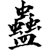
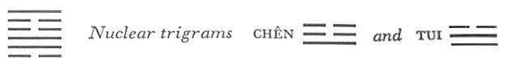
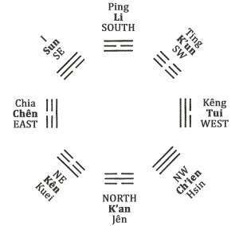
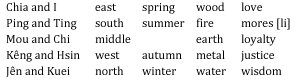

# Commentary: 18. Ku / Work on What Has Been Spoiled [Decay]

[18. Ku / Work on What Has Been Spoiled Decay](#pup-iching003.html_pup-iching003htmlpt05toc)

The ruler of the hexagram is the six in the fifth place; for although all of the lines are occupied in compensating for what has been spoiled, it is only at the fifth line that the work is completed. Hence all of the other lines have warnings appended to them, and only of the fifth is it said: “One meets with praise.”

The Sequence

When one follows others with pleasure, there are certain to be undertakings. Hence there follows the hexagram of WORK ON WHAT HAS BEEN SPOILED. Work on what has been spoiled means undertakings.

Miscellaneous Notes

WORK ON WHAT HAS BEEN SPOILED. Afterward there is order.
The structure of the hexagram is not favorable. The heavy Kên is above; below is the gentle, listless Sun, the eldest daughter, who is occupied with the youngest son. But this stagnation is not permanent or unalterable. The nuclear trigrams show another trend. Chên comes forth from Tui; both tend upward in movement and undertake the work ofimprovement energetically and joyously. This hexagram is the inverse of the preceding one.

### THE JUDGMENT

> WORK ON WHAT HAS BEEN SPOILED
>
> Has supreme success.
>
> It furthers one to cross the great water.
>
> Before the starting point, three days.
>
> After the starting point, three days.

Commentary on the Decision

WORK ON WHAT HAS BEEN SPOILED. The firm is above and the yielding below; gentle and standing still—that which has been spoiled.

“WORK ON WHAT HAS BEEN SPOILED has supreme success,” and order comes into the world.

“It furthers one to cross the great water.” On going one will have things to do.

“Before the starting point, three days. After the starting point, three days.” That a new beginning follows every ending, is the course of heaven.

The name of the hexagram is explained in its structure and in the attributes of the trigrams. The preceding hexagram is here reversed: the strong, upward-striving force is above, and the weak, sinking force is below. In this way the movements diverge, and relationships are lacking. The attributes of the two trigrams are inner weakness, gentle, irresolute drifting, and, on the outside, inaction. This leads to spoiling.

At the same time, however, something thus spoiled imposes the task of working on it, with expectation of success. Through work on what has been spoiled the world is set in order once more. But something must be undertaken. Crossing of the great water is suggested by the lower trigram, which means wood (hence boat) and wind (hence progress), and by the lower nuclear trigram Tui, lake.

The phrase “before the starting point,” rendered literally, means “before the sign Chia.” The trigram Chên, in the east,means spring and love, and the cyclic sign<a id="ref-1" href="#/com-18-ku-work-on-what-has-been-spoiled-decay?id=fn-1">1</a> Chia (with I) is next to it. Chia is the “starting point.” Before the three spring months, whose days taken together are called Chia (and I), lies winter; here the things of the past come to an end. After the spring months comes summer; from spring to summer is the new beginning. The words, “Before the sign Chia, three days. After the sign Chia, three days,” are thus explained by the words of the commentary: “That a new beginning follows every ending, is the course of heaven.” Since inner conditions are the theme of this hexagram, that is, work on what has been spoiled by the parents, love must prevail and extend over both the beginning and the end (cf. hexagram 57, Sun, THE GENTLE).

Figure 6

Another explanation is suggested by the order of the trigrams in the Inner-World Arrangement fig. 6; cf. fig. 2, p. 269. The starting point (Chia) is Chên. Going three trigrams back from this, we come to the trigram Ch’ien, the Creative; going three trigrams forward we come to K’un, the Receptive. Now Ch’ien and K’un are the father and mother, and the hexagram refers to work on what has been spoiled by these two.

### THE IMAGE

> The wind blows low on the mountain:
>
> The image of DECAY.
>
> Thus the superior man stirs up the people
>
> And strengthens their spirit.

The wind blowing down the mountain causes decay. But the reverse movement shows work on what has been spoiled. First there is the wind under the influence of Chên, the Arousing, which stirs things up; then comes the mountain, joined with the lake, which joyously fosters the spirit of men and nourishes it.

### THE LINES

Six at the beginning:

*a*) Setting right what has been spoiled by the father.

If there is a son,

No blame rests upon the departed father.

Danger. In the end good fortune.

*b*) “Setting right what has been spoiled by the father.”

He receives in his thoughts the deceased father.
When the first and the top line change, this hexagram becomes T’ai, PEACE, in which the father, Ch’ien, is below and the mother, K’un, above. Hence the recurrent idea of improving what has been spoiled by the father or the mother. This line stands in an inner relationship of receiving to the strong nine in the second place.

Nine in the second place:

*a*) Setting right what has been spoiled by the mother.

One must not be too persevering.

*b*) “Setting right what has been spoiled by the mother.”

He finds the middle way.
This line is strong and central, and at the beginning of the nuclear trigram Tui, hence joyous. Since the line is in the relationship of correspondence to the weak six in the fifth place, which represents the mother, strength must not be carried to extremes by a too obstinate perseverance.

Nine in the third place:

*a*) Setting right what has been spoiled by the father.

There will be a little remorse. No great blame.

*b*) “Setting right what has been spoiled by the father.”

In the end there is no blame.
This line is at the beginning of the nuclear trigram Chên, the eldest son, hence the image of work on what has been spoiled by the father. The line is too strong to be in the strong place of transition. Therefore it might be thought that the situation would lead to mistakes, but good intention compensates in this case.

Six in the fourth place:

*a*) Tolerating what has been spoiled by the father.

In continuing one sees humiliation.

*b*) “Tolerating what has been spoiled by the father.” He goes, but as yet finds nothing.
This line is especially weak, and at the top of the nuclear trigram Tui, the Joyous. In the given situation nothing will be gained by letting things drift.

Six in the fifth place:

*a*) Setting right what has been spoiled by the father.

One meets with praise.

*b*) “Setting right what has been spoiled by the father.

One meets with praise.” He receives him in virtue.
This line is central, in the place of honor, and yielding, hence very well fitted for rectifying mistakes of the past with forbearance, yet energetically.

Nine at the top:

*a*) He does not serve kings and princes,

Sets himself higher goals.

*b*) “He does not serve kings and princes.” Such an attitude may be taken as a model.
This line is at the top, strong, and at the highest point of the trigram Kên, the mountain. Therefore it does not serve the king in the fifth place but sets its goals higher. It does not work for one era, but for the world and for all time.

---

**Notes:**

<a id="fn-1" href="#/com-18-ku-work-on-what-has-been-spoiled-decay?id=ref-1">**1.**</a> The ten cyclic signs are:

