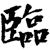
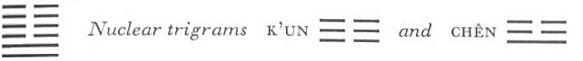

# Commentary: 19. Lin / Approach

The rulers of the hexagram are the nine at the beginning and the nine in the second place, of which the Commentary on the Decision says: “The firm penetrates and grows.”

The Sequence

When there are things to do, one can become great. Hence there follows the hexagram of APPROACH. Approach means becoming great.

Miscellaneous Notes

The meaning of the hexagrams of APPROACH and CONTEMPLATION is that they partly give and partly take.
The organization of this hexagram is altogether favorable. The two lines entering from below and pushing upward give the structure of the hexagram its character. Tui below moves upward, the upper trigram K’un sinks downward; thus the two movements come toward each other. The same thing takes place to an even greater extent as regards the nuclear trigrams. The lower, Chên, is thunder, which moves upward, while the upper, K’un, moves downward.

### THE JUDGMENT

> APPPROACH has supreme success.
>
> Perseverance furthers.
>
> When the eighth month comes,
>
> There will be misfortune.

Commentary on the Decision

APPROACH. The firm penetrates and grows.

Joyous and devoted. The firm is in the middle and finds correspondence. “Great success through correctness”: this is the course of heaven.

“When the eighth month comes, there will be misfortune.” Recession is not slow in coming.

*b*) The name of the hexagram is explained through its structure. The firm element that penetrates and grows are the two yang lines. Joyousness and devotion are the attributes of the two trigrams. The firm element in the middle that finds correspondence is the nine in the second place. It is taken as the basis for the explanation of the words of the hexagram. The eighth month is suggested in the fact that the next hexagram, Kuan (CONTEMPLATION, VIEW), in which the retreat of the strong lines parallels their advance here, comes exactly eight months after this hexagram in the cycle of the year.

### THE IMAGE

> The earth above the lake:
>
> The image of APPROACH.
>
> Thus the superior man is inexhaustible
>
> In his will to teach,
>
> And without limits
>
> In his tolerance and protection of the people.

The lake, which fructifies the earth with its inexhaustible moisture, suggests teaching, which fructifies man’s inner being. The earth means the masses, hence the upholding and protection of the people.

### THE LINES

Nine at the beginning:

*a*) Joint approach.

Perseverance brings good fortune.

*b*) “Joint approach. Perseverance brings good fortune.”

His will is to act correctly.
This line advances jointly with the second, hence “joint approach.” The word joint also contains the idea of stimulus, influence. Having been called in, the present line seeks to influence the weak line in the second place.<a id="ref-1" href="#/com-19-lin-approach?id=fn-1">1</a> But its will is to act correctly, since it is strong in a strong place.

Nine in the second place:

*a*) Joint approach.

Good fortune.

Everything furthers.

*b*) “Joint approach. Good fortune. Everything furthers.”

One need not yield to fate.
Here, coming to the upper ruler of the hexagram, we are reminded that as the joint ascent of the two strong lines is grounded in fate, so fate may in time also bring regression. But if—in accord with the nuclear trigram Chên—an upward movement is initiated in time, this movement is strong enough to counteract fate, should the consequences of fate set in before these precautions are taken.

Six in the third place:

*a*) Comfortable approach.

Nothing that would further.

If one is induced to grieve over it,

One becomes free of blame.

*b*) “Comfortable approach.” The place is not the appropriate one. A fault that induces grief no longer exists.
The third line is at the top of the trigram of joyousness, hence “comfortable approach.” Its place is not the proper one. It is a weak line in a strong place, hence nothing furthers. But because it also stands in the middle of the nuclear trigram Chên, meaning shock and terror, there is the possibility of remorse. Because of this, movement—likewise a characteristic of Chên—sets in, and thus the mistake is overcome.

Six in the fourth place:

*a*) Complete approach.

No blame.

*b*) “Complete approach. No blame,” for the place is the appropriate one.
Here we have the most intimate mutual approach of the upper and the lower trigram. The place is appropriate—a yielding line in a yielding place. The line is in the relationship of correspondence to the nine at the beginning.

Six in the fifth place:

*a*) Wise approach.

This is right for a great prince.

Good fortune.

*b*) What is right for a great prince—this means that he should walk in the middle.
The wisdom lies in the fact that the weak line in the central place of the ruler knows and appreciates the strong, efficient man in the second place, with whom it has a relationship ofcorrespondence. The bond uniting the two is their common central course.

Six at the top:

*a*) Greathearted approach.

Good fortune. No blame.

*b*) “Greathearted approach.” The will is directed inward.
At first it might be assumed that the six at the top, which has no relationship of correspondence, would be drawing away from the other lines. But in the time of APPROACH its direction is inward, that is, downward, so that it remains in relation with the other lines of the hexagram.

---

**Notes:**

<a id="fn-1" href="#/com-19-lin-approach?id=ref-1">**1.**</a> The line is strong, but its place is weak.
