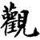
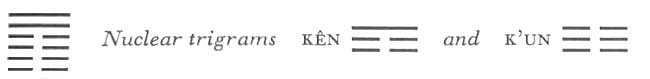
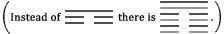

# Commentary: 20. Kuan / Contemplation (View)

The rulers of the hexagram are the nine in the fifth place and the nine at the top. The sentence in the Commentary on the Decision, “A great view is above,” refers to these.

The Sequence

When things are great, one can contemplate them. Hence there follows the hexagram of CONTEMPLATION.

Miscellaneous Notes

The meaning of the hexagrams of APPROACH and CONTEMPLATION is that they partly give and partly take.
This hexagram is the inverse of the preceding one: above is a tree, under it the earth. The tree on the earth is something to be viewed. The upper nuclear trigram Kên, the mountain, gives the same idea, for it too towers up and is widely visible. The hexagram has a double meaning: it “partly gives,” i.e., provides a sublime view, and “partly takes,” i.e., contemplates, seeks to attain something by contemplation.

### THE JUDGMENT

> CONTEMPLATION. The ablution has been made,
>
> But not yet the offering.
>
> Full of trust they look up to him.

Commentary on the Decision

A great view is above. Devoted and gentle. Central and correct, he is something for the world to view.

“Contemplation. The ablution has been made, but not yet the offering. Full of trust they look up to him.”

Those below look toward him and are transformed. He affords them a view of the divine way of heaven, and the four seasons do not deviate from their rule. Thus the holy man uses the divine way to give instruction, and the whole world submits to him.

The great view above consists of the two lines in the fifth and the top place. The lower trigram K’un is devoted, the upper, Sun, is gentle. The nine in the fifth place, the ruler of the hexagram, is central and correct. The nuclear trigram Kên, mountain, appears twice in the make-up of the hexagram, the one trigram intermeshed with the other.

Kên indicates gates and palaces; these bring to mind the temple of the ancestors, mysteriously locked. Kên is the hand, Sun means pure, hence washing of the hands. Kên means pausing, hence the uncompleted sacrifice. The rite of sacrifice is shownto the people and contemplated by them. The holy man knows the laws of heaven. He reveals them to the people, and his predictions come true. Just as the seasons of the year move under divine and immutable laws, so events do not deviate from the course he prophesies. Thus he uses his knowledge of the divine ways to teach the people, and the people trust him and look up to him.

### THE IMAGE

> The wind blows over the earth:
>
> The image of CONTEMPLATION.
>
> Thus the kings of old visited the regions of the world,
>
> Contemplated the people,
>
> And gave them instruction.

The wind blows everywhere on earth and reveals all things. Thus the journeys of the kings of antiquity are symbolized by the trigram Sun, wind, and the regions of the world by the trigram K’un, earth. The contemplation is the taking and the instruction is the giving for which the hexagram stands.

### THE LINES

Six at the beginning:

*a*) Boylike contemplation.

For an inferior man, no blame.

For a superior man, humiliation.

*b*) The boylike contemplation of the six at the beginning is the way of inferior people.
The six in the first place pictures a small (because it is a yin line) boy (because it is in a yang place). He is very far away from the object of everyone’s gaze, i.e., the prince in the fifth place, with whom he has no relationship; hence the idea of a boyishly inexperienced way of looking about.

Six in the second place:

*a*) Contemplation through the crack of the door.

Furthering for the perseverance of a woman.

*b*) “Contemplation through the crack of the door” is humiliating even where there is the perseverance of a woman.
The nuclear trigram Kên indicates a door, the trigram K’un a closed door, hence the crack of the door. The six in the second place indicates a girl. This line is in the relationship of correspondence to the nine in the fifth place, hence a connection exists, although it is greatly impeded.

Six in the third place:

*a*) Contemplation of my life

Decides the choice

Between advance and retreat.

*b*) “Contemplation of my life decides the choice between advance and retreat.” The right way is not lost.
Here a weak line in the place of transition is undecided whether to go forward or backward. It is at the bottom of the nuclear trigram Kên, mountain. Hence the backward look over its life, hence also the idea of the right way.

Six in the fourth place:

*a*) Contemplation of the light of the kingdom.

It furthers one to exert influence as the guest of a king.

*b*) “Contemplation of the light of the kingdom.” One is honored as a guest.
This line is at the top of the nuclear trigram K’un, which means kingdom, and also in the middle of the nuclear trigram Kên, meaning light. Furthermore, it is near the strong, central ruler, the nine in the fifth place, and stands in a receiving relationship to it. Hence the idea of its being treated as a guest.

Nine in the fifth place:

*a*) Contemplation of my life.

The superior man is without blame.

*b*) “Contemplation of my life,” that is, contemplation of the people.
Here the ruler of the hexagram is in the honored place, central and correct, at the top of the nuclear trigram Kên, mountain, hence the viewing of life as from a mountain. He who is the object of general contemplation here contemplates himself, especially with regard to the influence he has exerted upon the people.

Nine at the top:

*a*) Contemplation of his life.

The superior man is without blame.

*b*) “Contemplation of his life.” The will is not yet pacified.
Here one ruler of the hexagram looks from the vantage of the greatest height upon the nine in the fifth place. He has not yet forgotten the world and is therefore still concerned with its affairs.
