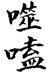
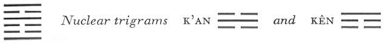

# Commentary: 21. Shih Ho / Biting Through

The ruler of the hexagram is the six in the fifth place. The Commentary on the Decision says of it: “The yielding receives the place of honor and goes upward.”

The Sequence

When there is something that can be contemplated, there is something that creates union. Hence therefollows the hexagram of BITING THROUGH. Biting through means union.

Miscellaneous Notes

BITING THROUGH means consuming.

Appended Judgments

When the sun stood at midday, the Divine Husbandman held a market. He caused the people of the earth to come together and collected the wares of the earth. They exchanged these with one another, then returned home, and each thing found its place. Probably he took this from the hexagram of BITING THROUGH.

The hexagram is here explained in the light of the meaning of the two trigrams Li and Chên. Li represents the sun high above, while Chên represents the turmoil of the market below. The inner structure of the hexagram is by no means as favorable as the outer form might lead one to conclude. It is true that clarity and movement are present, but between them, as opposing elements, there stand the nuclear trigrams K’an, danger, and Kên, Keeping Still—both formed by reason of the one fateful line in the fourth place.

### THE JUDGMENT

> BITING THROUGH has success.
>
> It is favorable to let justice be administered.

Commentary on the Decision

There is something between the corners of the mouth. This is called BITING THROUGH.

“BITING THROUGH, and moreover, success.” For firm and yielding are distinct from each other.

Movement and clarity. Thunder and lightning are united and form lines. The yielding receives the place of honor and goes upward.

Although it is not in the appropriate place, it is favorable to let justice be administered.

The name of the hexagram is here explained on the basis of its structure. The top line and the lowest are the jaws. The nine in the fourth place stands between the two as an obstacle to be removed by biting through. This points to the necessity of using force. The firm yang lines and the yielding yin lines are clearly set apart one from the other, without falling asunder. This is the substance of the hexagram. In the same way, innocence and guilt are clearly distinguishable in the eyes of a just judge.

Movement is the attribute of Chên, clarity that of Li; both tend upwards, thus uniting and forming clearly visible lines. The movements are separate, the coming together occurs in the heavens, whereupon the line of the lightning appears.<a id="ref-1" href="#/com-21-shih-ho-biting-through?id=fn-1">1</a>

The ruler of the hexagram is yielding by nature, a quality desirable in legal proceedings, because it prevents cruelty. However, this yielding quality is compensated by the firmness of the place, hence does not turn into weakness.

### THE IMAGE

> Thunder and lightning:
>
> The image of BITING THROUGH.
>
> Thus the kings of former times made firm the laws
>
> Through clearly defined penalties.

Thunder and lightning follow upon each other invariably. The phrase is “thunder and lightning,” not “lightning and thunder,” because the movement starts from below (however, the text according to Hsiang An Shih<a id="ref-2" href="#/com-21-shih-ho-biting-through?id=fn-2">2</a> on an old stone tablet reads, “Lightning and thunder”). The penal severity that serves to make men avoid transgressions should be as clearly defined as lightning. “Penalties” corresponds with the upper nuclear trigram K’an, danger. The strengthening of the laws, in order to intimidate the heedless, should ensue with the decisivenessof thunder. The laws are stable and stand rooted like a mountain (lower nuclear trigram Kên).

### THE LINES

Nine at the beginning:

*a*) His feet are fastened in the stocks

So that his toes disappear.

No blame.

*b*) “His feet are fastened in the stocks, so that his toes disappear. No blame.” He cannot walk.
Chên is foot; here it is below, hence toes. Chên also stands for the stocks. The line at the beginning is hard and stubborn, and must therefore be punished. But since it is seized at its first movement, it will improve under light punishment, hence there is no blame.

Six in the second place:

*a*) Bites through tender meat,

So that his nose disappears.

No blame.

*b*) “Bites through tender meat, so that his nose disappears.” He rests upon a hard line.
The nuclear trigram Kên means nose. This is a yielding line in a yielding place, and it rests on the hard nine at the beginning; hence it goes a little too far in punishment.

Six in the third place:

*a*) Bites on old dried meat

And strikes on something poisonous.

Slight humiliation. No blame.

*b*) “Strikes on something poisonous.” The place is not the appropriate one.
The nuclear trigram K’an means poison. The place is not appropriate—a weak line is in a strong place at a time oftransition. Because of the lack of power, decisions are allowed to hang fire indefinitely.

Nine in the fourth place:

*a*) Bites on dried gristly meat.

Receives metal arrows.

It furthers one to be mindful of difficulties

And to be persevering.

Good fortune.

*b*) “It furthers one to be mindful of difficulties and to be persevering. Good fortune.” He does not yet give light.
Firmness in a yielding place points to meat with bones. This is dried by the sun (Li, in which this is the beginning line). The nuclear trigram K’an means arrows. The line is in the place of the official. It is strong, but in view of the weakness of its place, remains aware of the difficulties, hence the augury of good fortune. Although it is at the beginning of Li, the line does not yet give light, because it is in the middle of the nuclear trigram K’an.

Six in the fifth place:

*a*) Bites on dried lean meat.

Receives yellow gold.

Perseveringly aware of danger.

No blame.

*b*) “Perseveringly aware of danger. No blame.” He has found what is appropriate.
The line is yielding, hence “lean” meat, and in the middle of Li, hence “dried” meat. When it changes, the upper trigram becomes Ch’ien, which means metal. As the middle line of K’un, its color is yellow—hence “yellow gold.” By reason of its mildness in the place of honor, it succeeds in biting through and receives yellow gold, the symbol of firmness and loyalty. Therefore in its verdict it hits upon what is right and appropriate, so that everything turns out properly.

Nine at the top:

*a*) His neck is fastened in the wooden cangue,

So that his ears disappear.

Misfortune.

*b*) “His neck is fastened in the wooden cangue, so that his ears disappear.” He does not hear clearly.
The top line indicates the head; the trigram Li, fetters. The nuclear trigram K’an means ear. The line is too hard, places itself arrogantly over the ruler of the hexagram, and does not heed him. It therefore does not heed the just sentence passed upon it, and because of this meets with the misfortune of being unable to hear any longer, even if it should desire to do so.

---

**Notes:**

<a id="fn-1" href="#/com-21-shih-ho-biting-through?id=ref-1">**1.**</a> Today one would speak here of the coming together of positive and negative electricity, the resultant discharge producing lightning.

<a id="fn-2" href="#/com-21-shih-ho-biting-through?id=ref-2">**2.**</a> Author of a treatise on the *I Ching*; died A.D. 1208.
