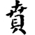
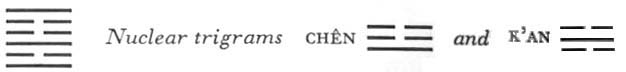

# Commentary: 22. Pi / Grace

The rulers of the hexagram are the six in the second place and the nine at the top. The Commentary on the Decision refers to these when it says: “The yielding comes and gives form to the firm, the firm ascends and gives form to the yielding.”

The Sequence

Things should not unite abruptly and ruthlessly; hence there follows the hexagram of GRACE. Grace is the same as adornment.

Miscellaneous Notes

GRACE means being undyed.
The most perfect grace consists not in external ornamentation but in allowing the original material to stand forth, beautified by being given form. The upper trigram Kên, the mountain, is disposed to remain still; fire, Li, blazes up from below and illumines the mountain. This movement is strengthened by the nuclear trigram Chên, which likewise moves upward, while the resting weight of the mountain is activated to a falling movement by the lower nuclear trigram K’an. Thus the inner structure of the hexagram shows a harmonious equalization of movement, giving no excess of energies to the one side or the other. This hexagram is the inverse of the preceding one.

### THE JUDGMENT

> GRACE has success.
>
> In small matters
>
> It is favorable to undertake something.

Commentary on the Decision

“GRACE has success.” The yielding comes and gives form to the firm; therefore, “Success.” A detached firm line ascends and gives form to the yielding; therefore, “In small matters it is favorable to undertake something.” This is the form of heaven. Having form, clear and still: this is the form of men. If the form of heaven is contemplated, the changes of time can be discovered. If the forms of men are contemplated, one can shape the world.

The text of the commentary does not appear to be intact. There seems to be a sentence missing before, “This is the form of heaven.” Wang Pi<a id="ref-1" href="#/com-22-pi-grace?id=fn-1">1</a> says: “The firm and the yielding unite alternately and construct forms: this is the form of heaven.” This was taken as the original text, now missing, but Mao Ch’i Ling<a id="ref-2" href="#/com-22-pi-grace?id=fn-2">2</a> takes another view and sees in it only an explanation of the foregoing sentence. But something of the sort must in fact be presupposed.

The yielding element that comes is the six in the second place. It places itself between the two firm lines and gives them success, gives them form. The strong element that detaches itself is the nine at the top. It places itself at the head of the two upper yielding lines and gives them the possibility of attaining form. In each case, the yang principle is the content, the yin principle the form. In the first case it is the yin line that bestows form directly and therefore brings about success, whereas the ascending yang line, by lending content, only indirectly provides the material on which the otherwise empty form of the yin lines can work itself out. Hence the effect is that it is favorable for “the small” to undertake something.

The form of heaven is symbolized by the four trigrams constituting the hexagram. The lower primary trigram Li is the sun, the lower nuclear trigram K’an is the moon; the upper nuclear trigram Chên by its movement represents the Great Bear, and the upper primary trigram Kên by its stillness represents the constellations. If one observes the rotation of the Great Bear, one knows the course of the year; through contemplation of the course of the sun and the phases of the moon, one recognizes the time of day and the periods of the month.

The form of human life results from the clearly defined (Li) and firmly established (Kên) rules of conduct, within which love (light principle) and justice (dark principle) build up the combinations of content and form. Here too love is the content and justice the form.

### THE IMAGE

> Fire at the foot of the mountain:
>
> The image of GRACE.
>
> Thus does the superior man proceed
>
> When clearing up current affairs.
>
> But he dare not decide controversial issues in this way.

This hexagram is the inverse of the preceding one. In the latter we find brightness and movement; these indicate a swift carrying out of penalties according to clearly understood laws. Here we have standstill (Kên) outside and clarity (Li) inside,and this means a theoretical, not a practical turn of mind. This attitude suffices for the application of the established rules of everyday affairs, but not for extraordinary things. One ruler of the hexagram is too weak, the other too far outside to be capable of taking hold of the situation.

### THE LINES

Nine at the beginning:

*a*) He lends grace to his toes, leaves the carriage, and walks.

*b*) “He leaves the carriage and walks,” for it accords with duty not to ride.
Being lowest, this line corresponds to the toes. The nuclear trigram K’an means a carriage. But the present line is below this trigram, hence does not ride. The six in the second place is the ruler of the hexagram; the nine in the beginning has no relationship with this ruler, so that it is not fitting for the line to ride. On the other hand, as a yang line, it possesses sufficient inner strength to be reconciled to the fate thus imposed.

Six in the second place:

*a*) Lends grace to the beard on his chin.

*b*) “Lends grace to the beard on his chin”: that is, he ascends with the one above.
The third line is the chin and the second is, as it were, merely its appendage. The upward movement that evokes grace takes place in the two lines together. The yielding element can adorn the strong, but cannot add to it any independent quality. This line has significance only in the hexagram taken as a whole; in its individual aspect it is not especially important.

Nine in the third place:

*a*) Graceful and moist.

Constant perseverance brings good fortune.

*b*) The good fortune of constant perseverance cannot, in the end, be put to shame.
The nine in the third place has content, because it is a strong line in a strong place; the six in the second place is in the relationship of holding together with it and adorns it. Hence grace. The nuclear trigram in which this line occupies the middle place is K’an, water, hence moistness. Moistness is the height of grace, and the line moreover stands at the highest point of the trigram Li, clarity. But since it also stands in the middle of the nuclear trigram K’an, the abyss, there is a danger that it may be submerged. Hence the praise of constant perseverance as a protection against this danger.

Six in the fourth place:

*a*) Grace or simplicity?

A white horse comes as if on wings.

He is not a robber,

He will woo at the right time.

*b*) The six in the fourth place is in doubt; this accords with its place.

“He is not a robber, he will woo at the right time.”

In the end, one remains free of blame.
The six in the fourth place stands outside the lower trigram and at the beginning of the upper one; hence, because of its weakness, some uncertainty arises. This is resolved by the quickly advancing first line, which is in the relationship of correspondence to it. The trigram Chên means a white horse, hence the image. White is the color of simplicity. In itself the intention of the approaching line is not quite clear, because the weak six in the fourth place is at the top of the nuclear trigram of danger. However, there is nothing to fear, because the inner relation to the oncoming line preponderates. It helps in warding off the danger of exaggerated grace and in returning to simplicity.

Six in the fifth place:

*a*) Grace in hills and gardens.

The roll of silk is meager and small.

Humiliation, but in the end good fortune.

*b*) The good fortune of the six in the fifth place has joy.
The upper trigram Kên means a large hill; the nuclear trigram Chên means a grove. By a change in the line, there arises Sun, meaning a roll of silk. The fifth place really depends on the second, but in this instance there is no relationship with the line in that place, because it too is weak. Hence the alliance with the strong line at the top, in order to enjoy grace with it.

Nine at the top:

*a*) Simple grace. No blame.

*b*) “Simple grace. No blame.” The one above attains his will.
The top line stands outside, at the top of the trigram Kên, mountain. Its strong nature allows it to forego all ornament. It chooses plain white. With the six in the fifth place joining it, it succeeds in carrying out its wish for simplicity.

NOTE. The relationships of correspondence and holding together appear in this hexagram. The six in the fourth place and the nine at the beginning are in the relationship of correspondence; the nine at the beginning leaves the carriage and goes toward the six in the fourth place, which sees it approaching as a winged horse. The second line holds together with the third, so also the fifth with the top line. Thus all of the lines are related in one way or, another, and in such a manner that it is always a reciprocal relationship between a firm and a yielding line that produces grace. Also to be noted is a tendency throughout the hexagram to counteract overemphasis of form by means of content.

---

**Notes:**

<a id="fn-1" href="#/com-22-pi-grace?id=ref-1">**1.**</a> A.D. 226–249.

<a id="fn-2" href="#/com-22-pi-grace?id=ref-2">**2.**</a> A.D. 1623–1716.
