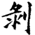
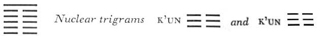

# Commentary: 23. Po / Splitting Apart

The ruler of the hexagram is the nine at the top. Although the dark force splinters the light, the light principle cannot be wholly split apart; therefore it is the ruler of the hexagram.

The Sequence

When one goes too far in adornment, success exhausts itself. Hence there follows the hexagram of SPLITTING APART. Splitting apart means ruin.

Miscellaneous Notes

SPLITTING APART means decay.
The thought here, taken together with that in the next hexagram, shows the connection between decay and resurrection. Fruit must decay before new seed can develop.

The sinking tendency of the hexagram is very strong. Both nuclear trigrams as well as the lower primary trigram are K’un, whose movement is downward. In contrast with this the upper primary trigram Kên stands still, without motion. This leads to a loosening of the structure. The tendency of the five yin lines is to bring about the downfall of the yang line at the top, in that they sink down and thus take the ground from under it. Here too the fundamental trend of the Book of Changes is expressed: the light principle is represented as invincible because in its sinking it creates new life, as does a grain of wheat when it sinks into the earth.

### THE JUDGMENT

> SPLITTING APART. It does not further one
>
> To go anywhere.

Commentary on the Decision

SPLITTING APART means ruin. The yielding changes the firm.

“It does not further one to go anywhere.” Inferior people increase.

Devotion and keeping still result from contemplating the image. The superior man takes heed of the alternation of increase and decrease, fullness and emptiness; for it is the course of heaven.

The yielding element changes the strong by imperceptible gradual influence. The yin lines are about to increase. This gives us the attitude of the superior man in such times, an attitude that derives from the two trigrams. In accordance with the attribute of the trigram K’un, he is devoted; in accordance with that of Kên he is calm, which means that he undertakes nothing, because the time is not yet come. Thus he submits to the course of heaven, which alternates between decrease and increase, in that whatever is full decreases and whatever is empty increases.

### THE IMAGE

> The mountain rests on the earth:
>
> The image of SPLITTING APART.
>
> Thus those above can ensure their position
>
> Only by giving generously to those below.

The broader the base of the mountain, the less is it liable to splitting apart. Here it is not so much the condition of splitting apart that is set forth as the condition that can prevent it. Hence also it is not the waning of the light principle and the waxing of the shadowy that are to be considered, but the solidity of the foundation. Through generous giving, such aslies in the nature of the earth (K’un), an assured calm, such as lies in the nature of the mountain (Kên), is attained.

### THE LINES

Six at the beginning:

*a*) The leg of the bed is split.

Those who persevere are destroyed.

Misfortune.

*b*) “The leg of the bed is split,” in order to destroy those below.
The position at the beginning, as the lowest place, means the leg. What is split is the resting place, hence the image of a bed. The splitting begins below. Therein lies the danger.

Six in the second place:

*a*) The bed is split at the edge.

Those who persevere are destroyed.

Misfortune.

*b*) “The bed is split at the edge,” because one has no comrade.
The splitting apart mounts upward from the leg of the bed. Now the edge is splitting. This line is isolated; it is neither in the relationship of correspondence to the lines around it nor in that of holding together. Already the attack is emerging from concealment into the open.

Six in the third place:

*a*) He splits with them. No blame.

*b*) “He splits with them. No blame.” He loses the neighbor above and the one below.
This line is in the relationship of correspondence to the nine at the top and quarrels with its environment because it remains loyal to these original ties. Because of this relation with the nine at the top, the line becomes separated from the two neighboring lines, with which there is no relationship of holding together.

Six in the fourth place:

*a*) The bed is split up to the skin.

Misfortune.

*b*) “The bed is split up to the skin. Misfortune.” This is a serious and immediate misfortune.
The trigram K’un below represents the bed, the resting place. The trigram Kên above represents the person resting. Here the splitting spreads from the resting place to the person resting on it; therefore misfortune is directly at hand.

Six in the fifth place:

*a*) A shoal of fishes. Favor comes through the court ladies.

Everything acts to further.

*b*) “Favor comes through the court ladies.” In the end this is not a mistake.
When this line changes, the upper trigram becomes Sun, which means fish (the fish is associated with the shadowy principle). The line is in the ruler’s place. Here, however, since the activity of the yin power becomes clearly manifest, it represents a queen, not a prince. The line stands in the relationship of holding together with the top line, hence there is no hostile activity; on the contrary, at the peak of its influence it subordinates itself to the yang line, which it approaches while leading the other four yin lines as though they were a shoal of fishes. These friendly relationships are represented in terms of the ruler’s relationship to the court ladies and his queen.

Nine at the top:

*a*) There is a large fruit still uneaten.

The superior man receives a carriage.

The house of the inferior man is split apart.

*b*) “The superior man receives a carriage.” He is carried by the people.

“The house of the inferior man is split apart”: he ends up as useless.
The one strong line at the top, containing the seed of the future, is seen in the image of a large fruit. K’un means a carriage. The collapse of the line through its change into a yin line is compared to the collapse of an inferior man’s hut. The line is, so to speak, the roof of the whole hexagram. When it falls apart the whole collapses.
