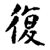
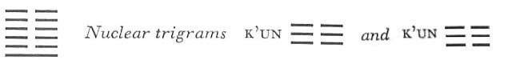

# Commentary: 24. Fu / Return (The Turning Point)

The ruler of the hexagram is the nine at the beginning. This is the line referred to by the Commentary on the Decision in the statement, “The firm returns.”

The Sequence

Things cannot be destroyed once and for all. When what is above is completely split apart, it returns below. Hence there follows the hexagram of RETURN.

Miscellaneous Notes

RETURN means coming back.

Appended Judgments

RETURN is the stem of character. RETURN is small, yet different from external things. RETURN leads to self-knowledge.

The hexagram of RETURN, applied to character formation, contains various suggestions. The light principle returns: thus the hexagram counsels turning away from the confusion of external things, turning back to one’s inner light. There, in the depths of the soul, one sees the Divine, the One. It is indeed only germinal, no more than a beginning, a potentiality, but as such clearly to be distinguished from all objects. To know this One means to know oneself in relation to the cosmic forces. For this One is the ascending force of life in nature and in man.

This hexagram is the inverse of the preceding one, and the movement tends very strongly upward from below—from the trigram Chên—going through the sinking trigram K’un.

### THE JUDGMENT

> RETURN. Success.
>
> Going out and coming in without error.
>
> Friends come without blame.
>
> To and fro goes the way.
>
> On the seventh day comes return.
>
> It furthers one to have somewhere to go.

Commentary on the Decision

“RETURN has success.” The firm returns.

Movement and action through devotion. Therefore, “Going out and coming in without error.”

“Friends come without blame. To and fro goes the way. On the seventh day comes return.” This is the course of heaven.

“It furthers one to have somewhere to go.” The firm is on the increase.

In the hexagram of RETURN one sees the mind of heaven and earth.

This hexagram expresses the idea that the light force is the creative principle of heaven and earth. It is an eternal cyclic movement, from which life comes forth again just at themoment when it appears to have been completely vanquished. Through the re-entrance of the yang line into the hexagram below, movement develops (Chên, the lower trigram), and this movement acts through devotion (K’un, the upper trigram). Going out and coming in are without error. The yang force has indeed gone (cf. the foregoing hexagram, Po), but like a fruit falling to earth, it has not disappeared without a trace; it has left an effect behind. This effect shows itself in the re-entrance of the yang line. The friends who come are either the other yang lines about to enter the hexagram after this first line (according to Ch’êng Tz
u), or the five yin lines, which meet the yang line cordially. The way of yang goes to and fro, up and down. After the light force begins to diminish in Kou, COMING TO MEET (44), it returns again in the hexagram Fu, after seven changes.

“It furthers one to have somewhere to go,” that is, to undertake something. Both this sentence and the image of the friends occur in the text of the second hexagram, K’un, THE RECEPTIVE.

### THE IMAGE

> Thunder within the earth:
>
> The image of THE TURNING POINT.
>
> Thus the kings of antiquity closed the passes
>
> At the time of solstice.
>
> Merchants and strangers did not go about,
>
> And the ruler
>
> Did not travel through the provinces.

The hexagram is associated with the month of the winter solstice. From this are drawn the conclusions resulting in the right behavior at the time when the returning yang force is still weak and must therefore be strengthened by rest.

### THE LINES

Nine at the beginning:

*a*) Return from a short distance.

No need for remorse.

Great good fortune.

*b*) “Return from a short distance”: thus one cultivates one’s character.
The strong line at the bottom turns back at once. The first line of Chên is very mobile; hence the immediate turnabout before going too far. Confucius says about this line:

“Yen Hui is one who will surely attain it. If he has a fault, he never fails to recognize it; having recognized it, he never commits the error a second time. In the Book of Changes it is said: ‘Return from a short distance. No need for remorse, Great good fortune.’”

Six in the second place:

*a*) Quiet return. Good fortune.

*b*) The good fortune of a quiet return depends on subordination to a good man.
This line is central and modest (yielding), and stands in the relationship of holding together with the ruler of the hexagram, the nine at the beginning. The good fortune depends on the resulting subordination to this good man.

Six in the third place:

*a*) Repeated return. Danger. No blame.

*b*) The danger of repeated return is, in its essential meaning, deliverance from blame.
This line is at the peak of movement. This points to a repeated turning back. The first turning back is from good to bad. The second is from bad to good once more. This line likewise turns, as a friend to the nine at the beginning.

Six in the fourth place:

*a*) Walking in the midst of others,

One returns alone.

*b*) “Walking in the midst of others, one returns alone,” and so follows the right way.
The fourth line is in the middle of the upper nuclear trigram K’un; it is moreover the top line of the lower nuclear trigram K’un and the lowest line of the upper primary trigram K’un. In a word, it is in the midst of weak lines, and is itself compliant and in a weak place. One might infer a lack of initiative. But this line is in the relationship of correspondence to the strong nine at the beginning, hence solitary return.

Six in the fifth place:

*a*) Noblehearted return. No remorse.

*b*) “Noblehearted return. No remorse.” Central, therefore he is able to test himself.
This line is actually very far away from the nine at the beginning. But it is central; therefore it is possible for it to test itself and thus to find a way of turning back from all mistakes. The relationship with the nine at the beginning is not suggested by any external ties, hence it represents noblehearted free decision.

Six at the top:

*a*) Missing the return. Misfortune.

Misfortune from within and without.

If armies are set marching in this way,

One will in the end suffer a great defeat,

Disastrous for the ruler of the country.

For ten years

It will not be possible to attack again.

*b*) The misfortune in missing the return lies in opposing the way of the superior man.
This line is at the end of the yin lines, hence there is no turning back for it. In refusing to turn back it defiantly seeks to attain its objective by force, thereby, however, owing to inner and outer misfortune, it loses for a long time all possibility of recuperating. The top line in the hexagram K’un, THE RECEPTIVE, has a similar judgment.

The trigram Chên means a general, K’un means crowd, hence “to set armies marching.” K’un means nation, Chên means ruler. Ten is the number belonging to the earth.

NOTE. Missing the return (six at the top) is the opposite of return from a short distance (nine at the beginning). The first line is not far off and comes back. Quiet return (six in the second place) and solitary return (six in the fourth place) resemble each other; both lines are related to the ruler of the hexagram. Repeated return (six in the third place) and noblehearted return (six in the fifth place) are opposites: in the one there is going back and forth, the other shows calm consistency.
