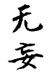
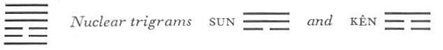

# Commentary: 25. Wu Wang / Innocence (The Unexpected)

The rulers of the hexagram are the nine at the beginning and the nine in the fifth place. The nine at the beginning is the first movement of the light principle as well as the first movement of the sincere heart of man. The nine in the fifth place symbolizes the essence of the Creative, as well as the tirelessness of the supremely sincere. Therefore it is said in the Commentary on the Decision: “The firm comes from without and becomes the ruler within.” This refers to the first line. And further: “The firm is in the middle and finds correspondence.” This refers to the fifth line.

The Sequence

By turning back one is freed of guilt. Hence there follows the hexagram of INNOCENCE.

Miscellaneous Notes

THE UNEXPECTED means misfortune from without.
Innocence frees itself of mistakes, so that no misfortune of internal origin can overtake it. When misfortune comes unexpectedly, it has an external origin, therefore it will pass again.

The hexagram has a very strong ascending tendency; both the upper and the lower trigram have an upward movement. This fact suggests movement in harmony with heaven, which is man’s true and original nature. The two nuclear trigrams, Kên, Keeping Still, mountain, and Sun, the Gentle, wind (tree), yield the idea of the functioning and development of the primal trends.

### THE JUDGMENT

> INNOCENCE. Supreme success.
>
> Perseverance furthers.
>
> If someone is not as he should be,
>
> He has misfortune,
>
> And it does not further him
>
> To undertake anything.

Commentary on the Decision

INNOCENCE. The firm comes from without and becomes the ruler within. Movement and strength. The firm is in the middle and finds correspondence.

“Great success through correctness”: this is the will of heaven.

“If someone is not as he should be, he has misfortune, and it does not further him to undertake anything.” When innocence is gone, where can one go? When the will of heaven does not protect one, can one do anything?

The firm element coming from without is the lowest line, a yang line. It comes from heaven (Ch’ien). The Receptive, inapproaching the Creative for the first time, receives the first line of Ch’ien and gives birth to Chên, the eldest son. Applied to man, this means that he receives the primal divine spirit as his guide and master. The attribute of the lower trigram, Chên, is movement, that of the upper, Ch’ien, is strength. The firm line in a central position that finds correspondence is the upper ruler of the hexagram, the nine in the fifth place, and the six in the second place corresponds with it. This all leads to success, because it shows man in the proper relationship to the divine, without ulterior designs and in primal innocence. Thus man is in harmony with heavenly fate, the will of heaven, just as the lower trigram harmonizes in movement with the upper.

But where the natural state is not this state of innocence, where desires and ideas are astir, misfortune follows of inner necessity. This hexagram differs from P’i, STANDSTILL, only in having a firm line at the beginning. If this should lose its firmness, the whole situation would change.<a id="ref-1" href="#/com-25-wu-wang-innocence-the-unexpected?id=fn-1">1</a>

### THE IMAGE

> Under heaven thunder rolls:
>
> All things attain the natural state of innocence.
>
> Thus the kings of old,
>
> Rich in virtue, and in harmony with the time,
>
> Fostered and nourished all beings.

“Under heaven thunder rolls: all things attain the natural state of innocence.” This image is explained by the saying in. the Discussion of the Trigrams: “God comes forth in the sign of the Arousing.” This is the beginning of all life. Here we have the Creative above in association with movement: The upper nuclear trigram is wood, the lower is mountain.

“Rich in virtue” refers to the strength of the Creative. “The time” derives from the trigram Chên (east and spring)—the trigram in which life comes forth. Fostering and nourishing are indicated by the nuclear trigram Kên, mountain. The fact that this influence extends to everything is symbolized by the nuclear trigram Sun, meaning wind and universal penetration.

### THE LINES

Nine at the beginning:

*a*) Innocent behavior brings good fortune.

*b*) Innocent behavior attains its will.
Innocence is symbolized by the light character of the line, which enters as ruler below the two dark lines. Coming from heaven, it bears within itself the warrant of success. It attains its goal with intuitive certainty.

Six in the second place:

*a*) If one does not count on the harvest while plowing,

Nor on the use of the ground while clearing it,

It furthers one to undertake something.

*b*) Not plowing in order to reap: that is, one does not seek wealth.
The trigram Chên means wood, hence a plow, and the second place is that of the field. The nuclear trigram Kên means hand, hence the image of clearing a field.

This line is central and correct. On the one hand, it is in the relationship of holding together with the nine at the beginning; on the other, it is in the relationship of correspondence to the nine in the fifth place. But being central and correct, it does not allow itself to be deflected by these relationships. It is the lowest line in the nuclear trigram Kên, Keeping Still, hence it keeps a calm mind; but it is also in the middle of the trigram Chên, movement, hence may undertake something.

Six in the third place:

*a*) Undeserved misfortune.

The cow that was tethered by someone

Is the wanderer’s gain, the citizen’s loss.

*b*) If the wanderer gets the cow, it is the citizen’s loss.
This line stands at the high point of movement and at the beginning of the nuclear trigram Sun, wind. Therefore it is in its movements not in harmony with the time. It is equally farfrom both rulers of the hexagram and hence does not find the right connection anywhere. Through change in this line, the trigram Li, meaning cow, develops below.

Nine in the fourth place:

*a*) He who can be persevering

Remains without blame.

*b*) “He who can be persevering remains without blame,” for he possesses firmly.
The nine in the fourth place is originally neither correct nor central. However, as the lowest line in the trigram Ch’ien, it is able to preserve the firmness belonging to the Creative. By this means it remains free of the blame otherwise to be feared.

Nine in the fifth place:

*a*) Use no medicine in an illness

Incurred through no fault of your own.

It will pass of itself.

*b*) One should not try an unknown medicine.
Medicine is suggested by the two nuclear trigrams, wood and stone (mountain). The illness is innocently incurred because this line, as the middle line of the Creative, represents a person by nature free of illness; that he appears ill comes from his way of taking the illnesses of others upon himself. His central, correct, and ruling position predisposes him to allow the ills of others, vicariously taken upon himself, to work themselves out in him.

Nine at the top:

*a*) Innocent action brings misfortune.

Nothing furthers.

*b*) Action without reflection brings about the evil of bewilderment.
This line is related to the weak, restless six in the third place. Thoughtless action brings misfortune. The line is at the end,in a time when action is no longer appropriate. To go on thoughtlessly leads to bewilderment. The line describes a situation similar to that of the top line of THE CREATIVE.

NOTE. In this hexagram the six lines are all innocent, that is, naïve, without ulterior motives. The nine at the beginning is in its appropriate place and is the ruler of the trigram of movement; this indicates that the time has come to act. Hence action brings good fortune. The nine at the top is not in the right place and stands outermost in the trigram Ch’ien. The time to act has already passed. Hence action, even though innocent, brings misfortune. Everything depends on the time. The line at the beginning has good fortune, the second is favorable; this is due to the time. The third line bears an augury of misfortune, the fifth of illness, the top line of misfortune. All this does not happen by plan, but is likewise the result of the time conditions. It is possible for the first and second lines to advance. The time has come for them to move. The fourth should remain steadfast, the fifth should use no medicine, the top line has misfortune if it acts: all this indicates that for these lines the time has come to remain quiet.

---

**Notes:**

<a id="fn-1" href="#/com-25-wu-wang-innocence-the-unexpected?id=ref-1">**1.**</a> In this hexagram there appear ideas that correspond with the mystical interpretations of the legends of Paradise and the fall of man.
