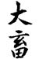
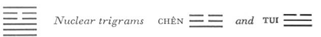

# Commentary: 26. Ta Ch'u / The Taming Power of the Great

The rulers of the hexagram are the six in the fifth place and the nine at the top. These are the lines referred to when it is said in the Commentary on the Decision: “The firm ascends and honors the worthy.”

The Sequence

When innocence is present, it is possible to tame. Hence there follows THE TAMING POWER OF THE GREAT.

Holding fast to heavenly virtue is the prerequisite for innocence. On the other hand, innocence is the indispensable condition for being able to hold fast to pristine heavenly virtue.

Miscellaneous Notes

THE TAMING POWER OF THE GREAT depends on the time.
The movements of the two trigrams are toward each other. The Creative below presses powerfully upward, and Keeping Still above holds it fast. The nuclear trigrams Chên and Tui also have a tendency to rise, the upper more so than the lower. These are the latent forces that are intensified by the holding fast. The two weak lines occupying the ruler’s and the minister’s place restrain the strong lines below, while showing recognition and liberality toward the strong line above. This hexagram is the inverse of the preceding one.

### THE JUDGMENT

> THE TAMING POWER OF THE GREAT.
>
> Perseverance furthers.
>
> Not eating at home brings good fortune.
>
> It furthers one to cross the great water.

Commentary on the Decision

THE TAMING POWER OF THE GREAT. Firmness and strength. Genuineness and truth. Brilliance and light. Daily he renews his virtue.

The firm ascends and honors the worthy. He is able to keep strength still; this is great correctness.

“Not eating at home brings good fortune,” for people of worth are nourished.

“It furthers one to cross the great water,” because one finds correspondence in heaven.

The upper trigram Kên is firm, the lower, Ch’ien, is strong; the upper is genuine, the lower is true: the upper is brilliant, the lower light. Thus the two trigrams complement each other. Through keeping still (Kên), the powers of character (Ch’ien) are so strengthened that a daily renewal takes place. This refers to the effect of the personality. Here the first meaning of the hexagram is given—keeping still and collecting oneself,

The firm element that ascends is the nine at the top. It, mounts above the six in the fifth place—the place of the ruler—and this ruler honors it in its ascent because it is worthy. The upper trigram Kên, Keeping Still, is able to hold fast the lower, Ch’ien, the strong. This explains the words of the Judgment: “Perseverance furthers.” Here we have the second meaning of the hexagram—holding fast and keeping still.

Not eating at home, that is, entering public service, brings good fortune, because the six in the fifth place represents a ruler who nourishes people of worth. This gives the third meaning—holding fast and nourishing.

“It furthers one to cross the great water.” This idea is suggested by the two nuclear trigrams—Chên, which also means wood, over Tui, lake. This dangerous action is possible because the ruler of the hexagram, the six in the fifth place, is in the relationship of correspondence to the nine in the second place, the central line of the lower trigram, heaven (Ch’ien).

### THE IMAGE

> Heaven within the mountain:
>
> The image of THE TAMING POWER OF THE GREAT.
>
> Thus the superior man acquaints himself with many sayings of antiquity
>
> And many deeds of the past,
>
> In order to strengthen his character thereby.

Heaven (Ch’ien) points to character, virtue. Strengthening is suggested by the mountain (Kên). The means to this strengthening of character are hidden in the nuclear trigrams: thelower, Tui, mouth, suggests words; the upper, Chên, movement, suggests deeds.

### THE LINES

Nine at the beginning:

*a*) Danger is at hand. It furthers one to desist.

*b*) “Danger is at hand. It furthers one to desist.” Thus one does not expose oneself to danger.
This strong line, which is in its proper place, would like to advance. But it is in the relationship of correspondence to the six in the fourth place, which is one of the two obstructing lines. This indicates danger that would hold it back if it should try to advance; but since the line is still just at the beginning, it allows itself to be held back and so escapes the danger.

Nine in the second place:

*a*) The axletrees are taken from the wagon.

*b*) “The axletrees are taken from the wagon.” In the middle there is no blame.
Ch’ien is round, hence the image of the wheel. Tui, the nuclear trigram, indicates breaking. The nine in the second place is central, hence able to control itself. It is held back by the six in the fifth place, to which it is related.

Nine in the third place:

*a*) A good horse that follows others.

Awareness of danger,

With perseverance, furthers.

Practice chariot driving and armed defense daily.

It furthers one to have somewhere to go.

*b*) “It furthers one to have somewhere to go.” The will of the one above is in agreement.
Ch’ien is a good horse; the nuclear trigram Chên, in which this is the beginning line, is movement, hence advance. This line stands in the relationship of congruity to the nine at the top,hence the agreement in will between them. But the fourth and the fifth line still create separation and danger, which must be borne in mind. The chariot is suggested by the trigram Ch’ien, the weapons by the nuclear trigram Tui, meaning metal and breaking.

Six in the fourth place:

*a*) The headboard of a young bull.

Great good fortune.

*b*) The great good fortune of the six in the fourth place consists in the fact that it has joy.
This line constitutes the horns of the nuclear trigram Tui, which to be sure means sheep and not horned cattle. The line easily restrains the nine at the beginning before it has begun to be dangerous, hence the joy.

Six in the fifth place:

*a*) The tusk of a gelded boar.

Good fortune.

*b*) The good fortune of the six in the fifth place consists in the fact that it has blessing.
Another interpretation reads: “The tethering post of a young pig.” The meaning is doubtless that of an indirect check before the danger grows formidable. An old commentary connects the pig of this line, as well as the bull of the preceding line, with sacrificial rites, hence the good fortune and the blessing. In any case, the blessing comes from the relationship of this line to the middle line of the lower trigram, heaven.

Nine at the top:

*a*) One attains the way of heaven. Success.

*b*) “One attains the way of heaven.” Truth works in the great.
The top line is honored as a sage by the six in the fifth place. It stands in the relationship of congruity to the nine in thethird place, which is, however, the top line of the trigram Ch’ien, heaven. The upper trigram Kên means a way.

NOTE. In this hexagram, the relationships between the yin and the yang lines are not those of correspondence and furtherance, but, in accordance with the character of the hexagram, those of obstruction. The lines of the lower trigram are obstructed, those of the upper trigram are the obstructors. Only the third and the top line, which, as two yang lines, are in harmony, are free of the idea of obstruction.

The persons represented by the first two lines are still eating at home and still obstructed in crossing the great water. The fourth and fifth lines operate by obstructing the two misbehaving lines—this is easy for the one, more difficult for the other. The third line advances, though with caution and under difficulties. The top line alone has a clear path ahead, and the obstacles disappear. It stands for the person of worth who can achieve great things and who is nourished.
