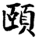
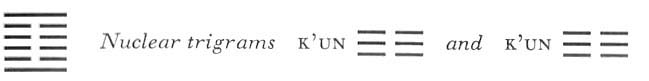

# Commentary: 27. I / The Corners of the Mouth (Providing Nourishment)

The rulers of the hexagram are the six in the fifth place and the nine at the top. These are the lines referred to in the Commentary on the Decision: “He provides nourishment for men of worth and thus reaches the whole people.”

The Sequence

When things are held fast, there is provision of nourishment. Hence there follows the hexagram ofTHE CORNERS OF THE MOUTH. “The corners of the mouth” means the providing of nourishment.

Miscellaneous Notes

THE CORNERS OF THE MOUTH means providing nourishment for what is right.
The two primary trigrams are opposed in movement. Kên, the upper, stands still; Chên, the lower, moves upward. This suggests the jaws and teeth. The upper jaw is immobile, the lower moves; hence the designation of the hexagram as THE CORNERS OF THE MOUTH. In contrast to Hsü, WAITING (5), which also deals with provision of nourishment but emphasizes man’s dependence on nourishment, the theme of the hexagram I is rather the human role in the providing of nourishment. A secondary meaning is that of providing nourishment first for men of worth, in order that thereby the people also may be nourished. The two hexagrams therefore present provision of nourishment as a natural process (Hsü, WAITING) and as a social problem (I, THE CORNERS OF THE MOUTH). A similar contrast obtains between the two hexagrams denoting nourishment in itself—Ching, THE WELL (48), the water necessary for nourishment, and Ting, THE CALDRON (50), the food necessary for nourishment.

### THE JUDGMENT

> THE CORNERS OF THE MOUTH.
>
> Perseverance brings good fortune.
>
> Pay heed to the providing of nourishment
>
> And to what a man seeks
>
> To fill his own mouth with.

Commentary on the Decision

“THE CORNERS OF THE MOUTH. Perseverance brings good fortune.” If one provides nourishment for what is right, good fortune comes.

“Pay heed to the providing of nourishment,” that is, pay heed to what a man provides nourishment for.

“To what he seeks to fill his own mouth with,”that is, pay heed to what a man nourishes himself with.

Heaven and earth provide nourishment for all beings. The holy man provides nourishment for men of worth and thus reaches the whole people. Truly great is the time of PROVIDING NOURISHMENT.

As an image the hexagram is conceived as a whole—as the image of an open mouth; consequently there is no need of explaining how it came to mean provision of nourishment. But it stresses the idea that as regards the manner of providing nourishment, everything depends on its being in harmony with what is right. In accord with the character of the two trigrams—movement and keeping still—there is no relation of correspondence between the relevant lines of the lower and the upper trigram. The lower trigram seeks nourishment for itself, the upper affords nourishment for others.

### THE IMAGE

> At the foot of the mountain, thunder:
>
> The image of PROVIDING NOURISHMENT.
>
> Thus the superior man is careful of his words
>
> And temperate in eating and drinking.

Thunder is the trigram in which God comes forth; the mountain is the trigram in which all things are completed. This is the image of PROVIDING NOURISHMENT. From the hexagram as a whole, as representing an open mouth are derived the movements of the mouth, speech and the taking in of food. This movement corresponds with the character of the trigram Chên. It must be moderated if it is to be correct. This is in correspondence with the character of the trigram Kên.

### THE LINES

Nine at the beginning:

*a*) You let your magic tortoise go,

And look at me with the corners of your mouth drooping.

Misfortune.

*b*) “You … look at me with the corners of your mouth drooping”: this is really not to be respected.
Structurally the whole hexagram recalls the trigram Li, the Clinging, hence the image of a tortoise.

The hexagram contains three ideas—nourishing oneself, nourishing others, and being nourished by others. The strong line at the top, the ruler of the hexagram, provides nourishment for others. The weak middle lines are obliged to depend on others to provide them with nourishment. The strong line below should indeed be able to provide nourishment for itself (the magic tortoise needs no earthly food but can nourish itself on air). Instead, however, it too moves toward the general source of nourishment and wants to be fed with the rest. This is contemptible and disastrous. “You” is the nine at the beginning, “me” is the nine at the top.

Six in the second place:

*a*) Turning to the summit for nourishment,

Deviating from the path

To seek nourishment from the hill.

Continuing to do this brings misfortune.

*b*) If the six in the second place continues to do this, it brings misfortune, because in going it loses its place among its kind.
The six in the second place could seek nourishment from its peer, the nine at the beginning. Instead, it turns aside from this path and seeks nourishment at the summit, that is, from the upper ruler of the hexagram (the upper trigram is Kên, mountain). This brings misfortune.

Another interpretation reads: “To seek to be provided with nourishment the other way round (by the nine at the beginning) or, leaving the path, to seek nourishment from the hill (the nine at the top) brings misfortune.”

Six in the third place:

*a*) Turning away from nourishment.

Perseverance brings misfortune.

Do not act thus for ten years.

Nothing serves to further.

*b*) “Do not act thus for ten years,” because it is all too contrary to the right way.
This line also, standing at the top of the trigram Chên, movement, seeks nourishment from the nine at the top instead of from the nine at the bottom. “Ten years” is implied by the nuclear trigram K’un, whose number is ten. The reason why this behavior is so severely criticized is that the line seeks personal advantages on the basis of its relationship of correspondence, which is not valid in this hexagram.

Six in the fourth place:

*a*) Turning to the summit

For provision of nourishment

Brings good fortune.

Spying about with sharp eyes

Like a tiger with insatiable craving.

No blame.

*b*) The good fortune in turning to the summit to be provided with nourishment inheres in the fact that the one above spreads light.
This line likewise turns to the nine at the top to be provided with nourishment, but because it belongs to the same trigram as the latter, this brings good fortune, in contrast to the fate of the six in the second place. “Spying about with sharp eyes” derives from the form of the hexagram, which is reminiscent of Li. The trigram Li also means eye.

Six in the fifth place:

*a*) Turning away from the path.

To remain persevering brings good fortune.

One should not cross the great water.

*b*) The good fortune in remaining persevering comes from following the one above devotedly.
This line is in the place of the ruler, but as a yielding, submissive line, it stands in the relationship of receiving to the strong line above it. Hence it devotedly places itself below the latter. (When the hexagram changes into the next one, the upper trigram Kên becomes Tui, lake. The fifth line then gets into the middle of the water, hence it is not favorable to cross the great water.)

Nine at the top:

*a*) The source of nourishment.

Awareness of danger brings good fortune.

It furthers one to cross the great water.

*b*) “The source of nourishment. Awareness of danger brings good fortune.” It has great blessing.
The danger comes from the responsibility of the position at the top of the hexagram and from the fact that, in addition, the line receives authority and honor from the yielding ruler in the fifth place. But in this position it dispenses great blessing. Being thus aware of the danger, it is able to undertake great enterprises, such as crossing the great water. (When the hexagram changes into the following one, this line is on the surface of Tui, the lake, hence, unlike the preceding line, not in danger of drowning.)
