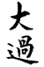
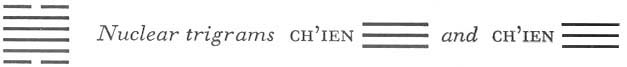

# Commentary: 28. Ta Kuo / Preponderance of the Great

The rulers of the hexagram are the nine in the second place and the nine in the fourth. The nine in the second place is firm, central, and not too heavy. The nine in the fourth place is a beam that does not sag to the breaking point.

The Sequence

Without provision of nourishment one cannot move; hence there follows the hexagram of PREPONDERANCE OF THE GREAT.

Nourishing without putting to use finally evokes movement. Movement without end leads finally too far, to overweighting.

Miscellaneous Notes

PREPONDERANCE OF THE GREAT is the peak.
The peak refers to the image of the ridgepole mentioned in the Judgment. The hexagram shows great strength within. Both the nuclear trigrams are Ch’ien, whose attribute is strength. But underneath is the gentle Sun, penetrating indeed, but ethereal as well, while above is the joyous Tui, the lake. Thus the outer ends are not equal to the weight of the strong structure within; hence the great in preponderance. This hexagram is the opposite of the preceding one.

Appended Judgments

In ancient times the dead were buried by covering them thickly with brushwood and placing them in the open country, without burial mound or grove of trees. The period of mourning had no definite duration. The holy men of a later time introduced inner and outer coffins instead. They probably took this from—the hexagram of PREPONDERANCE OF THE GREAT.

The hexagram represents wood that has penetrated below ground water; this gives the coffin image. Another explanation—holds that the two yin lines (above and below) represent the earth and trees of the burial place, while the yang lines between indicate the coffin. When the dead are thus well cared for, they enter (Sun) the earth and are happy (Tui). This hexagram is the opposite of the preceding one in this further respect, that the former shows the provisions of nourishmentfor the living, and the present one shows the care provided for the dead.

### THE JUDGMENT

> PREPONDERANCE OF THE GREAT.
>
> The ridgepole sags to the breaking point.
>
> It furthers one to have somewhere to go.
>
> Success.

Commentary on the Decision

PREPONDERANCE OF THE GREAT. The great preponderates. The ridgepole sags to the breaking point because beginning and end are weak.

The firm preponderates and is central. Gentle and joyous in action: then it furthers one to have somewhere to go, then one has success.

Great indeed is the time of PREPONDERANCE OF THE GREAT.

The name is explained on the basis of the structure. The great, that is, the yang element, outnumbers with its four lines the two lines of the yin element. This by itself would not mean preponderance, but the great is within, although it belongs without. Similarly, the small preponderates (cf. hexagram 62) when weak lines are in the majority and without, for by their nature they belong within. As representing preponderance of the great, the hexagram suggests the image of a ridgepole, the top beam of a house, on which the whole roof rests. Since beginning and end are weak, there arises the danger of a too great inner weight and of consequent sagging to the breaking point.

Despite this extraordinary situation, action is important. If the weight were to remain where it is, misfortune would arise. By means of movement, however, one gets out of the abnormal condition, chiefly because the ruler in the lower trigram is central and strong. The attributes of the trigrams, joyousness and gentleness, also indicate the right behavior for successful action.

### THE IMAGE

> The lake rises above the trees:
>
> The image of PREPONDERANCE OF THE GREAT.
>
> Thus the superior man, when he stands alone,
>
> Is unconcerned,
>
> And if he has to renounce the world,
>
> He is undaunted.

The ideas of standing alone and of renunciation of the world are derived from the situation indicated by the hexagram as a whole. Standing alone unconcerned is suggested by the symbol of Sun, the tree, and undauntedness by the attribute of Tui, joyousness.

### THE LINES

Six at the beginning:

*a*) To spread white rushes underneath.

No blame.

*b*) “To spread white rushes underneath”: the yielding is underneath.
The yielding line under the strong ruler of the hexagram, the nine in the second place, indicates that the load is set down with caution. Confucius says about this line:

“It does well enough simply to place something on the floor. But if one puts white rushes underneath, how could that be a mistake? This is the extreme of caution. Rushes in themselves are worthless, but they can have a very important effect. If one is as cautious as this in all that one does, one remains free of mistakes.”

Nine in the second place:

*a*) A dry poplar sprouts at the root.

An older man takes a young wife.

Everything furthers.

*b*) “An older man takes a young wife.” The extraordinary thing is their coming together.
The trigram for wood stands under the trigram for water, hence the image of the poplar, which grows near water. This line, the ruler of the hexagram, has the relationship of holding together with the six at the beginning. On the one hand, this produces the image of a root sprouting afresh from below and so renewing the life process; on the other hand, it represents an older man (the nine in the second place) who takes a young girl to wife (the six at the beginning). Although this is something out of the ordinary, everything is favorable.

Nine in the third place:

*a*) The ridgepole sags to the breaking point.

Misfortune.

*b*) The misfortune of the sagging and breaking of the ridgepole is due to its finding no support.
The third and the fourth line, occupying the middle of the hexagram, represent the ridgepole. The nine in the third place is a firm line in a firm place, which gives too much firmness for an exceptional time, hence the misfortune of bending and breaking threatens. For through obstinacy one cuts oneself off from the possibility of support.

Nine in the fourth place:

*a*) The ridgepole is braced. Good fortune.

If there are ulterior motives, it is humiliating.

*b*) The good fortune of the braced ridgepole lies in the fact that it does not sag downward and break.
This line is in better state than the preceding one. It does not sag down and break. While the nine in the third place is too strong and restless, the firmness of the nine in the fourth place is modified by the yieldingness of its position. While the nine in the third place is exposed to the danger of breaking because it is the top line of the trigram Sun, which is open underneath and hence weak, the nine in the fourth place rests at the bottom of the trigram Tui, which is open at the top; hence its security. “Ulterior motives” is implied by the fact that this lineis related by correspondence to the six at the beginning, but here no conclusions may be drawn from that fact, because the chief thing to be considered about this line is its position, as minister, in relation to the ruler in the fifth place.

Nine in the fifth place:

*a*) A withered poplar puts forth flowers.

An older woman takes a husband.

No blame. No praise.

*b*) “A withered poplar puts forth flowers.” How could this last long?

“An older woman takes a husband.” It is nevertheless a disgrace.
This line stands in contrast to the nine in the second place. In the latter an older man marries a young girl, here an older woman takes a husband. There the poplar puts forth sprouts at the root; here it puts forth flowers. There the relation of correspondence is with the line below, hence a sprouting root; here it is with the line above, hence the flowers. There the strong nine in the second place is the man who marries a young girl (the six at the beginning); here the six at the top is the old woman who marries the nine in the fifth place.

Six at the top:

*a*) One must go through the water.

It goes over one’s head.

Misfortune. No blame.

*b*) One should not join blame to the misfortune of going through the water.
The upper trigram Tui is a lake, hence the water. The nuclear trigram is Ch’ien, the head. The upper nuclear trigram ends with the nine in the fifth place; thus the six at the top shows water reaching above the head. However, one ought not to join blame to the misfortune, because it is due to the time, and the intention is good. This oracle, “Misfortune. No blame,” isamong the noblest thoughts possible about the overcoming of fate.

NOTE. As in the hexagrams I (27), Chung Fu (61), and Hsiao Kuo (62), the relationship of correspondence is not valid in this hexagram; instead, the upper and lower lines, reckoned from the middle, stand in contrast to one another. Thus the third and the fourth line both symbolize the ridgepole. But the third, a firm line in a firm place, is unlucky, and the ridgepole sags and breaks, while the fourth, a firm line in a yielding place, is lucky; the ridgepole is braced. The second and the fifth line are both old poplars. The second, a firm line in a yielding place, is lucky; it “sprouts at the root.” The fifth, a firm line in a firm place, is unlucky; it begins to blossom and consumes its last remnant of strength. The lowest line, which is yielding in a firm place, is lucky by dint of great caution; the top line, which is yielding in a yielding place, is unlucky by reason of courage and stubborn tenacity. All the lines standing in places opposed to their natures are lucky, because place and character complement each other. All the lines standing in places that accord with their natures are unlucky, for this creates overweighting.
