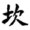
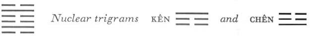

# Commentary: 29. K'an / The Abysmal (Water)

The rulers of the hexagram are the two yang lines in the second and the fifth place. The fifth, however, is ruler in a more marked degree; it represents water, which flows on when it has filled up a given place.

The Sequence

Things cannot be permanently in an overweighted state. Hence there follows the hexagram of THE ABYSMAL. The Abysmal means a pit.

Miscellaneous Notes

THE ABYSMAL is directed downward.
Water moves from above downward; it comes from the earth, but here it is in the heavens, hence its tendency to return earthward.

This hexagram is one of the eight formed by doubling of a trigram. The trigram K’an contains the middle line of the Creative (in the Inner-World Arrangement this trigram has shifted to the north, the place occupied by the Receptive in the Primal Arrangement<a id="ref-1" href="#/com-29-k-an-the-abysmal-water?id=fn-1">1</a>). Therefore this hexagram and the next following one, Li—which bears the same relation to the Receptive that K’an bears to the Creative—stand together at the end of part 1, which begins with THE CREATIVE and THE RECEPTIVE.

### THE JUDGMENT

> The Abysmal repeated.
>
> If you are sincere, you have success in your heart,
>
> And whatever you do succeeds.

Commentary on the Decision

The Abysmal repeated is twofold danger. Water flows on and nowhere piles up; it goes through dangerous places, never losing its dependability.

“You have success in your heart,” for the firm form the middle.

“Whatever you do succeeds”: advancing brings about achievements.

The danger of heaven lies in the fact that one cannot climb it. The dangers of earth are themountains and rivers, hills and heights. The kings and princes make use of danger to protect their realms.

The effects of the time of danger are truly great.

This hexagram is explained in two ways. First, man finds himself in danger, like water in the depths of an abyss. The water shows him how to behave: it flows on without piling up anywhere, and even in dangerous places it does not lose its dependable character. In this way the danger is overcome. The trigram K’an further means the heart. In the heart the divine nature is locked within the natural inclinations and tendencies) and is thus in danger of being engulfed by desires and passions. Here likewise the way to overcome danger is to hold firmly to one’s innate disposition to good. This is indicated by the fact that the firm lines form each the middle in one of the trigrams. Hence action results in good. Second, danger serves as a protective measure—for heaven, earth, and the prince. But it is never an end in itself. Therefore it is said: “The effects of the time of danger are great.”

### THE IMAGE

> Water flows on uninterruptedly and reaches its goal:
>
> The image of the Abysmal repeated.
>
> Thus the superior man walks in lasting virtue
>
> And carries on the business of teaching.

Water is constant in its flow; thus the superior man is constant in his virtue, like the firm line in the middle of the abyss. And just as water flows on and on, so he makes use of practice and repetition in the business of teaching.

### THE LINES

Six at the beginning:

*a*) Repetition of the Abysmal.

In the abyss one falls into a pit.

Misfortune.

*b*) “Repetition of the Abysmal.” One falls into the abyss because one has lost the way; this brings misfortune.
This line stands at the bottom and is divided, i.e., in the bottom of the abyss there is still another pit. This repetition of danger leads to habituation to danger. Being weak, the line does not possess the inner strength to withstand such temptation. Hence at the very start it falls away from the right path.

Nine in the second place:

*a*) The abyss is dangerous.

One should strive to attain small things only.

*b*) “One should strive to attain small things only.” For the middle has not yet been passed.
This line is strong and central and could therefore of its own nature accomplish something great. But it is still hemmed in by danger, hence there is nothing to be done. And its strength lies in the very fact that it does not seek the impossible but knows how to adapt itself to circumstances.

Six in the third place:

*a*) Forward and backward, abyss on abyss.

In danger like this, pause at first and wait,

Otherwise you will fall into a pit in the abyss.

Do not act in this way.

*b*) “Forward and backward, abyss on abyss”: here any effort ends up as impossible.
This line is weak, and not in its proper place. It is in the midst of danger and moreover stands in the middle of the nuclear trigram Chên, movement; hence it is not only surrounded by danger but also full of inner disquiet. Hence the warning not to act, as the nature of the line suggests.

Six in the fourth place:

*a*) A jug of wine, a bowl of rice with it;

Earthen vessels

Simply handed in through the window.

There is certainly no blame in this.

*b*) “A jug of wine, a bowl of rice with it.” It is the boundary line between firm and yielding.
The trigram K’an means wine. The nuclear trigram Chên means ritual vessels. The whole is conceived as a simple sacrifice. K’an stands in the north and is often coupled with the idea of sacrifice. Despite its simplicity, the sacrifice is accepted, because the attitude is sincere. The fourth line is in the relationship of holding together with the upper ruler of the hexagram —hence the close relationships that can dispense with ceremonious outer form.

Nine in the fifth place:

*a*) The abyss is not filled to overflowing,

It is filled only to the rim.

No blame.

*b*) “The abyss is not filled to overflowing,” for the central line is not yet great.
The ruler of the hexagram, being moreover strong and in a strong place, might easily feel himself to be great and powerful. But his central position prevents this; therefore it is enough for him merely to extricate himself from the danger. This is the line referred to by the sentence in the Commentary on the Decision: “Water flows on and nowhere piles up.”

Six at the top:

*a*) Bound with cords and ropes,

Shut in between thorn-hedged prison walls:

For three years one does not find the way.

Misfortune.

*b*) The six at the top has lost the way. This misfortune continues for three years.
In contrast to the six at the beginning, which is caught in a pit within the abyss, this line is at the top, hence inclosed by a wall behind thorn hedges (prison walls in China are arranged in this way to prevent escape). Thorns are indicated by the trigram K’an. The unfortunate situation of the line is due to the factthat it rests upon a hard line, the nine in the fifth place. For minor offenses, where repentance was shown, pardon was granted after a year, for more serious ones after two years, and for very grave ones after three years, so that here it is question of an extremely serious entanglement.

NOTE. The whole hexagram of THE ABYSMAL is based on the idea that the light lines are inclosed by the dark lines, and thus endangered. This idea of danger not only gives the hexagram its character, but also dominates the individual lines. It appears that the two strong lines (the second and the fifth) fare better than the others and have the prospect of getting out of danger, while the six at the beginning and the six in the third place fall into abyss after abyss, and the six at the top sees no way out for three years. Thus the danger threatening the dark lines is even greater. It often happens, however, that the idea of a given hexagram as a whole is differently expressed in some of the lines.

---

**Notes:**

<a id="fn-1" href="#/com-29-k-an-the-abysmal-water?id=ref-1">**1.**</a> See here.
