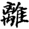
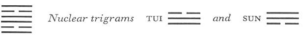

# Commentary: 30. Li / The Clinging, Fire

The rulers of the hexagram are the two yin lines in the second and the fifth place; of these, the line in the second place is ruler in a more marked degree, for fire is brightest when it first flames up.

The Sequence

In a pit there is certain to be something clinging within. Hence there follows the hexagram of THE CLINGING. The Clinging means resting on something.

Miscellaneous Notes

THE CLINGING is directed upward.

Appended Judgments

Fu Hsi made knotted cords and used them for nets and baskets in hunting and fishing. He probably took this from the hexagram of THE CLINGING.

This hexagram, divided within and closed without, is an image of the meshes of a net in which animals remain snared.<a id="ref-1" href="#/com-30-li-the-clinging-fire?id=fn-1">1</a> It is the opposite of the preceding hexagram, not only in structure but also in its entire meaning.

### THE JUDGMENT

> THE CLINGING. Perseverance furthers.
>
> It brings success.
>
> Care of the cow brings good fortune.

Commentary on the Decision

Clinging means resting on something. Sun and moon cling to heaven. Grain, plants, and trees cling to the soil.

Doubled clarity, clinging to what is right, transforms the world and perfects it.

The yielding clings to the middle and to what is right, hence it has success. Therefore it is said: “Care of the cow brings good fortune.”

Here the co-operation of the two world principles is shown. The light principle becomes visible only in that it clings to bodies. Sun and moon attain their brightness by clinging to heaven, from which issue the forces of the light principle. The plant world owes its life to the fact that it clings to the soil (the Chinese character here is *t’u*, not *ti*<a id="ref-2" href="#/com-30-li-the-clinging-fire?id=fn-2">2</a>), in which the forces of life express themselves. On the other hand, bodies are likewiseneeded, that the forces of light and of life may find expression in them.

It is the same in the life of man. In order that his psychic nature may be transfigured and attain influence on earth, it must cling to the forces of spiritual life.

The yielding element in Li is the central line of the Receptive, hence the image of the strong but docile cow.

### THE IMAGE

> That which is bright rises twice:
>
> The image of FIRE.
>
> Thus the great man, by perpetuating this brightness,
>
> Illumines the four quarters of the world.

Fire flames upward, hence the phrase, “That which is bright rises.” Twice is implied by the doubling of the trigram. In relation to the spiritual realm, brightness means the innate light-imbued predispositions of man, which through their consistency illumine the world. The trigram Li stands in the south and represents the summer sun, which illumines all earthly things.

### THE LINES

Nine at the beginning:

*a*) The footprints run crisscross.

If one is seriously intent, no blame.

*b*) Seriousness when footprints run crisscross serves in avoiding blame.
The first line means the morning. The fire at first burns fitfully—an image of the restless confusion of daily business. The line is firm, hence the possibility of seriousness.

Six in the second place:

*a*) Yellow light. Supreme good fortune.

*b*) The supreme good fortune of yellow light lies in the fact that one has found the middle way.
This line is the middle one of the lower trigram, hence “the middle way.” Yellow is the color of the middle, here specially mentioned because the line originates as the middle line of the trigram K’un, the Receptive.

Nine in the third place:

*a*) In the light of the setting sun,

Men either beat the pot and sing

Or loudly bewail the approach of old age.

Misfortune.

*b*) How can one wish to hold for long the light of the setting sun?
The third line ends the lower trigram, hence the image of the setting sun. The line is simultaneously in the nuclear trigram Tui, which indicates autumn, and in the nuclear trigram Sun, meaning growth. But Tui also means joyousness and Sun also means sighing.

Nine in the fourth place:

*a*) Its coming is sudden;

It flames up, dies down, is thrown away.

*b*) “Its coming is sudden.” Yet in itself it has nothing that would cause it to be accepted.
The fourth line is restless at the point of intersection of the two nuclear trigrams. It is oppressed from below and rejected from above.

Six in the fifth place:

*a*) Tears in floods, sighing and lamenting.

Good fortune.

*b*) The good fortune of the six in the fifth place clings to king and prince.
The fifth place is that of the ruler. Since the line is yielding, it is not arrogant but humble and sad (it is at the top of the nuclear trigram Tui, mouth, hence the lament). Therein lies its good fortune.

Nine at the top:

*a*) The king uses him to march forth and chastise.

Then it is best to kill the leaders

And take captive the followers. No blame.

*b*) “The king uses him to march forth and chastise”: in order to bring the country under discipline.
The ruler of the hexagram, the six in the fifth place, is the king. He uses the top line to lead the armed forces (the trigram Li has weapons for its symbol). Since it is at the top and strong, the line is correct, and therefore does not push the business of war too far. It shows the light at its height.

---

**Notes:**

<a id="fn-1" href="#/com-30-li-the-clinging-fire?id=ref-1">**1.**</a> Literally, “clinging.”

<a id="fn-2" href="#/com-30-li-the-clinging-fire?id=ref-2">**2.**</a> *Ti* means the earth
