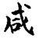
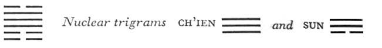

# Commentary: 31. Hsien / Influence (Wooing)

The nine in the fourth place is in the place of the heart. The heart holds mastery in influence, hence the fourth line is here a ruler of the hexagram. The nine in the fifth place is in the place of the back and therefore means keeping still in the midst of the influence. In the midst of movement, it is able to remain quiet and is therefore ruler of the hexagram to a still greater degree.

The Sequence

After there are heaven and earth, there are the individual things.

After individual things have come into being, there are the two sexes.

After there are male and female, there is the relationship between husband and wife.

After the relationship between husband and wife exists, there is the relationship between father and son.

After the relationship between father and son exists, there is the relationship between prince and servitor.

After the relationship between prince and servitor exists, there is the difference between superior and inferior.

After the difference between superior and inferior exists, the rules of propriety and of right can operate.

Miscellaneous Notes

INFLUENCE fulfills itself quickly.

### THE JUDGMENT

> INFLUENCE. Success.
>
> Perseverance furthers.
>
> To take a maiden to wife brings good fortune.

Commentary on the Decision

INFLUENCE means stimulation. The weak is above, the strong below. The forces of the two stimulate and respond to each other, so that they unite.

Keeping Still and joyousness.<a id="ref-1" href="#/com-31-hsien-influence-wooing?id=fn-1">1</a> The masculine subordinates itself to the feminine. Hence it is said:

“Success. Perseverance furthers. To take a maiden to wife brings good fortune.”

Heaven and earth stimulate each other, and all things take shape and come into being. The holy man stimulates the hearts of men, and the world attains peace and rest. If we contemplate the outgoing stimulating influences, we can know the nature of heaven and earth and all beings.

Hsien differs from the character *kan*, “to stimulate,” in that the heart is not a constituent part of it, as it is of the latter. Hence it represents an influence that is unconscious and involuntary, not one that is conscious and willed. It is a matter of objective relationships of a general kind, not those of a subjective, individual character.

The “weak above” is the trigram Tui, the youngest daughter; its attribute is joyousness, its image is the lake. The “strong below” is Kên, the youngest son; its attribute is keeping still, its image is the mountain.

The explanation of the Judgment is based on the organization of the hexagram (the weak element above, the strong below), the attributes, and the symbols (the youngest son, the youngest daughter).

### THE IMAGE

> A lake on the mountain:
>
> The image of influence.
>
> Thus the superior man encourages people to approach him
>
> By his readiness to receive them.<a id="ref-2" href="#/com-31-hsien-influence-wooing?id=fn-2">2</a>

The mountain lake gives of its moisture to the mountain; the mountain collects clouds, which feed the lake. Thus their forces have a reciprocal influence. The relation of the two images shows how this influence comes about: it is only when a mountain is empty at its summit, that is, deepened into a hollow, that a lake can form. Thus the superior man receives people by virtue of emptiness. The superior man is compared to the mountain, the people to the lake. The relation is formed through the initiative of the mountain, the superior man.

### THE LINES

The stimulation here shows itself step by step. The individual lines denote the respective parts of the body: the three lower lines are the legs, including toe, calf, and thigh; the three upper lines are the trunk, with the heart, the back of the neck, and the organs of speech.

Six at the beginning:

*a*) The influence shows itself in the big toe.

*b*) Influence in the big toe: the will is directed outward.
This line is related to the nine in the fourth place in the outer trigram. The image of the toe is chosen because it denotes the lowest part of the body. The will is directed outward, thoughthis does not become manifest, because the movement of the toe is invisible from outside.

Six in the second place:

*a*) The influence shows itself in the calves of the legs.

Misfortune.

Tarrying brings good fortune.

*b*) Even though misfortune threatens, tarrying brings good fortune. One does not come to harm through devotion.
This line is related to the nine in the fifth place. If it does not move in unison with the six at the beginning, but tarries until stimulated from above by the nine in the fifth place, it does not come to harm. The possibility of tarrying is open to it because its position is central.

Nine in the third place:

*a*) The influence shows itself in the thighs.

Holds to that which follows it.

To continue is humiliating.

*b*) “The influence shows itself in the thighs.” For he cannot keep still.

When the will is directed to things that one’s followers hold to, this is very base.
Since the two lower lines are weak by nature, it is not surprising that they let themselves be influenced by others. But this strong line could easily master itself and not yield to every stimulus from below. It makes itself contemptible by conforming to the aims of the two lower lines, its followers.

Nine in the fourth place:

*a*) Perseverance brings good fortune.

Remorse disappears.

If a man is agitated in mind,

And his thoughts go hither and thither,

Only those friends

On whom he fixes his conscious thoughts

Will follow.

*b*) “Perseverance brings good fortune. Remorse disappears.” Because in this way one does not stir up anything injurious.
Thoughts going hither and thither in agitation: by this one shows that one has as yet no clear light.

This is a strong line in a weak place, hence it has a twofold possibility. It can remain firm and, resisting the temptation to use special influence, quietly make itself felt as one of the rulers of the hexagram, by virtue of its character; in this case it does not stimulate anything injurious, since it is in harmony with the right. Or it can instead yield to the influence of the six at the beginning, to which it is related. Thereby it limits its influence; everything is shifted to the conscious plane, and the inner light darkens. This possibility is suggested by the fact that the line is the lowest in the trigram Tui, hence deepest within the realm of the shadowy (Tui is a yin trigram, therefore dark). Confucius says of this line:

What need has nature of thought and care? In nature all things return to their common source and are distributed along different paths; through one action, the fruits of a hundred thoughts are realized. What need has nature of thought, of care?

Nine in the fifth place:

*a*) The influence shows itself in the back of the neck.

*b*) “The influence shows itself in the back of the neck.”

The will is directed to the ramifications.
The back of the neck is immobile. The influence is sound at the root. And where the root is sound the ramifications are also sound. Therefore the influence is good. The line is strong and central and ruler of the hexagram, hence it influences through the perfect calm of inner equilibrium. At the same time the will is not inert; by controlling the chief organic processes, it achieves order in particulars as well.

Six at the top:

*a*) The influence shows itself in the jaws, cheeks, and tongue.

*b*) “The influence shows itself in the jaws, cheeks, and tongue.” He opens his mouth and chatters.
This is a weak line that in itself has little influence. The trigram Tui means the mouth. The top line is divided; hence opening of the mouth.

---

**Notes:**

<a id="fn-1" href="#/com-31-hsien-influence-wooing?id=ref-1">**1.**</a> Tui.

<a id="fn-2" href="#/com-31-hsien-influence-wooing?id=ref-2">**2.**</a> Literally, “Thus the superior man receives people by virtue of emptiness.”
