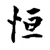
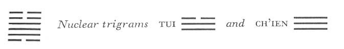

# Commentary: 32. Hêng / Duration

Duration means that which always is. What is in the middle abides always. In the hexagram the second and the fifth place are middle positions. But the six in the fifth place, although central, is weak, whereas the nine in the second place is central and strong as well. Hence the second line is the ruler of the hexagram.

While in the preceding hexagram the correspondence of the lines comes into account as more of a hindrance than a help, here the fact that all the lines correspond is proof of a firm inner organization of the hexagram that guarantees duration. The strong second line stands in the relationship of correspondence to the weak six in the fifth place.

The Sequence

The way of husband and wife must not be other than long-lasting. Hence there follows the hexagram of DURATION. Duration means long-lasting.

Miscellaneous Notes

DURATION means that which lasts long.

Appended Judgments

DURATION brings about firmness of character. DURATION shows manifold experiences without satiety. DURATION brings about unity of character.

### THE JUDGMENT

> DURATION. Success. No blame.
>
> Perseverance furthers.
>
> It furthers one to have somewhere to go.

Commentary on the Decision

DURATION means that which lasts long. The strong is above, the weak below; thunder and wind work together.

Gentle and in motion. The strong and the weak all correspond: this signifies duration.

“Success. No blame. Perseverance furthers”: this means lasting perseverance in one’s course. The course of heaven and earth is enduring and long and never ends.

“It furthers one to have somewhere to go.” This means that an end is always followed by a new beginning.

Sun and moon have heaven and can therefore shine forever. The four seasons change and transform, and thus can forever bring to completion. The holy man remains forever in his course, and the world reshapes itself to completion. If we meditate on what gives duration to a thing, we can understand the nature of heaven and earth and of all beings.

The organization of the hexagram shows the strong Chên above and the weak Sun below; this is the enduring condition in the world. Here the eldest son and the eldest daughter are united in marriage, in contrast to the situation in the preceding hexagram, which represents entering into marriage.

The images show thunder, which is carried still farther by the power of wind, and wind, which is strengthened by the power of thunder. Their combined action imparts duration to both. The attribute of the trigram Sun is gentleness, that of Chên is movement. The outer movement, supported within by devotion, is likewise such that it is capable of duration.

Finally, the hexagram is given inner firmness by the correspondence between the individual lines. The six in the first place corresponds with the nine in the fourth; the nine in the second place with the six in the fifth; the nine in the third place with the six at the top.

All this serves to explain the name of the hexagram.

On the basis of the Judgment, the conditions necessary for duration are then set forth. They consist in perseverance in the right course, that is to say, continuity in change. This is the secret of the eternity of the universe.

Perseverance in a course leads to the goal, the end. However, since the course is cyclic, a new beginning is joined with every end. Movement and rest beget each other. This is the rhythm of all happening. The operation of this principle in specific instances, in relation to the macrocosm and the microcosm, is then pointed out.

### THE IMAGE

> Thunder and wind: the image of DURATION.
>
> Thus the superior man stands firm
>
> And does not change his direction.

Thunder is that which is mobile, wind is that which is penetrating—the most mobile of all things that have duration under the law of motion. Wood is an attribute of both Chên and Sun, hence the idea of standing firm. Sun is within and penetrates, Chên is without and moves; hence the idea of a fixed direction.

### THE LINES

Six at the beginning:

*a*) Seeking duration too hastily brings misfortune persistently.

Nothing that would further.

*b*) The misfortune of seeking duration too hastily arises from wanting too much immediately at the outset.
The first line is the ruler of the trigram Sun, penetration. The line seeks to penetrate too hastily and too deeply. This impetuosity interferes with the influence, otherwise good, of the strong line in the fourth place, whose affinity with the first line is thus prevented from having effect.

Nine in the second place:

*a*) Remorse disappears.

*b*) Remorse disappears for the nine in the second place, because it is permanently central.
A strong line in a weak place might in itself produce occasion for remorse. But since the line is strong and central and in correct relation to the six in the fifth place, there is no danger of overstepping the limits of moderation, and thus no occasion for remorse.

Nine in the third place:

*a*) He who does not give duration to his character

Meets with disgrace.

Persistent humiliation.

*b*) “He who does not give duration to his character” meets with no toleration.
The line is at the point of transition from the lower to the upper trigram, hence excited and superficial. In the forward direction, it has not yet entered into the movement of the trigram Chên; in the backward direction, it has already passed beyond the gentleness of Sun (because it is a strong line in a strong place). Therefore it does not come to rest anywhere.

Nine in the fourth place:

*a*) No game in the field.

*b*) When one is forever absent from one’s place, how can one find game?
Chên is represented by a horse ranging the field, likewise by a highroad, where there is no game; hence the image.

The line is at the beginning of the trigram Chên, i.e., not yet central. It is a strong line in a weak place, hence not correct. Thus it bestirs itself unceasingly where it should not, and therefore finds nothing. The third line has character (a strong line in a strong place) “but no duration: the present line has duration but no character (a strong line in a weak place).

Six in the fifth place:

*a*) Giving duration to one’s character through perseverance.

This is good fortune for a woman, misfortune for a man.

*b*) Perseverance brings good fortune for a woman, because she follows one man all her life. A man must hold to his duty; if he follows the woman, the results are bad.
This line is yielding but central and in direct relation to the strong nine in the second place, which is ruler of the hexagram. Hence these relations are enduring. However, the law” that the weak unswervingly follows the strong reflects a virtue of woman. Things are different in the case of a man.

Six at the top:

*a*) Restlessness as an enduring condition brings misfortune.

*b*) Restlessness as an enduring condition in a high position is wholly without merit.
Chên has movement for its attribute. Here a weak line is at the high point of the trigram of movement. It cannot control itselfand therefore falls prey to a restlessness that is harmful because it is in opposition to the meaning of the time. The line is the opposite of the six at the beginning; there we have movement too hasty to endure, here movement that endures but accomplishes nothing.
