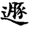
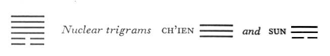

# Commentary: 33. Tun / Retreat

The constituting rulers of the hexagram are the two yin lines in the first and the second place. They show the dark principle pressing forward, with the light principle in retreat. The ruler of the action is the strong, central line in the fifth place, which finds correspondence in the weak, central line in the second place. This is the line referred to in the Commentary on the Decision: “The firm is in the appropriate place and finds correspondence. This means that one is in accord with the time.”

The lower trigram is Kên, Keeping Still, hence the three lower lines show themselves hampered in retreating. The upper trigram is Ch’ien, strong movement, hence the retreat of these three lines is free and unhampered.

The Sequence

Things cannot abide forever in their place: hence there follows the hexagram of RETREAT. Retreat means withdrawing.

Miscellaneous Notes

RETREAT means withdrawing.

### THE JUDGMENT

> RETREAT. Success.
>
> In what is small, perseverance furthers.

Commentary on the Decision

“RETREAT. Success”: this means that success lies in retreating.

The firm is in the appropriate place and finds correspondence. This means that one is in accord with the time.

“In what is small, perseverance furthers”: this means that it is pressing forward, and on the increase.

Great indeed is the meaning of the time of RETREAT.

Success lies in being able to retreat at the right moment and in the right manner. This success is made possible by the fact that the retreat is not the forced flight of a weak person but the voluntary withdrawal of a strong one, as is implicit in the nature of the strong ruler of the hexagram, the nine in the fifth place, which finds correspondence in the weak six in the second place. Strength is shown in that one does not attempt to force anything but shows perseverance in small matters alone, because the dark element, represented by the two yin lines below, is pressing forward and on the increase.

The meaning of the time of RETREAT is great; that is, it is vitally important to hit upon the moment when retreat is called for.

### THE IMAGE

> Mountain under heaven: the image of RETREAT.
>
> Thus the superior man keeps the inferior man at a distance,
>
> Not angrily but with reserve.

The question is to what extent the mountain under heaven suggests the image of RETREAT. One interpretation is that the mountain under heaven is so high and steep that men cannotcome near to it. However, the other interpretation—that heaven represents the superior man, the mountain the inferior man—is more in harmony with the movement of the trigrams. Heaven has a strong upward movement and therefore automatically retreats from the mountain, whose character is immobility. An even greater divergence occurs in the hexagram P’i, STANDSTILL (12), in which the movements are directly opposed.

What the situation in the present hexagram teaches is, as in the case of P’i, deduced from the attributes of the trigrams taken separately. The superior man keeps the inferior at a distance by being as reserved and inaccessible as heaven; thus he brings the inferior man to a standstill (this is the attribute of the lower trigram, Kên, mountain).

### THE LINES

Six at the beginning:

*a*) At the tail in retreat. This is dangerous.

One must not wish to undertake anything.

*b*) If one undertakes nothing while exposed to the danger of the retreating tail, what misfortune could befall one?
The two lower lines are those before which the four upper ones retreat, therefore they are the constituting rulers. As in the hexagram Lü, CONDUCT (10), in which the youngest daughter follows the trigram Ch’ien, so likewise here, where the youngest son is under Ch’ien, the tail is used as the image of the first line. The interpretation does not take into account the fact that in the hexagram as a whole, this line represents the inferior man, because the Book of Changes gives counsel not for inferior men but only for the superior. Instead, the counsel focuses on the situation as such, which is retreat, particularly retreat at the tail—the rear. To be at the rear in a retreat is dangerous. The danger is avoided by keeping still.

Six in the second place:

*a*) He holds him fast with yellow oxhide.

No one can tear him loose.

*b*) “He holds him fast with yellow oxhide”: this means a firm will.
Here also the retreat is hampered. This line occupies the middle of the trigram Kên, Keeping Still. Yellow is the color of the middle. The line is near the nine in the third place, hence holds it fast. Here we have the perseverance of the inferior, the small, referred to in the Judgment.

Nine in the third place:

*a*) A halted retreat

Is nerve-wracking and dangerous.

To retain people as men- and maidservants

Brings good fortune.

*b*) The danger of a halted retreat is nerve-wracking; this brings fatigue.

“To retain people as men- and maidservants brings good fortune.” True enough, but one cannot use them in great things.
The line is strong in itself, and it might therefore be expected to have the strength to retreat. What makes this impossible is the fact, first, that it is at the top of the trigram Kên, Keeping Still, and, second, that the two weak lines below cling to it. This is tiring. It can of course use the lower lines as men- and maidservants, because in the trigram Kên the top line has the mastery. This provides a way out, to the extent that the immediate danger is thereby avoided. However, with such a following it is not possible to attain great ends.

Nine in the fourth place:

*a*) Voluntary retreat brings good fortune to the superior man

And downfall to the inferior man.

*b*) The superior man retreats voluntarily; this brings downfall for the inferior man.
Here the entrance into the upper trigram is completed. Since heaven is strong, all three of the upper lines can retreatunhindered. This is the line of demarcation. The superior man retreats upward and the inferior man remains alone below. This is bad for him—though not for the superior man—because he cannot rule himself.

Nine in the fifth place:

*a*) Friendly retreat. Perseverance brings good fortune.

*b*) “Friendly retreat. Perseverance brings good fortune,” because the will thereby reaches a correct decision.
The will here is related to the will of the six in the second place, because the two lines correspond. The one shows a strong will to hold on firmly (a good thing for inferior men), the other an unwavering will to remain persevering and not to submit to being held.

Another explanation, from the *Chou I Hêng Chieh*,<a id="ref-1" href="#/com-33-tun-retreat?id=fn-1">1</a> deserves mention, namely, that it is a question only of an inner retreat here, while outwardly one remains at one’s post in order to prepare a countermove.

Nine at the top:

*a*) Cheerful retreat. Everything serves to further.

*b*) “Cheerful retreat. Everything serves to further,” because there is no longer any possibility of doubt.
Here one knows exactly what to do. Under such circumstances the carrying out of the decision is not difficult.

---

**Notes:**

<a id="fn-1" href="#/com-33-tun-retreat?id=ref-1">**1.**</a> See here.
