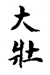
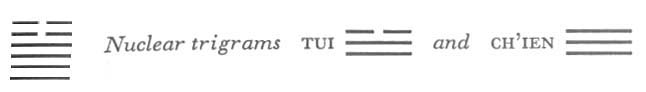
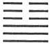
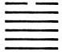

# Commentary: 34. Ta Chuang / The Power of the Great

The ruler of the hexagram is the yang line in the fourth place, because the four yang lines are the basis of the power of the hexagram, with the fourth at their head.

The Sequence

Things cannot retreat forever, hence there follows THE POWER OF THE GREAT.

Miscellaneous Notes

The meaning of THE POWER OF THE GREAT shows itself in the fact that one pauses.

Appended Judgments

In the most ancient times people dwelt in caves and lived in forests. The holy men of a later time made the change to buildings. At the top was a ridgepole, and sloping down from it there was a roof, to keep off wind and rain. They probably took this from the hexagram of THE POWER OF THE GREAT.

The four strong lines taken together are regarded as a ridgepole, as also in the hexagram Ta Kuo, PREPONDERANCE OF THE GREAT (28). The two divided lines at the top represent rain and wind.

The hexagram can be thought of as formed by the lines of Tui taken twice each. Tui has the sheep (or goat) for its animal, hence the goat is used as an image in several of the lines. The two upper lines are the horns.

It is the contrast between power and violent force that is expressed in the meaning of the hexagram. In structure it is the inverse of the preceding one.

### THE JUDGMENT

> THE POWER OF THE GREAT. Perseverance furthers.

Commentary on the Decision

THE POWER OF THE GREAT means that the great are powerful. Strong in movement—this is the basis of power.

“THE POWER OF THE GREAT. Perseverance furthers,” for what is great must be right.

Great and right: thus we can behold the relations of heaven and earth.

The hexagram linked with the first month is T’ai, PEACE (11). Although in it the light lines are advancing, they are not yet in the majority.

The hexagram correlated with the third month is Kuai, BREAK-THROUGH (43). In this instance the light lines are markedly in the majority, but downfall is already imminent.

Neither of these situations can be said to denote power.

But the presence of four yang lines in Ta Chuang indicates power. Strength is the attribute of the inner trigram, the Creative, and movement that of the outer, the Arousing. Strength makes it possible to master the egotism of the sensual drives; movement makes it possible to execute the firm decision of the will. In this way all things can be attained. This is the foundation upon which power rests. When the statement is made that what is great must be right, it means not that great and right are two different things, but that without rightness there is no greatness. The relations of heaven and earth are never other than great and right.

### THE IMAGE

> Thunder in heaven above:
>
> The image of THE POWER OF THE GREAT.
>
> Thus the superior man does not tread upon paths
>
> That do not accord with established order.

The upper trigram is Chên, thunder; the lower is Ch’ien, heaven. Thunder in the heavens shows the power of something great in full expansion. The trigram Chên also has as its image the foot, and the attribute of Ch’ien is “great and right.” Thus the foot treads upon the great and right and takes its way thereon. The strength of the trigram Ch’ien imparts to the movement of the trigram Chên the force resolutely to do what is good, and this is the basis of great power.

### THE LINES

Nine at the beginning:

*a*) Power in the toes.

Continuing brings misfortune.

This is certainly true.

*b*) “Power in the toes.” This certainly leads to failure.
The first line, as is often the case (cf. hexagram 31), means the toes, while the upper lines mean the horns.

Nine in the second place:

*a*) Perseverance brings good fortune.

*b*) The nine in the second place finds good fortune through perseverance because it is in a central place.
A nine, being a strong line, is not ordinarily correct in the second place, which is weak, and it might therefore be expected that perseverance would not be recommended here. But the place is central and moreover in the center of the trigram Ch’ien, heaven, hence inherently strong. Further, the line has a firm relationship of correspondence with the six in the fifth place. All this indicates that in the place here occupied by the line, perseverance acts favorably.

Nine in the third place:

*a*) The inferior man works through power.

The superior man does not act thus.

To continue is dangerous.

A goat butts against a hedge

And gets its horns entangled.

*b*) The inferior man uses his power. This the superior man does not do.
These words explain the first sentence of the oracle. The image for this line is a goat butting against a hedge and entangling its horns. This is due to the fact that the line is the lowest in the upper nuclear trigram Tui, whose animal is the sheep or goat. Since a strong line is in front of it, this suggests the idea that the goat butts against a hedge and is caught fast by the horns.

Nine in the fourth place:

*a*) Perseverance brings good fortune.

Remorse disappears.

The hedge opens; there is no entanglement.

Power depends upon the axle of a big cart.

*b*) “The hedge opens; there is no entanglement.” It can go upward.
This line, as the uppermost of the four advancing light lines, is the ruler of the hexagram. It finds before itself a divided line that does not hinder further advance. Hence it can advance upward unchecked.

Six in the fifth place:

*a*) Loses the goat with ease.

No remorse.

*b*) “Loses the goat with ease,” because the place is not the appropriate one.
The place is strong, it is in fact the place of the prince, but the nature of the line is yielding, hence the outer place does notcorrespond with the inner nature. Therefore the line easily rids itself of its obstinate disposition.

Six at the top:

*a*) A goat butts against a hedge.

It cannot go backward, it cannot go forward.

Nothing serves to further.

If one notes the difficulty, this brings good fortune.

*b*) “It cannot go backward, it cannot go forward.” This does not bring luck.

“If one notes the difficulty, this brings good fortune.”

The mistake is not lasting.
This line is at the height of the movement (Chên), topping the figure of the goat, the symbol of the nuclear trigram Tui, this suggests the idea of butting with horns. But since it has reached the end it can go no farther; hence confusion and difficulties. However, the line is yielding in character; therefore, instead of stiffening in its obstinacy, it yields, and in this way the mistake does not become a lasting one.
