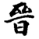
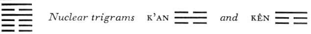

# Commentary: 35. Chin / Progress

This hexagram is characterized by light rising out of the earth. The six in the fifth place is the ruler of the trigram Li (light), because it is in the middle place of heaven. Hence it is the ruler of the hexagram, referred to in the sentence of the Commentary on the Decision: “The weak progresses and goes upward.”

The Sequence

Beings cannot stay forever in a state of power; hence there follows the hexagram of PROGRESS. Progress means expansion.

Miscellaneous Notes

PROGRESS means the day.
The hexagrams Chin, Shêng, PUSHING UPWARD (46), and Chien, DEVELOPMENT (53), all mean progress. Chin has for its image the sun mounting over the earth. It is the finest of these three hexagrams. Shêng is symbolized by wood rising above the earth. Chien shows the still more gradual development of a tree on a mountain. It is true that a too rapid expansion has its dangers, as the next hexagram shows.

In terms of human society, the present hexagram indicates a wise ruler with obedient servitors at his side.

### THE JUDGMENT

> PROGRESS. The powerful prince
>
> Is honored with horses in large numbers.
>
> In a single day he is granted audience three times.

Commentary on the Decision

PROGRESS means making advance. Clarity rises high over the earth. Devoted, and clinging to this great clarity, the weak progresses and goes upward. Hence it is said: “The powerful prince is honored with horses in large numbers. In a single day he is granted audience three times.”

The structure of the hexagram points to progress—indeed, to progress on all sides, to expansion. Devoted refers to the lower trigram K’un, here meaning servitor. The great clarity is the upper trigram Li, here meaning the ruler. The weak element that progresses is the middle line of K’un, which occupies the middle place in the upper trigram, originally Ch’ien, the father; hence it is the ruler of the hexagram, the wise prince.

The ruler needs the loyalty of his servitors, and being possessed of great wisdom, he knows how to reward them fittingly. This explains the words of the Judgment.

### THE IMAGE

> The sun rises over the earth:
>
> The image of PROGRESS.
>
> Thus the superior man himself
>
> Brightens his bright virtue.

The Image is directly explained through the relative positions of the two trigrams: Li, light, stands above K’un, the earth. Here we have a model for a philosophy of life: what is innately light rises over that which darkens. It can do this of its own power because it is not obstructed by the earth, which is devoted and compliant in its nature.

### THE LINES

Six at the beginning:

*a*) Progressing, but turned back.

Perseverance brings good fortune.

If one meets with no confidence, one should remain calm.

No mistake.

*b*) “Progressing, but turned back.” Solitary, he walks in the right. Composure is not a mistake. One has not yet received the command.
A standstill is imposed upon the lowest line, weak in itself, by the nuclear trigram Kên forming above it. Hence it is stopped in its tendency to progress. Nevertheless it goes its solitary way on the path of duty and calmly awaits the time that will surely come.

Six in the second place:

*a*) Progressing, but in sorrow.

Perseverance brings good fortune.

Then one obtains great happiness from one’s ancestress.

*b*) “One obtains great happiness,” because of the central and correct position.
This line is similar in character to the ruler of the hexagram, the six in the fifth place. The latter appears under the image of the ancestress, because according to ancient custom the grandson was associated with the grandfather, not with the father. Both lines being weak, the images here are feminine—the grandson’s wife and the ancestress. The line is at the base of the nuclear trigram Kên, Keeping Still, hence likewise hindered in its advance.

Six in the third place:

*a*) All are in accord. Remorse disappears.

*b*) “All are in accord,” because there is a will to go upward.
This line is quite close to the upper trigram Li, clarity, hence misunderstandings are cleared up. Since it is at the head of others of the same mind, progress is possible for it.

Nine in the fourth place:

*a*) Progress like a hamster.

Perseverance brings danger.

*b*) A hamster gets into danger through perseverance; the place is not appropriate.
This line is at the top of the trigram Kên, with which the rat and other rodents are associated. Rats and hamsters hide themselves by day and are active only by night. But the line is already in the trigram of the sun, whose light it cannot endure. Since it is a time of progress, the line mingles with the crowd and joins in what is going on. However, this is not its proper place (a strong line in a weak place); therefore going on in this way brings danger (the line is also the middle line of the upper nuclear trigram K’an, danger).

Six in the fifth place:

*a*) Remorse disappears.

Take not gain and loss to heart.

Undertakings bring good fortune.

Everything serves to further.

*b*) “Take not gain and loss to heart.” Undertaking brings blessing.
A yin line in a yang place should really cause remorse, but since it is here in the center of the great light,<a id="ref-1" href="#/com-35-chin-progress?id=fn-1">1</a> there is no need for remorse. Furthermore, the line is empty, that is, divided in the middle. This is an indication that it does not take gain and loss to heart, because it is not dependent on external things. Fire has no definite form, it flames up and goes out; hence the image of gain and loss. Moreover, although the line is the uppermost one in the nuclear trigram K’an, the Abysmal, which suggests sorrow, it is the ruler of the hexagram, hence sorrow is not necessary.

Nine at the top:

*a*) Making progress with the horns is permissible

Only for the purpose of punishing one’s own city.

To be conscious of danger brings good fortune.

No blame.

Perseverance brings humiliation.

*b*) “Permissible only for the purpose of punishing one’s own city.” The way is not yet in the light.
The line at the top is strong. This suggests the image of horns. Since it is a time of progress, there is shown here at the end an attempt to progress by means of force. But the line stands isolated, because under it the Abysmal (upper nuclear trigram) sinks into the depths, leaving it forsaken. It is thrown back upon itself and is able to discipline only its own city.

---

**Notes:**

<a id="fn-1" href="#/com-35-chin-progress?id=ref-1">**1.**</a> Li, the sun.
