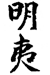
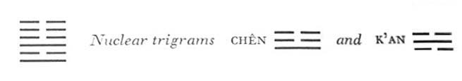

# Commentary: 36. Ming I / Darkening of the Light

This hexagram has for its characterizing image the sun sunk below the earth. The six at the top stands for the greatest accumulation of earth, hence it is the line that damages and darkens the light of the others. It is the ruler determining the meaning of the hexagram. Both the six in the second place and the six in the fifth place have the attributes of central and devoted character, and it is they that are injured. They are the rulers governing the hexagram. Hence it is said in the Commentary on the Decision: “King Wên experienced this, Prince Chi experienced this.”

The Sequence

Expansion will certainly encounter resistance and injury. Hence there follows the hexagram of DARKENING OF THE LIGHT. Darkening means damage, injury.

Miscellaneous Notes

DARKENING OF THE LIGHT means injury.
The whole hexagram has a historical background. For at the time when King Wên wrote the judgments on the hexagrams, conditions in China were just as this hexagram pictures them. In the judgments on the lines, the Duke of Chou refers to Prince Chi as exemplifying the situation. Confucius carries thisfurther in the Commentary on the Decision by adding the example of King Wên.

Later on—quite in keeping with the meaning—historical personages came to be linked with each of the lines. The evil ruler was Chou Hsin,<a id="ref-1" href="#/com-36-ming-i-darkening-of-the-light?id=fn-1">1</a> the last king of the Yin dynasty. He is symbolized by the six at the top. Under him the most able princes of the realm were all made to suffer severely, and their fates are mirrored in the individual lines. The highminded Po I withdrew into hiding with his brother, Shu Ch’i. He is represented by the nine at the beginning. The six in the second place pictures King Wên, who, as the foremost of the feudal princes, was long held prisoner by the tyrant, with constant danger to his life. The nine in the third place represents his son, afterward King Wu of Chou, who overthrew the tyrant. The six in the fourth place depicts the situation of Prince Wei Tz
u who was able to save himself by timely flight abroad. Finally, the six in the fifth place depicts the situation of Prince Chi, who could save his life only by dissembling.

This hexagram is the inverse of the preceding one.

### THE JUDGMENT

> DARKENING OF THE LIGHT. In adversity
>
> It furthers one to be persevering.

Commentary on the Decision

The light has sunk into the earth: DARKENING OF THE LIGHT. Beautiful and clear within, gentle and devoted without, hence exposed to great adversity—thus was King Wên.

“In adversity it furthers one to be persevering”: this means veiling one’s light. Surrounded by difficulties in the midst of his closest kin, nonetheless keeping his will fixed on the right—thus was Prince Chi.

The inner trigram is Li, light, whose attributes are beauty and clarity; the outer trigram is K’un, the Receptive, whose attributes are yieldingness and devotion. King Wên, in whomthese attributes are seen united, is depicted in one of the rulers of the hexagram, the six in the second place.

Prince Chi is depicted by the six in the fifth place. He too is in difficulties; these are represented by the nuclear trigram K’an, the Abysmal, danger. King Wên is as it were hidden by this nuclear trigram over him. For the six in the fifth place the difficulties lie within, that is, below. It is not overcome by them because it is at the top of the upper nuclear trigram Chên, movement. By movement it gets clear of the difficulties, and the light, although jeopardized, cannot be extinguished.

### THE IMAGE

> The light has sunk into the earth:
>
> The image of DARKENING OF THE LIGHT.
>
> Thus does the superior man live with the great mass:
>
> He veils his light, yet still shines.

The upper trigram K’un means the mass. Amid the multitude are the two dominating rulers of the hexagram, as the superior men. Their behavior is explained on the basis of the relative positions of the two trigrams: Earth stands over light, and this suggests a veiling of the light. But the lower trigram Li is not injured in its character by this combination. Its light is only veiled, not extinguished.

### THE LINES

Nine at the beginning:

*a*) Darkening of the light during flight.

He lowers his wings.

The superior man does not eat for three days

On his wanderings.

But he has somewhere to go.

The host has occasion to gossip about him.

*b*) It is the obligation of the superior man to refrain from eating during his wanderings.
The animal symbol belonging to the trigram Li is the pheasant, hence the idea of flying. The line, being strong, is about to advance. But the nuclear trigram over it is K’an, danger; henceit is hindered in its flight. It renounces the idea of sacrificing its principles in order to secure a livelihood; it prefers going hungry to eating without honor.

Six in the second place:

*a*) Darkening of the light injures him in the left thigh.

He gives aid with the strength of a horse.

Good fortune.

*b*) The good fortune of the six in the second place comes from its devotion to the rule.
One might expect misfortune from the situation, yet the oracle is, “Good fortune.” This is because the line, being yielding, correct, and in the proper place, is equal to the demands of its position. The first half of the Commentary on the Decision, which uses the example of King Wên, has reference to this line.

Nine in the third place:

*a*) Darkening of the light during the hunt in the south.

Their great leader is captured.

One must not expect perseverance too soon.

*b*) The purpose of the hunt in the south has great success.
The aim is centered on the hunt. That success comes, that the great leader of the darkening is captured, is not something premeditated, hence the success is all the greater. King Wu had no intention of acquiring personal power and seizing empire for himself; it fell to him because of his character. The line is a strong one in a strong place, hence it carries out its intention. The upper nuclear trigram Chên is linked with the horse, the lower, K’an, with the chariot, hence the idea of a hunt. Li, in which this is the top line, is the south.

Six in the fourth place:

*a*) He penetrates the left side of the belly.

One gets at the very heart of the darkening of the light,

And leaves gate and courtyard.

*b*) “He penetrates the left side of the belly,” that is, he finds out the inmost sentiment of the heart.
K’un, the upper primary trigram, means the belly, and Chên, the upper nuclear trigram, means the left side—hence the left side of the belly. The line stands near the lord of darkness; thus it finds out his inmost sentiment and can take itself out of danger in good time. Staying on would mean sacrificing oneself to no purpose.

Six in the fifth place:

*a*) Darkening of the light as with Prince Chi.

Perseverance furthers.

*b*) The perseverance of Prince Chi shows that the light cannot be extinguished.
The second half of the Commentary on the Decision refers to this line, which is central and yielding. Prince Chi concealed his perseverance but maintained it inwardly. Similarly, the light of the sun is veiled from time to time, but it cannot be extinguished. The upper nuclear trigram Chên, in which this is the top line, means being aroused, pressing forward. Thus the light cannot be permanently held below but presses forward powerfully when the time has come.

Six at the top:

*a*) Not light but darkness.

First he climbed up to heaven,

Then he plunged into the depths of the earth.

*b*) “First he climbed up to heaven.” Thus he might have been able to illumine the lands of all the four quarters of the earth.

“Then he plunged into the depths of the earth,” because he had lost the rule.
First he held a position through which he might have been able to enlighten all the people of the realm. Instead, however, he made it his business to injure men, and thus transgressedthe rule that binds one who governs; as a result, he prepared his own downfall.

The line stands at the top, where the earth veils the sun most heavily; but it is also the first to be unmasked in its sinister character when the sun reappears.

---

**Notes:**

<a id="fn-1" href="#/com-36-ming-i-darkening-of-the-light?id=ref-1">**1.**</a> Overthrown *ca*. 1150 B.C.
