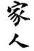
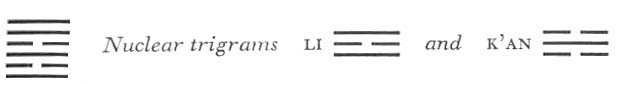

# Commentary: 37. Chia Jên / The Family [The Clan]

[37. Chia Jên / The Family The Clan](#pup-iching003.html_pup-iching003htmlpt05toc)

The rulers of the hexagram are the nine in the fifth place and the six in the second, hence it is said in the Commentary on the Decision: “The correct place of the woman is within; the correct place of the man is without.”

The Sequence

He who is injured without, of a certainty draws back into his family. Hence there follows the hexagram of THE FAMILY.

Miscellaneous Notes

THE FAMILY is inside.
The upper trigram Sun means influence, the lower, Li, means clarity; accordingly the hexagram points to the outgoing influence that emanates from inner clarity.<a id="ref-1" href="#/com-37-chia-j-n-the-family-the-clan?id=fn-1">1</a>

### THE JUDGMENT

> THE FAMILY. The perseverance of the woman furthers.

Commentary on the Decision

THE FAMILY. The correct place of the woman is within; the correct place of the man is without. That man and woman have their proper places is the greatest concept in nature.

Among the members of the family there are strict rulers; these are the parents. When the father is in truth a father and the son a son, when the elder brother is an elder brother and the younger brother a younger brother, the husband a husband and the wife a wife, then the house is on the right way.

When the house is set in order, the world is established in a firm course.

While the Judgment speaks only of the perseverance of woman, because of the fact that the hexagram consists of the two elder daughters, Sun and Li, who are in their proper places—the elder above, the younger below—the commentary is based on the two rulers of the hexagram, the nine in the fifth place and the six in the second, and speaks accordingly of both man and woman, whose proper places are respectively without and within. These positions of man and woman correspond with the relative positions of heaven and earth, hence this is called the greatest concept in nature (literally, heaven and earth).

The proper positions of the individual lines have been discussed above. The action of the family on the world corresponds with the action of fire, which creates the wind.

### THE IMAGE

> The image of THE FAMILY.
>
> Thus the superior man has substance in his words
>
> And duration in his way of life.

Wind is an effect of fire. Similarly, the effect of order within the family is to create an influence that brings order into the world. It is achieved when the head of the family has substance in his words, just as flame must rely upon fuel, and duration in his way of life, just as the wind blows without cease.

### THE LINES

Nine at the beginning:

*a*) Firm seclusion within the family.

Remorse disappears.

*b*) “Firm seclusion within the family”: the will has not yet changed.
The line is at the beginning, in the lowest place; hence it represents the time when the will of an individual has not yet changed for the worse. Here is the point at which to intervene and prevent change.

Six in the second place:

*a*) She should not follow her whims.

She must attend within to the food.

Perseverance brings good fortune.

*b*) The good fortune of the six in the second place depends upon devotion and gentleness.
Devotion and gentleness are mentioned three times—in the hexagram of YOUTHFUL FOLLY (4) as attributes necessary in serving a teacher, in the hexagram of DEVELOPMENT (53) as attributes necessary in serving a ruler, and in the present instance as attributes necessary in serving a husband.

The middle line in the trigram Li means devotion and correctness, which seek nothing for themselves. One of the nuclear trigrams, K’an, means wine and food, and the other, Li, means cooking and baking; hence the preparation of food is said to be the duty of woman.

Nine in the third place:

*a*) When tempers flare up in the family,

Too great severity brings remorse.

Good fortune nonetheless.

When woman and child dally and laugh,

It leads in the end to humiliation.

*b*) “When tempers flare up in the family,” nothing is as yet lost.

“When woman and child dally,” the discipline of the house is lost.
This line is at the top of the lower primary trigram Li, flame, and likewise at the beginning of the upper nuclear trigram, which is also Li; hence it implies too much heat. Although this is a mistake, such behavior is still to be preferred in the case of a strong line between two weak ones. If the line changes and becomes yielding, the discipline of the house is lost.

Six in the fourth place:

*a*) She is the treasure of the house.

Great good fortune.

*b*) “She is the treasure of the house. Great good fortune.”

For she is devoted and in her place.
The fourth line is the yielding lowest line in the upper primary trigram Sun, gentleness. It is the middle line of the upper nuclear trigram Li; when the line changes, it remains within the lower nuclear trigram Sun thus formed. Sun means work, silk, a near-by market—all things that promise wealth. As a yielding line in its proper place, it means great good fortune.

Nine in the fifth place:

*a*) As a king he approaches his family.

Fear not.

Good fortune.

*b*) “As a king he approaches his family”: they associate with one another in love.
The line is correct, strong, central; hence the image of a king. As a ruler of the hexagram, it influences the other lines. Being central, it does not effect its ends by means of severity.

Nine at the top:

*a*) His work commands respect.

In the end good fortune comes.

*b*) “Commands respect” and “good fortune”: this indicates that one makes demands first of all upon oneself.
This line is at the end of the hexagram. It is strong and stable, hence does not turn to others but only to itself; from this finally good fortune comes.

---

**Notes:**

<a id="fn-1" href="#/com-37-chia-j-n-the-family-the-clan?id=ref-1">**1.**</a> As these relationships indicate, the Chinese family is the patriarchal clan, which forms the nucleus of the patriarchal state. This trend of thought is developed still further in the Great Learning *Ta Hsüeh*.
