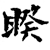
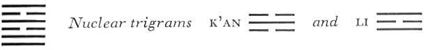

# Commentary: 38. K'uei / Opposition

The rulers of the hexagram are the six in the fifth place and the nine in the second. Therefore it is said in the Commentary on the Decision: “The yielding progresses and goes upward, attains the middle, and finds correspondence in the firm.”

The Sequence

When the way of THE FAMILY draws to an end, misunderstandings come. Hence there follows the hexagram of OPPOSITION. Opposition means misunderstandings.

Miscellaneous Notes

OPPOSITION means estrangement.

Appended Judgments

The men of ancient times strung a piece of wood for a bow and hardened pieces of wood in the fire for arrows. The use of bow and arrow is to keep the world in fear. They probably took this from the hexagram of OPPOSITION.

The upper primary trigram Li means weapons; the lower, Tui, is associated with the west, metal, and killing; hence the idea of bow and arrow to keep the world in fear and alarm.<a id="ref-1" href="#/com-38-k-uei-opposition?id=fn-1">1</a> The correspondences between the lines are of great importance in this hexagram. In all the lines the situation is that of opposition; throughout, however, the tendency is toward smoothing out misunderstandings. This is why at the first line no search is made for the horse, which returns of its own accord, and why at the fourth line one meets a person of like mind. At the second place it is said, “One meets his lord,” and correspondingly at the fifth place, “The companion bites his way through the wrappings.” Again, the pronouncement at the third place, “Not a good beginning, but a good end,” is related to that at the topmost place: “As one goes, rain falls.” This hexagram is the inverse of the preceding one.

### THE JUDGMENT

> OPPOSITION. In small matters, good fortune.

Commentary on the Decision

OPPOSITION: fire moves upward, the lake moves downward. Two daughters live together, but their minds are not directed to common concerns.

Joyousness and dependence upon clarity: the yielding progresses and goes upward, attains the middle,and finds correspondence in the firm. This is why there is good fortune in small matters.

Heaven and earth are opposites, but their action is concerted. Man and woman are opposites, but they strive for union. All beings stand in opposition to one another: what they do takes on order thereby. Great indeed is the effect of the time of OPPOSITION.

The name of the hexagram is derived from the relationships developing out of the movement of the two trigrams. Fire flames upward, water seeps downward: when they are quiescent, their movements can unite; when they are in motion, they draw farther and farther apart. The two daughters are originally together in the parental house. Their ways part as they grow up and marry into different families. Thus the movement leads more and more to opposition. However, since this movement is a natural one, it comes of itself to a turning when it has reached an extreme.

The trigram Tui has joyousness as an attribute; the trigram Li, dependence upon clarity. Joyousness unites, clarity finds the right way for this. Furthermore, the relations of the two rulers of the hexagram are favorable, so that there is a possibility of success at least in small matters.

However, Confucius goes still further. He shows that opposition is actually the natural prerequisite for union. As a result of opposition, a need to bridge it arises; this is true as regards heaven and earth, man and woman. Similarly, it is the individual differences between things that enable us to differentiate them clearly and hence to classify them. This is the effect of the phase of opposition—a phase that must be transcended.

### THE IMAGE

> Above, fire; below, the lake:
>
> The image of OPPOSITION.
>
> Thus amid all fellowship
>
> The superior man retains his individuality.

The images belonging to the trigrams, whose tendencies combat each other, create the condition of opposition, while theirattributes lead to its being overcome. The joyousness of Tui symbolizes fellowship; the clarity of Li symbolizes clearly recognizable individuality.

The reason why the two daughters tend to opposition is that the eldest, whose authority would maintain order, is absent.

### THE LINES

Nine at the beginning:

*a*) Remorse disappears.

If you lose your horse, do not run after it;

It will come back of its own accord.

When you see evil people,

Guard yourself against mistakes.

*b*) “When you see evil people,” avoid mistakes.
As long as an opposition has not become poisoned, it can be smoothed out. A mistake arises only in letting it go too far. This line is in relationship with the fourth, which stands in the nuclear trigram K’an, meaning horse, but does not correspond with it; hence the horse gets lost. The first line is firm and can control itself, and so it does not run after the horse. The horse comes back of its own accord when the opposition has run its course. The fourth line, which belongs both to the nuclear trigram K’an, danger, and to Li, excitement, symbolizes the evil man. Through the joyousness of the trigram Tui, a sharpening of the opposition, and the mistakes that would ensue, are avoided.

Nine in the second place:

*a*) One meets his lord in a narrow street.

No blame.

*b*) If one meets his lord in a narrow street, one has not lost his way.
Attempting to attain something by crooked paths is to lose one’s way. But this line is firm and central, hence not set on a meeting at all costs. The meeting, although informal—that is,not quite according to rule—is accidental, or brought about by the lord, so that there is no reason for reproaching oneself.

Six in the third place:

*a*) One sees the wagon dragged back,

The oxen halted,

A man’s hair and nose cut off.

Not a good beginning, but a good end.

*b*) “One sees the wagon dragged back”: this happens because the place is not the right one.

“Not a good beginning, but a good end”: this happens through meeting one that is firm.
The place is not the right one, because a weak six is in the strong third place. Moreover, the weak line is placed between the strong lines in the second and the fourth place; these dare encroach because they also are not in their proper places. The nuclear trigram K’an means a wagon; the nuclear trigram Li, in the center of which the line stands, is associated with the cow. The fact that a good end is attained is due to the relations with the strong line at the top, which resolves the misunderstandings.

Nine in the fourth place:

*a*) Isolated through opposition,

One meets a like-minded man

With whom one can associate in good faith.

Despite the danger, no blame.

*b*) Association in good faith, without blame: this means that the will effects its purpose.
The companion found is the strong line at the beginning, which is of the same character as the nine in the fourth place. Both have the will to overcome the misunderstandings, and thus succeed. This line is isolated because of outer circumstances; for it is placed between two dark lines representing inferior persons. Here there is no relationship of correspondence with the first line, but rather that of similarity of kind.

Six in the fifth place:

*a*) Remorse disappears.

The companion bites his way through the wrappings.

If one goes to him,

How could it be a mistake?

*b*) “The companion bites his way through the wrappings.” If one goes to him, it brings blessing.
The companion is the nine in the second place. The present line stands in the upper primary trigram Li, the nine in the second place stands in the lower nuclear trigram Li; thus they are of like kind. Change of the nine in the second place produces the hexagram of BITING THROUGH (21), whose second line similarly bites through the skin. This describes the leader who finds a capable assistant to help in clearing up misunderstandings. The person in the superior position must go out to meet the companion. The rule demands this. A man of ability will not take the initiative and offer himself.

Nine at the top:

*a*) Isolated through opposition,

One sees one’s companion as a pig covered with dirt,

As a wagon full of devils.

First one draws a bow against him,

Then one lays the bow aside.

He is not a robber; he will woo at the right time.

As one goes, rain falls; then good fortune comes.

*b*) The good fortune of the rainfall means that all doubts disappear.
The nuclear trigram is K’an, meaning pig as well as wagon, cunning, danger, also robbers. The trigram Li means a bow. But since the third line, to which all this refers, is in the relationship of correspondence to the present line, this is all illusion. It is not a hostile assault, but a well-meant approach, for the purpose of a mutual relation. As soon as this is recognized, doubts disappear and misunderstandings are cleared up.

---

**Notes:**

<a id="fn-1" href="#/com-38-k-uei-opposition?id=ref-1">**1.**</a> Cf. the arrows of Helios.
