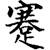
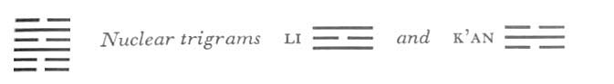

# Commentary: 39. Chien / Obstruction

The ruler of the hexagram is the nine in the fifth place. Therefore it is said in the Commentary on the Decision: “He goes and attains the middle.” The reference to “the great man” in the Judgment always relates to the fifth place.

The Sequence

Through opposition difficulties necessarily arise. Hence there follows the hexagram of OBSTRUCTION. Obstruction means difficulty.

Miscellaneous Notes

OBSTRUCTION means difficulty.
The idea of obstruction is expressed by danger without (K’an), in the face of which one keeps still within (Kên). This distinguishes the hexagram from YOUTHFUL FOLLY (4), where K’an is within and Kên is without. The obstruction is not a lasting condition, hence everything in the hexagram is centered on overcoming it. It is overcome in that the strong line moves outward to the fifth place and from there initiates a countermovement. The obstruction is overcome not by pressing forward into danger nor by idly keeping still, but by retreating, yielding. Hence the text alludes to the words of the hexagram K’un, THE RECEPTIVE (2). K’un is in the southwest, it is the earth, that which is level; friends are there. Kên is inthe northeast, it is the mountain, that which is steep; there it is lonely. For overcoming danger one has need of fellowship; hence retreat. The great man is seen because he stands at the top of the nuclear trigram Li, which means light and the eye. The movement indicated is expressed also in the individual lines.

### THE JUDGMENT

> OBSTRUCTION. The southwest furthers.
>
> The northeast does not further.
>
> It furthers one to see the great man.
>
> Perseverance brings good fortune.

Commentary on the Decision

OBSTRUCTION means difficulty. The danger is ahead. To see the danger and to know how to stand still, that is wisdom.

In OBSTRUCTION “the southwest furthers,” because he goes and attains the middle.

“The northeast does not further,” because there the way comes to an end.

“It furthers one to see the great man,” because he goes and wins merits.

In the right place, “perseverance brings good fortune,” because through it the country comes into order.

The effect of a time of OBSTRUCTION is great indeed.

Danger, the trigram K’an, is in front. To see the danger (upper nuclear trigram Li, light, eye) and to stop short in time (inner trigram Kên, Keeping Still) is true wisdom, in contrast to the situation in YOUTHFUL FOLLY, where the positions of danger and standstill are reversed. In order to overcome the danger it is important to take the safe-road, the road toward the southwest, where one attains the middle, that is, sees oneself surrounded by helpers. The nine in the fifth place doesthis. When the ruler of the hexagram is in the outer trigram it is said, “He goes,” and when it is in the inner trigram, “He comes.” In the northeast (north means danger, northeast means mountain) one comes to an impassable road, leading no farther. It is favorable to see the great man—the nine in the fifth place, standing at the top of the nuclear trigram Li. Through going something is achieved: in that the ruler of the hexagram “goes,” he takes part in the downward movement of the trigram K’an, water, which flows toward the earth and thus accomplishes something. Abiding in the right place brings good fortune, because one’s activity is directed not outward but inward, to one’s own country. Turning inward is achieved through obstructions, and the improvement brought about by this turning inward (“conversion”) is the great value inhering in the effect of a time of obstruction.

### THE IMAGE

> Water on the mountain:
>
> The image of OBSTRUCTION.
>
> Thus the superior man turns his attention to himself
>
> And molds his character.

Water on the top of a mountain cannot flow down in accordance with its nature, because rocks hinder it. It must stand still. This causes it to increase, and the inner accumulation finally becomes so great that it overflows the barriers. The way of overcoming obstacles lies in turning inward and raising one’s own being to a higher level.

### THE LINES

Six at the beginning:

*a*) Going leads to obstructions,

Coming meets with praise.

*b*) “Going leads to obstructions, coming meets with praise,” because it is right to wait.
Going, as this weak line at the beginning would be inclined to do, would lead into danger. Coming back is in accord with the trigram Kên, Keeping Still.

Six in the second place:

*a*) The king’s servant is beset by obstruction upon obstruction,

But it is not his own fault.

*b*) “The king’s servant is beset by obstruction upon obstruction.” But in the end there is no blame in this.
This line is in the relationship of correspondence to the ruler of the hexagram, the nine in the fifth place. The ruler stands in the very center of the danger (upper primary trigram K’AN). His servant hastens to his aid, but since his path leads through the nuclear trigram K’an, he meets with one obstruction after another. However, this situation is not due to his own position; the line is in the trigram Kên, Keeping Still, hence it is not inherently necessary for it to go into these dangers. It is only duty, arising from the relation to the ruler, that leads it into peril. Therefore it remains free of fault even in the most dangerous situation.

Six in the third place:

*a*) Going leads to obstructions;

Hence he comes back.

*b*) “Going leads to obstructions; hence he comes back.” Those within rejoice over it.
This strong line is the ruler of the trigram Kên and has two weak lines depending on it. Its strength might induce it to move outward, but there it encounters the trigram of danger (K’an). Hence it turns back, and the six in the second place, which has a relationship of holding together with it, rejoices.

Six in the fourth place:

*a*) Going leads to obstructions,

Coming leads to union.

*b*) “Going leads to obstructions, coming leads to union.” In the appropriate place one finds support.
The six in the fourth place is related to the six at the top, but should it wish to go there, it would find a weak line at the pinnacle of danger. Return to its own place leads to union. The fourth place is that of the minister, who serves the strong ruler above, the nine in the fifth place, and who is supported from below by the strong assistant, the nine in the third place. In the appropriate place (the dark fourth place is the proper one for a yielding line), it achieves union with these two strong lines.

Nine in the fifth place:

*a*) In the midst of the greatest obstructions,

Friends come.

*b*) “In the midst of the greatest obstructions, friends come.” For they are ruled by the central position.
The fifth line is the ruler of the hexagram. As the middle line of the upper trigram K’an, it is in the center of danger—that is, in the midst of the greatest obstructions. However, it is related to the six in the second place, to the six in the fourth place, and also to the six at the top, and these come as friends to help it, because it rules them by virtue of its central position.

Six at the top:

*a*) Going leads to obstructions,

Coming leads to great good fortune.

It furthers one to see the great man.

*b*) “Going leads to obstructions, coming leads to great good fortune,” for the will is directed to inner things.

“It furthers one to see the great man.” For thus does one follow a man of rank.
If the weak line at the top should try to go forth and overcome the obstacles alone, it would meet with failure. Its nature, its will, direct it toward the great, i.e., strong nine in the third place, which has a relationship of correspondence with it. It furthers one to see the great man because the nine in the fifthplace, the great man of the hexagram, stands at the top of the nuclear trigram Li, eye, light. He is seen in the sense that the present line, together with the nine in the third place, follows him as the man of rank under whose leadership the obstructions are overcome.
