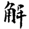
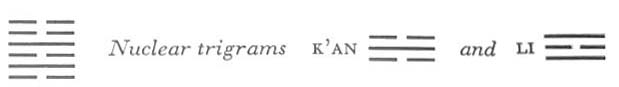

# Commentary: 40. Hsieh / Deliverance

The rulers of the hexagram are the nine in the second and the six in the fifth place. Therefore it is said in the Commentary on the Decision, “By going he wins the multitude,” this referring to the fifth place, and further, “He wins the central position,” this referring to the second place.

The Sequence

Things cannot be permanently amid obstructions. Hence there follows the hexagram of DELIVERANCE. Deliverance means release from tension.

Miscellaneous Notes

DELIVERANCE means release from tension.
The idea of release and deliverance is expressed in the fact that the trigram Chên, movement, stands above (without) and moves away from the lower (inner) trigram K’an, danger. In one aspect, thishexagram is a further development of the situation described in Chun, DIFFICULTY AT THE BEGINNING (3); in the latter, there is movement within danger, here movement brings deliverance from danger. In another aspect, this hexagram is the inverse of the preceding one. The obstruction is removed, deliverance has come.

In terms of the Image, thunder—electricity—has penetrated the rain clouds. There is release from tension. The thunderstorm breaks, and the whole of nature breathes freely again.

### THE JUDGMENT

> DELIVERANCE. The southwest furthers.
>
> If there is no longer anything where one has to go,
>
> Return brings good fortune.
>
> If there is still something where one has to go,
>
> Hastening brings good fortune.

Commentary on the Decision

DELIVERANCE. Danger produces movement. Through movement one escapes danger: this is deliverance.

During deliverance “the southwest furthers”: by going he wins the multitude.

“His return brings good fortune,” because he wins the central position.

“If there is still something where one has to go, hastening brings good fortune.” Then going is meritorious.

When heaven and earth deliver themselves, thunder and rain set in. When thunder and rain set in, the seed pods of all fruits, plants, and trees break open.

The time of DELIVERANCE is great indeed.

Danger incites to movement, and this movement leads out of the danger; this explanation of the name of the hexagram is derived from the attributes of the two primary trigrams. The southwest is the place of the trigram K’un, the Receptive. Its opposite, the northeast, is no longer mentioned, because here the difficulties have already been overcome. K’un also means the multitude. This refers to the six in the fifth place. Whendeliverance has only just come, a certain protection is needed, a quiet nurturing under the maternal care of the Receptive. By returning when there is nothing more to be attended to, the nine in the second place attains the center of the lower trigram. If there is still something to be done, it brings good fortune to do it as quickly and carefully as possible, because the movement is then crowned with success; it is not a purposeless, futile effort. Lastly there is mentioned, as an analogy, the release from atmospheric tension that comes with a thunderstorm, which clears the air and causes all seed pods to burst open. Thus the time of DELIVERANCE also has its greatness.

### THE IMAGE

> Thunder and rain set in:
>
> The image of DELIVERANCE.
>
> Thus the superior man pardons mistakes
>
> And forgives misdeeds.

K’an means lawsuits and transgressions. Chên moves upward and lets the mistakes sink down behind it. In life this brings a release from tension similar to that produced in nature by the clearing of the air after a thunderstorm.

### THE LINES

Six at the beginning:

*a*) Without blame.

*b*) On the border between firm and yielding there should be no blame.
This line is in a strong place, but yielding by nature. It stands in the relationship of correspondence to the nine in the fourth place, which occupies a weak place but is strong by nature. The joint action of these balanced opposites brings order into the whole situation, and naturally everything goes well.

Nine in the second place:

*a*) One kills three foxes in the field

And receives a yellow arrow.

Perseverance brings good fortune.

*b*) The good fortune of the perseverance of the nine in the second place is due to its attaining the middle way.
The trigram K’AN denotes a fox, Li denotes bow and arrow. The second place, as the upper of the two lowest places, is the place of the field (cf. the nine in the second place in hexagram 1, Ch’ien, THE CREATIVE). The three foxes are three of the four yin lines, omitting the six in the fifth place.

Six in the third place:

*a*) If a man carries a burden on his back

And nonetheless rides in a carriage,

He thereby encourages robbers to draw near.

Perseverance leads to humiliation.

*b*) “If a man carries a burden on his back and nonetheless rides in a carriage,” he should really be ashamed of himself.

When I myself thus attract robbers, on whom shall I lay the blame?
This line is at the place where the lower primary trigram K’an and the upper nuclear trigram K’an come in contact. K’an means carriage and robbers. The structure of the hexagram is such that this six, a yin line and weak by nature, seeks to occupy the top place in the lower trigram. Its strength being insufficient for this, it carries a heavy burden. In this untenable position it necessarily attracts robbers. Persisting in this state naturally leads to humiliation.

Nine in the fourth place:

*a*) Deliver yourself from your great toe.

Then the companion comes,

And him you can trust.

*b*) “Deliver yourself from your great toe”: for the place is not the appropriate one.
The trigram Chên means foot; the six in the third place is under Chên and so gives rise to the image of the big toe. The present line and the nine in the second place are friends of kindred nature, jointly rendering loyal help to the ruler in the fifth place. But to do this it is necessary first to exclude the interfering six in the third place, to which the present line stands in the relationship of holding together. The place is not appropriate, because this is a yin place, while the line is a yang line.<a id="ref-1" href="#/com-40-hsieh-deliverance?id=fn-1">1</a>

Six in the fifth place:

*a*) If only the superior man can deliver himself,

It brings good fortune.

Thus he proves to inferior men that he is in earnest.

*b*) The superior man delivers himself, because inferior men then retreat.
The fifth place is that of the ruler. In times of deliverance, the yielding—disposition of this line is appropriate, because it is in the relationship of correspondence to the strong assistants. But it is important to liberate oneself from inferior men who are also yielding in temperament. When they notice this attitude, they retreat of their own accord, The line delivers itself, as does the preceding line, by moving upward in accord with the trigram Chên.

Six at the top:

*a*) The prince shoots at a hawk on a high wall.

He kills it. Everything serves to further.

*b*) “The prince shoots at a hawk”: thereby he delivers himself from those who resist.
The dark line at the top is injurious. With the exception of the six in the fifth place, all the yin lines in the time of DELIVERANCE tend to have a negative influence, in so far as thisis not neutralized by relationships with yang lines. This highly placed evildoer is shot from below, where the trigram K’an (arrow) is situated, because the movement is upward, and thus deliverance from the last obstacle is achieved.

---

**Notes:**

<a id="fn-1" href="#/com-40-hsieh-deliverance?id=ref-1">**1.**</a> According to another interpretation, the big toe from which one is to liberate oneself is the six at the beginning; with this line there is a relationship of correspondence from which one must free oneself.
