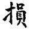
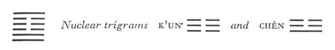

# Commentary: 41. Sun / Decrease

The hexagram Sun is based on the idea that the top line of the lower trigram is decreased in order to increase the top line of the upper trigram; hence it is the six in the third place and the nine at the top that are the constituting rulers of the hexagram. But, since the ruler is the one who is enriched through decrease of what is below and increase of what is above, the governing ruler of the hexagram is the six in the fifth place.

The Sequence

Through release of tension something is sure to be lost. Hence there follows the hexagram of DECREASE.

Miscellaneous Notes

The hexagrams of DECREASE and INCREASE are the beginning of flowering and of decline.
This hexagram consists of Tui below and Kên above. The depth of the lake is decreased in favor of the height of the mountain. The top line of the lower trigram is decreased in favor of the top line of the upper trigram. In both cases, what is (below is decreased in favor of what is above, and this means out-and-out decrease.

When decrease has reached its goal, flowering is sure to begin. Hence DECREASE is the beginning of flowering, as INCREASE, through fullness, ushers in decline.

Appended Judgments

DECREASE shows the cultivation of character. It shows first what is difficult and then what is easy. Thus it keeps harm away.

### THE JUDGMENT

> DECREASE combined with sincerity
>
> Brings about supreme good fortune
>
> Without blame.
>
> One may be persevering in this.
>
> It furthers one to undertake something.
>
> How is this to be carried out?
>
> One may use two small bowls for the sacrifice.

Commentary on the Decision

DECREASE. What is below is decreased, what is above is increased; the direction of the way is upward.

“DECREASE combined with sincerity brings about supreme good fortune without blame. One may be persevering in this. It furthers one to undertake something. How is this to be carried out? One may use two small bowls for the sacrifice.”

“Two small bowls” is in accord with the time. There is a time for decreasing the firm, and a time for increasing the yielding. In decreasing and increasing, in being full and being empty, one must go with the time.

The firm top line of the lower trigram is decreased, that is, replaced by a yielding line; at the same time, the yielding top line of the upper trigram is increased, that is, replaced by astrong line, and this strong line makes its way upward. The upper element is enriched at the expense of the lower. Those below bring a sacrifice to the ruler. If this sacrifice is offered sincerely it is not wrong; rather, it results in success and all things desirable. Nor is thrift then a disgrace. All that matters is that things should happen at the right time.

### THE IMAGE

> At the foot of the mountain, the lake:
>
> The image of DECREASE.
>
> Thus the superior man controls his anger
>
> And restrains his instincts.

The lake evaporates; its waters decrease and benefit the mountain’s vegetation, which thereby is furthered in its growth and enriched. Anger rises mountain high; the instincts drown the heart like the depths of a lake. Inasmuch as the two primary trigrams represent the youngest son and youngest daughter, passions are especially strong. The anger aroused must be restrained by keeping still (upper trigram Kên), and the instincts must be curbed by the confining quality of the lower trigram Tui, as the lake confines its waters within its banks.

### THE LINES

Nine at the beginning:

*a*) Going quickly when one’s tasks are finished

Is without blame.

But one must reflect on how much one may decrease others.

*b*) “Going quickly when one’s tasks are finished”: this is right because the mind of the one above accords with one’s own.
The lowest line stands for people of the lower classes. Though strong itself, it stands in the relationship of correspondence to the weak six in the fourth place, which represents an official. The one above needs help from the one below, and it is readily offered by the latter. Instead of the word for “finished” theword for “through” or “with” appears in old texts (cf. the *Shuo Wên*,<a id="ref-1" href="#/com-41-sun-decrease?id=fn-1">1</a> where the wording is cited); thus the sentence would read: “Going quickly with services”—i.e., to help the one above—”is without blame.” This means self-decrease on the part of the one below for the benefit of the one above. The second half of the line, which reads literally, “One must weigh how much one may decrease him,” refers to the one above, who claims the services of the one below. It is his duty to weigh in his mind how much he may require without injuring the one below. Only when this is the attitude of the one above does it fit in with the self-sacrifice of the one below. If the one above should make inconsiderate demands, the joy in giving felt by the one below would be decreased.

Nine in the second place:

*a*) Perseverance furthers.

To undertake something brings misfortune.

Without decreasing oneself,

One is able to bring increase to others.

*b*) That the nine in the second place furthers through perseverance is due to the fact that it has the correct mean in its mind.
The nine is strong and stands in a central place. Hence perseverance in this attitude serves to further. The line stands at the beginning of the nuclear trigram Chên, the Arousing. This would suggest that it might of its own initiative go to the six in the fifth place, with which it has a relationship of correspondence. If it did this, however, it would demean itself somewhat. It is in keeping with its central position to increase the other without decreasing itself.

Six in the third place:

*a*) When three people journey together,

Their number decreases by one.

When one man journeys alone,

He finds a companion.

*b*) If a person should seek to journey as one of three, mistrust would arise.
The text says that three persons journeying together are decreased by one, but one man journeying alone finds a companion. This refers to the change that has taken place within the lower trigram. At the outset it consisted of the three strong lines of the trigram Ch’ien, the Creative. They have been journeying together. Then one leaves them and goes up to the top of the upper trigram. The weak line entering the third place in its stead is lonely in the company of the two other lines of the lower trigram. But it stands in the relationship of correspondence to the strong line at the top, hence finds its complement in the latter. Through this separation, three become two; further, through the union one becomes two. Thus what is excessive is decreased, and what is insufficient is increased. Through this process of interchange between the trigrams Ch’ien and K’un of the original hexagram, there come into being the two youngest children, Kên and Tui.

On the other hand, the present line, the six in the third place, which is lonely in the lower trigram, should not again consider going along with the other two, for this would give rise to misunderstandings. Confucius says about this line:

“Heaven and earth come together, and all things take shape and find form. Male and female mix their seed, and all creatures take shape and are born. In the Book of Changes it is said: ‘When three people journey together, their number decreases by one. When one man journeys alone, he finds a companion.’ This refers to the effect of becoming one.”

Six in the fourth place:

*a*) If a man decreases his faults,

It makes the other hasten to come and rejoice.

No blame.

*b*) “If a man decreases his faults,” it is indeed something that gives cause for joy.
The fault of the six in the fourth place is excessive weakness. A weak line in a weak place, it is inclosed above and below byweak lines. However, through its relationship of correspondence to the strong first line, these faults are compensated. Through elimination of these faults, the six in the fourth place hastens the helpful coming of the nine at the beginning, which brings joy to both and is not a mistake.

Six in the fifth place:

*a*) Someone does indeed increase him.

Ten pairs of tortoises cannot oppose it.

Supreme good fortune.

*b*) The supreme good fortune of the six in the fifth place comes from its being blessed from above.
If he is enriched, ten pairs of tortoise shells cannot oppose it, and supreme good fortune comes. The number ten is suggested by the nuclear trigram K’un. The tortoise belongs to the trigram Li—which of course can be read into this hexagram only by straining the point considerably. A large tortoise used for fortune telling costs twenty cowrie shells. A double cowrie shell is called a pair. Accordingly, one explanation takes the line to mean a tortoise worth ten pairs of cowrie shells. Another explanation reads it as referring to ten pairs of tortoise shells. Blessing from above is suggested by the strong top line covering the hexagram protectively.

Nine at the top:

*a*) If one is increased without depriving others,

There is no blame.

Perseverance brings good fortune.

It furthers one to undertake something.

One obtains servants

But no longer has a separate home.

*b*) Without decreasing, he is increased; that is, he attains his will in great measure.
The top line is enriched by the six in the third place. It accepts this increase, but in such a way that the other is not decreased by it. Therefore the relationship here is the opposite of thatrepresented by the nine in the second place, which increases others without decreasing itself. Hence the outlook is favorable throughout, because harmony is maintained between those above and those below.

Kên, mountain, denotes a house. As the line changes, the upper primary trigram Kên turns into the trigram K’un, which knows no house, i.e., no mountain, its place being the southwest; hence there are loyal helpers, but not for promoting family interests.

---

**Notes:**

<a id="fn-1" href="#/com-41-sun-decrease?id=ref-1">**1.**</a> A dictionary compiled *ca*. A.D. 100.
