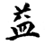
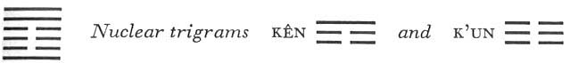

# Commentary: 42. I / Increase

The idea of increase is here expressed through the fact that the lowest line in the upper trigram is decreased, whereby the lowest line of the lower trigram is increased. Hence the six in the fourth place and the nine in the first place are the constituting rulers of the hexagram. But since the decrease above is at the hands of the prince, and the increase below is received by the official, the nine in the fifth place and the six in the second place are the governing rulers of the hexagram.

The Sequence

If decrease goes on and on, it is certain to bring about increase. Hence there follows the hexagram of INCREASE.

Miscellaneous Notes

The hexagrams of DECREASE and INCREASE are the beginning of flowering and of decline.
The two hexagrams with which part II begins, namely, INFLUENCE (31) and DURATION (32), after ten changes become the hexagrams of DECREASE (41) and INCREASE (42)—just as the first two hexagrams of part I, THE CREATIVE and THE RECEPTIVE, after ten changes become the hexagrams of PEACE (11) and STANDSTILL (12). PEACE and STANDSTILL have an inner connection with DECREASE and INCREASE, because through the transference of a strong line—from the lower to the upper trigram, DECREASE develops from PEACE, and through the transference of a strong line from the upper to the lower trigram, INCREASE develops from STANDSTILL. Thus when in P’i, STANDSTILL, the lowest line of the upper trigram is transferred to the bottom, the resultant new hexagram is I, INCREASE.

The fact that continuous decrease finally leads to a change into its opposite, increase, lies in the course of nature, as can be perceived in the waning and waxing of the moon and in all of the regularly recurring processes of nature.

The hexagram consists of the primary trigrams of wind and thunder, which increase each other. The decrease above and the strengthening below produce a stability that means increase for the whole. This hexagram is the inverse of the preceding one.

Appended Judgments

When Pao Hsi’s clan was gone, there sprang up the clan of the Divine Husbandman. He split a piece of wood for a plowshare and bent a piece of wood for the plow handle, and taught the whole world the advantage of laying open the earth with a plow. He probably took this from the hexagram of INCREASE.

Both parts of the hexagram have wood for a symbol. The outer trigram means penetration, the inner means movement.Movement combined with penetration has brought the greatest increase to the world.

INCREASE shows fullness of character. INCREASE shows the growth of fullness without artifices. Thus INCREASE furthers what is useful.

### THE JUDGMENT

> INCREASE. It furthers one
>
> To undertake something.
>
> It furthers one to cross the great water.

Commentary on the Decision

INCREASE. Decreasing what is above

And increasing what is below;

Then the joy of the people is boundless.

What is above places itself under what is below:

This is the way of the great light.

And it furthers one to undertake something:

Central, correct, and blessed.

It furthers one to cross the great water:

The way of wood creates success.

INCREASE moves, gentle and mild:

Daily progress without limit.

Heaven dispenses, earth brings forth:

Thereby things increase in all directions.

The way of INCREASE everywhere

Proceeds in harmony with the time.

The name of the hexagram is explained on the basis of its structure: increase of what is below at the cost of what is above is out-and-out increase, because it benefits the whole people. The fourth line, in descending from the upper trigram to the lowest place in the lower trigram, shows a self-abnegation that gives proof of great clarity. In times of INCREASE it is favorable to undertake something, for the rulers of the hexagram,the nine in the fifth place and the six in the second, are centrally placed and correct—a strong line in a strong place and a weak line in a weak place. Crossing of the great water is suggested by the upper trigram, Sun, which means wood and so gives the idea of a ship, while the lower trigram guarantees the movement of the ship. The attributes of the trigrams Chên, movement, and Sun, gentleness, guarantee lasting progress.

The idea of increase in the cosmic sphere is expressed through the fact that the first line of heaven (Ch’ien) places itself below the earth (K’un), this gives rise to the trigram Chên, in which all beings come into existence. This process of increase also is bound up with the right time, within which it comes to consummation.

### THE IMAGE

> Wind and thunder: the image of INCREASE.
>
> Thus the superior man:
>
> If he sees good, he imitates it;
>
> If he has faults, he rids himself of them.

Wind and thunder generate and reinforce each other. Thunder corresponds in its nature with the light principle, which it sets in motion; wind is connected in its nature with the shadowy principle, which it breaks up and dissolves. What is light corresponds to the good, which is attained by moving toward it, in accordance with the trigram Chên. The shadowy corresponds to evil, which is destroyed by being broken up and dissolved, as Sun, wind, breaks up clouds. Both principles further increase, for in the moral realm the good is the equivalent of the light, the positive, and furthering of this principle signifies increase.

### THE LINES

Nine at the beginning:

*a*) It furthers one to accomplish great deeds.

Supreme good fortune. No blame.

*b*) “Supreme good fortune. No blame.” Those below do not use it for their own convenience.
The nine at the bottom stands for the common people. In that the six in the fourth place, the minister, descends (it stands in the relationship of correspondence to the first line), it enables the lower line to accomplish great things, because it does not selfishly retain for itself the grace bestowed on it from above. This line is at the bottom of the trigram Chên and therefore moves upward. Hence the great good fortune.

Six in the second place:

*a*) Someone does indeed increase him;

Ten pairs of tortoises cannot oppose it.

Constant perseverance brings good fortune.

The king presents him before God.

Good fortune.

*b*) “Someone does indeed increase him.” This comes from without.
The increase of the inner trigram comes from without. Therefore it is regarded as being unexpected, a spontaneous happening. The hexagram I is the hexagram Sun inverted, hence the text of this line corresponds with that of the six in the fifth place of the preceding hexagram. Increase comes because its prerequisites are provided in the line’s own correctness, central position, and yielding nature, and because the strong nine in the fifth place is in the relationship of correspondence to it. The admonition to constant perseverance is necessary because the yielding quality of the line, in combination with the yielding place, might lead to a certain weakness, which must be balanced by firmness of will. The increase here is threefold—through men, through gods (indicated by the tortoises, through which the will of the gods is revealed), and through the supreme Lord of Heaven, who graciously receives the man brought to him at the sacrifice. The hexagram I refers to the first month, in which the rites of sacrifice were carried out in the meadow.

Six in the third place:

*a*) One is enriched through unfortunate events.

No blame, if you are sincere

And walk in the middle,

And report with a seal to the prince.

*b*) “One is enriched through unfortunate events.” This is something that certainly is one’s due.
This is a weak line in a strong place, at the high point of excitement (lower trigram Chên), and furthermore not central. All this points to misfortune. But since it is the time of INCREASE, even this misfortune, which is not accidental but comes upon one from inner causes, must serve to good ends. The line is in the center of the lower nuclear trigram K’un and at the same time at the top of the lower primary trigram Chên, movement, which gives rise to the idea of movement, of walking the middle path. The seal is a round jade piece that was bestowed as a badge of office.

One interpretation explains the line of thought as follows: If in the time of INCREASE heaven sends disaster, such as crop failure and the like, a sympathetic prince will ease the burden of those affected by granting them remission of taxes and other relief, and the official who announces this remission carries the jade insignia as a mark of his authority.

Six in the fourth place:

*a*) If you walk in the middle

And report to the prince,

He will follow.

It furthers one to be used

In the removal of the capital.

*b*) “If you report to the prince, he will follow,” because his purposes are thereby increased.
The fourth place is that of the minister. The six in the fourth place is the lowest line of the trigram Sun, wind, penetration. The line has influence in correspondence with this. However, since it is in the middle of the upper nuclear trigram Kên, it does not use this influence for personal ends, for this is the line whose decrease increases the lower trigram. It therefore represents a man who, as mediator between the prince and thepeople, is in a position to make the will of the former clear to the latter. Persons of this kind are of great importance in dangerous and decisive undertakings (crossing the great water—here the moving of the capital, which took place five times under the Shang dynasty).

Nine in the fifth place:

*a*) If in truth you have a kind heart, ask not.

Supreme good fortune.

Truly, kindness will be recognized as your virtue.

*b*) “If in truth you have a kind heart, ask not.” If kindness is recognized as your virtue, you have attained your purpose completely.
The ruler of the hexagram, strong and central in a correct, strong place, has a truly kind heart and seeks to give increase to those below. Here there is no question: the effect is inevitably favorable, and because the good intention is recognized, all is well.

Nine at the top:

*a*) He brings increase to no one.

Indeed, someone even strikes him.

He does not keep his heart constantly steady.

Misfortune.

*b*) “He brings increase to no one.” This is a saying that pictures one-sidedness.

“Someone even strikes him.” This comes from without.
This line is obdurate and not consistently concerned with bringing increase to those below. Despite its relation to the six in the third place, the latter shows no sign of being influenced by it. Thus the line is one-sided and aloof. Without intent on the part of anyone, this wrong position automatically provokes misfortune, because the attitude of the line is not stable, that is, not in harmony with the demands of the time.
