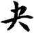
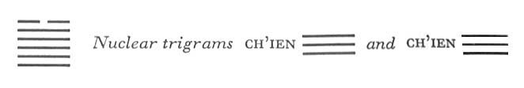

# Commentary: 43. Kuai / Break-through (Resoluteness)

The meaning of the hexagram is based on the fact that a dark line is at the top, in the outermost place, hence the six at the top is the constituting ruler. But the five light lines turn resolutely against the dark one. The fifth line is at their head, and furthermore in the place of honor; therefore the nine in the fifth place is the governing ruler of the hexagram.

The Sequence

If increase goes on unceasingly, there is certain to be a break-through. Hence there follows the hexagram of BREAK-THROUGH. Break-through means resoluteness.

Miscellaneous Notes

BREAK-THROUGH means resoluteness. The strong turns resolutely against the weak.

Appended Judgments

In primitive times people knotted cords in order to govern. The holy men of a later age introduced written documents instead, as a means of governing the various officials and supervising the people. They probably took this from the hexagram of BREAK-THROUGH.

The hexagram Kuai actually means a break-through as when a river bursts its dams in seasons of flood. The five strong lines are thought of as mounting from below, resolutely forcing the weak upper line out of the hexagram. The same idea evolves from the images. The lake has evaporated and mounted to the sky. There it will discharge itself as a cloudburst. Here again we have the idea of a break-through.

The hexagram consists of the trigram Tui, words, above, and Ch’ien, whose attribute is strength, below. Thus the hexagram indicates that words should be made strong and enduring.

### THE JUDGMENT

> BREAK-THROUGH. One must resolutely make the matter known
>
> At the court of the king.
>
> It must be announced truthfully. Danger.
>
> It is necessary to notify one’s own city.
>
> It does not further to resort to arms.
>
> It furthers one to undertake something.

Commentary on the Decision

BREAK-THROUGH is the same as resoluteness. The firm resolutely dislodges the yielding. Strong and joyous—this means resolute and harmonious.

“One must make the matter known at the court of the king.” The weak rests upon five hard lines.

Truthful announcement is fraught with danger. However, this danger leads to the light.

“It is necessary to notify one’s own city. It does not further to resort to arms.” What that man holds high comes to nothing.

“It furthers one to undertake something,” because the firm grow and lead through to the end.

In forcing out the dark line at the top it is essential that it be done in the right spirit. For the issue of this struggle is not indoubt. What happens is inevitable, therefore a serenely cheerful and calm resoluteness is the correct attitude of mind, as denoted by the character of the two trigrams (Tui, the Joyous, without, and Ch’ien, the Creative, strength, within). One must make the truth known at the court of the king: the weak six at the top stands over five strong lines, of which the uppermost occupies the place of the prince. The weak line symbolizes an inferior man in a high position. The trigram Tui means mouth; hence the making known, announcing. Ch’ien also means battle and danger; Ch’ien and Tui both mean metal, hence the image of weapons. But since the situation in itself promises success, there is no need of using weapons against outside forces.

### THE IMAGE

> The lake has risen up to heaven:
>
> The image of BREAK-THROUGH.
>
> Thus the superior man
>
> Dispenses riches downward
>
> And refrains from resting on his virtue.

The lake has evaporated and its waters are gathering high in the heavens as mist and clouds: this points to an imminent break-through, in which the water will come down again as rain. In order to avoid a violent break-through, it is necessary to take advantage of the attributes of the two trigrams. Tui means pleasure; therefore, instead of piling up wealth in dangerous places and thus inviting a breach, one will be continuously giving and thus causing joy. In self-education we should be mindful of the stern judgment meted out by Ch’ien. Then we shall never be self-satisfied, which would also lead to catastrophe, but shall always retain a sense of awe. When joy has mounted high, as a lake mounts to the heavens, it easily leads to excessive pride; hence it must be supplemented by the beneficent way of heaven. When strength perceives weakness above it, as does heaven under the lake, it leads easily to defiance; hence it must be moderated by the friendly way of Tui.

### THE LINES

Nine at the beginning:

*a*) Mighty in the forward-striding toes.

When one goes and is not equal to the task,

One makes a mistake.

*b*) When one goes without being equal to the task, it is a mistake.
Toes are suggested by the lowest line. The hexagram of BREAK-THROUGH is the next stage after the hexagram of THE POWER OF THE GREAT (34). This is why the pronouncement on the lowest line is the same in both, except that here it is moderated somewhat, because the situation has developed further.

Nine in the second place:

*a*) A cry of alarm. Arms at evening and at night.

Fear nothing.

*b*) Despite weapons, no fear—because one has found the middle way.
Tui, the upper trigram, means mouth, hence the cry of alarm. Tui is in the west, which indicates evening; Ch’ien is in the northwest, which indicates night. Metal is associated both with Tui and with Ch’ien, and this indicates weapons. But there is nothing to fear, because the line is strong and central and in the middle of the lower trigram Ch’ien, heaven.

Nine in the third place:

*a*) To be powerful in the cheekbones

Brings misfortune.

The superior man is firmly resolved.

He walks alone and is caught in the rain.

He is bespattered,

And people murmur against him.

No blame.

*b*) “The superior man is resolutely resolved.” Ultimately this is not a mistake.
Ch’ien is the head. The third place is at the top of this trigram, hence the image of the cheekbones. This line belongs to the strong primary trigram Ch’ien and also stands in the middle of the lower nuclear trigram Ch’ien, hence the redoubled resolution. It is solitary because it alone is in the relationship of correspondence to the dark line at the top. Tui, as water, suggests the idea of rain bespattering the line. The strength of its nature protects it from contamination by the dark line above, hence despite evil appearances there is no mistake.

Nine in the fourth place:

*a*) There is no skin on his thighs,

And walking comes hard.

If a man were to let himself be led like a sheep,

Remorse would disappear.

But if these words are heard

They will not be believed.

*b*) Walking comes hard.” The place is not the appropriate one.

“If these words are heard they will not be believed.” There is no clear comprehension.
This line is in the lowest place of the upper trigram, hence the image of the thighs. The fact that the line is hindered in its forward push by the strong line in the fifth place suggests the idea that walking is impossible. A symbol of Tui is the sheep, hence the advice to let oneself be led like a sheep. As the line changes, the upper trigram will turn into the trigram K’an, which means ear; but since the line is neither correct nor in its proper place, it pays no heed to what is said.

Nine in the fifth place:

*a*) In dealing with weeds,

Firm resolution is necessary.

Walking in the middle

Remains free of blame.

*b*) “Walking in the middle remains free of blame.” The middle is not yet in the light.
The line is the ruler of the hexagram. It is this line that must lead the resolute struggle against the six at the top, which symbolizes the inferior man. But while the nine in the third place is in the relationship of correspondence to the six above, the nine in the fifth place is in the relationship of holding together with it. This makes the struggle more difficult. But the line can be resolute. It is on the one hand the ruler of the hexagram, and moreover ruler in the most distinguished place; on the other hand it is the top line of the vigorous upper nuclear trigram Ch’ien. Furthermore, it is in the middle of the upper primary trigram; thus there is a hope that it will succeed in remaining consistent.

Six at the top:

*a*) No cry.

In the end misfortune comes.

*b*) The misfortune of not crying out should in the end not be allowed to persist.
This line is the representative of the evil that is to be rooted out. The undertaking requires caution. It appears easy, because there are five strong lines as against only one weak line; but the dark nature of the present line suggests that it knows how to silence those who would raise the warning. However, its kind must not be tolerated; otherwise it is to be feared that from the neglected solitary yin line, evil will sprout forth as from a seed.
